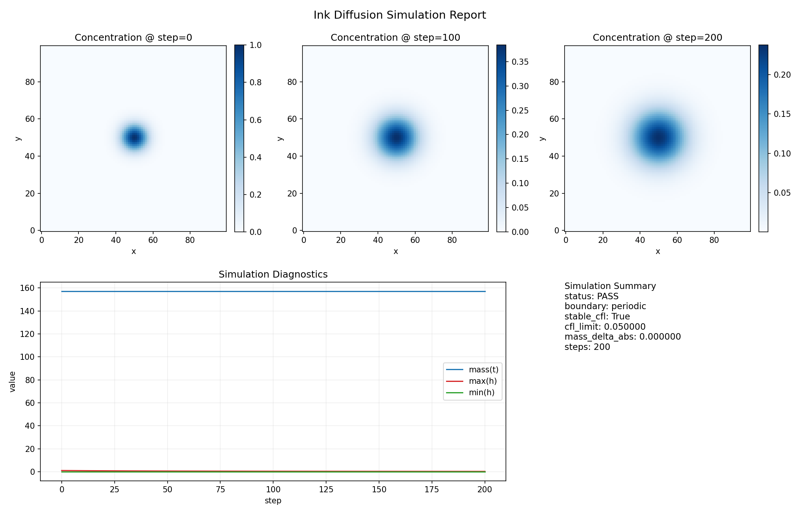
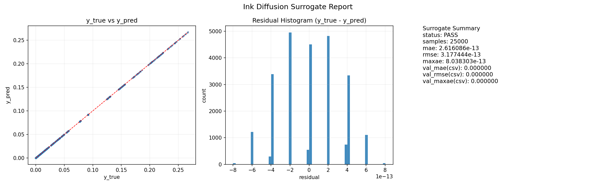

## 1. 目标 / Goal

本页用于沉淀 `ink_diffusion` 的工程验收结果：记录执行链路、关键产物与门禁判定。  
This page captures `ink_diffusion` engineering acceptance: execution chain, key artifacts, and gate decisions.

## 2. 页面范围 / Scope

本页分两条线：  
This page has two tracks:

1. 仿真主线（`mode=simulation`）/ Simulation mainline (`mode=simulation`)
2. 监督代理支线（`mode=supervised`，surrogate）/ Supervised surrogate branch (`mode=supervised`)

对应目录：`ForgeFlowApps/ink_diffusion/`。  
Mapped app directory: `ForgeFlowApps/ink_diffusion/`.

## 3. Track-A：PDE 仿真主线 / Track-A: PDE Simulation Mainline

配置文件 / Config file: `ForgeFlowApps/ink_diffusion/config/run.json`

关键参数 / Key parameters:

- `mode = simulation`
- `adapter_ref = ForgeFlowApps.ink_diffusion.adapters.ink_grid_adapter:InkGridAdapter`
- `model_ref = ForgeFlowApps.ink_diffusion.models.ink_diffusion_explicit:InkDiffusionExplicitSimulator`
- `steps = 200`
- `dt = 0.04`
- `dx = dy = 0.1`
- `kappa = 0.05`
- `boundary = periodic`
- `strict_cfl = true`
- `mass_tolerance = 1e-4`

### 3.1 初始场设定（高斯/正态） / Initial Field (Gaussian/Normal)

当前实验采用高斯型（正态型）初始场作为统一 baseline。  
The current experiment uses a Gaussian (normal-type) initial field as the unified baseline.

初始文件：`ForgeFlowApps/ink_diffusion/data/processed/initial.csv`（列为 `x,y,h`）。  
Initial file: `ForgeFlowApps/ink_diffusion/data/processed/initial.csv` (`x,y,h` columns).

可用的标准表达（概念式）是：  
A standard conceptual form is:

$$
h_0(x,y)=\exp\!\left(-\frac{(x-x_c)^2+(y-y_c)^2}{2\sigma^2}\right)
$$

工程上等价的生成写法（与你前面笔记一致）可写成：  
An equivalent engineering generator form (matching your PDE note) is:

```python
h = np.exp(-((X - L/2)**2 + (Y - L/2)**2) / 0.5)
```

当前数据的观测特征（本地统计）/ Observed properties of current data:

- 网格规模 `100 x 100`（`rows=10000`）
- 峰值 `h_max = 1.0`
- 边缘接近 0（12 位小数下多处显示为 `0.000000000000`）

为什么用高斯初值 / Why Gaussian initialization:

- 形状平滑，适合检验扩散模型的稳定性与守恒行为。  
- Smooth shape, good for checking diffusion stability and conservation.
- 径向对称，便于观察数值各向同性误差。  
- Radially symmetric, making anisotropy errors easier to diagnose.
- 作为 baseline 足够简单，便于后续替换成更复杂初值。  
- Simple enough for baseline, easy to replace with more complex initial states later.

执行命令 / Run command:

```bash
python main.py --config ForgeFlowApps/ink_diffusion/config/run.json
```

输出文件 / Outputs:

- `ForgeFlowApps/ink_diffusion/output/trajectory.csv`
- `ForgeFlowApps/ink_diffusion/output/eval_report.csv`

本次记录结果（来自 `eval_report.csv`）/ Recorded result (from `eval_report.csv`):

| Item | Value |
|---|---:|
| mode | simulation |
| steps_requested | 200 |
| states_recorded | 201 |
| boundary | periodic |
| dt | 0.040000 |
| dx | 0.100000 |
| dy | 0.100000 |
| kappa | 0.050000 |
| cfl_limit | 0.050000 |
| stable_cfl | True |
| mass_delta_abs | 0.000000 |
| mass_tolerance | 0.000100 |
| status | PASS |

## 4. Track-B：Surrogate 监督支线 / Track-B: Supervised Surrogate Branch

### 4.1 数据构建 / Dataset Build

先从仿真轨迹构建监督数据：  
Build supervised data from trajectory first:

```bash
python ForgeFlowApps/ink_diffusion/scripts/build_supervised_samples.py
python ForgeFlowApps/ink_diffusion/scripts/build_surrogate_datasets.py
```

当前规模（本地记录）/ Current scale (recorded):

- `trajectory.csv`: `2,010,001` lines (header included)
- `supervised_samples.csv`: `2,000,001` lines
- `surrogate_train.csv`: `100,001` lines
- `surrogate_infer.csv`: `25,001` lines

### 4.2 Surrogate 训练与推理 / Surrogate Train and Infer

配置文件 / Config file: `ForgeFlowApps/ink_diffusion/config/surrogate_run.json`

关键参数 / Key parameters:

- `mode = supervised`
- `task = ink_diffusion_surrogate`
- `adapter_ref = ForgeFlowApps.ink_diffusion.adapters.ink_surrogate_adapter:InkSurrogateAdapter`
- `model_ref = ForgeFlowApps.linear_xy.models.linear_regression:LinearDynamicsRegressor`
- `train_ratio = 0.8`
- `split.shuffle = true`
- `split.seed = 42`
- `infer.chunk_size = 50000`
- `eval_policy = { val_mae_max: 1e-6, val_rmse_max: 1e-6, val_maxae_max: 1e-5 }`

执行命令 / Run command:

```bash
python main.py --config ForgeFlowApps/ink_diffusion/config/surrogate_run.json
```

输出文件 / Outputs:

- `ForgeFlowApps/ink_diffusion/output/surrogate_predictions.csv`
- `ForgeFlowApps/ink_diffusion/output/surrogate_eval_report.csv`

本次记录结果（来自 `surrogate_eval_report.csv`）/ Recorded result (from `surrogate_eval_report.csv`):

| Item | Value |
|---|---:|
| mode | supervised |
| train_samples | 80000 |
| val_samples | 20000 |
| val_mae | 0.000000 |
| val_rmse | 0.000000 |
| val_maxae | 0.000000 |
| status | PASS |

## 5. 可视化报告 / Visualization Reports

生成仿真与 surrogate 报告图：  
Generate simulation and surrogate report plots:

```bash
python ForgeFlowApps/ink_diffusion/scripts/plot_report.py
```

输出路径 / Output paths:

- `ForgeFlowApps/ink_diffusion/output/report/simulation_report.png`
- `ForgeFlowApps/ink_diffusion/output/report/surrogate_report.png`

页面内嵌展示（本页快照）/ Embedded snapshots on this page:

[](simulation_report.png)

_Simulation report: mass/peak diagnostics and field snapshots._

[](surrogate_report.png)

_Surrogate report: y_true vs y_pred, residual histogram, and metric summary._

## 6. 验收逻辑（门禁顺序） / Acceptance Logic (Gate Order)

验收不是“看一个 PASS 字段”就结束，而是按顺序通过以下门禁：  
Acceptance is not a single PASS flag check; gates are evaluated in order:

1. 配置门 / Config gate  
   - `run.json` 与 `surrogate_run.json` 能被加载，必填字段齐全。  
   - `run.json` and `surrogate_run.json` are loadable with required fields.
2. 仿真稳定门 / Simulation stability gate  
   - `stable_cfl=True`，且 `status=PASS`。  
   - `stable_cfl=True` and `status=PASS`.
3. 守恒门 / Conservation gate  
   - `mass_delta_abs <= mass_tolerance`。  
   - `mass_delta_abs <= mass_tolerance`.
4. 代理精度门 / Surrogate quality gate  
   - `val_mae/val_rmse/val_maxae` 均低于 `eval_policy` 阈值，且 `status=PASS`。  
   - all surrogate metrics are below thresholds and `status=PASS`.
5. 产物完整门 / Artifact completeness gate  
   - 轨迹、评估、预测和报告图均存在且可读取。  
   - trajectory/evaluation/prediction/report files all exist and are readable.

### 6.1 门禁表 / Gate Table

| Gate | Rule | Source | Fail Action |
|---|---|---|---|
| Config | JSON loadable + required keys | `config/*.json` | 回退到最近可用配置并重新跑 |
| Stability | `stable_cfl=True` | `output/eval_report.csv` | 减小 `dt` 或增大 `dx,dy` |
| Conservation | `mass_delta_abs <= mass_tolerance` | `output/eval_report.csv` | 检查边界处理与更新公式 |
| Surrogate | metrics <= thresholds | `output/surrogate_eval_report.csv` | 增加样本/调整特征/重训 |
| Artifacts | required files exist | `output/*`, `output/report/*` | 补跑缺失步骤并记录原因 |

### 6.2 失败归因优先级 / Failure Triage Priority

1. 先看配置与路径（最快排除环境问题）。  
1. Check config and paths first (fastest environment sanity check).
2. 再看 CFL 与守恒（数值稳定性根因）。  
2. Then check CFL and conservation (numerical root cause).
3. 最后看 surrogate 指标（建模能力问题）。  
3. Finally inspect surrogate metrics (modeling capacity issue).

### 6.3 当前验收结论 / Current Acceptance Verdict

- 仿真轨通过：CFL 稳定、质量守恒检查通过，`status=PASS`。  
- Simulation track passed: CFL stable, mass check passed, `status=PASS`.
- surrogate 轨通过：验证指标低于阈值，`status=PASS`。  
- Surrogate track passed: validation metrics are below thresholds, `status=PASS`.
- 当前版本可作为后续参数扫描和多步预测的可靠起点。  
- Current version is a reliable baseline for parameter sweeps and multi-step prediction.

### 6.4 收敛性补充 / Convergence Addendum

本补充基于以下两份报告：  
This addendum is based on:

- `ForgeFlowApps/ink_diffusion/output/convergence_report.csv`
- `ForgeFlowApps/ink_diffusion/output/spatial_convergence_report.csv`

时间收敛（固定 `100x100` 网格，`T=8.0`）观测到 `p≈1.58`（`L2=1.5856`, `L∞=1.5842`）。  
Temporal convergence (fixed `100x100` grid, `T=8.0`) shows `p≈1.58` (`L2=1.5856`, `L∞=1.5842`).

说明：这个数值当前说服力有限，主要因为参考解使用 `dt_ref=0.01`，精度还不够细，参考误差未被充分压低。  
Note: this value currently has limited confidence, mainly because the reference case uses `dt_ref=0.01`, which is not yet fine enough to suppress reference error sufficiently.

空间收敛（`stride=4/2/1`）观测到 `L2≈2.20`, `L∞≈1.99`，与五点差分空间二阶预期一致。  
Spatial convergence (`stride=4/2/1`) shows `L2≈2.20`, `L∞≈1.99`, consistent with expected second-order spatial accuracy of the five-point stencil.

后续改进方向：  
Next improvement direction:

1. 使用更细时间参考解（如 `dt_ref=0.005/0.0025`）。  
1. Use finer temporal reference cases (e.g., `dt_ref=0.005/0.0025`).
2. 引入理查德森外推，构造更接近真解的参考值并提升阶数估计可信度。  
2. Apply Richardson extrapolation to build a closer-to-truth reference and improve confidence of temporal order estimation.

## 7. 当前边界 / Current Limits

- 当前 surrogate 任务是“一步预测”口径，尚未评估长时 rollout 误差累积。  
- Current surrogate target is one-step prediction; long-horizon rollout error is not yet evaluated.
- 当前物理场景仍是简化扩散模型，未引入对流/反应/参数时变。  
- Current physics is simplified diffusion; advection/reaction/time-varying parameters are not included yet.

## 8. 关联页面 / Linked Pages

- 框架本体 / Framework core: [Artifact-2.0](/artifacts/02-forgeflow/2-0-framework-core/)
- 上一项 / Previous: [Artifact-2.2](/artifacts/02-forgeflow/2-2-poly4-app-validation/)
- 父索引 / Parent: [Artifact-2](/artifacts/02-forgeflow/)
