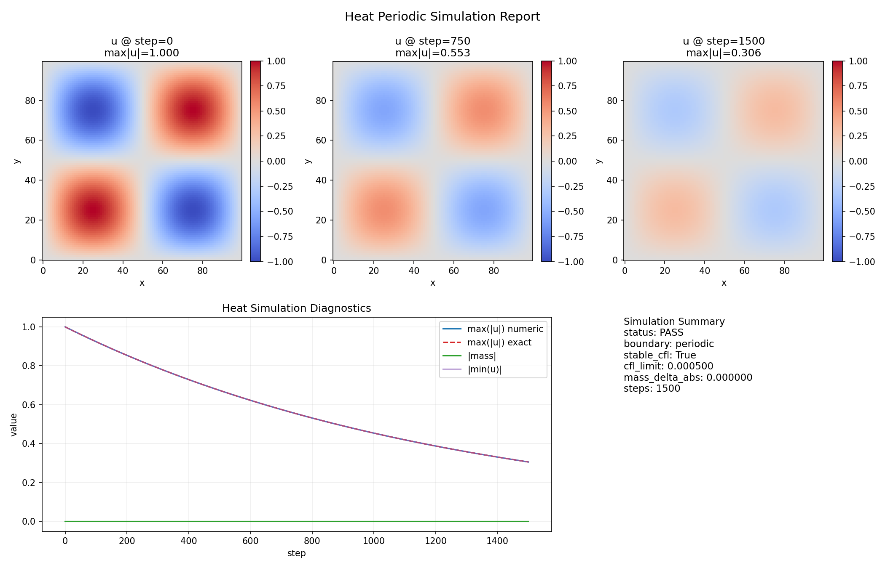
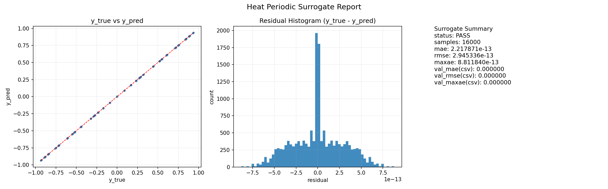
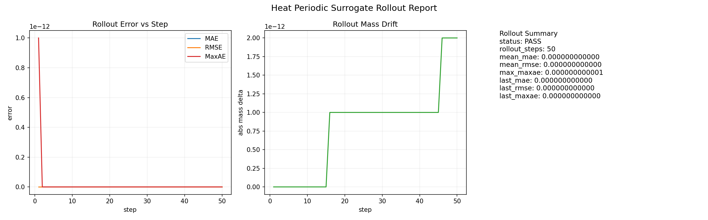

## 1. 目标 / Goal

本页记录 `heat_periodic` 的工程验收：在周期边界下跑通二维热方程，补上解析解对照的时间/空间收敛结论，并记录 surrogate 的一步与 rollout 表现。  
This page records `heat_periodic` engineering acceptance: run 2D heat equation under periodic boundary, add exact-solution temporal/spatial convergence results, and capture surrogate one-step + rollout behavior.

## 2. 页面范围 / Scope

本页包含三条线：  
This page includes three tracks:

1. 仿真主线（`mode=simulation`, long_t）/ Simulation mainline (`mode=simulation`, long_t)
2. 解析解收敛线（time/spatial exact convergence）/ Exact-convergence track (time/spatial)
3. surrogate 支线（监督训练 + rollout）/ Surrogate track (supervised + rollout)

对应目录：`ForgeFlowApps/heat_periodic/`。  
Mapped app directory: `ForgeFlowApps/heat_periodic/`.

## 3. Track-A：周期热方程仿真主线 / Track-A: Periodic Heat Simulation Mainline

配置文件 / Config file: `ForgeFlowApps/heat_periodic/config/run_long_t.json`

关键参数 / Key parameters:

- `mode = simulation`
- `task = heat_periodic_long_t`
- `adapter_ref = ForgeFlowApps.heat_periodic.adapters.heat_grid_adapter:HeatGridAdapter`
- `model_ref = ForgeFlowApps.ink_diffusion.models.ink_diffusion_explicit:InkDiffusionExplicitSimulator`
- `steps = 1500`
- `dt = 0.0002`
- `dx = dy = 0.01`
- `kappa = 0.05`
- `boundary = periodic`
- `strict_cfl = true`
- `mass_tolerance = 1e-4`

### 3.1 初值设定（解析模式） / Initial Condition (Analytic Mode)

初值通过脚本生成，目标模式是：
Initial condition is generated by script, using:

$$
u(x,y,0)=\sin(2\pi x)\sin(2\pi y)
$$

生成命令 / Build command:

```bash
python ForgeFlowApps/heat_periodic/scripts/build_initial_csv.py
```

输出文件 / Output:

- `ForgeFlowApps/heat_periodic/data/processed/initial.csv`

### 3.2 执行与产物 / Run and Outputs

执行命令 / Run command:

```bash
python main.py --config ForgeFlowApps/heat_periodic/config/run_long_t.json
```

输出文件 / Outputs:

- `ForgeFlowApps/heat_periodic/output/trajectory_long_t.csv`
- `ForgeFlowApps/heat_periodic/output/eval_report_long_t.csv`

本次记录结果（`eval_report_long_t.csv`）/ Recorded result (`eval_report_long_t.csv`):

| Item | Value |
|---|---:|
| mode | simulation |
| steps_requested | 1500 |
| states_recorded | 1501 |
| boundary | periodic |
| dt | 0.000200 |
| dx | 0.010000 |
| dy | 0.010000 |
| kappa | 0.050000 |
| cfl_limit | 0.000500 |
| stable_cfl | True |
| mass_delta_abs | 0.000000 |
| mass_tolerance | 0.000100 |
| status | PASS |

备注：`run.json` 仍可作为快速冒烟版本（短时长），本页主记录统一采用 `run_long_t.json`。  
Note: `run.json` remains a quick smoke-test variant (short horizon), while this page uses `run_long_t.json` as the primary record.

## 4. Track-B：解析解收敛验证 / Track-B: Exact-Solution Convergence

### 4.1 时间收敛（固定网格） / Temporal Convergence (Fixed Grid)

执行命令 / Run command:

```bash
python ForgeFlowApps/heat_periodic/scripts/run_exact_convergence_study.py
```

输出文件 / Output:

- `ForgeFlowApps/heat_periodic/output/exact_convergence_report.csv`

建议口径：看 `*_exact_semidiscrete` 列做时间阶判断；`*_exact_continuous` 会叠加固定空间离散偏差。  
Recommended interpretation: use `*_exact_semidiscrete` columns for temporal-order checks; `*_exact_continuous` includes fixed spatial-discretization bias.

| case | dt | steps | error_l2_exact_semidiscrete | error_linf_exact_semidiscrete | observed_order_l2_exact_semidiscrete | observed_order_linf_exact_semidiscrete | status |
|---|---:|---:|---:|---:|---:|---:|---|
| dt_0.0002 | 2e-4 | 100 | 1.4400e-05 | 2.8801e-05 | - | - | PASS |
| dt_0.0001 | 1e-4 | 200 | 7.1984e-06 | 1.4397e-05 | 1.000369 | 1.000369 | PASS |
| dt_5e-05 | 5e-5 | 400 | 3.5987e-06 | 7.1975e-06 | 1.000184 | 1.000184 | PASS |

结论：时间阶与前向欧拉一阶预期一致。  
Conclusion: temporal order matches first-order forward Euler expectation.

### 4.2 空间收敛（嵌套网格） / Spatial Convergence (Nested Grids)

执行命令 / Run command:

```bash
python ForgeFlowApps/heat_periodic/scripts/run_exact_spatial_convergence_study.py
```

输出文件 / Output:

- `ForgeFlowApps/heat_periodic/output/exact_spatial_convergence_report.csv`

| case | stride | grid | dx | dt | steps | error_l2_exact | error_linf_exact | observed_order_l2_exact | observed_order_linf_exact | status |
|---|---:|---|---:|---:|---:|---:|---:|---:|---:|---|
| stride_4 | 4 | 25x25 | 0.04 | 0.0050000000 | 4 | 1.6936e-04 | 3.3738e-04 | - | - | PASS |
| stride_2 | 2 | 50x50 | 0.02 | 0.0015384615 | 13 | 6.2957e-05 | 1.2542e-04 | 1.427641 | 1.427641 | PASS |
| stride_1 | 1 | 100x100 | 0.01 | 0.0004000000 | 50 | 1.6815e-05 | 3.3630e-05 | 1.904608 | 1.898909 | PASS |

结论：空间阶随网格细化向二阶收敛，与五点差分空间二阶预期一致。  
Conclusion: spatial order trends toward second order under refinement, consistent with five-point spatial accuracy.

## 5. Track-C：Surrogate 训练与 Rollout / Track-C: Surrogate Training and Rollout

### 5.1 数据与训练 / Dataset and Training

构建数据命令 / Build dataset:

```bash
python ForgeFlowApps/heat_periodic/scripts/build_surrogate_datasets.py
```

训练命令 / Train command:

```bash
python main.py --config ForgeFlowApps/heat_periodic/config/surrogate_run.json
```

本次记录结果（`surrogate_eval_report.csv`）/ Recorded result (`surrogate_eval_report.csv`):

| Item | Value |
|---|---:|
| mode | supervised |
| train_samples | 51200 |
| val_samples | 12800 |
| val_mae | 0.000000 |
| val_rmse | 0.000000 |
| val_maxae | 0.000000 |
| status | PASS |

### 5.2 Rollout 评估 / Rollout Evaluation

执行命令 / Run command:

```bash
python ForgeFlowApps/heat_periodic/scripts/run_surrogate_rollout_eval.py
```

输出文件 / Outputs:

- `ForgeFlowApps/heat_periodic/output/surrogate_rollout_steps.csv`
- `ForgeFlowApps/heat_periodic/output/surrogate_rollout_summary.csv`

本次 rollout 摘要（`surrogate_rollout_summary.csv`）/ Rollout summary (`surrogate_rollout_summary.csv`):

| Item | Value |
|---|---:|
| train_samples | 64000 |
| rollout_steps | 50 |
| mean_mae | 0.000000000000 |
| mean_rmse | 0.000000000000 |
| max_maxae | 0.000000000001 |
| last_mass_delta_abs | 0.000000000002 |
| status | PASS |

### 5.3 可视化快照（long_t） / Visual Snapshots (long_t)

[](simulation_report.png)

_Simulation report (long_t): field snapshots and diagnostics._

[](surrogate_report.png)

_Surrogate report: fit quality and residual distribution._

[](rollout_report.png)

_Rollout report: long-step prediction stability._

## 6. 验收逻辑（门禁顺序） / Acceptance Logic (Gate Order)

1. 配置门 / Config gate  
   - `run_long_t.json` 与 `surrogate_run.json` 可加载，字段完整。  
   - `run_long_t.json` and `surrogate_run.json` are loadable with required fields.
2. 仿真稳定门 / Simulation stability gate  
   - `stable_cfl=True` 且 `status=PASS`。  
   - `stable_cfl=True` and `status=PASS`.
3. 解析解收敛门 / Exact-convergence gate  
   - 时间阶（semidiscrete 列）接近 1，空间阶随细化接近 2。  
   - Temporal order (semidiscrete columns) near 1; spatial order trends toward 2.
4. surrogate 精度门 / Surrogate quality gate  
   - `val_mae/val_rmse/val_maxae` 低于阈值，`status=PASS`。  
   - validation metrics below thresholds, `status=PASS`.
5. rollout 稳定门 / Rollout stability gate  
   - rollout 误差与质量偏差可控，`status=PASS`。  
   - rollout error and mass drift remain controlled, `status=PASS`.
6. 产物完整门 / Artifact completeness gate  
   - 轨迹、收敛报告、预测、rollout、图表均存在且可读取。  
   - trajectory, convergence reports, predictions, rollout, and plots all exist and are readable.

## 7. 当前边界 / Current Limits

- 当前基准是单模态解析初值（`sin(2πx)sin(2πy)`），尚未覆盖多模态混合场。  
- Current benchmark uses a single-mode analytic initial field (`sin(2πx)sin(2πy)`), not yet multi-mode mixtures.
- 主仿真记录采用 long_t；解析解收敛脚本是独立 exact study（默认 `T=0.02` 口径）用于阶数判定。  
- Main simulation record uses long_t; exact-convergence scripts are separate exact studies (default `T=0.02`) for order estimation.
- 时间收敛判断应优先使用 semidiscrete 对照列；continuous 对照会叠加空间偏差。  
- Temporal-order checks should prioritize semidiscrete columns; continuous columns include spatial bias.
- surrogate 当前验证集中在同分布一步与短期 rollout，尚未覆盖显著 OOD 场景。  
- Surrogate validation currently focuses on in-distribution one-step/short rollout and does not cover strong OOD scenarios.

## 8. 关联页面 / Linked Pages

- 框架本体 / Framework core: [Artifact-2.0](/artifacts/02-forgeflow/2-0-framework-core/)
- 上一项 / Previous: [Artifact-2.3](/artifacts/02-forgeflow/2-3-ink-diffusion-dual-track/)
- 下一项 / Next: [Artifact-2.5](/artifacts/02-forgeflow/2-5-heat-kappa-inverse/)
- 父索引 / Parent: [Artifact-2](/artifacts/02-forgeflow/)
