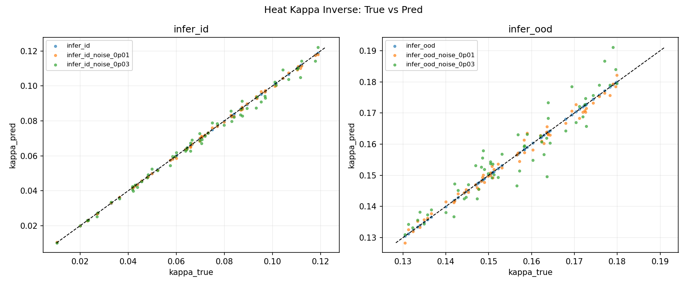

## Goal

This page records the parameter-inversion validation of `heat_kappa_inverse`: infer the diffusion coefficient `kappa` from compact observation features and evaluate the result under ID, OOD, and noisy conditions.

## Scope

The artifact is divided into two stages:

1. Stage 1: dataset generation (`kappa -> features`)
2. Stage 2: inverse regression and robustness analysis (`features -> kappa`)

## Stage 1: Data Generation

Main config:

`ForgeFlowApps/heat_kappa_inverse/stage1_data_gen/config/generate.json`

The generated datasets cover:

- in-distribution training and inference ranges
- out-of-distribution inference ranges
- noisy ID and noisy OOD slices

## Stage 2: Inverse Regression

Main configs:

- `ForgeFlowApps/heat_kappa_inverse/stage2_inverse/config/run_id.json`
- `ForgeFlowApps/heat_kappa_inverse/stage2_inverse/config/run_ood.json`

Validation result:

| Item | Value |
|---|---:|
| train_samples | 176 |
| val_samples | 44 |
| val_mae | 0.000005 |
| val_rmse | 0.000006 |
| val_maxae | 0.000013 |
| status | PASS |

## ID/OOD and Noise

Clean ID is very accurate.  
Error rises under distribution shift and injected noise, which is exactly the expected direction.

Selected results:

| split | mae | anomaly_ratio |
|---|---:|---:|
| infer_id | 0.000004 | 0.000000 |
| infer_id_noise_0p03 | 0.001902 | 0.983333 |
| infer_ood | 0.000043 | 1.000000 |
| infer_ood_noise_0p03 | 0.003819 | 1.000000 |

## Sigma-K Calibration

The current recommendation is:

`sigma_k = 4.0`

It keeps OOD alerting high while slightly reducing false positives on noisy ID samples.

## Visualization

## Acceptance Logic

The current gate order is:

1. data-generation integrity
2. regression quality
3. ID/OOD contrast behavior
4. noisy robustness behavior
5. threshold calibration
6. artifact completeness

## Linked Pages

- Previous: [Artifact-2.4](/en/artifacts/02-forgeflow/2-4-heat-periodic-benchmark/)
- Parent: [Artifact-2](/en/artifacts/02-forgeflow/)
