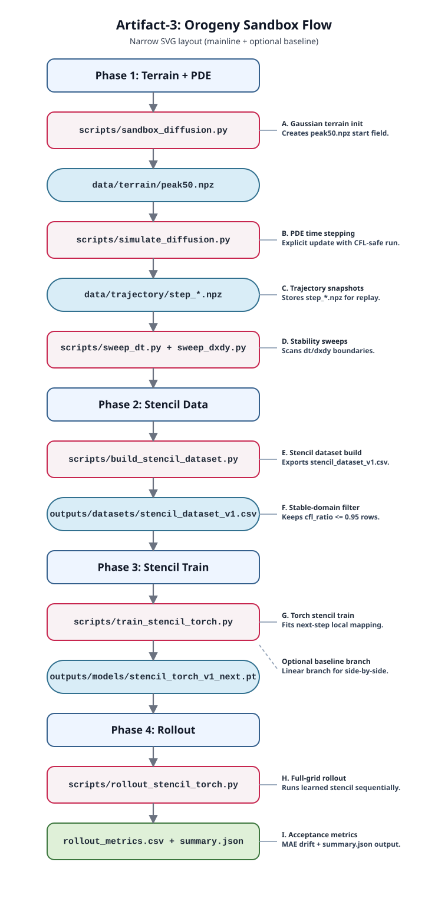

---
date: '2026-02-22T05:30:00+09:00'
draft: false
title: "[Artifact-3] Orogeny Sandbox 全链验证 / Orogeny Sandbox End-to-End Validation"
summary: "从高斯地形生成、PDE 扩散仿真、稳定域数据集构建到 multistep/CNN rollout 与 OOD+3σ 门控的完整链路记录。 / End-to-end record from Gaussian terrain generation and PDE diffusion to multistep/CNN rollout and OOD+3-sigma runtime gates."
description: "Artifact 3 tracks the full PDE-to-ML pipeline in orogeny-sandbox, including frozen best multistep, CNN POC, and OOD gating."
tags:
  - "Computational Science"
  - "PDE"
  - "CNN"
  - "Reliability"
categories:
  - "Artifacts"
series:
  - "Inverse Modeling and Reliable Computation"
weight: 30
aliases:
  - /artifacts/orogeny-sandbox/
---

## 1. 目标 / Goal

本页按“一条链路跑到底”的方式记录 `orogeny-sandbox` 的 v0.1 里程碑：  
This page documents the v0.1 milestone of `orogeny-sandbox` as one full chain:

`地形生成 -> PDE 扩散 -> 稳定域数据工程 -> stencil 学习 -> rollout 验证 -> OOD+3σ 门控`  
`terrain generation -> PDE diffusion -> stable-domain data engineering -> stencil learning -> rollout validation -> OOD + 3-sigma runtime gate`

项目路径 / Project path: `D:\Github_Repos\orogeny-sandbox`

---

## 2. 全链流程图 / End-to-End Flowchart

[](orogeny-sandbox-flow.svg)


---

## 3. 链路拆解（Phase 1 -> 6） / Chain Breakdown (Phase 1 -> 6)

### Phase 1: 地形 + PDE
- 输入 / Input: `data/terrain/peak50.npz`
- 核心脚本 / Core scripts:
  - `scripts/sandbox_diffusion.py`
  - `scripts/simulate_diffusion.py`
  - `scripts/sweep_dt.py`
  - `scripts/sweep_dxdy.py`
- 产物 / Outputs:
  - `data/trajectory/*`
  - `outputs/metrics/dt_sweep_summary.csv`
  - `outputs/metrics/dxdy_sweep_summary.csv`
- 结论 / Takeaway:
  - 在 canonical 设置（`kappa=1`, `dx=dy=1`）下，`dt_max=0.25`。
  - `dt=0.24` 可稳定，`dt=0.30/0.35` 明显发散。

### Phase 2: 稳定域数据工程
- 输入 / Input: Phase 1 轨迹数据。
- 核心脚本 / Core script: `scripts/build_stencil_dataset.py`
- 规则 / Rule: 仅保留 `cfl_ratio <= 0.95` 样本。
- 输出 / Output: `outputs/datasets/stencil_dataset_v1.csv`

### Phase 3: Stencil 学习（v1 与 multistep）
- Baseline 分支 / Baseline branch:
  - `scripts/train_stencil_baseline.py`
  - `scripts/rollout_stencil_linear.py`
- Torch one-step 分支 / Torch one-step branch:
  - `scripts/train_stencil_torch.py`
  - `scripts/rollout_stencil_torch.py`
- Torch multistep 分支 / Torch multistep branch:
  - `scripts/train_stencil_torch_multistep.py`
  - `configs/stencil_multistep_best_neumann_h5_m1e4.json`

### Phase 4: 连续 rollout 对照
- 核心脚本 / Core scripts:
  - `scripts/rollout_stencil_torch.py`
  - `scripts/rollout_cnn_torch.py`
- 对照方式 / Validation mode:
  - 每步将 learned rollout 与 PDE ground truth 对比。
- 关键产物 / Key outputs:
  - `outputs/rollout/*/rollout_metrics.csv`
  - `outputs/rollout/*/summary.json`

### Phase 5: Frozen Best 固化运行
- 一键入口 / One-command entry:
  - `scripts/run_frozen_best_multistep.py`
- 配置文件 / Config:
  - `configs/stencil_multistep_best_neumann_h5_m1e4.json`
- 固化参数 / Frozen setup:
  - `horizon=5`, `lambda_mass=1e-4`, `epochs=10`, `batches_per_epoch=96`, `batch_trajectories=4`

### Phase 6: CNN POC + OOD 门控
- POC runner / POC runner:
  - `scripts/run_cnn_poc_standard.py`
  - `configs/cnn_poc_neumann_standard.json`
- OOD profile + runtime gate:
  - `scripts/build_ood_sigma_profile.py`
  - `scripts/ood_sigma.py`
  - `configs/ood_sigma_profile_neumann_default.json`
- 产物 / Outputs:
  - `outputs/metrics/generalization_min_summary_cnn_poc_neumann_standard_cnn_poc_v1.csv`
  - `outputs/rollout/ood_smoke_*/summary.json`

---

## 4. 当前关键指标 / Current Key Metrics

来自 `README.md` 与 `outputs/*` 的当前口径：  
Current snapshot from `README.md` and `outputs/*`:

| Item | Value |
|---|---:|
| One-step test R² (Torch stencil v1) | 0.9996875303 |
| Frozen multistep 60-step final MAE | 0.0270107879 |
| Frozen multistep 120-step final MAE | 0.0528981476 |
| Frozen multistep 120-step final mass abs error | 124.5418858851 |
| CNN POC 120-step final MAE | 0.0569392458 |
| CNN POC 120-step final mass abs error | 130.6776753687 |
| Minimal benchmark mean final MAE (CNN) | 0.0557232487 |
| Minimal benchmark mean final MAE (frozen multistep) | 0.0560578554 |
| OOD smoke (ID Neumann): `ood_is_ood` | false |
| OOD smoke (Periodic): `ood_is_ood`, violations | true, 2 |

---

## 5. 复现实验主链 / Reproduce Mainline

### 5.1 Core Path（v1）

```powershell
python scripts/sandbox_diffusion.py --size 50 --sigma 7 --out data/terrain/peak50.npz
python scripts/simulate_diffusion.py --data data/terrain/peak50.npz --out-dir data/trajectory/run_stable --steps 120 --save-every 30 --dt 0.1 --kappa 1.0 --dx 1.0 --dy 1.0 --boundary neumann
python scripts/build_stencil_dataset.py --out-csv outputs/datasets/stencil_dataset_v1.csv --summary-csv outputs/datasets/stencil_trajectory_summary_v1.csv --meta-json outputs/datasets/stencil_dataset_v1_meta.json --num-trajectories 200 --steps 40 --samples-per-step 128 --size 50 --seed 42 --boundaries neumann --cfl-ratio-max 0.95
python scripts/train_stencil_torch.py --data-csv outputs/datasets/stencil_dataset_v1.csv --target-col next_center --epochs 6 --batch-size 4096 --lr 0.001 --weight-decay 0.000001 --hidden-dims 64,64 --dropout 0.0 --model-pt outputs/models/stencil_torch_v1_next.pt --model-json outputs/models/stencil_torch_v1_next_meta.json --report-csv outputs/reports/stencil_torch_v1_next_report.csv --pred-csv outputs/reports/stencil_torch_v1_next_predictions.csv --skip-predictions --test-ratio 0.2 --seed 42
python scripts/rollout_stencil_torch.py --model-pt outputs/models/stencil_torch_v1_next.pt --data data/terrain/peak50.npz --out-dir outputs/rollout/stencil_torch_v1_next_peak50_120 --steps 120 --kappa 1.0 --dx 1.0 --dy 1.0 --dt 0.1 --boundary neumann --save-every 20
```

### 5.2 Frozen Best（multistep）

```powershell
python scripts/run_frozen_best_multistep.py
```

### 5.3 CNN POC + OOD Smoke

```powershell
python scripts/run_cnn_poc_standard.py --run-name cnn_poc_v1 --device auto
python scripts/build_ood_sigma_profile.py --samples 3000 --seed 42 --out-json configs/ood_sigma_profile_neumann_default.json
python scripts/rollout_stencil_torch.py --model-pt outputs/models/stencil_torch_neumann_multistep_h5_m1e4_ep10b96.pt --data data/terrain/peak50.npz --out-dir outputs/rollout/ood_smoke_stencil_id --steps 20 --kappa 1.0 --dx 1.0 --dy 1.0 --dt 0.1 --boundary neumann --save-every 20 --ood-profile configs/ood_sigma_profile_neumann_default.json --ood-sigma 3.0
python scripts/rollout_cnn_torch.py --model-pt outputs/models/cnn_poc_neumann_standard_cnn_poc_v1.pt --data data/terrain/peak50.npz --out-dir outputs/rollout/ood_smoke_cnn_id --steps 20 --kappa 1.0 --dx 1.0 --dy 1.0 --dt 0.1 --boundary neumann --save-every 20 --ood-profile configs/ood_sigma_profile_neumann_default.json --ood-sigma 3.0
```

---

## 6. 验收门槛 / Acceptance Gates

1. PDE 稳定门 / PDE stability gate: CFL 条件满足且不爆炸；CFL-compliant and non-explosive simulation.
2. 数据质量门 / Dataset gate: `cfl_ratio <= 0.95` 的稳定域过滤生效；stable-domain filtering (`cfl_ratio <= 0.95`) is enforced.
3. 一步精度门 / One-step gate: report 指标达到高精度拟合；one-step fitting metrics reach high accuracy.
4. 长时推演门 / Long-horizon rollout gate: 120-step 不 blow-up 并记录漂移；120-step rollout stays bounded with tracked drift.
5. 固化配置门 / Frozen config gate: `configs/stencil_multistep_best_neumann_h5_m1e4.json` 可一键复现主要指标；frozen runner reproduces reference metrics.
6. 可靠性门 / Reliability gate: OOD+3σ 运行时告警可区分 ID 与明显 OOD（如 periodic）；OOD gate separates ID and clear OOD runs.

---

## 7. 当前边界 / Current Limits

- 长时域 rollout 仍存在误差与质量漂移累积。  
- Long-horizon rollout still accumulates error and mass drift.
- OOD profile 当前主要围绕 Neumann 分布构建，跨边界泛化还需补充。  
- OOD profile is currently centered on Neumann-distribution runs; cross-boundary generalization needs more coverage.
- 当前 benchmark 还是最小集（12 案例），建议扩展 amplitude/sigma/dt 与复杂地形族。  
- Current benchmark is still minimal (12 cases); broader amplitude/sigma/dt and richer terrain families are needed.

---

## 8. 关联入口 / Linked Entry

- 父索引 / Parent: [Artifacts](/artifacts/)
- 前一条 / Previous: [Artifact-2](/artifacts/02-forgeflow/)
