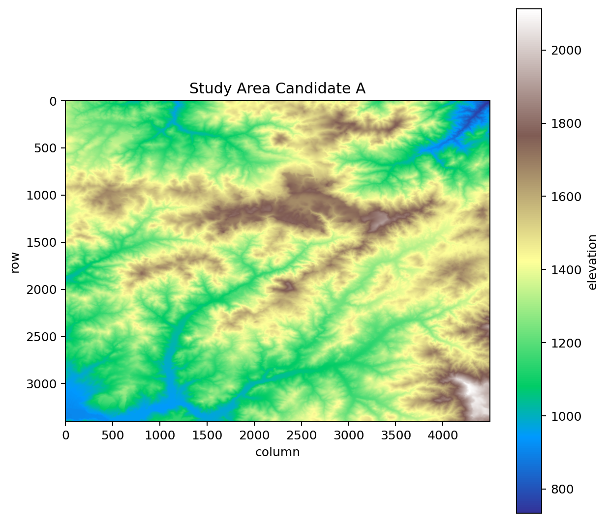
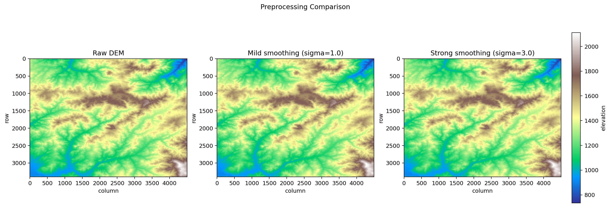
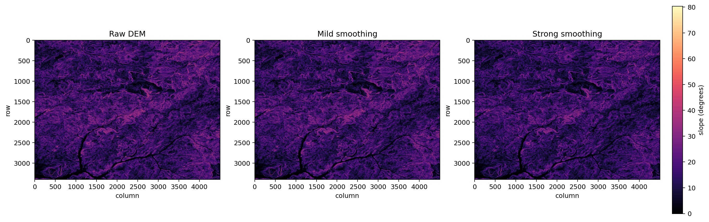
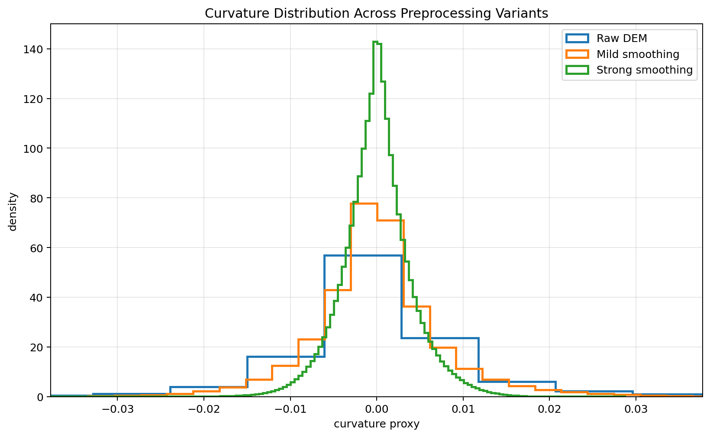
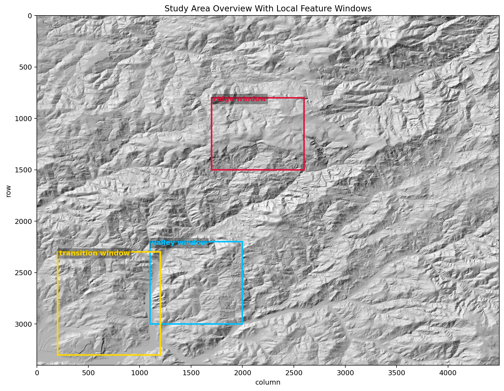
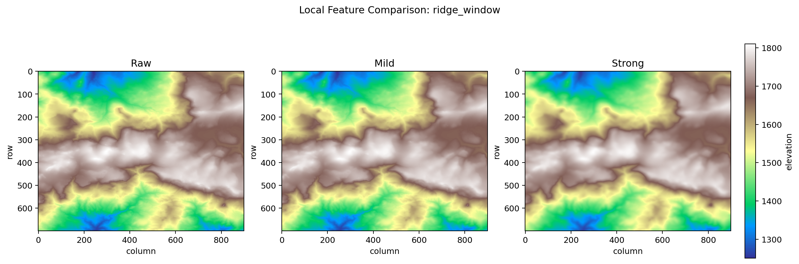
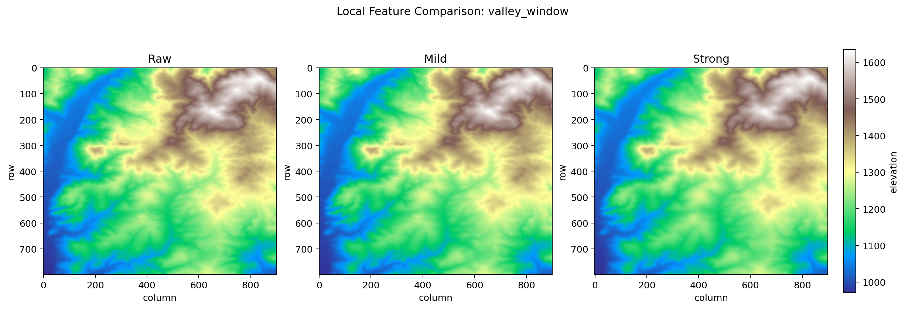
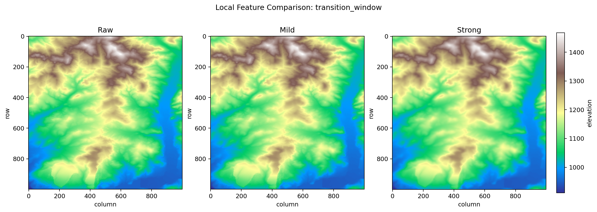

Project repo: [dem-landform-stability-lab](https://github.com/r1skers/dem-landform-stability-lab)

# Problem Setup

**A small-area terrain-analysis experiment based on public DEM data: how stable is landform recognition under different preprocessing conditions, and where do the interpretation boundaries start to appear?**

This project is not an inversion problem, and it is not a PDE solver project either.  
It is closer to a small terrain-analysis / geomorphology-oriented DEM demo:

- choose a real public DEM
- apply different preprocessing settings to the same study area
- compare `slope` and `curvature proxy`
- see which landform features remain robust and which are more sensitive

Because this is a learning demo, the DEM data here comes from [USGS The National Map Downloader](https://apps.nationalmap.gov/downloader/) (`n45w121`, `n45w122`).

## What this article is really trying to answer

In the end, this demo converges to a fairly concrete question:

> Under different preprocessing strengths, does the broad landform framework remain robust?  
> Which small-scale terrain expressions are affected first?

Making that question explicit early helps the rest of the page read more clearly. The later steps are not about “making the map look nicer”; they are about judging:

- whether large-scale structure has changed
- whether small-scale expression has been weakened
- how far those changes can be interpreted

# Overview of the Data-Processing Stage

This stage contains three steps:

1. `inspect_dem.py`
2. `crop_study_area.py`
3. `preprocess_dem.py`

These three scripts are responsible for:

- checking whether the DEM itself can be read correctly
- cropping the real study area from a larger tile
- building three comparable input versions: raw / mild / strong

The overall goal is to turn the data into a **controlled comparison object**.

# Step 1: Inspect the Raw DEM (`inspect_dem.py`)

The script mainly does three things:

- read the raw `.tif` DEM
- convert `nodata` into `NaN` for later statistics
- print basic metadata and export a quicklook

More specifically, this step checks:

- `shape`
- `resolution`
- `bounds`
- `crs`
- `nodata`
- elevation min / max / mean

It also exports a quick preview image to help judge:

- whether the dataset is too large
- whether topographic variation is strong enough
- whether it is worth moving on to cropping

# Step 2: Crop the Study Area (`crop_study_area.py`)

The raw downloaded DEM tile is too large to use directly as the main object of analysis.  
The reasons are straightforward:

- the extent is too large
- the landform units are too mixed
- later interpretation would become too diffuse
- computation and plotting would become heavy

So the second step is:  
crop a real **study area** from the larger source tile.

In the current version, this study area is a ridge-hillslope-valley unit cropped from `USGS_13_n45w121_20260202.tif`, saved as:

`study_area_candidate_a_n45w121.tif`

It satisfies several needs of the current project:

- a clear ridge
- valley / drainage structure
- hillslope transitions
- an internally coherent but not overly complicated geometry

The meaning of this step is:

**shrink a large and scattered raw DEM into a smaller object that can actually support a comparison-driven research question.**

# Step 3: Build the Preprocessing Comparison (`preprocess_dem.py`)

Once the study area is available, preprocessing becomes a way to construct a comparable experiment.

The script generates three versions:

- `Raw DEM`
- `Mild smoothing`
- `Strong smoothing`

The current version uses Gaussian smoothing:

- mild: `sigma = 1.0`
- strong: `sigma = 3.0`

The best way to read this is:

**smoothing is not being used as a blunt denoising tool; it is being used to compare how terrain expression changes under different processing strengths.**

So preprocessing acts more like a controlled perturbation:

- does the large-scale topographic skeleton remain?
- do local breaks in slope begin to soften?
- does curvature response contract toward 0 more quickly?

That naturally leads to the later computation of `slope` and `curvature proxy`.

# Step 4: Compute Terrain Metrics (`terrain_metrics_stage1.py`)

Once the three input versions exist, the question changes into:

- which terrain expressions are changing?
- which changes are large-scale and which are small-scale?
- which features remain stable under preprocessing?

At this stage I compute three terrain metrics:

- `hillshade`
- `slope`
- `curvature proxy`

## hillshade: relearning how to “see” the study area

The role of `hillshade` is to turn the DEM from an abstract elevation matrix into something closer to how the eye reads terrain.

In this project, hillshade mainly answers:

- is the ridge / valley skeleton still there?
- did preprocessing immediately turn the study area into “a different terrain”?

The current result says:

**under raw / mild / strong, the large-scale ridge-valley framework is still recognizable.**

That means:

- preprocessing did not immediately destroy the large structure
- the current smoothing strengths are still within a reasonable range

## slope: checking whether local steepness is weakened

`slope` is the first terrain metric here with a clear quantitative meaning.  
It asks:

**how fast elevation changes, in other words how steep the terrain is.**

In the current version, as smoothing becomes stronger:

- mean slope drops from `15.269` to `13.553`
- slope `p95` drops from `29.016` to `25.464`
- max slope drops from `80.330` to `54.868`

Here `p95` is not a middle value. It means the **95th percentile**:

> 95% of all pixels are below this value, and only the steepest 5% are above it.

So `p95` is more stable than `max`, and better for describing whether the high-slope tail is being compressed.

This part of the result shows:

- smoothing weakens local high-slope response
- but the large-scale spatial slope pattern remains fairly stable

In other words:

**slopes become gentler, but the ridge / valley framework does not disappear all at once.**

## curvature proxy: checking whether local convex-concave expression is sensitive

If slope is looking at first-order change, then `curvature proxy` is closer to looking at:

**changes in local shape variation.**

That is exactly why it is more sensitive than slope.

In the current whole-area result:

- Raw:
  - `p05 = -0.015161`
  - `p95 = 0.016755`
  - `std = 0.010544`
- Mild smoothing:
  - `p05 = -0.011878`
  - `p95 = 0.012941`
  - `std = 0.007778`
- Strong smoothing:
  - `p05 = -0.006600`
  - `p95 = 0.006850`
  - `std = 0.004053`

The key question here is not whether the distribution “looks Gaussian”, but:

- does it contract toward `0`?
- do the two tails become shorter?
- are extreme curvature responses reduced?

The result is very clear:

**after strong smoothing, the curvature distribution contracts strongly toward 0, meaning a large amount of small-scale convex-concave variation has been weakened.**

Put differently:

- the large-scale landform skeleton remains
- but small-scale terrain expression gets flattened out more quickly by smoothing

# Step 5: What the whole-area comparison means (`terrain_metrics_stage2_summary.py`)

At this stage, the workflow produces:

- `slope histograms`
- `curvature histograms`
- whole-area summary statistics

This turns visual judgment into quantitative evidence that can support interpretation.

## Core conclusion of this stage

At this point, the whole-area comparison already supports a very clear conclusion:

**preprocessing does not immediately change the large-scale landform skeleton of the study area, but it does clearly change small-scale terrain expression.**

More specifically:

- `hillshade` suggests the main ridge-valley framework is still stable
- `slope` suggests local steepness is weakened, but the overall slope structure remains readable
- `curvature proxy` suggests small-scale convex-concave response is pushed toward 0 much more strongly

So from this stage onward, the real research question has already emerged:

> is the broad landform framework robust?  
> is small-scale landform expression more dependent on preprocessing?

At this point, the data-preparation and whole-area terrain-metric part is basically complete.  
The natural next step is to move into:

- local feature windows
- local comparisons for ridge / valley / transition
- which concrete landform features are stable and which are more sensitive

# Step 6: Local window comparison (`local_feature_overview.py` + `local_feature_panels.py`)

The whole-area comparison can answer:

- whether the overall distribution has changed
- whether preprocessing affects slope more or curvature more

But it cannot answer very well:

- which kinds of landform features are actually more robust?
- how do ridge, valley, and transition each change?

So the next move was:

**cut several representative local windows out of the full study area.**

The current version uses three:

- `ridge window`
- `valley window`
- `transition window`

Here:

- `local_feature_overview.py` marks their locations on the full study-area figure
- `local_feature_panels.py` compares each window side by side under raw / mild / strong

## Why local windows are needed

The reason is simple:

**whole-area statistics only tell me the overall trend; they do not directly tell me which landform unit is changing.**

For example:

- curvature contracts toward 0 overall

That statement is true, but still not specific enough.  
I also need to know:

- is the ridge edge getting blunter?
- are small tributaries in the valley weakening?
- is the fine segmentation in the transition zone being reduced?

That is why this stage matters:

it brings the earlier “overall conclusion” back down to actual interpretable landform objects.

## ridge window: the large ridge is stable, edge sharpness is more sensitive

The clearest feature here is a continuous high ridge zone and the slopes on both sides.

From the figures:

- the ridge crest is very clear in raw
- still clear in mild
- still recognizable even in strong

So the first-layer conclusion is:

**the main ridge as a large-scale landform structure is stable.**

But at the same time:

- the ridge edge is sharper in raw
- it becomes rounder and blunter in strong

So the second-layer conclusion is:

**the ridge body does not disappear, but ridge-edge sharpness weakens as smoothing becomes stronger.**

The local statistics support that:

- `95th-percentile slope` drops by about `12.6%`
- `curvature std` drops by about `63.6%`

So the most fitting sentence here is:

> major ridge geometry remains robust, while finer edge sharpness is processing-sensitive.

## valley window: the broad valley framework is stable, but small tributary texture is more sensitive

The clearest object here is a relatively wide valley body with some tributary-like branching texture.

From the figures:

- the valley body remains recognizable in all three versions
- the low-lying channel does not disappear
- but small branches and fine texture weaken noticeably in the strong version

So the interpretation here is:

**the broad valley framework is stable, but smaller tributary-like texture is more sensitive.**

The local statistics are:

- `95th-percentile slope` drops by about `9.7%`
- `curvature std` drops by about `60.5%`

This suggests:

- the broad valley object is still present
- but smaller-scale incision / branching expression is weakened under strong smoothing

## transition window: broad transition is stable, fine segmentation is more sensitive

This area contains:

- higher topography at the top
- a mid-slope transition
- lower terrain below
- plus some side gullies

From the figures:

- the large-scale high-to-low transition remains in all three versions
- but some side-gully texture gradually becomes less visible

So:

**the broad transition remains interpretable, while local terrain segmentation is more processing-sensitive.**

The local statistics are:

- `95th-percentile slope` drops by about `13.3%`
- `curvature std` drops by about `64.8%`

Together with the previous two windows, this forms a very consistent pattern:

- the large objects do not disappear first
- the small-scale expressions are smoothed away earlier

# Step 7: What the local-window comparison adds (`terrain_metrics_stage3_local_summary.py`)

At this point, the project is no longer just “looking at how different a few plots are”.

Through the local windows, I can say more clearly:

- preprocessing does not first destroy the broad landform framework
- preprocessing first affects small-scale landform expression
- ridge, valley, and transition all show similar patterns

The most important meaning of this stage is that it makes the earlier whole-area conclusion more concrete.

## Not all landform features are equally sensitive

This point is essential.

The current result is not saying:

- smoothing makes every landform feature disappear together

It is saying:

- different levels of landform features do not have the same sensitivity to preprocessing

More precisely:

- large-scale ridge / valley / transition framework: relatively robust
- small-scale edge sharpness / tributary texture / side gullies / local convex-concave variation: more sensitive

## This is where the interpretation starts to look like a research judgment

Without the local windows, the article would easily stop at:

- the map changed
- the histogram changed
- curvature is more sensitive

All of that is true, but still a bit abstract.

With local windows, the project finally starts answering:

> which landform objects remain stable under preprocessing?  
> which kinds of objects depend more strongly on the processing choice?

That is a big difference.

Because it turns “metric change” into:

**landform interpretation change**

# Summary: limitations

Although this project already forms a fairly complete comparison chain, it is still only a learning demo rather than a full research study.

The current version has at least these limitations:

## 1. There is only one study area

All analysis here is built on one study area.  
That means:

- the current conclusion is first and foremost valid for this one area
- it cannot yet be directly generalized to other terrain types

So this version is better described as:

**a single-case terrain sensitivity demo**

rather than a systematic cross-region comparison study.

## 2. The preprocessing family is still simple

At the moment only three versions are compared:

- raw
- mild smoothing
- strong smoothing

That is enough for the current question, but it still does not cover:

- different filter families
- resolution changes
- multi-scale resampling
- more complex preprocessing chains

So this version mainly reflects:

**how terrain metrics respond under the current smoothing setup.**

## 3. The curvature here is only a proxy

The current `curvature proxy` is a simplified indicator mainly used to track whether local convex-concave expression is being weakened.  
It is not a full standard geomorphological curvature system, and it should not be over-interpreted as strict geomorphological truth.

So the more accurate way to describe it is:

- it is a useful sensitivity indicator
- it is not a final quantity that can independently support complex geomorphological process judgment

## 4. Process interpretation is still lightweight

This version of the project already starts talking about:

- ridge
- valley
- transition
- tributary-like texture

But it is still only a relatively lightweight geomorphological interpretation.

In other words, this version mainly gets as far as:

- discussing which landform expressions are more stable
- discussing which local features are more processing-sensitive

It does not yet move into:

- landscape evolution modeling
- more complex process attribution
- stronger field-based or process-based validation

# Summary: lessons learned

From a technical-difficulty point of view, this project is not especially hard.  
Its difficulty does not come from “the algorithm being complicated”, but from the methodology:

- whether the question is set clearly
- whether the relationship between preprocessing and interpretation is stated clearly
- whether the result is over-interpreted

For me, there are three main takeaways:

## 1. Learning how to turn a real DEM into a comparable problem

It is not about downloading the DEM and immediately computing maps. The first step is to ask:

- what is the state of the data?
- how should the study area be chosen?
- how should preprocessing be designed?

That made me see more clearly:

**a project does not begin with “writing code”; it begins with tightening the object and the question.**

## 2. Learning to distinguish “large-scale stability” from “small-scale sensitivity”

This is the core point of the project.

Before doing it, I was more likely to think of preprocessing as:

- process the image a bit
- then keep computing metrics

But now I understand more clearly:

- preprocessing does not necessarily change the large topographic skeleton first
- it is more likely to change small-scale terrain expression first
- so interpretation has to distinguish landform levels

