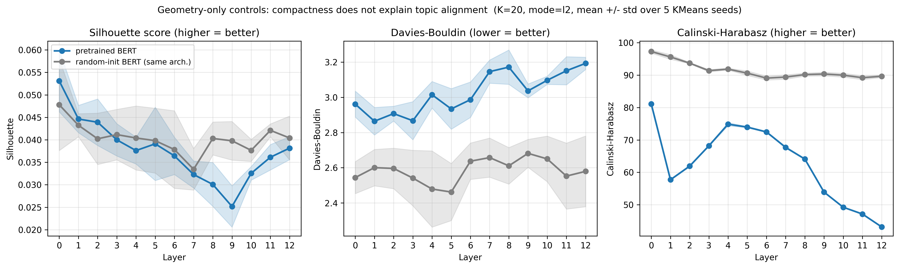
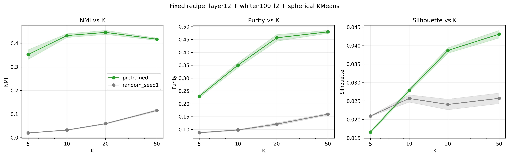
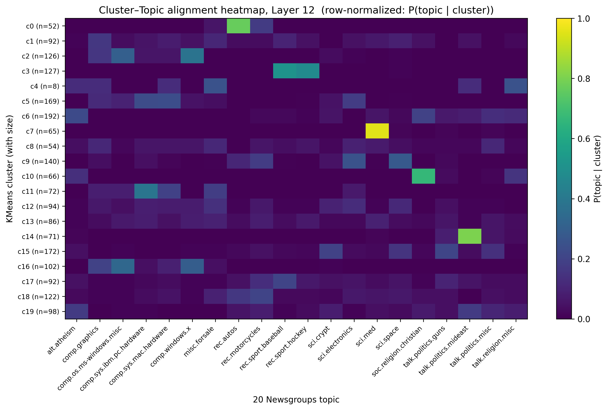
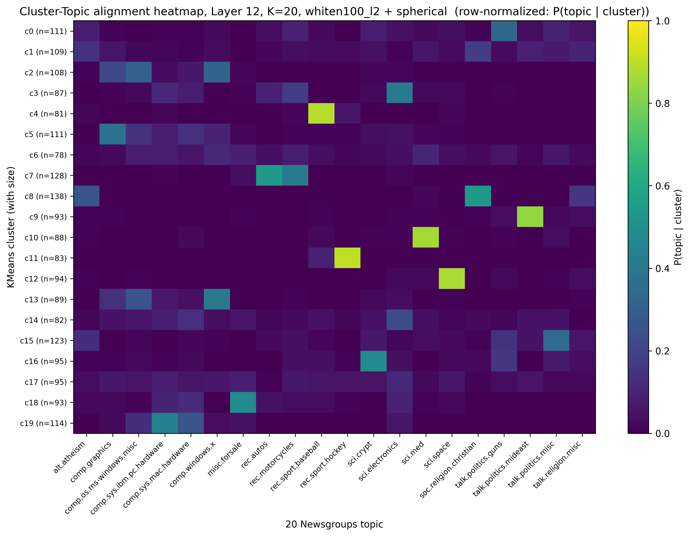

Project repo: local at `D:\Dev\repos\bert-cluster-stability` (not yet pushed to GitHub).  
This artifact records the W1 pilot, not a final paper-style result. The goal is to lock down the experimental chain and staged conclusions that are already working.

## 1. Goal

This page records the clustering view of `bert-cluster-stability` (completed 2026-05):  
use clustering as a probe to see whether BERT's document-segment representations contain readable topic-aligned structure.

Problem setup:

> If we take BERT's document-segment representations from each layer and run unsupervised clustering on them, will the clustering result look increasingly close to the 20 Newsgroups topic labels?

More tightly:

**Is there a topic geometry inside BERT's higher-layer representations that a clustering probe can read out?**

Current shortest finding:

> The L12 document-segment embeddings of pretrained BERT do contain topic-aligned organization. This structure is most clearly recovered after PCA whitening, using spherical KMeans.

---

## 2. Problem Setup

### 2.1 Data and Models

| Item | Value |
|---|---|
| Dataset | 20 Newsgroups |
| Current pilot sample | `n_docs=2000`, `sample_seed=42` |
| Input granularity | document segment |
| Truncation | first 512 WordPiece tokens |
| Main model | `bert-base-uncased` |
| Control model | same architecture, random-init, `seed=1` |
| Probed layers | embedding layer 0 + encoder layers 1..12 |
| Representation | mean-pool over non-padding tokens |
| Cache shape | `(N, 13, 768)` |

### 2.2 Metrics

Primary:

- `NMI(cluster, topic)`
- `purity(cluster, topic)`

Auxiliary:

- silhouette
- Davies-Bouldin
- Calinski-Harabasz
- anisotropy
- participation ratio

The most important distinction here:

**Geometric compactness is not the same thing as semantic alignment.**

So the rest of this note relies on NMI / purity to judge topic alignment, and treats silhouette and friends as geometry-only controls, not as the final answer.

---

## 3. Main Pipeline

The current pipeline collapses into four steps:

1. Load 20NG documents and topic labels
2. Use pretrained BERT and random-init BERT to extract 13 layers of document-segment embeddings
3. For each layer, each preprocessing choice, and each clusterer, run clustering
4. Use NMI / purity / heatmap to judge whether clusters align with the topic labels

Cached vector shape:

```text
embeddings: (2000, 13, 768)
```

meaning:

```text
2000 documents
13 BERT layers
768 hidden dims
```

---

## 4. Why Not Just baseline + Lloyd

The most naive recipe was the first thing tried:

```text
L2 normalize + Lloyd KMeans
```

At L12 with K=20 it already gave NMI ≈ 0.36; against the random-init baseline of NMI ≈ 0.05 this is a clear gap. At first glance it looked sufficient.


But there was an odd observation: **silhouette / Davies-Bouldin / Calinski-Harabasz — three classical geometric compactness metrics — barely separate pretrained from random-init**.



That contrast forces a question:

> The two models look indistinguishable under geometric compactness, yet they look very different under NMI.  
> So in BERT's representation space, semantic alignment and conventional cluster compactness appear to be decoupled.

The first version of the story was therefore named:

> **Late semantic alignment with geometric decoupling**

But that "decoupling" itself raises a new question: maybe the anisotropy of BERT's representation space is masking some clusterable structure? If so, a transformation like PCA whitening might expose what was previously pinned inside a narrow cone.

This suspicion is what triggered the preprocessing × clusterer sweep in the second half of the project. The shift was not in the research question, but in research attitude:

> Representation preprocessing is not a fixed default — it is an experimental variable that deserves systematic comparison.

---

## 5. Current Best Recipe

The strongest configuration in the current pilot is:

```text
layer12 + whiten100_l2 + spherical KMeans + K=20
```

Averaged over 5 clustering seeds:

| Model | NMI | Purity |
|---|---:|---:|
| Pretrained BERT | ~0.446 | ~0.457 |
| Random-init BERT | ~0.059 | ~0.121 |

The takeaway:

**Pretrained BERT's L12 representations contain topic-aligned clustering structure; same-architecture random-init BERT does not.**

---

## 6. Layer Sweep

Fixed:

```text
whiten100_l2 + spherical KMeans + K=20
```

Swept:

```text
L0..L12
```


Current observations:

- L0 already carries weak lexical / topic signal
- L1-L5 rise quickly
- L6-L9 plateau
- L10-L12 strengthen again
- L12 is the strongest
- Random-init BERT stays near the floor across all layers

This matters: topic alignment is not a simple monotone climb from shallow to deep. It is more like a three-stage arc — **early rise, mid plateau, late strengthening**.  
In other words, late-layer enhancement is real, but the middle layers are not blank.

---

## 7. Whitening Dimension

Fixed:

```text
layer12 + spherical KMeans + K=20
```

Vary only the number of components kept during PCA whitening:

```text
d = 10, 20, 50, 100, 150, 200, 300, 500, 768
```


Current observations:

| Whitening dim | Pretrained NMI | Reading |
|---:|---:|---|
| 10 / 20 | low-mid | too narrow, topic info insufficient |
| 50 | strong | already exposes clear structure |
| 100 | peak | current best |
| 150 / 200 | still useful | starts to slip |
| 300+ | drops | noise directions return |
| 768 | near collapse | back to weak alignment |

Staged conclusion:

> For 20NG topic clustering, the useful semantic signal is concentrated inside a mid-dimensional whitened-PCA subspace; the current sweet spot lies around 100 dimensions.

Note: this does NOT say that BERT's intrinsic dimension is 100. More precisely, `d≈100` is what we might call:

```text
topic-clustering-useful dimensionality
```

---

## 8. Clusterer Comparison

Fixed:

```text
layer12 + whiten100_l2 + K=20
```

Compared:

- Lloyd KMeans
- spherical KMeans
- agglomerative clustering (cosine / average)
- agglomerative clustering (Ward)
- Gaussian mixture (diag covariance)
- Gaussian mixture (full covariance)


Current results:

| Clusterer | NMI | Purity | Observation |
|---|---:|---:|---|
| Lloyd KMeans | ~0.427 | ~0.436 | strong baseline |
| spherical KMeans | ~0.446 | ~0.457 | current best |
| agglo (cosine) | ~0.343 | ~0.349 | signal present but weak |
| agglo (Ward) | ~0.345 | ~0.358 | a few pure small clusters, but uneven overall |
| GMM diag | ~0.408 | ~0.392 | reads topics, but seed-sensitive |
| GMM full | ~0.421 | ~0.417 | close to Lloyd, still below spherical |

Conclusion:

> Topic-aligned structure is visible to multiple clusterers, but the cleanest recovery comes from PCA-whitened representations followed by spherical KMeans.

This means the result is not an artifact of one specific clusterer; but under the current representation and dataset, BERT's geometry is best read by direction-based / prototype-style clustering.

---

## 9. K Sweep

Fixed:

```text
layer12 + whiten100_l2 + spherical KMeans
```

Vary:

```text
K = 5, 10, 20, 50
```



Observations:

- `K=10`: produces coarse semantic groupings — sports / vehicles / religion / computers
- `K=20`: closest to 20NG's topic label granularity
- `K=50`: purity keeps rising, but NMI drops — clusters become over-fragmented

One line:

> More clusters is not automatically better; topic alignment peaks near the dataset's own semantic granularity.

---

## 10. Opening the Black Box

To avoid relying only on summary numbers, the pilot also produces cluster-topic heatmaps and c-TF-IDF keywords.

To turn the methodological sensitivity of §4 into visual evidence, here are the baseline (`L2 + Lloyd`) and best-recipe (`whiten100_l2 + spherical`) heatmaps at L12, K=20, side by side:


*Baseline recipe: `L2 + Lloyd KMeans`. Rows are diffuse; per-cluster topic concentration is low.*


*Best recipe: `whiten100_l2 + spherical KMeans`. Rows are more banded; multiple cluster rows concentrate on a single topic column.*

The best-recipe heatmap is visibly cleaner. This is the pixel-level view of the NMI lift in §5: the gain is not just a number — the cluster-topic contingency genuinely becomes closer to a banded structure.

Things visible in the heatmap:

- Baseball / hockey / space / med / mideast topics show distinct bright blocks
- Some topics are merged into coarser semantic clusters, e.g. autos + motorcycles
- Some politics / religion / computer-related topics remain mixed
- This is not perfect classification — it is topic-aligned organization

> The clusters are not perfect replicas of the 20NG labels, but they are far from arbitrary: several clusters align strongly with recognizable topics, while related labels are often merged into broader semantic groups.

---

## 11. Current Findings

The pilot collapses into six points:

1. Pretrained BERT contains clustering-readable, topic-aligned structure; the same-architecture random-init model does not.
2. This structure is stronger in higher layers, especially L10-L12.
3. The raw 768-dim representation is not necessarily best for clustering; PCA whitening exposes topic structure substantially more.
4. There is a sweet spot for whitening dimension: currently around `d=100`.
5. Spherical KMeans recovers this structure most cleanly in the current setup, but Lloyd and GMM also see it — the signal is not a single-algorithm artifact.
6. `K≈20` matches 20NG's topic granularity best; smaller K merges coarse classes, larger K over-fragments.

Short version:

> BERT L12 document-segment embeddings contain topic-aligned organization that is most clearly recovered in a mid-dimensional whitened PCA subspace using spherical KMeans.

---

## 12. Lessons Learned

A working methodology for representation analysis, distilled from this pilot:

### 12.1 Methodological sensitivity IS a finding

Getting NMI ≈ 0.36 with `L2 + Lloyd` already looked like a story worth telling. But a small anomaly — silhouette failing to separate pretrained from random-init — forced me to keep sweeping preprocessing. That sweep is what eventually exposed the `whiten100_l2 + spherical` recipe, lifting L12 NMI to ~0.45 and pulling L0 from "barely visible" to "clearly readable".

> Preprocessing is not a tuning detail. It changes **what you can see in the same BERT representation**.

For future representation-analysis work this attitude matters more than any single number.

### 12.2 Negative controls can carry real evidence

silhouette / DB / CH do not separate the two models in this setup. That looks like "metric failure", but it is actually empirical evidence:

> Geometric compactness ≠ topic recovery

Calling these "geometry-only negative controls" rather than "useless metrics" is the more honest framing: it tells the reader that the alignment gain is **not** simply a story about cluster centroids moving apart.

### 12.3 Sanity first, plots second

Before drawing the main figures, I ran a three-axis robustness check:

- KMeans seed × 5: NMI std ≈ `0.005-0.013`
- Representation mode (`L2` / `centered` / `raw`): L12 NMI essentially identical
- Random-init control: a stable gap between pretrained and random-init

If the plot had gone out first and the conclusion later turned out to depend on a specific seed, the story would be fragile. **Sanity is the foundation that a figure stands on.**

---

## 13. Current Limits

This is still a pilot, not a finished research conclusion.

Open limits:

- Only validated on 20 Newsgroups
- Main sample is `n=2000`, not yet scaled to full ~18k
- Document-segment pooling uses mean-pool only; CLS / no-special-token / IDF-weighted variants not systematically compared
- `d≈100` is an empirical sweet spot; the mechanistic explanation is still informal
- Stability ARI under the best recipe is not yet filled in
- 20NG labels are not the only reasonable semantic granularity — the K=10 coarse-class merging is interesting in its own right

---

## 14. Next Steps

The next step is not to keep sweeping algorithms indefinitely, but to firm up the main story:

1. Add stability ARI under the best recipe (subset-resample validation of partition robustness)
2. Scale up to full 20NG (n ≈ 18k, estimated CPU ~2 hours)
3. If time permits, add the Wiki / Reddit / arXiv cross-corpus domain-separability stretch

A fuller Stage 3 follow-up framing lives in local planning notes; this artifact only locks down the W1 pilot's experimental chain and staged findings.

---

## 15. A Geometric Note on Why Whitening Helps

§5–§7 give an empirical fact: PCA-whitening BERT L12 representations down to about 100 components lifts the 20NG topic NMI from ~0.36 to ~0.45 under spherical KMeans. This section tries to explain **why**, in basic geometric language.

It is not a theorem. The goal is to translate "empirical phenomenon" into "geometric cause".

### 15.1 Anisotropy as a narrow cone

Ethayarajh (2019) defines representation anisotropy as the average pairwise cosine similarity between representations:

$$
A(X) = \frac{1}{N(N-1)} \sum_{i \ne j} \frac{x_i^\top x_j}{\|x_i\|\,\|x_j\|}.
$$

- Fully isotropic high-dim Gaussian: $A \approx 0$
- Everything pinned on a single ray: $A \to 1$

Measured: pretrained BERT L12 raw representations sit at $A \approx 0.75$; same-architecture random-init at $A \approx 0.97$. Both are narrow-cone, and random-init is even more so.

Geometrically, let the SVD of the mean-centered representations be $\tilde X = U S V^\top$. Anisotropy is closely related to the concentration of the spectrum $\sigma_1^2 / \sum_i \sigma_i^2$. **When the leading singular value dominates**, the data is "squeezed" along direction $v_1$.

To make it worse, BERT representations carry a non-zero mean shift $\bar{x}$, which is itself a "global direction". Even if the covariance shape were not so skewed, $\bar{x}$ alone is enough to dominate pairwise similarity.

### 15.2 Why cosine similarity gets dominated by common directions

Decompose each representation into three pieces:

$$
x_i = \bar{x} + s_i\, v_1 + r_i,
$$

- $\bar{x}$ : the global mean (shared by all points)
- $s_i\, v_1$ : the scalar projection along the leading direction $v_1$
- $r_i$ : the residual, where **topic-relevant signal most likely lives**

Assuming approximate orthogonality between $\bar{x}$, $v_1$, and $r_i$:

$$
x_i^\top x_j \approx \|\bar{x}\|^2 + s_i s_j + r_i^\top r_j,
\qquad
\|x_i\|^2 \approx \|\bar{x}\|^2 + s_i^2 + \|r_i\|^2.
$$

In the anisotropic regime $\|\bar{x}\|^2 \gg s_i^2,\, \|r_i\|^2$:

$$
\cos(x_i, x_j) \approx 1 - O\!\left(\frac{\text{topic signal}}{\|\bar{x}\|^2}\right).
$$

**The meaning**: all pairwise cosines are pinned close to 1, and the topic information $r_i^\top r_j$ only contributes a second-order correction. The similarity matrix that KMeans sees is essentially "all bright". Asking the algorithm to discriminate clusters under that matrix is asking it to decide in the noise floor.

That is why Lloyd / spherical KMeans on raw representations cannot push NMI higher — not because KMeans is the wrong algorithm, but because **cosine geometry has degenerated under the dominance of $\bar{x}$**.

### 15.3 PCA whitening as decorrelation + rescaling

Whitening splits into three steps, each addressing one cause of the degeneration in §15.2:

**Step 1 — Mean-center**: $\tilde{x}_i = x_i - \bar{x}$.  
Directly kills the $\|\bar{x}\|^2$ term that was pinning cosine close to 1.

**Step 2 — Diagonalize**: covariance $\Sigma = V \Lambda V^\top$. In the principal basis, $\tilde{x}_i^\top \tilde{x}_j = \sum_k \lambda_k\, a_{ik} a_{jk}$.  
The leading $\lambda_1$ still dominates this sum — the mean is gone, but the spectrum is still narrow-cone-shaped.

**Step 3 — Whiten (rescale)**: keep the top-$k$ eigenvectors and rescale by $\sqrt{\lambda_i}$:

$$
z_i = \Lambda_k^{-1/2}\, V_k^\top\, \tilde{x}_i.
$$

Effect: $\mathrm{Cov}(Z) = I_k$.

Now $z_i^\top z_j = \sum_k a_{ik} a_{jk}$ — every direction contributes equally, and **the leading direction no longer hijacks cosine similarity**.

Equivalent view: whitening + Euclidean distance in the whitened space equals **Mahalanobis distance** in the original space. So "spherical KMeans on whitened representations" is approximately Mahalanobis-distance KMeans in the original space, restricted to the top-$k$ principal subspace.

This also explains the layer-wise pattern in §6 — it is not just L12 NMI that rises; **L0 NMI also jumps from ~0.07 to ~0.20**. The original L0 representations are not signal-free; they were just compressed by $\bar{x}$ and the narrow cone. Whitening decompresses them.

### 15.4 Why $d \approx 100$ looks like a sweet spot

The whitening-dimension sweep in §7 puts the NMI peak around $d \approx 100$. This is not a theoretically-prescribed value, but it has a clean bias-variance reading.

Two opposing terms:

- **Signal-subspace coverage**$(d)$: how many topic-relevant directions the top-$d$ PCs capture. Larger $d$ → more coverage → **lower bias**.
- **Noise-amplification penalty**$(d)$: the $1/\sqrt{\lambda_i}$ rescaling amplifies small-singular-value directions. When $d$ is too large, the retained $\lambda_i$ get close to the noise floor, and rescaling amplifies noise — **higher variance**.

The empirical optimum is roughly where they cross:

$$
d^\star \approx \arg\max_d\, \big[\, \text{coverage}(d) \;-\; \text{noise penalty}(d) \,\big].
$$

**A numerical coincidence (or perhaps not)**: pretrained BERT L12 raw representations have participation ratio ≈ 38. After whitening to $d = 100$, the resulting subspace has PR ≈ 95 — using almost all 100 dimensions. This suggests that below 100 dimensions every retained direction is still contributing useful variance, while beyond 100 we start whitening noise directions.

**A few honest disclaimers**:

- $d = 100$ is the empirical optimum for the current (model, dataset, task) triple — not a universal constant
- It is **not** BERT's intrinsic dimension — the intrinsic dimension is likely larger, and its definition depends on the metric
- A more accurate phrasing is "topic-clustering-useful dimensionality" — acknowledging that this number is bound to a specific task and metric

Acknowledging this boundary is itself a lesson of representation analysis: a useful empirical sweet spot does not need to be dressed up as a theoretical constant.

---

## Appendix: Reproduce Mainline

### A.1 Extract embeddings

```powershell
.\.venv\Scripts\python.exe experiments\extract_embeddings.py
```

### A.2 Baseline layer sweep

```powershell
.\.venv\Scripts\python.exe experiments\run_pilot_metrics.py --seeds 0 1 2 3 4
.\.venv\Scripts\python.exe experiments\plot_pilot.py
```

### A.3 Best-recipe layer sweep

```powershell
.\.venv\Scripts\python.exe experiments\sweep_transforms.py --layers 0 1 2 3 4 5 6 7 8 9 10 11 12 --transforms whiten100_l2 --clusterers spherical --models pretrained random --output outputs/tables/layer_sweep_best_recipe.csv
.\.venv\Scripts\python.exe experiments\plot_best_recipe_layer_sweep.py
```

### A.4 Whitening dimension sweep

```powershell
.\.venv\Scripts\python.exe experiments\sweep_whitening_dims.py
.\.venv\Scripts\python.exe experiments\plot_whitening_dim_sweep.py
```

### A.5 Clusterer sweep

```powershell
.\.venv\Scripts\python.exe experiments\sweep_transforms.py --layers 12 --transforms whiten100_l2 --clusterers lloyd spherical agglo_cosine agglo_ward gmm_diag gmm_full --models pretrained --output outputs/tables/clusterer_sweep_gmm.csv
.\.venv\Scripts\python.exe experiments\plot_clusterer_sweep.py --csv outputs/tables/clusterer_sweep_gmm.csv --filename clusterer_sweep_gmm_alignment.png
```

### A.6 K sweep

```powershell
.\.venv\Scripts\python.exe experiments\sweep_k.py --models pretrained random
.\.venv\Scripts\python.exe experiments\plot_k_sweep.py
```

### A.7 Cluster interpretation

```powershell
.\.venv\Scripts\python.exe experiments\interpret_clusters.py --layers 12 --k 20 --transform whiten100_l2 --clusterer spherical --seed 0
```
