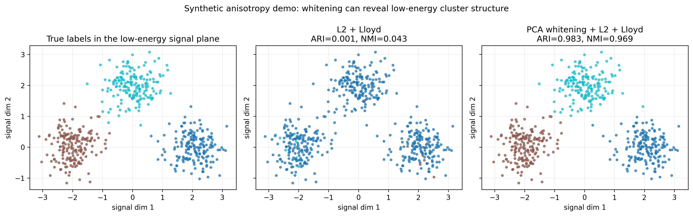

项目来源：`bert-cluster-stability` 里的 synthetic whitening demo。  
代码位置：`D:\Dev\repos\bert-cluster-stability\experiments\whitening_demo.py`

这是一篇 micro-artifact。不是一个完整研究项目，而是一个**几何反例 / sanity check**：  
用合成数据说明，为什么在高维 embedding 分析里，PCA whitening 有时不是装饰性的预处理，而是能改变聚类器实际读到的结构。

---

## 1. 目标

这页想回答的是：

> 如果一个向量空间被无关的大方差方向支配，KMeans 会不会稳定地抓错结构？PCA whitening 能不能把低能量的真实簇结构重新显露出来？

这个问题来自 [Artifact-5：BERT 聚类几何探针](/artifacts/05-bert-cluster-stability/)。

在 BERT clustering pilot 中，`PCA whitening + spherical KMeans` 比 baseline 更容易读出 20 Newsgroups 的 topic-aligned structure。但这会引出一个解释问题：

> whitening 到底是在"调分数"，还是在几何上真的修复了某种距离 / 方向的偏置？

这个 synthetic demo 的作用，就是把这个解释压缩到一个可控的小实验里。

---

## 2. 数据构造

合成数据由三部分组成：

1. 三个真实簇，藏在两个低能量 signal 方向里；
2. 一个与真实标签无关的高方差 nuisance 方向；
3. 少量额外噪声维度，让数据更像一个高维 embedding 而不是纯二维玩具。

直觉上：

```text
真实语义结构：在 signal plane 里
主导几何结构：在 nuisance direction 上
```

也就是说，真实簇是存在的，但原始距离几何会优先看见那个无关的大方差方向。

---

## 3. 两个配方

对同一份数据比较两个最小配方：

```text
baseline: L2 normalize + Lloyd KMeans
whitened: PCA whitening + L2 normalize + Lloyd KMeans
```

这里故意不用 BERT，也不用 spherical KMeans。  
目的不是复刻 Artifact-5 的完整 pipeline，而是隔离 whitening 本身的几何作用。

---

## 4. 结果



左图是真实标签在 low-energy signal plane 里的分布。  
中图是 `L2 + Lloyd` 的预测标签。  
右图是 `PCA whitening + L2 + Lloyd` 的预测标签。

数值结果：

| space | ARI | NMI | anisotropy | participation ratio |
|---|---:|---:|---:|---:|
| `L2` | ~0.001 | ~0.043 | ~0.893 | ~2.6 |
| `whiten + L2` | ~0.983 | ~0.969 | ~-0.002 | ~9.9 |

baseline 几乎完全没有恢复真实簇；whitening 后基本恢复。

---

## 5. 为什么会这样

PCA whitening 做了两件事：

1. **旋转坐标轴**：把数据放到主成分坐标系里；
2. **重新标定尺度**：每个方向除以对应的标准差。

如果某个无关方向的方差特别大，普通欧式距离和 KMeans 目标会被它支配。  
白化后，这个方向不再因为尺度大而自动拥有更高话语权。

因此，低能量方向里的真实簇结构有机会重新进入距离计算。

用一句话说：

> Whitening is a geometric preconditioner: it does not create labels, but it can stop nuisance anisotropy from dominating the clustering objective.

---

## 6. 和 BERT artifact 的关系

这个 toy demo 给 Artifact-5 的观察提供了一个更清楚的几何解释：

- random-init BERT 在 baseline 下可能产生高 stability，但 NMI 接近地板；
- 这类 stability 可能来自各向异性主方向导致的 trivial partition；
- whitening 消掉主方向后，如果没有真实结构，stability 会坍塌；
- 如果有真实结构，topic alignment 会更容易浮出来。

所以 Artifact-5 里更成熟的结论不是：

> whitening 让所有聚类都更好。

而是：

> whitening 可以降低无关主方向对聚类目标的支配，使低能量语义结构更容易被读出；但读出的结构仍然需要用 NMI / purity / stability 等指标交叉验证。

---

## 7. 和 PCA whitening 笔记的关系

这页也可以看作 [PCA、Whitening 与邻域可视化笔记](/notes/笔记-机器学习-无监督学习1-pcawhitening与邻域可视化/) 的一个实验脚注。

笔记里讲的是公式：

$$
z_i = \Lambda_k^{-1/2} V_k^\top (x_i - \bar{x})
$$

这篇 artifact 展示的是同一个公式在聚类任务里的效果：

```text
大方差方向支配距离
↓
whitening 重新标定方向尺度
↓
低能量簇结构变得可读
```

公式说明 whitening 做了什么；这个 demo 说明 whitening 为什么可能有用。

---

## 8. 边界

这个 demo 的边界也很重要：

- 它是人为构造的，不是 BERT 机制的证明；
- 它只说明一种可能失败模式：nuisance anisotropy dominates clustering；
- 在真实 embedding 中，whitening 也可能放大小特征值方向的噪声；
- 因此 whitening 维度需要 sweep，而不是默认越多越好。

这也是 Artifact-5 中 `d≈100` sweet spot 的原因之一：  
太低维可能丢 signal，太高维可能把噪声方向也白化进来。

---

## 9. 复现

在 `bert-cluster-stability` 仓库根目录运行：

```powershell
.\.venv\Scripts\python.exe experiments\whitening_demo.py
```

输出：

```text
outputs/tables/whitening_demo.csv
outputs/figures/transforms/whitening_demo.png
```

当前结果：

```text
        L2: ARI=0.001, NMI=0.043, anisotropy=0.893, PR=2.6
 whiten_l2: ARI=0.983, NMI=0.969, anisotropy=-0.002, PR=9.9
```
