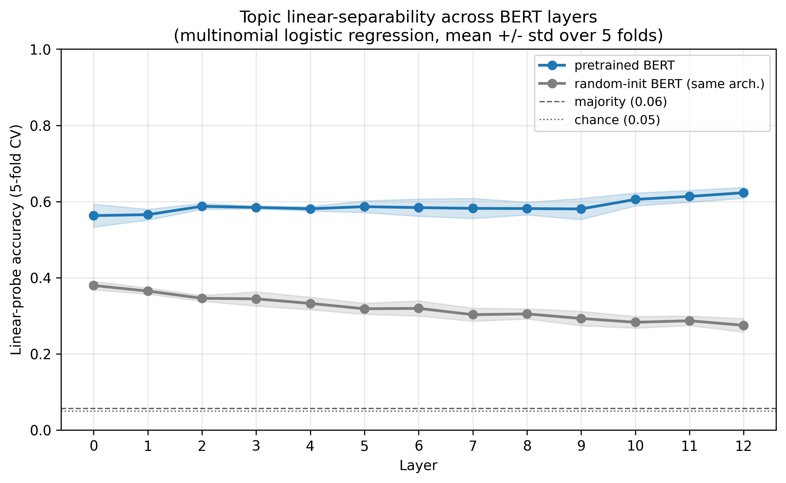
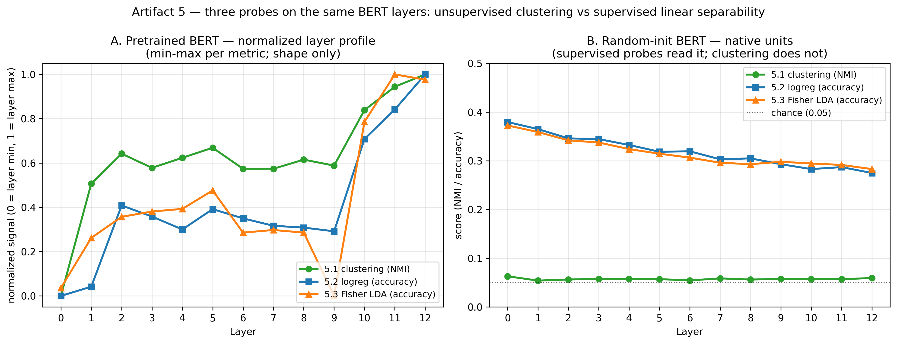
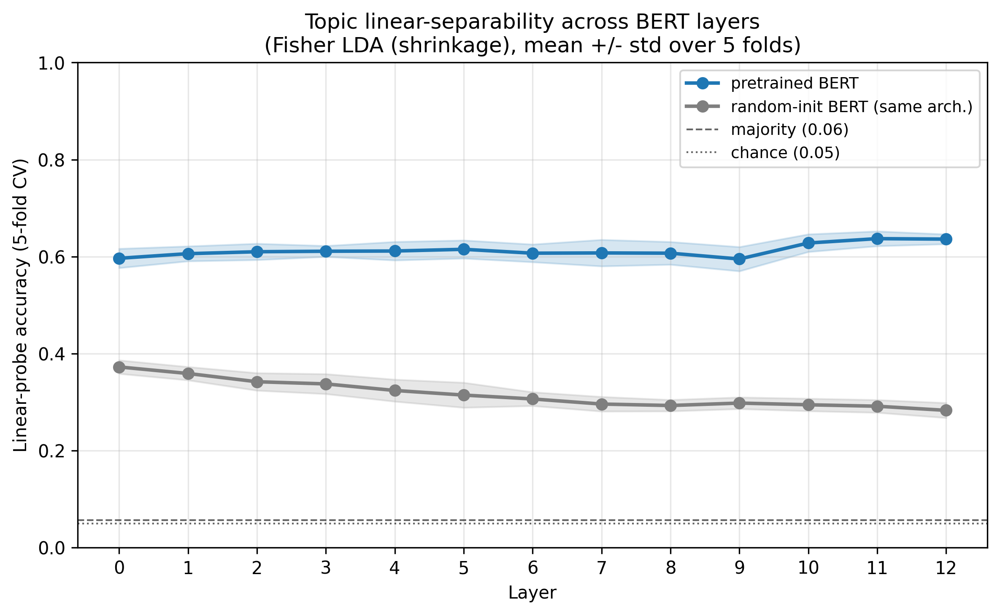

项目地址：[bert-cluster-stability](https://github.com/r1skers/bert-cluster-stability)（本地 `D:\Dev\repos\bert-cluster-stability`）。
这篇 artifact 是 5.2 线性探针视角的完整记录，完成于 2026-06。它和 5.1 共享同一份缓存的 BERT 层间表征，只换了「探针」。

> **2026-07 closure note：** 本页保留原始 pilot 的实验记录，但撤回“topic signal 主要藏在 low-variance residual、anisotropy 是唯一根因”的机制表述。后续 same-sample direction-level audit 显示：raw centered pretrained L12 的 PC1 per-PC $\eta^2=0.669$；前 100 PCs 含 **82.4%** 方差、**98.7%** between-class scatter；variance 与 per-PC $\eta^2$ 的 Spearman 为 **+0.718**。这是 exploratory/descriptive attribution，不是 held-out confirmation；它把解释收紧为 **leading-subspace spectral rebalancing**。

## 1. 目标

5.1 用**无监督聚类**作探针，问"BERT 表征里**有没有自发浮现**的话题结构"。
5.2 换一个问法——用**监督线性探针**：

> **BERT 第 L 层把一篇文档变成的那串数字里，"它属于哪个话题"这个信息，能不能用一个线性分类器轻松读出来？**

更短地说：

**话题信息是否被排布成了一种「线性可读」的几何，且这种可读性随层数怎么变？**

当前结论：

> 预训练 BERT 把话题信息逐层排成越来越线性可读的几何（L12 最强）；但线性可解码本身是个低门槛——**连随机初始化 BERT 都远高于瞎猜**，而且它的可读性随层数**衰减**，与预训练的**上升**正好相反。

---

## 2. 问题设置

### 2.1 数据与模型（与 5.1 完全一致，复用缓存）

| 项目 | 值 |
|---|---|
| 数据集 | 20 Newsgroups（去 headers/footers/quotes，过滤过短文档）|
| 当前 pilot 样本 | `n_docs=2000`, `sample_seed=42` |
| 输入粒度 | 文档片段，前 512 WordPiece tokens，非 padding mean-pool |
| 主模型 | `bert-base-uncased` |
| 对照模型 | 同架构、随机初始化、`seed=1` |
| 探测层 | embedding 层 0 + encoder 层 1..12 = 13 层 |
| 缓存形状 | `(2000, 13, 768)` |

**关键点：embeddings 是从 5.1 的 `outputs/cache/*.npz` 直接读的，5.2 不重跑任何 BERT forward。** 这也是 5.2 / 5.3 并行的前提——三视角共享同一份表征，只换探针。

### 2.2 探针与协议

| 项目 | 值 |
|---|---|
| 探针 | 多分类逻辑回归（multinomial logistic regression）|
| 预处理 | `StandardScaler`（放进 Pipeline，**仅在训练折上 fit**）|
| 评估 | 5 折 StratifiedKFold 交叉验证，报 mean ± std |
| 主指标 | accuracy（辅 macro-F1）|
| 基准线 | chance = 1/20 = 0.05；majority ≈ 0.06 |
| 正则 | `C=1.0`（固定）|

---

## 3. 为什么是「线性」探针

这一节回答一个容易被跳过、但决定整件事意义的问题：为什么探针必须是**线性**的、而且要**弱**？

线性分类器（逻辑回归）的判别规则只有一条——把一个点的 768 个坐标**各乘一个权重、加起来、再加偏置**：

$$
w_1 x_1 + w_2 x_2 + \dots + w_{768} x_{768} + b \;\gtrless\; 0
$$

它的分界面（`=0` 那一面）在几何上**永远是一个超平面（直的）**——式子里没有 $x^2$、没有 $x_i x_j$，所以它**数学上拐不了弯**。

于是有两种可能：

- **直平面就能分开** → 话题信息**摆在明面上、好读**。✅ 这正是我们想测的。
- **必须用弯曲面才分得开** → 信息在，但**缠在一起、藏得深**。

我们**故意只用直的探针**，因为我们测的是"**好不好读**"，不是"**到底有没有**"。换一个强探针（MLP、核方法），就算它把缠在一起的信息抠出来，你测到的也是**探针的本事**，而不是**表征几何的整齐度**。

> **探针的「弱」是设计的一部分**：它让测量只反映"话题信息被排得有多线性可达"，而不是"信息存不存在"。

### 3.1 探针在做什么（内积视角）

逐层逻辑回归，本质是给 20 个话题各训一个**探测器** $w_k$（一支 768 维的方向箭头）。一个点 $x$ 的话题分 = **点与探测器的内积**：

$$
\text{score}_k = \langle x, w_k\rangle + b_k = \|x\|\,\|w_k\|\cos\theta + b_k
$$

内积大 = 点与 $w_k$ 方向越对齐 = 越像话题 k。20 个分打包成一次矩阵乘法 `coef_ @ x`（`coef_` 形状 `(20, 768)`），取最高分即预测。把"考试集"里预测对的比例作为该层 accuracy。

（这个"内积 = 对齐度"的原语，和 Transformer 里 $QK^\top$ 是同一个——注意力测词与词对齐，探针测点与话题方向对齐。）

---

## 4. 主结果：accuracy(L)

固定协议，扫 13 层，pretrained vs random-init：



当前观察（5 折 CV accuracy，chance = 0.05）：

| 模型 | L0 | 中段(L4–9) | L12 | 形状 |
|---|---:|---:|---:|---|
| pretrained | 0.563 | ~0.58 平台 | **0.623** | 低起步 → 中段平台 → 末段再升 |
| random-init | **0.380** | ~0.31 | 0.275 | 高起步 → **单调衰减** |

两件值得说的事：

1. **预训练曲线随深度上升**，L10–L12 再抬头，L12 最强——和 5.1 聚类 NMI 的"末段增强"呼应。
2. **随机初始化曲线反向衰减**，但**全程远高于 chance（0.05）**。

### 4.1 random-init 为什么不在地板：可检验解释，而非既定机制

L0 的 mean-pool 可以近似看成**一袋随机词向量**。但 random-init control 仍使用 pretrained WordPiece tokenizer；mean-pooled random token embeddings 可能像高维 random features 一样保留 lexical cues。因此 L0 的 0.38 与“词汇线索经过随机映射仍可线性读取”一致，**不等于随机 BERT 已经学会了 topic organization**。

往深走，random-init probe accuracy 下降，而 pretrained 上升；这是观察到的 contrast。没有 TF-IDF、显式 BOW random projection、多 random seeds 或 module intervention 时，不能把下降唯一归因为“随机 mixing 逐层销毁词汇结构”。

> 深度对两条 probe 曲线产生相反趋势；它提示 pretraining 改变了信息的线性可达性，但还不是对内部机制的因果分解。

可以把两条曲线的差写成一个**描述性 contrast**：

$$
\text{probe gap}(L) = \text{pretrained}(L) - \text{random-init}(L)
$$

这个差随层张开（L12 ≈ 0.62 − 0.28 = 0.34），但单 seed 的差值不是“pretraining contribution”的无偏因果估计。

---

## 5. 与 5.1 的对照：可线性解码 ≠ 结构自组织

这是 5.2 真正的 payoff，也是整个"多探针三角测量"的意义所在。



> **图的当前身份：legacy exploratory overlay。** 它是 2026-06 的曲线形状对照；不同指标经 min-max normalization 后叠在一起，不能证明它们测到同一机制，也不能单凭曲线拐点定位“能力在哪层涌现”。

**左图（pretrained，归一化）**：三条曲线有相似的早升—平台—末段再升形状，这是值得继续检验的 observation，而不是 emergence proof。

**右图（random-init，原始单位）**：clustering semantic alignment 很低（NMI 约 0.06），监督探针则约 0.38 并随深度下降。**NMI 没有 classification accuracy 那条 `1/20=0.05` chance baseline**；这里不能写成“NMI ≈ chance 0.05”。

同一份随机初始化权重：

- **无监督聚类**在这套 distance / preprocessing / clusterer 下得到很低的 topic alignment；
- **监督线性探针**说明标签可从同一表征中线性预测。

为什么分歧？random-init 的强 anisotropy（平均成对余弦约 0.97）可能影响 distance-based clustering，但它不是当前设计识别出的唯一原因。clustering 与 probe 的目标函数、metric、covariance weighting 和标签使用都不同；random-init 还可能通过 tokenizer 与随机词特征保留 lexical cues。后续 spectrum audit 更直接反驳了“主要信号一直躲在完整谱低方差尾部”的说法。

> **可靠结论是 measurement 不等价。** Anisotropy 是候选解释之一；low-variance tail 不是被本实验确认的统一机制。

也就是说：

> **"信息可被线性解码"和"结构会自己聚成簇"是两件解耦的事。单一探针会得出错误结论（"random-init 没有话题信息"），多探针对照才看清真相。**

---

## 6. 5.3 LDA 印证：两个监督最优彼此一致

5.2（逻辑回归，凸优化最优）和 5.3（Fisher LDA，高斯解析最优）走的是**同一套 harness**，只换了估计器。



| 模型 | L0 | L12 |
|---|---:|---:|
| LDA pretrained | 0.597 | 0.636 |
| LDA random-init | 0.372 | 0.283 |

LDA 曲线和逻辑回归**几乎重合**。两个出发点不同的 regularized linear estimators 给出相近曲线 → 逐层 probe 趋势对这两种 estimator choice 稳健；这仍不等于“模型自身使用了被 probe 读出的信息”。

（实现细节：高维下 `S_W`（768×768）由 ~1600 样本估计、接近奇异，所以 LDA 用 `lsqr + 自动 shrinkage`。这是个小注脚——"解析最优"在高维下**也得正则化**，和逻辑回归的 `C` 是同一件事的两种长相。）

---

## 7. 怎么读"线性可解码"——三条精确边界

为避免把结论说过头，三处用词要拧紧：

1. **是"线性可分 / 可解码"，不是"线性关系"。** y 是 20 个类别不是连续值；问的是"能不能用超平面读出来"，不是 Pearson 相关。
2. **测的是"信息的几何排布"，不是"信息存不存在"。** accuracy 0.62 不代表 BERT 只懂 62% 的话题——它说话题信息里有这么多是**线性够得着**的；换非线性探针可能抠出更多。这是一句关于**表征几何**的陈述。
3. **要扣对照。** 线性可解码是低门槛（架构白送一大半）；预训练的功劳藏在 `pretrained − random` 的差里。

---

## 8. 当前结论

当前 pilot 可以收束成六条：

1. 预训练 BERT 中，话题信息的线性可解码度**随层上升**，L10–L12 最强（L12 acc ≈ 0.62 vs chance 0.05）。
2. 随机初始化 BERT 的线性可解码度**全程远高于 chance**，但随层**衰减**——与预训练相反。
3. random-init 的高起点与 lexical / random-feature cues 一致，但当前没有 TF-IDF 或显式 random-projection control，不能归因成“架构白送”。
4. **可线性解码 ≠ 结构自组织**：linear probe accuracy 与 clustering NMI 是不同 measurement，不能互相替代，也不能共用 chance baseline。
5. anisotropy 可能影响聚类，但不是唯一已识别根因；probe 目标、distance geometry、covariance 与 lexical cues 都可能贡献。
6. 逻辑回归与 shrinkage LDA 曲线几乎重合 → 趋势对两种线性 estimator 稳健，而非证明模型会 native-use 这些信息。
7. direction-level audit 反驳 low-variance-tail 解释：pretrained L12 的 topic-aligned between scatter 高度集中在 leading PCs；whitening 更像 leading-subspace 内的 spectral rebalancing。

短版结论：

> Across BERT layers, pretrained topic labels become increasingly **linearly decodable**, while random-init remains partly decodable, plausibly from lexical/random-feature cues. Linear readout, clustering alignment, and Fisher geometry give non-equivalent verdicts; the spectrum audit localizes pretrained-L12 class-mean scatter to the leading subspace rather than the low-variance tail.

---

## 9. 当前边界

- 只在 20 Newsgroups 上验证；只在 `n=2000` pilot 规模，未全量。
- 对照只 1 个 random seed；`C` 固定未扫。
- 趋势稳健（两探针一致、CV 误差带窄），但**绝对数值是 pilot 级**。
- pooling 仍是 mean-pool，未系统比较 CLS / IDF 加权等。
- 2026-07 spectrum attribution 在同一 `n=2000` 样本上使用标签，属于 descriptive audit；没有独立 confirmation split，也没有把 whitening 效果做成因果干预。

---

## 10. 收口后的开放问题

1. 用 TF-IDF、显式 BOW random projection 与多个 random-init seeds 校准 lexical/random-feature explanation。
2. 若继续做确认性研究，预注册独立 split；PCA / preprocessing 只在 train fit，最后在 held-out data 上评估。
3. 新项目应把 decodability、native behavior 与 causal intervention 分开，而不是继续从 probe curve 推断 emergence。

---

## 附录：复现主链

embeddings 复用 5.1 已缓存的 `outputs/cache/*.npz`（若不存在，先跑 5.1 的 `experiments\extract_embeddings.py`）。

### A.1 逻辑回归探针（5.2）

```powershell
.\.venv\Scripts\python.exe experiments\probe\run_linear_probe.py
.\.venv\Scripts\python.exe experiments\probe\plot_linear_probe.py
```

### A.2 Fisher LDA 探针（5.3，同一 harness）

```powershell
.\.venv\Scripts\python.exe experiments\probe\run_linear_probe.py --probe lda --output outputs/tables/probe/lda_probe.csv
.\.venv\Scripts\python.exe experiments\probe\plot_linear_probe.py --csv outputs/tables/probe/lda_probe.csv --filename lda_probe_accuracy.png
```

### A.3 Legacy 三视角 exploratory overlay

```powershell
.\.venv\Scripts\python.exe experiments\synthesis\plot_three_view.py
```

### A.4 2026-07 direction-level spectrum audit

```powershell
.\.venv\Scripts\python.exe experiments\probe\run_spectral_attribution.py
```
