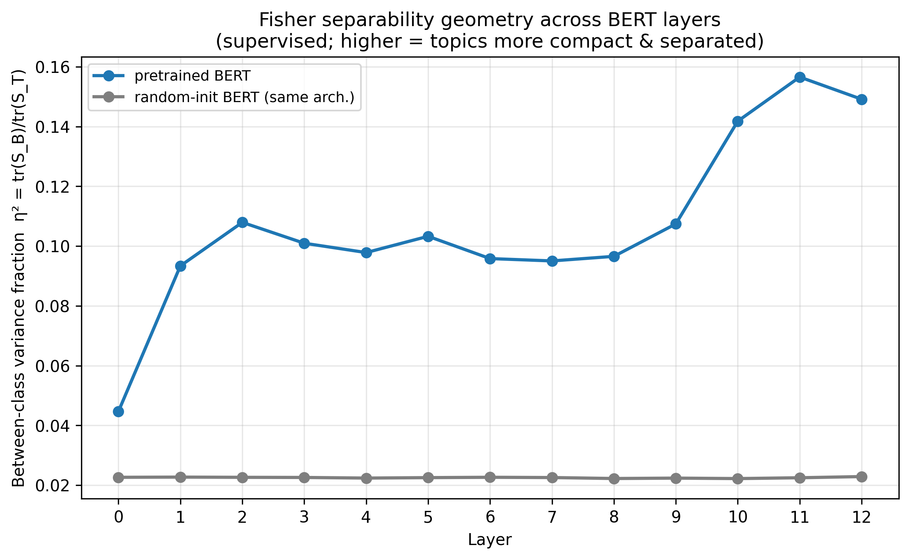

项目地址：[bert-cluster-stability](https://github.com/r1skers/bert-cluster-stability)（本地 `D:\Dev\repos\bert-cluster-stability`）。
这篇 artifact 是 5.3 Fisher 几何视角的完整记录，完成于 2026-06。它和 5.1 / 5.2 共享同一份缓存的 BERT 层间表征，只换了「探针」。

> **2026-07 closure note：** 本页最初把“低 aggregate η² + 高 probe accuracy”唯一解释为 topic signal 藏在 low-variance directions。后续 same-sample direction-level audit 直接检验了这个说法：raw centered pretrained L12 的 PC1 per-PC $\eta^2=0.669$；前 100 PCs 含 **82.4%** 方差却含 **98.7%** between-class scatter；PC variance 与 per-PC $\eta^2$ 的 Spearman 为 **+0.718**。因此 low-variance-tail 统一假说被反驳并撤回；保留的是 **measurement 不等价 + leading-subspace spectral rebalancing**。这些 attribution 是 exploratory/descriptive，不是 held-out confirmation。

## 1. 定位：同一份表征，第三把尺子

5.1 用无监督聚类，5.2 用逻辑回归，5.3 用 **Fisher / LDA**。三者是同一张表里的近亲——按"**生成式 vs 判别式**"和"**用不用标签**"两个轴排开：

| | 不给标签（无监督）| 给标签（监督）|
|---|---|---|
| **生成式**（先建模每类点云 $p(x\mid 类)$ 再贝叶斯反推）| **GMM 聚类**（5.1 用过）| **LDA**（5.3）/ QDA |
| **判别式**（不管点云形状，直接画界 $p(类\mid x)$）| — | **逻辑回归**（5.2）|

**关于标签的一个澄清**（贯穿三视角）：话题标签是 **20 Newsgroups 数据集自带的**（每帖发在哪个新闻组 = 它的真话题），不是任何方法"算出来"的。三把尺子**从头就握着同一份真标签**，区别只在用法：

- **5.1 聚类**：分组时**不看**标签（蒙眼），分完才用标签**打分**（NMI）。
- **5.2 / 5.3**：**全程睁眼用**标签。

> 一句话：5.1 是"扣着答案做题、做完对答案"；5.2 / 5.3 是"答案正面朝上做题"。

5.3 真正的独有贡献不是"再做一遍监督线性分类"，而是：**Fisher 给出一个不依赖分类器的描述性几何量**，于是能把"aggregate geometry"和"predictive readout"拆开看。它们的分歧证明两种 measurement 不可互换，但分歧本身不唯一识别某个隐藏机制。

---

## 2. Fisher 几何 η² 是什么（直觉）

### 2.1 信噪比

把每层的点按真话题分成 20 团，看两样东西：

- **团内胖瘦** $S_W$（噪声）：同一话题的文章彼此差多远。
- **团间距离** $S_B$（信号）：不同话题的团心离多远。

$$
J=\frac{S_B}{S_W}=\frac{\text{团间距离}}{\text{团内胖瘦}}=\frac{\text{信号}}{\text{噪声}},\qquad
\eta^2=\frac{S_B}{S_B+S_W}=\frac{J}{J+1}\in[0,1]
$$

射箭比方：两个射手各射一组箭。**每组箭群越紧（$S_W$ 小）、两个靶心离得越远（$S_B$ 大）→ 越容易分清谁射的 → Fisher 越高**；箭群散开或靶心挨近 → 两堆重叠 → Fisher 低。

$\eta^2$ 读作"**话题解释了总散布的几成**"——其实就是一元方差分析的 $R^2$。$\eta^2=0.15$ 意思是只有 15% 的散布来自"话题不同"，85% 是"同话题里文章千差万别"。

### 2.2 描述性的

$\eta^2$ **不分类任何点、不画任何界**。它只是"拿尺子量一眼分布、报个数"——是 anisotropy / participation ratio 的**带标签版几何诊断**：纯几何、$[0,1]$ 有界、**不求逆**。

具体怎么算（5 步，全用真标签，无聚类、无切线）：

```
1. 用真标签 y 把点分成 20 团        ← 照答案分，不是 KMeans
2. 每团算中心 μ_c，全体算全局中心 μ
3. S_W = Σ 每点到“本团中心”的平方和   (团多胖)
4. S_B = Σ 团心到“全局中心”的平方和   (团心多散)
5. η² = S_B / (S_B + S_W)
```

L12 实数（标准化后）：

| L12 | $S_W$ 团内 | $S_B$ 团间 | η² |
|---|---:|---:|---:|
| pretrained | 1,306,927 | **229,073** | 0.149 |
| random-init | 1,500,838 | **35,162** | 0.023 |

看 $S_B$ 那列：random-init 的 20 个真话题团**团心几乎没分开**（35k vs pretrained 229k），所以 η² 极低。

### 2.3 为什么用迹比，不用完整 Fisher

完整 Fisher 准则要 $S_W^{-1}$，但 768 维、每类才几十样本，$S_W$ 接近奇异。迹比 $\eta^2=\operatorname{tr}(S_B)/\operatorname{tr}(S_T)$ 是**无需求逆、良态**的那一版——它把 768 维**一视同仁地求和**，正是"原封不动的几何"本身，和下面 LDA**分类器**（靠 shrinkage 处理奇异）是两回事。

---

## 3. η² 和 LDA 分类器：区别不是"直 vs 弯"，是"挑不挑方向"

这一点是 5.3 的关键，容易想偏：η²、LDA、逻辑回归**全都是线性的，没有任何曲线参与**（弯的要到 QDA / 核 / MLP，本系列故意不用）。它们真正的分水岭是：

| | 切吗 | **挑方向 / 重加权吗** | 性质 |
|---|---|---|---|
| **Fisher η²** | 不切 | **不挑**——768 维按各自方差**平摊**着量（各向同性）| 描述 |
| **LDA / 逻辑回归** | 直切 | **挑**——按训练目标、协方差与正则化重组方向 | 预测 |

两边同源（都来自 $S_W, S_B$ 这套料），用法不同：**η² 平摊量散布；LDA 用 $S_W^{-1}S_B$ 挑最佳切方向。** 同一堆料，一个"平摊着量"，一个"挑方向切"。

> 顺带厘清方向：是 **Fisher 准则 → 推出最佳切法**（LDA 切线的方向 = 让 Fisher 比最大的方向），不是"切完再算 Fisher"。而我们报的 η² 是迹比版——连方向都不挑、不切。

---

## 4. 结果 A：LDA 分类器 ≈ 逻辑回归（稳健性互证）


| 模型 | L0 | L12 |
|---|---:|---:|
| LDA pretrained | 0.597 | 0.636 |
| LDA random-init | 0.372 | 0.283 |
| （对照）logreg pretrained | 0.563 | 0.623 |
| （对照）logreg random-init | 0.380 | 0.275 |

LDA（高斯解析最优）和逻辑回归（凸优化最优）**曲线几乎重合**：两个出发点完全不同的线性最优给出同一条 `可分性(L)`。

> 结论：这条曲线对两种 regularized linear estimators 稳健；它仍是 probe-dependent readout，不证明模型 native-use 了这些信息。

和 5.2 一样，random-init 的 LDA 准确率也**远高于 chance（0.05）**、且随层衰减。

---

## 5. 结果 B：Fisher 几何 η²——random-init 极低



| 模型 | L0 | 中段 | L11（峰）| L12 |
|---|---:|---:|---:|---:|
| pretrained η² | 0.045 | ~0.10 平台 | **0.157** | 0.149 |
| random-init η² | 0.023 | 0.023 | 0.023 | 0.023 |

- **pretrained**：η² 随层升约 3.5×，三段式（早升—中段平台—L10-12 强升），峰在 L11。但即便最强，也只有 **~15%** 的总方差是类间的。
- **random-init**：全程约 0.023，低于 pretrained 峰值约 7×且近乎不随层变化。$(K-1)/(N-1)\approx0.01$ 只是 same-sample null 的量级参考，不是本实验跑出的 permutation confidence interval。

---

## 6. 核心观察：几何 vs 分类器，在 random-init 上分道扬镳

把结果 A、B 并到一起看 random-init：

| random-init 上的测量 | 结果 | 像谁 |
|---|---|---|
| Fisher **几何** η² | ~0.023，低且近乎平坦 | 像 5.1 的低 alignment |
| LDA / logreg **分类器**准确率 | 0.28–0.38，**远超 chance** | 像 5.2 探针 |

**同一份随机初始化表征：aggregate geometry 很低，分类器却能预测部分话题。** 两者为何可以同时成立？

### 6.1 被撤回的解释：判别信号藏在 low-variance tail

2026-06 初版推理是：aggregate η² 低、linear accuracy 高，所以判别信号必然藏在 low-variance directions，LDA / logreg 靠重加权把它放大。这个推理**不可识别**：许多弱方向的联合累积、协方差结构、regularization、lexical/random-feature cues，都可能产生同样的“低总量 / 高 readout”组合。

2026-07 的 direction-level audit 直接在 raw centered PCA basis 中计算每个 PC 的 variance、per-PC η² 与 between-scatter contribution。pretrained L12 上：

- PC1 per-PC $\eta^2=0.669$；
- PC≤100：82.4% variance，98.7% between-class scatter；
- variance 与 per-PC $\eta^2$ 的 Spearman = +0.718。

这与“主要信号藏在完整谱低方差尾部”方向相反。它支持更窄的描述：topic-aligned class-mean structure 集中在 **leading subspace**；whitening 保留前 100 PCs 再重标定，收益更可能来自 leading-subspace 内的 **spectral rebalancing**。这里仍没有做 whitening 的 causal intervention。

### 6.2 收口后的 umbrella：不同尺子不等价

| 方法 | measurement operator | 它不能单独推出什么 |
|---|---|---|
| 5.1 clustering + NMI | 无监督 partition 后量 label alignment | 信息不存在 / NMI 的 chance 是 0.05 |
| whitening + clustering | leading PCs 内改变 distance weighting | 主要信号来自 low-variance tail |
| Fisher trace η² | 汇总所有方向的 class-mean scatter fraction | 每个方向在哪里、分类器能否读出 |
| logreg / shrinkage LDA | 带标签拟合线性 decision rule | 模型自身会使用该信息 / 意识到该信息 |

> **收口后的统一结论：linear decodability、cluster alignment、aggregate Fisher geometry 与 direction-level spectral attribution 测的是不同对象。它们可以分歧；分歧是结果，不是某个机制的唯一证明。**

random-init 的 above-chance probe 还可能来自 pretrained tokenizer 保留的 lexical cues 与 mean-pooled random token features。anisotropy 可能影响 distance-based clustering，但不是当前实验隔离出的唯一原因。

---

## 7. 该看什么：η² 与准确率的"落差"

单看一条不够；把 η² 与 acc 并起来，能看出 measurement sensitivity，但不能从“落差”直接反推出信号所在的 variance rank：

| 情况 | η² | acc | 读出 |
|---|---|---|---|
| aggregate 与 readout 都强 | 高 | 高 | 两种 measurement 都强；方向位置仍需谱分解 |
| aggregate 弱、readout 强 | 低 | 高 | readout 能利用 aggregate trace 未突出的结构；可能原因不止 low variance |
| 两种 measurement 都弱 | 低 | 低 | 在当前 probe / sample / regularization 下都弱；不能证明信息绝对不存在 |

> **落差只说明两个 operator 对结构的敏感性不同。** 要回答“信号在哪个 variance rank”，必须像 2026-07 audit 那样直接做 per-direction attribution。

三视角合一句：**聚类问"自发分不分得开"，Fisher η² 问"不挑方向本来分不分得开"，探针问"挑最优方向能不能分开"。**

---

## 8. 三视角合成


> **图的当前身份：legacy exploratory overlay。** 左侧对不同指标做 min-max normalization，右侧又保留 native units；它适合回看曲线形状，不适合证明共享机制或把 NMI≈0.06 当成 classification chance 0.05。Fisher η² 与 direction-level audit 应作为独立 measurement 阅读。

---

## 9. 当前结论

1. shrinkage LDA 与逻辑回归的 `可分性(L)` 曲线几乎重合 → 趋势对两种 regularized linear estimators 稳健。
2. Fisher 几何 η²：pretrained 随层升至 ~0.15（峰 L11，三段式），random-init 全程接近 ~0.023 地板。
3. **aggregate geometry vs classifier 在 random-init 上分歧**；这是 measurement non-equivalence，不是 low-variance mechanism 的唯一证明。
4. direction-level audit 反驳 low-variance-tail 假说：pretrained-L12 between scatter 高度集中在 leading subspace。
5. whitening 更适合描述为 leading-subspace spectral rebalancing；random-init readout 仍需 lexical/random-feature 与多 seed controls。

短版结论：

> Fisher gives two non-equivalent readings of the same representation: aggregate class-mean geometry and regularized linear readout. Their divergence motivates direct direction-level measurement; that audit localizes pretrained-L12 between-class scatter to the leading subspace and retires the low-variance-tail explanation.

---

## 10. 当前边界

- 只在 20 Newsgroups、`n=2000` pilot 规模、单 random seed。
- η² 是**全局、rotation-invariant** 的粗粒度几何量（迹比），不分方向；它和分类器准确率本就度量不同侧面，"η² 平 / 分类器衰减"这类细节差异不宜过度解读。
- η² 依赖标签集：换一套标签（如情感而非话题）会变；它是"**第 L 层表征在 20NG 话题视角下的几何性质**"，非脱离任务的内禀属性。
- 完整 Fisher 判别（$S_W^{-1}S_B$ 特征谱）未做——刻意用迹比避开高维奇异。
- 2026-07 direction-level attribution 用同一 `n=2000` 样本标签，属于 descriptive audit；没有 independent confirmation split。
- 初版“低方差方向 + 重加权”统一假说已被 spectrum audit 反驳并撤回。leading-subspace rebalancing 仍是描述性解释，未做因果验证。

---

## 附录：复现主链

embeddings 复用缓存的 `outputs/cache/*.npz`（若不存在，先跑 `experiments\extract_embeddings.py`）。

### A.1 LDA 分类器（结果 A）

```powershell
.\.venv\Scripts\python.exe experiments\probe\run_linear_probe.py --probe lda --output outputs/tables/probe/lda_probe.csv
.\.venv\Scripts\python.exe experiments\probe\plot_linear_probe.py --csv outputs/tables/probe/lda_probe.csv --filename lda_probe_accuracy.png
```

### A.2 Fisher 几何 η²（结果 B）

```powershell
.\.venv\Scripts\python.exe experiments\probe\fisher_geometry.py
```

### A.3 Legacy 三视角 exploratory overlay

```powershell
.\.venv\Scripts\python.exe experiments\synthesis\plot_three_view.py
```

### A.4 2026-07 direction-level spectrum audit

```powershell
.\.venv\Scripts\python.exe experiments\probe\run_spectral_attribution.py
```
