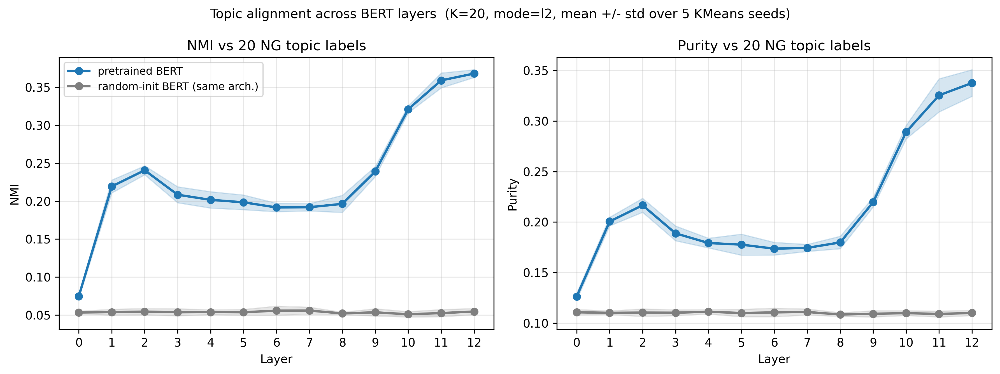
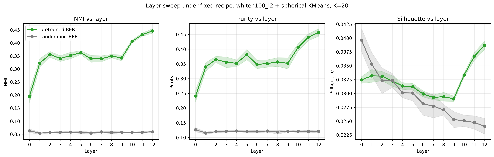
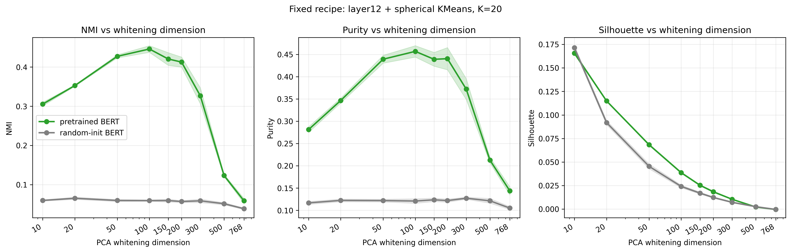
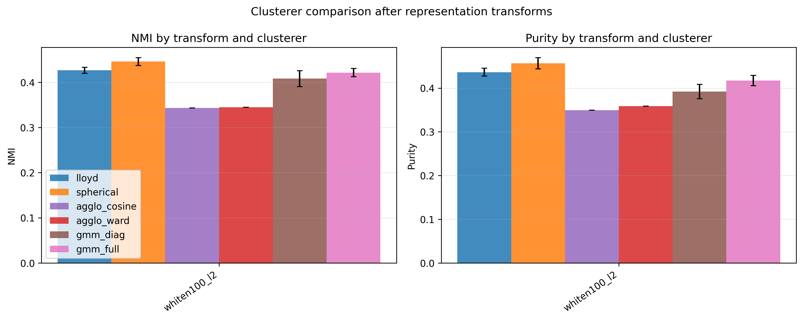
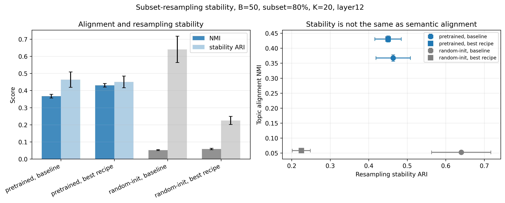

项目地址：本地仓库 `D:\Dev\repos\bert-cluster-stability`（暂未推 GitHub）。  
这篇 artifact 记录的是 W1 阶段产物，不是最终论文式结论；目的是把目前已经跑通的实验链和阶段性判断先固定下来。

## 1. 目标

本页记录 `bert-cluster-stability` 的 W1 pilot：  
用聚类方法作为探针 (probe)，观察 BERT 的文档片段表征中是否存在可被读出的、与话题对齐的结构。

问题设置：

> 如果把 BERT 每一层的文档片段表示拿出来做无监督聚类，聚类结果是否会越来越接近 20 Newsgroups 的话题标签？

更短地说：

**BERT 高层表示里，是否藏着一种可被聚类探针读出的话题几何？**

当前最短结论：

> BERT L12 的文档片段嵌入中确实存在与话题对齐的组织；这个结构在 PCA 白化之后、用球面 KMeans 最容易被读出来。

---

## 2. 问题设置

### 2.1 数据与模型

| 项目 | 值 |
|---|---|
| 数据集 | 20 Newsgroups |
| 当前 pilot 样本 | `n_docs=2000`, `sample_seed=42` |
| 输入粒度 | 文档片段 (document segment) |
| 截断长度 | 前 512 个 WordPiece tokens |
| 主模型 | `bert-base-uncased` |
| 对照模型 | 同架构，随机初始化，`seed=1` |
| 探测层 | embedding 层 0 + encoder 层 1..12 |
| 表征 | 在非 padding token 上 mean-pool |
| cache 形状 | `(N, 13, 768)` |

### 2.2 指标

主指标：

- `NMI(cluster, topic)`
- `purity(cluster, topic)`

辅助指标：

- silhouette
- Davies-Bouldin
- Calinski-Harabasz
- anisotropy（各向异性）
- participation ratio（有效维度）

这里最重要的区分是：

**几何紧密度不等于语义对齐。**

所以本文后面主要用 NMI / purity 判断话题对齐；silhouette 等指标作为几何控制项，而不是最终结论本身。

---

## 3. 主实验链路

当前流程可以压缩成四步：

1. 加载 20NG 文档与话题标签
2. 用预训练 BERT 和随机初始化 BERT 抽取 13 层文档片段嵌入
3. 对每层、每种预处理、每种聚类器跑一次聚类
4. 用 NMI / purity / 热力图判断聚类是否对齐话题标签

缓存后的向量形状：

```text
embeddings: (2000, 13, 768)
```

含义是：

```text
2000 篇文档
13 个 BERT 层
768 维 hidden state
```

---

## 4. 为什么不是 baseline + Lloyd

最初尝试是最朴素的配方：

```text
L2 归一化 + Lloyd KMeans
```

在 L12、K=20 上，它已经拿到 NMI ≈ 0.36；相比随机初始化模型的 NMI ≈ 0.05，这是一个很明显的差距。乍看之下，这似乎已经够用了。



但有一个奇怪的现象：**silhouette / Davies-Bouldin / Calinski-Harabasz 这三个传统几何紧密度指标，在预训练模型和随机初始化模型之间几乎重合**。


这反过来给了一个提示：

> 几何上看起来没有明显分离，但 NMI 出现了巨大差异。  
> 这说明在 BERT 表征空间里，"语义对齐"和"传统几何紧密度"可能是解耦的。

第一版故事因此被命名为：

> **Late semantic alignment with geometric decoupling**

但这个"解耦"本身也提出了新问题：是不是 BERT 表征空间的各向异性正在遮蔽某些可聚类结构？如果是，PCA 白化之类的处理可能会把原本被压在一条 narrow cone 里的结构暴露出来。

这个怀疑触发了后面的预处理 × 聚类器扫描。也就是说，本项目后半段真正改变的不是研究问题，而是方法态度：

> 表征的预处理不是固定不变的默认选择，而是需要被系统比较的实验变量。

---

## 5. 当前最佳配方

当前 pilot 中最强的配置是：

```text
layer12 + whiten100_l2 + 球面 KMeans + K=20
```

在 5 个聚类种子上的均值：

| 模型 | NMI | purity |
|---|---:|---:|
| 预训练 BERT | ~0.446 | ~0.457 |
| 随机初始化 BERT | ~0.059 | ~0.121 |

这个结果说明：

**预训练 BERT 的 L12 表示中存在与话题对齐的聚类结构；同架构随机初始化的 BERT 基本没有。**

---

## 6. 层间结果

固定：

```text
whiten100_l2 + 球面 KMeans + K=20
```

扫描：

```text
L0..L12
```



当前观察：

- L0 已经有微弱的词汇/话题信号
- L1-L5 快速上升
- L6-L9 中段平台
- L10-L12 再次上升
- L12 最强
- 随机初始化模型全程接近地板

这一点很重要：话题对齐并不是从浅层到深层简单单调爬升，而是更像一个三段式过程 —— **早期快速上升 → 中段平台 → 末期再次增强**。  
换句话说，高层增强仍然存在，但中间层并不是空白。

---

## 7. 白化维度扫描

固定：

```text
layer12 + 球面 KMeans + K=20
```

只改变 PCA 白化保留的维度：

```text
d = 10, 20, 50, 100, 150, 200, 300, 500, 768
```



当前观察：

| 白化维度 | 预训练 NMI | 解释 |
|---:|---:|---|
| 10 / 20 | 偏低 | 维度太低，话题信息不够 |
| 50 | 强 | 已经能读出清楚结构 |
| 100 | 峰值 | 当前最强点 |
| 150 / 200 | 仍可用 | 但开始回落 |
| 300+ | 下降 | 噪声方向回来 |
| 768 | 接近塌缩 | 几乎回到弱对齐 |

阶段性结论：

> 对 20NG 的话题聚类来说，有用的语义信号主要集中在一个中等维度的白化主成分子空间中，当前 sweet spot 在约 100 维附近。

注意：这不是说 BERT 表示的本征维度 (intrinsic dimension) 就是 100。  
更准确地说，`d≈100` 是当前任务设置下的：

```text
对话题聚类有用的维度 (topic-clustering-useful dimensionality)
```

---

## 8. 聚类器对照

固定：

```text
layer12 + whiten100_l2 + K=20
```

比较：

- Lloyd KMeans
- 球面 KMeans (spherical)
- 层次聚类 (agglomerative, cosine / average)
- 层次聚类 (agglomerative, Ward)
- 高斯混合 (GMM, diag)
- 高斯混合 (GMM, full)



当前结果：

| 聚类器 | NMI | purity | 观察 |
|---|---:|---:|---|
| Lloyd KMeans | ~0.427 | ~0.436 | 强基线 |
| 球面 KMeans | ~0.446 | ~0.457 | 当前最好 |
| 层次（余弦） | ~0.343 | ~0.349 | 有信号但弱 |
| 层次（Ward） | ~0.345 | ~0.358 | 有纯小簇，但整体不均 |
| GMM diag | ~0.408 | ~0.392 | 能读到话题，但波动较大 |
| GMM full | ~0.421 | ~0.417 | 接近 Lloyd，但仍低于球面 |

结论：

> 与话题对齐的结构对多种聚类器都可见，但最干净的恢复发生在"白化 + 球面 KMeans"这一对组合。

这说明结果不是某一个聚类器凭空造出来的；但在当前表征和数据设置下，BERT 表征更容易被基于方向 / 原型的聚类方式读出来。

---

## 9. K 粒度

固定：

```text
layer12 + whiten100_l2 + 球面 KMeans
```

改变：

```text
K = 5, 10, 20, 50
```


观察：

- `K=10`：更像粗语义大类，比如运动 / 车辆 / 宗教 / 计算机
- `K=20`：最接近 20NG 话题标签粒度
- `K=50`：purity 继续上升，但 NMI 下降，说明开始过度切碎

一句话：

> 簇并不是越多越好；话题对齐在接近数据集本身的语义粒度时达到峰值。

---

## 10. 打开黑箱

为了避免只看指标，当前还生成了簇—话题热力图和 c-TF-IDF 关键词。

为了把 §4 的方法学敏感性变成视觉证据，下面把基线配方（`L2 + Lloyd`）和最佳配方（`whiten100_l2 + 球面 KMeans`）在 L12、K=20 下的热力图并列：


*基线配方：`L2 + Lloyd KMeans`。行较散，单一话题集中度偏低。*


*最佳配方：`whiten100_l2 + 球面 KMeans`。行更"带状"，多个簇行集中在单一话题列上。*

最佳配方下的热力图明显更干净。这可以看作 §5 中 NMI 提升的视觉版：指标上升不是纯数字变化，而是簇—话题的对应关系真的更接近带状结构。

目前能看到的现象：

- 棒球 / 冰球 / 太空 / 医学 / 中东等话题有明显亮块
- 一些话题会被合并成粗语义簇，例如汽车 + 摩托
- 一些政治 / 宗教 / 电脑相关话题仍有混合
- 这不是完美分类，而是与话题对齐的组织

> The clusters are not perfect replicas of the 20NG labels, but they are far from arbitrary: several clusters align strongly with recognizable topics, while related labels are often merged into broader semantic groups.

---

## 11. 当前结论

当前 pilot 可以收束成七条：

1. 预训练 BERT 中存在可聚类读出的、与话题对齐的结构；同架构随机初始化模型中基本没有。
2. 这个结构在高层更强，尤其 L10-L12。
3. 原始 768 维表示不一定最适合聚类；PCA 白化会显著暴露话题结构。
4. 白化维度存在 sweet spot：当前约 `d=100` 最好。
5. 球面 KMeans 在当前设置下最能读出这个结构，但 Lloyd / GMM 也能读到，说明信号不是单一算法的副产物。
6. `K≈20` 最贴近 20NG 的话题粒度；更小的 K 合并粗类，更大的 K 过度切碎。
7. Stability ARI 暴露了一个"假稳定"陷阱：随机初始化模型在 baseline 配方下最稳定，但几乎没有话题对齐。

短版结论：

> BERT L12 document-segment embeddings contain topic-aligned organization that is most clearly recovered in a mid-dimensional whitened PCA subspace using spherical KMeans.

### 11.1 Stability 不是 alignment 的替代品

最初的问题里有一个很自然的直觉：如果一个聚类结构是真的，它应该对采样扰动更稳定。因此我补了一个 subset-resampling stability 实验：

```text
80% subset × B=50
fit recipe on subset
predict all documents
pairwise ARI across all partitions
```



结果比"best recipe 更稳定"更有意思：

| model | recipe | stability ARI | resampled NMI |
|---|---:|---:|---:|
| pretrained | baseline | ~0.464 | ~0.367 |
| pretrained | best | ~0.450 | ~0.431 |
| random-init | baseline | ~0.640 | ~0.052 |
| random-init | best | ~0.225 | ~0.058 |

这张表说明三件事：

1. 在预训练 BERT 上，best recipe 主要提升 topic alignment，而不是单纯提升 stability。
2. 随机初始化模型的 baseline stability 最高，但 NMI 接近地板。这是一个稳定但无意义的 partition。
3. 白化之后，随机初始化模型的 stability 从约 0.64 暴跌到约 0.22，而预训练模型仍维持在约 0.45。

因此，**resampling stability alone is not a reliable indicator of clustering quality**。它必须和 NMI / purity 这类 alignment 指标一起看。一个 partition 可以非常稳定，却只是各向异性几何反复给出的同一种 trivial cut。

这也反过来支持 §15 的几何解释：如果 random-init 的高 stability 来自窄锥各向异性，那么 whitening 消掉主方向后，这种伪稳定就应该坍塌；实验结果正是如此。

---

## 12. 经验

整理一套做表征分析的工作方法：

### 12.1 方法学敏感性本身就是发现

最初用 `L2 + Lloyd` 拿到 NMI ≈ 0.36 时，结果已经看起来可以讲故事。但一个不起眼的反常现象（silhouette 不区分预训练和随机初始化）迫使我继续做预处理扫描。后面才发现，`whiten100_l2 + 球面 KMeans` 可以把 L12 NMI 抬到约 0.45，同时也让 L0 的话题信号从几乎不可见变得可观察。

> 预处理选择不是"调参细节"，它会改变**你能从同一份 BERT 表征里看到什么**。

这个洞察对未来做表征分析的态度，比单一数字更重要。

### 12.2 阴性对照也能说有意义的事

silhouette / DB / CH 在这个设置下不区分两个模型。这看起来像"指标失败"，但其实是有用的实证证据：

> 几何紧密度（cluster compactness）不等于语义对齐（topic recovery）

把它写成"几何控制项 / negative control"，而不是"没用的指标"，是更合适的：它告诉读者对齐增强**不是简单的簇间距离变大**。

### 12.3 先 sanity 再画图

在正式画主图之前，我先做了三轴一致性检查：

- KMeans seed × 5：NMI 标准差约 `0.005-0.013`
- 表示处理（`L2` / `centered` / `raw`）：L12 NMI 基本一致
- 随机初始化对照：预训练与随机初始化之间有稳定差距

如果先画图、后发现结论靠某个特定 seed 才成立，整条故事会很脆。**Sanity check 是图的地基**。

### 12.4 稳定不等于有意义

stability ARI 是必要的 robustness probe，但它不是语义质量本身。random-init baseline 的结果是一个很好的提醒：算法每次都重复同一种切法，不代表这套切法对应真实语义。

更可靠的判断方式是把两个问题分开：

```text
alignment: 这个 partition 是否接近 topic labels？
stability: 这个 partition 是否对采样扰动可重复？
```

当前结果显示，best recipe 在 pretrained BERT 上给出更高的 alignment，同时维持与 baseline 接近的 stability；而 random-init 的高 stability 只是一个 anisotropy artifact。

---

## 13. 当前边界

这仍然是 pilot，不是最终研究结论。

当前边界：

- 只在 20 Newsgroups 上验证
- 当前主样本是 `n=2000`，还未全量扩展到 ~18k
- 文档片段使用的是 mean pooling，尚未系统比较 CLS / no-special-token / IDF 加权 pooling
- `d≈100` 是经验上的 sweet spot，机制解释仍然有限
- stability ARI 目前只在 `n=2000` pilot 规模下补完，尚未做全量稳定性实验
- 20NG 标签本身不是唯一合理的语义层级，K=10 的粗语义合并也有解释价值

---

## 14. 下一步

下一步不是继续无限试算法，而是补强主故事：

1. scale 到全量 20NG（n ≈ 18k，窄 scope 验证主效应）
2. 如果时间允许，再做 Wiki / Reddit / arXiv 的跨语料 domain separability 扩展
3. polish artifact 和 SOP-ready paragraph

更完整的 Stage 3 follow-up 框架目前仍放在本地 planning notes 中；本 artifact 只固定 W1 pilot 的实验链和阶段性发现。

---

## 15. 为什么白化会有用：一个几何说明

§5–§7 给出了一个经验事实：把 BERT L12 表征做 PCA 白化到约 100 维之后，球面 KMeans 在 20NG 上的话题 NMI 从约 0.36 抬到约 0.45。这一节用更基本的几何语言尝试解释**为什么会这样**。

它不是严格定理，目的是把"经验现象"翻译成"几何原因"。

### 15.1 各向异性 = 窄锥

Ethayarajh (2019) 把表征的各向异性定义为表征对之间的平均余弦相似度：

$$
A(X) = \frac{1}{N(N-1)} \sum_{i \ne j} \frac{x_i^\top x_j}{\|x_i\|\,\|x_j\|}.
$$

- 完全各向同性的高维高斯：$A \approx 0$
- 全部贴在一条 ray 上：$A \to 1$

实测：预训练 BERT L12 raw 表征 $A \approx 0.75$，同架构随机初始化 $A \approx 0.97$。两者都偏向窄锥，且随机初始化更甚。

几何上，记中心化后表征的 SVD 为 $\tilde X = U S V^\top$，那么各向异性强相关于谱的集中程度 $\sigma_1^2 / \sum_i \sigma_i^2$。**当主奇异值显著大于其它**，数据就被"压"在 $v_1$ 方向附近。

更糟的是 BERT 表征还有一个非零的整体均值 $\bar{x}$，本身就是一个"全局方向"。即使协方差形状未必那么畸形，$\bar{x}$ 一个人就足够主导相似度。

### 15.2 余弦相似度被共同方向主导

把每个表征拆成 3 块：

$$
x_i = \bar{x} + s_i\, v_1 + r_i,
$$

- $\bar{x}$ ：全局均值（所有点共享）
- $s_i\, v_1$ ：在主方向 $v_1$ 上的标量投影
- $r_i$ ：残差，**话题相关的信号大概率主要藏在这里**

在 $\bar{x},\, v_1,\, r_i$ 大致正交的近似下：

$$
x_i^\top x_j \approx \|\bar{x}\|^2 + s_i s_j + r_i^\top r_j,
\qquad
\|x_i\|^2 \approx \|\bar{x}\|^2 + s_i^2 + \|r_i\|^2.
$$

在各向异性区间 $\|\bar{x}\|^2 \gg s_i^2,\, \|r_i\|^2$ 下：

$$
\cos(x_i, x_j) \approx 1 - O\!\left(\frac{\text{话题信号}}{\|\bar{x}\|^2}\right).
$$

**含义**：所有对的余弦相似度都被钉在接近 1 的位置，话题信息 $r_i^\top r_j$ 只贡献一个二阶小修正。KMeans 看到的相似度矩阵几乎是"全亮"的；要靠这个矩阵区分簇，等于让算法在噪声层做决定。

这就是为什么在原始表征上跑 Lloyd / 球面 KMeans，NMI 上不去 —— 不是 KMeans 算法不行，而是**余弦几何在 $\bar{x}$ 主导下退化了**。

### 15.3 PCA 白化做了什么

白化可以拆成三步，每一步都直接对应 §15.2 的一个退化原因：

**第一步 — 中心化**：$\tilde{x}_i = x_i - \bar{x}$。  
直接消掉 $\|\bar{x}\|^2$ 这个把余弦钉在 1 附近的元凶。

**第二步 — 对角化**：协方差 $\Sigma = V \Lambda V^\top$，在主成分基下 $\tilde{x}_i^\top \tilde{x}_j = \sum_k \lambda_k\, a_{ik} a_{jk}$。  
此时主特征值 $\lambda_1$ 仍然主导这个和 —— 均值没了，但谱的形状还是窄锥。

**第三步 — 白化（重新标定）**：取前 $k$ 个特征向量，按 $\sqrt{\lambda_i}$ 重新标定：

$$
z_i = \Lambda_k^{-1/2}\, V_k^\top\, \tilde{x}_i.
$$

效果：$\mathrm{Cov}(Z) = I_k$。

现在 $z_i^\top z_j = \sum_k a_{ik} a_{jk}$ —— 每个方向贡献均等，**主方向不再绑架余弦相似度**。

直觉对应：白化 + 欧式距离在原空间等价于 **Mahalanobis 距离**。所以"球面 KMeans + 白化表征"约等于在原空间用 Mahalanobis 距离做 KMeans，限制在前 $k$ 个主成分子空间上。

这也就解释了 §6 的层间现象 —— 不只是 L12 NMI 涨，**L0 NMI 也从约 0.07 跳到约 0.20**。原始 L0 表征不是没有话题信号，而是被 $\bar{x}$ 和窄锥共同压住了；白化把它们解压出来。

### 15.4 为什么 $d \approx 100$ 看起来是最优点

§7 的白化维度扫描显示 NMI 在 $d \approx 100$ 处取峰。这不是一个有理论保证的特定数值，但**可以用偏差—方差的语言解读**。

定义两个相互对立的项：

- **信号子空间覆盖度** $(d)$：前 $d$ 个主成分能捕获多少话题相关方向。$d$ 越大覆盖越多，**偏差越小**。
- **噪声放大代价** $(d)$：白化那一步的 $1/\sqrt{\lambda_i}$ 会把小奇异值方向放大。$d$ 太大时，保留的方向里 $\lambda_i$ 已接近噪声底板，**重标定等于放大噪声 → 方差越大**。

经验最优大致是这两项相抵之处：

$$
d^\star \approx \arg\max_d\, \big[\, \text{coverage}(d) \;-\; \text{noise penalty}(d) \,\big].
$$

**一个数值上的巧合（也可能不是巧合）**：预训练 BERT L12 原始表征的参与比 (participation ratio) 约 38。白化到 $d = 100$ 后，得到的子空间参与比约 95，几乎用满了 100 维 —— 说明在 100 维以下，每个保留方向都还在贡献有效方差；超过 100，就开始白化噪声方向了。

**几个诚实的边界**：

- $d = 100$ 是**当前（模型，数据集，任务）三元组的经验最优**，不是普适常数
- 它**不是** BERT 表征的本征维度 —— 本征维度那个数大概率更大、定义方式也依赖度量
- 准确的说法是"对话题聚类有用的维度"，承认它和**任务 / 度量选择绑定**

承认这条边界本身也是表征分析的一个 lesson：好用的经验数值不需要被硬包装成理论数值。

### 15.5 一个 synthetic sanity check

为了确认上面的几何解释不是纯文字游戏，我做了一个最小合成实验。

这个 demo 已经整理成独立 micro-artifact：[Artifact-5.1：PCA Whitening 如何修复各向异性导致的聚类失败](/artifacts/05-1-pca-whitening-demo/)。

构造方式：

- 三个真实簇藏在两个低能量 signal 方向里
- 额外加入一个和标签无关的高方差 nuisance 方向
- 对比 `L2 + Lloyd` 和 `PCA whitening + L2 + Lloyd`


结果：

| space | ARI | NMI | anisotropy | participation ratio |
|---|---:|---:|---:|---:|
| `L2` | ~0.001 | ~0.043 | ~0.893 | ~2.6 |
| `whiten + L2` | ~0.983 | ~0.969 | ~-0.002 | ~9.9 |

这个 toy 不是 BERT 的证明；它只是说明一种可能机制：

> 当一个无关的大方差方向支配距离 / 角度几何时，KMeans 可以稳定地抓错结构。白化把各方向重新标定后，低能量的真实簇结构才重新变得可读。

这和前面的 random-init stability 结果互相呼应：random-init baseline 的高 stability 可能来自各向异性制造的 trivial cut；whitening 消掉这类主方向后，如果没有真实结构，stability 会坍塌；如果有真实结构，topic alignment 会浮出来。

---

## 附录：复现主链

### A.1 抽取 embeddings

```powershell
.\.venv\Scripts\python.exe experiments\extract_embeddings.py
```

### A.2 基线层间扫描

```powershell
.\.venv\Scripts\python.exe experiments\run_pilot_metrics.py --seeds 0 1 2 3 4
.\.venv\Scripts\python.exe experiments\plot_pilot.py
```

### A.3 最佳配方层间扫描

```powershell
.\.venv\Scripts\python.exe experiments\sweep_transforms.py --layers 0 1 2 3 4 5 6 7 8 9 10 11 12 --transforms whiten100_l2 --clusterers spherical --models pretrained random --output outputs/tables/layer_sweep_best_recipe.csv
.\.venv\Scripts\python.exe experiments\plot_best_recipe_layer_sweep.py
```

### A.4 白化维度扫描

```powershell
.\.venv\Scripts\python.exe experiments\sweep_whitening_dims.py
.\.venv\Scripts\python.exe experiments\plot_whitening_dim_sweep.py
```

### A.5 聚类器扫描

```powershell
.\.venv\Scripts\python.exe experiments\sweep_transforms.py --layers 12 --transforms whiten100_l2 --clusterers lloyd spherical agglo_cosine agglo_ward gmm_diag gmm_full --models pretrained --output outputs/tables/clusterer_sweep_gmm.csv
.\.venv\Scripts\python.exe experiments\plot_clusterer_sweep.py --csv outputs/tables/clusterer_sweep_gmm.csv --filename clusterer_sweep_gmm_alignment.png
```

### A.6 K 扫描

```powershell
.\.venv\Scripts\python.exe experiments\sweep_k.py --models pretrained random
.\.venv\Scripts\python.exe experiments\plot_k_sweep.py
```

### A.7 簇内容解释

```powershell
.\.venv\Scripts\python.exe experiments\interpret_clusters.py --layers 12 --k 20 --transform whiten100_l2 --clusterer spherical --seed 0
```
