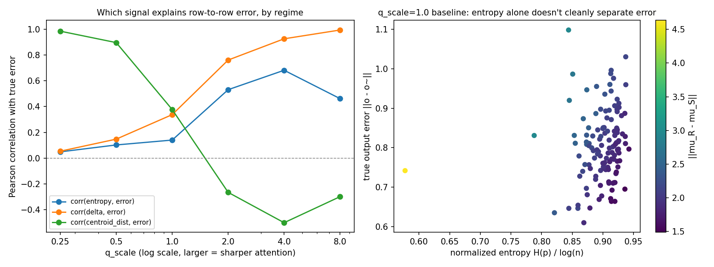

项目本体见 GitHub 仓库 [value-aware-sparse-attention](https://github.com/r1skers/value-aware-sparse-attention)。这篇是 Artifact-6 系列的第一份记录，完成于 2026-07-02，覆盖 stage 0（恒等式验证）到 v1（信号层级建立）。全部实验在合成数据上进行（$N=128$, $d=64$, iid 高斯 $Q,K,V$, float64, 无 GPU）。

## 1. 公式推导

### 1.1 Softmax 是熵正则化的解

attention 权重不是拍脑袋来的。对 logits $z$，考虑概率单纯形 $\Delta$ 上的优化：

$$
p^\* = \arg\max_{p\in\Delta}\ \langle p, z\rangle + \tau H(p)
$$

拉格朗日乘子法给出唯一解

$$
p_i = \frac{e^{z_i/\tau}}{\sum_j e^{z_j/\tau}}.
$$

也就是说，softmax 本身就是"线性收益 + 熵正则"的最优解，温度 $\tau$ 控制熵水平。

这个推导在本篇里给了一个**制造不同熵 regime 的合法旋钮**。实验里用 `q_scale` 缩放 $Q$（等价于缩放 logits、反比调温度），从接近均匀（高熵）一路扫到接近 one-hot（低熵），后面所有 regime 结论都建立在这根轴上。

softmax / 最大熵的推导见[问题集：拉格朗日乘子与凸对偶：softmax-最大熵分布](/notes/problems/optimization-variation/#softmax-maximum-entropy)。

### 1.2 剪枝误差分解（项目核心）

对单个 attention 行 $p$ 和 value 矩阵 $V$，完整输出是

$$
o=\sum_{i=1}^{n}p_i v_i.
$$

现在把 token 索引集合 $\{1,\ldots,n\}$ 分成两部分：保留集合 $S$，剪掉集合 $R$。先不要急着写误差，先把两边的概率质量定义清楚：

$$
m=\sum_{i\in S}p_i,\qquad
\delta=\sum_{i\in R}p_i=1-m.
$$

top-k 剪枝之后并不是把 $R$ 置零就结束，而是要在保留集合 $S$ 上重新归一化。因此 sparse 输出是：

$$
\tilde o
=\frac{1}{m}\sum_{i\in S}p_i v_i.
$$

这一步很关键：$\tilde o$ 不是一个新东西，它就是保留部分的加权 value 质心。于是定义两个条件质心：

$$
\mu_S=\frac{1}{m}\sum_{i\in S}p_i v_i,\qquad
\mu_R=\frac{1}{\delta}\sum_{i\in R}p_i v_i.
$$

所以有

$$
\tilde o=\mu_S.
$$

完整输出也可以按 $S/R$ 两块拆开：

$$
o
=\sum_{i\in S}p_i v_i+\sum_{i\in R}p_i v_i
=m\mu_S+\delta\mu_R.
$$

现在相减：

$$
\begin{aligned}
o-\tilde o
&=m\mu_S+\delta\mu_R-\mu_S\\
&=(m-1)\mu_S+\delta\mu_R\\
&=-\delta\mu_S+\delta\mu_R\\
&=\delta(\mu_R-\mu_S).
\end{aligned}
$$

取范数得到：

$$
\boxed{\ \|o-\tilde o\|=\delta\,\|\mu_R-\mu_S\|\ }.
$$

**恒等式而非近似式**。只要 sparse 输出是在保留集合上重归一化得到的，这个分解就成立；而且它对任意 $S/R$ 划分成立，不限于 top-k。

直觉上，它是一个加权陈述：误差 = value 位移 × 被剪区域的概率质量。测度论视角下，attention 行是 token 位置上的离散概率测度，$o=\int V\,d\mu$；剪枝把测度换成 $S$ 上的条件测度，误差就是被移走区域的质量乘以两个条件期望的位移。**质量小的地方，多大的位移都搬不动输出**——这一句话预言了后面全部实验现象。

由此立刻得到信号分类：$\delta$ 只需要 Q, K（softmax 之后的 $p$）；$\|\mu_R-\mu_S\|$ 必须由 V 切入；entropy 只间接影响 $\delta$，对 value 几何完全盲。

### 1.3 四种剪枝规则：到底用什么决定 $k$

有了误差分解之后，下一步是把几种剪枝规则摆在同一个坐标系里。本文里所有方法都先保留一个共同前提：**保留集合仍然按 attention probability 从大到小取前 $k$ 个**。也就是说，它们暂时不改变"剪谁"的排序，只比较"每一行保留多少个 $k$"由什么信号决定。

第一类是 **fixed top-k**。每一行都保留一样多的 token：

$$
k_j \equiv k.
$$

它的优点是简单，缺点也正是简单：它不看这一行剪掉了多少概率质量，不看 entropy，更不看 V。有的行本来很容易，却被分到太多预算；有的行很难，却仍然只拿同样的 $k$。

第二类是 **entropy-adaptive**。它用一行 attention 分布的熵

$$
H(p)=-\sum_i p_i\log p_i
$$

来决定预算。直觉是：

```text
H 高 -> 分布平 -> 多保留
H 低 -> 分布尖 -> 少保留
```

这仍然只看 Q,K 产生的 attention 权重，不看 V。它的角色是一个粗粒度的 row difficulty signal：用 $H(p)$ 猜这一行该保留多少，但不直接保证剪掉的概率质量有多小。

第三类是 **Q,K-only dropped-mass adaptive**。它不再问熵高不高，而是直接看 top-k 之后被剪掉的概率质量：

$$
\delta(k)=\sum_{i\notin \operatorname{topk}(p)}p_i.
$$

给定阈值 $\tau$，每一行选择最小的 $k$ 使

$$
\delta(k)\le \tau.
$$

这比 entropy 更贴近误差分解，因为它直接控制了公式里的第一个因子 $\delta$。但它仍然是 Q,K-only：它只知道剪掉了多少 attention 质量，不知道被剪掉的 value 和保留的 value 差多远。换句话说，它控制 $\delta$，不控制 $\|\mu_R-\mu_S\|$。

第四类是 **restricted value-aware oracle / error-budgeted top-k**。它直接用真实输出误差决定 $k$：

$$
E(k)=\delta(k)\|\mu_R(k)-\mu_S(k)\|,
$$

然后每一行取最小的 $k$，使

$$
E(k)\le \varepsilon.
$$

实验里实际用的是相对误差版本，即 $\|o-\tilde o_k\|/(\|o\|+\eta)\le\varepsilon$。这显然不是便宜方法，因为它已经摸到了 V，甚至近似等价于知道真实误差；它的意义是作为**受限上界**：如果我们仍然限制保留集合必须是 top-k-by-$p$，那么 value-aware 信号最多能把 $k$ 分配得多好。

因此这四类方法的层级关系是：

```text
fixed top-k:
  不自适应

entropy-adaptive:
  Q,K-only，用分布形状猜 k

dropped-mass adaptive:
  Q,K-only，直接控制 delta(k)

restricted value-aware oracle:
  Q,K,V-aware，直接控制 delta(k) * value centroid displacement
```

这个分类也解释了后文为什么要做 matched-budget 对比：不同规则如果平均保留 token 数不同，误差不能直接横向比较；必须先把预算校准到同一水平，再问谁更会分配这些预算。

### 1.4 成本模型：为什么 oracle 只能当尺子

到这里很容易产生一个疑问：既然我们已经有了精确误差公式，为什么不直接遍历所有 $k$，算出每个 $E(k)$，再选最好的？

离线分析当然可以这么做，而且本文后面的 restricted oracle 正是这么做的。但它不能直接当成 sparse attention 的部署算法，因为 sparse attention 想省的主要不是几个标量运算，而是 **V-side 的向量读取和聚合**。

设序列长度为 $N$，单个 head 的 value 维度为 $d$，每行最后保留 $k$ 个 token。粗略看，每个 attention weight $p_i$ 是一个标量；每个 value $v_i$ 是一个 $d$ 维向量。Q,K 侧的 entropy、top-k、dropped mass 都只需要看 $p$ 或 logits；而 sparse attention 真正想省的是 V-side 的向量读取：

```text
full attention:
  每行读 N 个 value 向量      -> O(Nd)
  N 行合计                   -> O(N^2 d)

top-k sparse attention:
  每行只读 k 个 value 向量    -> O(kd)
  N 行合计                   -> O(Nkd)
```

如果 $k\ll N$，这个差距就是 sparse attention 的主要希望。可是精确计算

$$
\mu_R(k)=\frac{1}{\delta(k)}\sum_{i\notin \operatorname{topk}(p)}p_i v_i
$$

则需要逐 query 读取 dropped region 里的 value 向量。每行额外要读大约 $N-k$ 个 value 向量：

```text
restricted oracle:
  已读 retained V: k 个
  还要读 dropped V: N-k 个
  合计约 N 个 value 向量      -> O(Nd) per row
  N 行合计                   -> O(N^2 d)
```

换句话说，restricted oracle 和 full attention 在 V-side 访问上同阶。它不是"多一点计算"，而是把 top-k sparse attention 试图省下来的 dropped-V IO 又读回来了。

以本文默认实验尺度 $N=128,d=64,k\approx40$ 为例：full attention 每行读 128 个 value 向量；top-k sparse 每行只读约 40 个；但 oracle 为了评估 dropped side，还要再读约 88 个，$40+88=128$，等于又回到 full attention 的 V 读取规模。

所以几类方法的成本边界大致是：

```text
fixed top-k:
  只读保留的 top-k V

entropy-adaptive:
  用 H(p) 决定 k；只读最终保留的 V

dropped-mass adaptive:
  用 delta(k) 决定 k；只读最终保留的 V

restricted oracle:
  为了知道真实 E(k)，需要 dropped-side V 统计；
  适合作为离线评测尺子，不适合作为直接部署算法

cheap value proxy:
  允许使用 retained V、序列级预计算、block centroid、sketch；
  不允许逐 query 扫描整个 dropped V
```

因此，本文里的 oracle 曲线不是算法承诺，而是评测尺子：它告诉我们 value-aware 信息在当前受限 top-k 家族里最多能带来多少收益。下一阶段真正要问的是：能不能在不逐 query 读取 dropped V 的前提下，用 retained V、block 级质心、全局 value summary 或随机 sketch 之类的便宜信息，追回一部分 restricted oracle 的优势。

## 2. 实验过程与现象

### 2.1 恒等式的浮点级验证

对每行分别计算 $\|o-\tilde o\|$ 和 $\delta\|\mu_R-\mu_S\|$：

```text
max abs diff  ≈ 1e-15
mean abs diff ≈ 1e-16
```

float64 精度下逐行相等。量尺本身没有问题，后面所有结论建立在这个地基上。

### 2.2 Entropy 基线：弱

固定 $k=30$ 时，三个行级信号对真实误差的解释力如下：

```text
corr(entropy, error)       = 0.14
corr(delta, error)         = 0.34
corr(centroid_dist, error) = 0.38
```

entropy 是三者中最弱的。更严格的测试是**等预算对比**：把和 fixed top-k 完全相同的总保留 token 数按行熵重新分配（保总预算的整数分配器），扫过 budget 4→64。结果是 entropy 分配与 fixed 几乎无差别，max error 还常常更差。朴素的"熵高多给预算"不是一个好的分配器。

### 2.3 Regime 切换：主导因子随尖锐度翻转

用 `q_scale` 扫过熵 regime（固定 $k=30$）：

```text
q_scale | H_norm mean | corr(H,err) | corr(delta,err) | corr(centroid,err)
   0.25 |      0.99   |      0.05   |          0.05   |             0.99
   0.50 |      0.97   |      0.10   |          0.15   |             0.90
   1.00 |      0.90   |      0.14   |          0.34   |             0.38
   2.00 |      0.65   |      0.53   |          0.76   |            -0.27
   4.00 |      0.31   |      0.68   |          0.93   |            -0.50
   8.00 |      0.13   |      0.46   |          0.99   |            -0.30
```



这里有两个干净的现象：

- **高熵区**（接近均匀）：$\delta$ 又大又均匀，行与行的误差差异几乎全由 value 质心距离决定（corr ≈ 0.99）。
- **尖锐区**：top-k 已捕获几乎全部质量，残余的 $\delta$ 就是误差本身（corr ≈ 0.99）。

entropy 自己**从头到尾都不是主导信号**，最高只到 0.68。

这里还有一个容易误读的点：尖锐区 `corr(centroid_dist, err)` 变负**不是**"位移大反而误差小"。$\delta$ 和 centroid_dist 本身负相关（-0.12 ~ -0.73），当 $\delta$ 解释了几乎全部方差时，乘法搭档的边际相关可以翻负。这是乘积结构的统计伪影，不是机制。

### 2.4 同预算三方对比：value 信息值多少预算

单独看相关系数有 circularity 风险：$\delta\cdot\text{centroid}$ 和误差的相关恒为 1，这是公式保证的，不是发现。真正有信息量的问题是：**给同样的总预算，摸 V 的方法比不摸 V 的方法好多少？**

三方对比，全部校准到相同平均保留数（二分校准阈值）：

- **fixed top-k**：每行同一个 $k$（不自适应）
- **dropped-mass adaptive**：每行取最小 $k$ 使 $\delta(k)\le\tau$（Q,K-only，本质是 top-p/nucleus 截断）
- **restricted value-aware oracle**：每行用**真实误差**取最小 $k$ 使相对误差 $\le\varepsilon$（摸 V）

`q_scale=1.0` 的结果（worst-row 相对误差）：

```text
target_k | oracle | dropped-mass | fixed
      80 | 0.147  |       0.181  | 0.236
      60 | 0.273  |       0.356  | 0.413
      40 | 0.500  |       0.638  | 0.718
```

稳定排序是 **oracle < dropped-mass < fixed**。Q,K-only 的自适应已经拿走一部分收益，但同预算下相比 oracle 仍差 23–31%——这是"value 几何有增量信息"的第一个非同义反复的量化证据。

### 2.5 把三方对比扫过 regime：value 的价值集中在高熵区

把 2.4 的对比放到 q_scale 轴上（目标 mean k=40），看 dropped-mass 吃掉了 fixed→oracle 差距的几成：

```text
q_scale | gap closed by dropped-mass
   0.25 |   -6%   （比 fixed 还差）
   0.50 |    0%
   1.00 |   36%
   2.00 |   70%
   4.00 |   97%
```

这个比例随 attention 变尖而单调爬升，并且和 2.3 的相关性分析用**完全独立的方法**指向同一结论：

- 尖锐区：$\delta$ ≈ 误差，Q,K-only 几乎追平 oracle，V 加不了多少。
- 高熵区：$\delta$ 对行间误差零信息（corr=0.05），按 $\delta$ 重分配预算是纯噪声，甚至有害；fixed→oracle 之间约 23% 的 worst-row 误差差距**只有摸 V 才能拿到**。

这正是恒等式的加权读法在预算语言里的重现：$\delta\to 0$ 时，几何因子被质量压住；$\delta$ 大且缺乏区分度时，几何因子接管。

两个顺手记下的边角发现：

- **饱和现象**：`q_scale=8` 时大多数行在 $k\approx 14$ 后误差落到浮点零，任何阈值都逼不出更多预算。超尖锐 regime 里剪枝问题近乎平凡，预算多了也花不出去。第一版输出里"Q,K-only 打赢 oracle 7.9 倍"就是这个失效造成的假结果，已排除。
- **校准 bug 记录**：等预算校准的二分查找第一版方向写反（oracle 的 mean k 随 $\varepsilon$ 递减），症状是 oracle mean k 恒为 2.2。保留这条记录是因为"结果曾经错过、怎么发现的"和结果本身一样重要。

### 2.6 One-swap 观察：top-k-by-p 不是集合最优

以上所有方法（包括 oracle）都把保留集限制在"按 $p$ 排序取前 k"的家族里。但恒等式对**任意**划分成立——按 $p$ 选集合只最小化 $\delta$，不最小化乘积。允许一次交换（换出一个保留 token、换入一个被剪 token）：

```text
q_scale=0.25: 128/128 行可改进，平均降 10.6%，最高 17.7%
q_scale=1.0 : 128/128 行可改进，平均降  7.4%，最高 22.4%
q_scale=4.0 :  82/128 行可改进，平均降  2.4%，最高 15.9%
```

每个 regime 里 top-k-by-p 都不是集合最优，且改进空间同样集中在高熵区。一个 $p$ 很小但 value 离群的 token，可能比 $p$ 大而 value 平庸的 token 更值得保留。这正是 value-aware attention 文献的出发点。

两个推论：

1. 2.4 里 oracle 对 dropped-mass 的 23–31% 优势是**低估**——那只是 k 选择的 oracle，集合选择的 oracle 更强，V 信息价值的下界只会上修。
2. 语言纪律：本系列所有 "oracle" 都应读作 **restricted oracle**（top-k-by-p 家族内的最优 k），不可当成不可超越的上界。

## 3. 总结

在当前受限设定下，信号层级可以概括为：

$$
\text{entropy} \approx \text{fixed-}k \;\lt\; \text{dropped-mass} \;\lt\; \text{restricted oracle} \;\lt\; \text{set-selection oracle（未做）}.
$$

主线陈述：

> 我们不再把 entropy 当主角，它只是对照。真正目标是最小化剪枝后的输出误差。分解式说误差由两个因子支配：被剪概率质量 $\delta$ 和 value 质心位移。$\delta$ 是最强的 Q,K-only 信号，但它的效力依赖 regime——尖锐区接近 oracle，高熵区完全失效，**而高熵区恰恰是 value 几何解释剩余差距的地方**。

接下来问题更加精确了：

> $\|\mu_R-\mu_S\|$ 能不能在完整计算之前**便宜地**估出来？一个和真实输出一样贵的预测器指导不了任何加速。评测目标：在高熵 regime 里做到 fixed < dropped-mass < **cheap value proxy** < restricted oracle。

**文献定位（声明）**：误差分解与 TV 距离的联系见 [*A Mathematical Theory of Top-k Sparse Attention via Total Variation Distance*](https://arxiv.org/abs/2512.07647)；value 重要性见 [*Value-aware Approximate Attention*](https://arxiv.org/abs/2103.09857)；entropy 剪枝见 [*Rényi Attention Entropy for Patch Pruning*](https://arxiv.org/abs/2604.03803)；adaptive budget 见 [*Twilight: Adaptive Attention Sparsity with Hierarchical Top-p Pruning*](https://arxiv.org/abs/2502.02770) / [*SSA: Sparse Sparse Attention by Aligning Full and Sparse Attention Outputs in Feature Space*](https://arxiv.org/abs/2511.20102)。本篇不主张理论原创性，主张的是：独立推导、可复现实验、以及"信号层级 + regime 地图"这份系统化对照。
