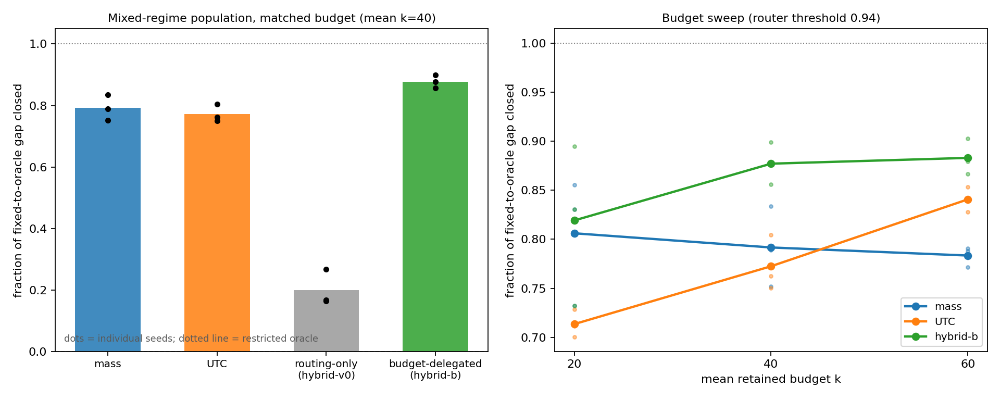

Project repository:
[value-aware-sparse-attention](https://github.com/r1skers/value-aware-sparse-attention).

[Artifact-6.1](/en/artifacts/06-1-formulas-and-phenomenon-observation/) ended
with the exact identity

$$
\|o-\tilde o\|=\delta\|\mu_R-\mu_S\|.
$$

The restricted oracle can use the true value-centroid displacement term, but
it has a cost problem: exact $\mu_R$ requires reading the dropped V vectors.
That is precisely the memory traffic sparse attention wants to avoid.

Stage 1 asks:

> Can a cheap value-side proxy recover part of the restricted-oracle advantage,
> especially in high-entropy regimes where dropped mass fails?

## 1. Why the Oracle Is Not Deployable

For a candidate retained set $S(k)$,

$$
\mu_R(k)=\frac{1}{\delta(k)}\sum_{i\in R(k)}p_iv_i.
$$

Computing this exactly scans the dropped values. With sequence length $N$ and
head dimension $d$:

```text
full attention:        O(Nd) value reads per row
top-k sparse attention: O(kd) value reads per row
restricted oracle:     roughly O(Nd), because it reads retained and dropped V
```

So the oracle is an offline teacher, not a sparse-attention rule.

A deployable proxy may use:

```text
retained V
sequence-level value summaries
block-level centroids
global moments / sketches
```

It should not scan dropped V for every query row.

## 2. UTC: Uniform-Tail Centroid

The first proxy is based on the high-entropy intuition: if the dropped tail is
close to uniform, approximate the dropped weighted centroid by the unweighted
tail centroid:

$$
\hat\mu_R(k)=\frac{\sum_i v_i-\sum_{i\in S(k)}v_i}{|R(k)|}.
$$

The score is

$$
\hat E_{\text{UTC}}(k)=\delta(k)\|\hat\mu_R(k)-\mu_S(k)\|.
$$

Cost:

- $\sum_i v_i$ is a sequence-level precompute;
- retained values are already read by sparse attention;
- no per-row scan over dropped V is required.

This is why the proxy is cheap in the relevant IO model.

## 3. Predictor Quality Is Not Allocation Quality

On iid synthetic values, UTC predicts the centroid displacement surprisingly
well:

```text
corr(UTC, trueC) >= 0.98 across regimes
```

But high predictor correlation is not enough. The allocation task is:

```text
Given the same total retained-token budget, which score assigns row-wise k best?
```

This revealed an important lesson:

> A good resource-allocation score is not merely correlated with error. It must
> be calibrated near the stopping threshold across rows.

Entropy had low predictive power and bad allocation. UTC had high correlation
but still failed in one intermediate regime. Both cases teach the same lesson:
correlation is not allocation quality.

## 4. The Router Mistake

An early entropy-router experiment looked successful:

```text
high entropy -> UTC
low entropy  -> dropped mass
```

But each synthetic dataset had a single regime. The router did not make real
row-level decisions; it degenerated into a dataset-level switch. The threshold
was also in-sample.

This was logged as a methodological correction:

```text
the per-dataset router was a consistency check, not evidence.
```

The real test must mix regimes inside one population.

## 5. Mixed-Regime Population

Each row draws its own `q_scale` from a set of regimes. The population now
contains diffuse, intermediate, and sharp rows at the same time.

The key result:

```text
gap closed (overall worst-row relative error)

method     seed 0   seed 1   seed 2
mass        0.833    0.751    0.791
UTC         0.804    0.761    0.772
hybrid-v0   0.267    0.164    0.168
hybrid-b    0.855    0.902    0.878
```

Interpretation:

- routing-only hybrid collapses because it prevents cross-regime budget
  transfer;
- dropped mass is a strong cross-regime budget allocator;
- UTC is useful inside the high-entropy group;
- hybrid-b works because it delegates budget first, then refines allocation
  within the high-entropy group.

The final role of entropy is narrow:

```text
not an error scorer,
not a standalone router,
but a grouping variable for budget-respecting delegation.
```



## 6. Sensitivity

The two dangerous knobs were router threshold and budget level.

The conclusion survives:

- threshold sweep from 0.85 to 0.97: hybrid-b remains on a plateau;
- budgets 20/40/60 across 3 seeds: hybrid-b is never worse than both pure
  strategies and is strictly better in most configurations.

## 7. Takeaway

Stage 1 answers the cheap-proxy question:

> Value geometry can be approximated cheaply enough to improve local allocation
> in the regimes where dropped mass is blind.

But the synthetic setup still leaves too many choices under our control:
regime mixture, value structure, and entropy distribution. The next step is
real attention.
