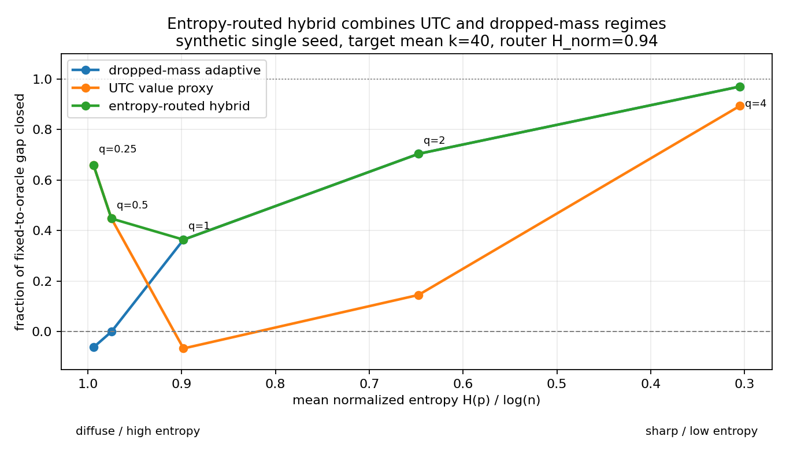

项目本体见 GitHub 仓库 [value-aware-sparse-attention](https://github.com/r1skers/value-aware-sparse-attention)。上一篇 [Artifact-6.1：公式推导与现象观察](/artifacts/06-1-formulas-and-phenomenon-observation/) 里，核心结论已经很明确：

$$
\|o-\tilde o\|=\delta\|\mu_R-\mu_S\|.
$$

top-k 剪枝误差不是只由 attention 权重决定，而是由两个因子共同决定：

- $\delta$：被剪掉的 attention probability mass，只需要 Q,K / attention weights。
- $\|\mu_R-\mu_S\|$：剪掉部分和保留部分的 value 质心距离，必须看 V。

v1 的合成实验中还发现了一个 regime 切换：尖锐 attention 里 $\delta$ 主导，Q,K-only 的 dropped-mass adaptive 几乎够用；高熵 attention 里 $\delta$ 对行间误差几乎没有解释力，value 几何变成主导因素。

这篇是切进真实数据前的 Stage 1 记录。问题现在转向：

> 如果精确 value-aware oracle 太贵，那有没有便宜的 value-side proxy，能在高熵 regime 追回一部分 restricted oracle 的优势？

## 1. 为什么不能直接用 oracle

上一篇里的 restricted oracle 直接用真实误差选 $k$：

$$
E(k)=\delta(k)\|\mu_R(k)-\mu_S(k)\|.
$$

它很好地回答了"如果允许看 V，最多能把预算分配得多好"。但它不能直接当成稀疏注意力算法，因为精确计算 $\mu_R$ 要读 dropped V：

$$
\mu_R(k)=\frac{1}{\delta(k)}\sum_{i\in R(k)}p_i v_i.
$$

这正好碰到 sparse attention 想省掉的那部分 IO。设序列长度 $N$、head dim 为 $d$、每行保留 $k$ 个 token：

```text
full attention:
  每行读取 N 个 value 向量      -> O(Nd)

top-k sparse attention:
  每行读取 k 个 value 向量      -> O(kd)

restricted oracle:
  读取 retained V + dropped V   -> 约 O(Nd)
```

所以 oracle 的角色是**离线的尺子**：它告诉我们 value 信息值多少预算，但不能直接部署。任何自称"可部署"的 proxy 都必须遵守下面的成本纪律：

```text
允许：
  retained V
  序列级预计算，例如 sum_i v_i
  block-level centroid
  global moments / sketch

禁止：
  每个 query 行都完整扫描 dropped V
```

这就是 Stage 1 的出发点。注意问题的形状：不是找"另一种精确算 $\mu_R$ 的方式"——精确算 $\mu_R$ 在定义上就等于算出完整输出——而是**换一个更便宜的信息集，在那个信息集上做估计**。

## 2. UTC：Uniform-Tail Centroid proxy

第一个 proxy 的想法很直接：既然高熵 regime 里 attention tail 接近均匀，那 dropped weighted centroid

$$
\mu_R=\frac{1}{\delta}\sum_{i\in R}p_i v_i
$$

可以先用 dropped values 的无权平均近似：

$$
\hat\mu_R
=\frac{\sum_i v_i-\sum_{i\in S}v_i}{|R|}.
$$

于是得到 UTC score：

$$
\widehat E_{\text{UTC}}(k)
=\delta(k)\|\hat\mu_R(k)-\mu_S(k)\|.
$$

成本：

- $\sum_i v_i$ 是序列级预计算，所有 query 行共享。
- $\sum_{i\in S}v_i$ 和 $\mu_S$ 只用 retained V，也就是 sparse attention 本来就要读的部分。
- 不逐行扫描 dropped V。

这个 proxy 的设计赌注也很明确：它最适合 tail 接近均匀的地方，而 v1 恰好告诉我们，高熵 regime 才是 value geometry 最需要出场的地方。

## 3. Predictor 准，不等于分配准

第一轮看相关性，UTC 非常漂亮：

```text
corr(UTC, true centroid distance) >= 0.98
corr(delta * UTC, true error)     约 0.96 - 0.998
```

而且把 V 做成和 K 相关的结构化版本之后，UTC 没有立刻崩掉。即使 $V=0.9KM+\text{noise}$，相关性仍然接近 0.99，相对误差最差约 7.5%。

但这组 headline 数字需要诚实拆解：UTC 和真值共享**精确已知**的 $\mu_S$，真正被估计的只有 $\mu_R$。把估计核心单独拎出来看：

```text
q_scale | ||mu_R_hat - mu_R|| / trueC | ||mu_R|| | ||mu_S||
   0.25 |                       8.8% |    0.89 |    1.31
   1.00 |                      25.2% |    1.00 |    1.65
   4.00 |                      27.8% |    1.62 |    5.09
```

这反而验证了设计直觉：tail 越不均匀，$\hat\mu_R$ 越不准。幸运的是，它准的地方正是主战场：高熵区。

真正的及格线不是相关性，而是**分配测试**。一个 predictor 即使全局相关性很高，也可能在停止阈值附近把行与行排错，导致预算分配失败。

单 regime matched-budget 测试里，UTC 的表现是：

```text
high entropy:
  UTC 关掉 fixed -> oracle gap 的 66% / 45%
  dropped-mass 为 -6% / 0%，几乎无效甚至有害

middle regime:
  UTC predictor corr 仍然约 0.96
  但 allocation gap closed = -6.6%，比 fixed 还差
```

这给了一个很重要的方法论教训：

> predictor correlation != allocation quality.

allocation 看的是 score 在跨行预算分配时是否可比，尤其是停止阈值附近的排序；全局相关性无法测量这件事。entropy 已经给过一次反例：corr 低、分配差。UTC 在中间 regime 又给了反方向的反例：corr 高，分配照样可能差。

（预告：切进真实 BERT 之后，这个中间区失败还会暴露出一个更大的成因——score 的绝对量与相对误差目标之间的错配。）

## 4. Entropy 的角色第二次降级

到这里很自然会想：既然 dropped-mass 擅长尖锐区，UTC 擅长高熵区，那能不能直接按 entropy 路由？

第一版做法是：

```text
H_norm 高 -> 用 UTC
H_norm 低 -> 用 dropped-mass
```

但这个实验后来被降级为一致性检查，因为察觉到循环风险：

- 每个合成 dataset 本身就是单一 regime，router 没有真正做复杂决策。
- threshold 是 in-sample 选的。
- hybrid 曲线几乎等于两条纯方法曲线的逐点 max。

为了让 router 真的面对问题，必须构造一个 mixed-regime population：同一个 dataset 里每一行来自不同 q_scale，熵分布混在一起，然后要求所有方法在同一总预算下分配。

这个实验带来一个意外结论：**预算转移比信号选择更重要**。

## 5. Mixed-regime：预算委托，而不是简单路由

在 mixed-regime 数据上，比较五种方法：

- fixed：每行同样 $k$。
- mass：单一 dropped-mass threshold，全局决定每行 $k$。
- UTC：单一 UTC threshold，全局决定每行 $k$。
- hybrid-v0：按 entropy 路由，高熵用 UTC，低熵用 mass，但两个组都固定同样 mean k。
- hybrid-b：先让 mass 决定高/低熵组之间的预算分配，再让 UTC 在高熵组内部重新分配。

结果：

```text
gap closed (worst-row relative error) | seed 0 | seed 1 | seed 2
mass                                  |  0.833 |  0.751 |  0.791
UTC                                   |  0.804 |  0.761 |  0.772
hybrid-v0 (routing-only)              |  0.267 |  0.164 |  0.168
hybrid-b (budget-delegated)           |  0.855 |  0.902 |  0.878
```


值得关注 hybrid-v0 的失败。它不是因为"选错 scorer"，而是因为它把两个组都钉死在同一个 mean k，阻断了跨 regime 的预算转移。真正有用的是：

```text
先决定预算该流向哪个 regime
再在对应 regime 内部选 scorer 精修
```

在这个设定下，mass 反而是很强的跨 regime budget allocator：一个全局 $\tau$ 基本复刻了 restricted oracle 的组间预算划分（约 74/19 vs 76/18）。但 mass 在高熵组内部仍然盲，所以 hybrid-b 用 UTC 接管高熵组内的分配。

这个结论的两个旋钮也做了敏感性检查：router 阈值在 $[0.85, 0.97]$ 整个区间上 hybrid-b 都同时优于两个纯策略（阈值坐在平台上，不是刀锋）；预算扫 $k \in \{20, 40, 60\}$，9 个配置里 hybrid-b 全部 $\ge \max(\text{mass}, \text{UTC})$、7 个严格更好。唯一的边界：紧预算（$k=20$）时优势消失——全场最差行落在 hybrid-b 不触碰的低熵组里——但从不有害。

这就是 Stage 1 里 entropy 的最终定位：

```text
不是 scorer
不是单独 pruning criterion
而是预算委托时的 grouping variable
```

它不直接回答"这行误差多大"，但能帮我们判断这一行更像哪个机制 regime。

## 6. 产出图

实验产出一张图：



横轴是 normalized entropy $H_{\text{norm}}$。这点很重要：q_scale 是合成实验的旋钮，真实数据如 BERT 里没有；entropy 是 attention map 本身可观测的物理量。未来真实数据的点可以直接落在同一根轴上。

图上的交叉说明：

- 低熵 / sharp regime：mass 更强，因为 $\delta$ 本身几乎决定误差。
- 高熵 / diffuse regime：UTC 更强，因为 $\delta$ 失去区分度，value geometry 接管。
- 两条曲线在中间交叉，说明不存在一个全 regime 通吃的简单信号。

这张图把 v1 的公式结论、q_scale sweep 和 matched-budget allocation 三条线收拢成一句话：

> sparse attention 的剪枝信号并不是"entropy vs value"这种二选一问题，而是不同 regime 下误差因子的主导权切换。

## 7. 阶段总结

Stage 1 的当前结论如下：

1. restricted value-aware oracle 是衡量一切 proxy 的标尺，但它的 V-side 读取与 full attention 同阶，只能离线使用。
2. UTC 是一个合法的 cheap proxy：只用 retained V 和序列级 value sum，不逐 query 扫 dropped V。
3. UTC 的估计核心在高熵区最准，而高熵区正是 dropped-mass 失效、value geometry 最值钱的地方。
4. predictor correlation 不是 allocation quality。真正要测的是同预算下的 worst-row relative error。
5. 在 mixed-regime 合成台架上，简单 entropy routing 会失败；budget delegation 更合理。
6. hybrid-b 在当前合成 benchmark 上稳定优于纯 mass 和纯 UTC，但它不是最终方法，只是一个 budget-respecting 的阶段性方案。

注意：

- 这里的 oracle 是 **restricted oracle**：只在 top-k-by-probability 里选每行 $k$，不是任意集合选择的全局最优。
- 所有合成结果都是 synthetic iid Gaussian setting 上的证据，虽然做了 V-K correlation probe，但还不是自然 attention。
- hybrid-b 只是"在这个 synthetic benchmark 上稳定占优的委托方案"。

## 8. 思考

目前有几个实验本身设计的局限：

- regime mixture 是我们造的。
- entropy 分布是 q_scale 扫出来的。
- V 的结构主要是 iid Gaussian，最多加一点 V-K correlation probe。
- mixed-regime 的 high / low entropy 阈值仍然来自合成设定。

而真实 attention map 会自动给出这些东西：

- 哪些 head 真的高熵，哪些 head 真的尖锐——regime 混合比例由数据给定，不再由我们选。
- value 向量和 key/query 的真实相关结构。
- sink token、punctuation、special token 会不会制造合成数据里没有的失败模式。
- budgeted allocation 在真实 head 上是否还能保持同样排序。

所以接下来接入真实 BERT attention map——那是 6.3 的内容。
