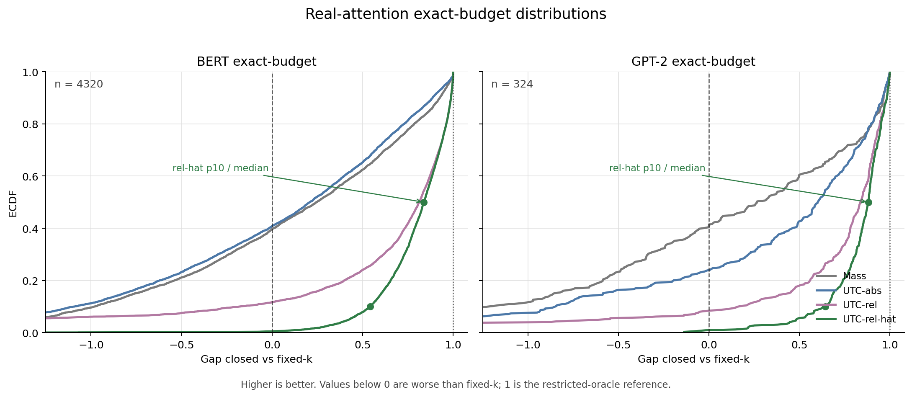

Project repository:
[value-aware-sparse-attention](https://github.com/r1skers/value-aware-sparse-attention).

The first two notes built the local error decomposition and cheap proxy story
on synthetic data. This stage moves to real attention maps.

The short version:

> BERT exposes that absolute scores are misaligned with relative error and that
> threshold protocols have comparable-row bias. UTC-rel-hat and exact-budget
> evaluation fix those issues. GPT-2 then validates that the local scorer
> ladder is not just a BERT-specific trick.

## 1. Why Move to Real Attention?

Synthetic data was useful because it gave a controlled entropy axis. But it
could not provide:

- real mixed entropy regimes;
- sink, punctuation, and special-token rows;
- real value/key correlations;
- real output-norm variation;
- protocol saturation effects.

So Stage 2 starts with `bert-base-uncased` and extracts real attention
probabilities and value vectors.

## 2. BERT Extraction Sanity Checks

The extraction pipeline recomputes attention probabilities from Q,K and checks
them against the model-returned attention:

```text
max |P_recomputed - P_model| ~= 1e-6
```

The decomposition

$$
\|o-\tilde o\|=\delta\|\mu_R-\mu_S\|
$$

also holds to floating-point precision on real BERT attention rows.

This matters because the later failures are not extraction artifacts.

## 3. From UTC-abs to UTC-rel-hat

Stage 1 used an absolute score:

$$
E_{\text{abs}}(k)=\delta(k)\|\hat\mu_R(k)-\mu_S(k)\|.
$$

BERT immediately exposed a mismatch: the evaluation target is relative error,
and some sink/punctuation rows have small output norm. Absolute error can miss
the dangerous rows.

The retained-denominator fix was

$$
E_{\text{rel}}(k)=
\frac{\delta(k)\|\hat\mu_R(k)-\mu_S(k)\|}
{\|\mu_S(k)\|+\eta}.
$$

It fixed some rows but could blow up when $\|\mu_S\|$ was unstable.

The final local scorer candidate is rel-hat:

$$
\hat o(k)=(1-\delta(k))\mu_S(k)+\delta(k)\hat\mu_R(k),
$$

$$
E_{\text{rel-hat}}(k)=
\frac{\delta(k)\|\hat\mu_R(k)-\mu_S(k)\|}
{\|\hat o(k)\|+\eta}.
$$

The key idea is not just "change the denominator." It estimates the quantity
the restricted local oracle actually cares about: relative output error.

## 4. Exact-Budget Evaluation

The first threshold-calibrated BERT sweep had a problem: only 718 out of 4320
rows were strictly comparable. Many heads saturated and did not spend the
requested budget.

Stage 2C replaces this with an exact-budget protocol:

```text
For each method:
  build score(row, k)
  choose a threshold that fits under the total budget
  spend leftover budget using that method's marginal score improvements
```

Now every method spends the same total retained-token budget.

## 5. BERT Result

Full exact-budget BERT sweep:

```text
10 docs x 12 layers x 12 heads x 3 budgets = 4320 rows
```

Gap closed vs fixed-k:

```text
method       mean gap  median gap  p10 gap
mass            0.071       0.245   -0.980
UTC-abs         0.017       0.208   -1.090
UTC-rel         0.380       0.813   -0.179
UTC-rel-hat     0.790       0.838    0.541
```

Pairwise checks:

```text
rel-hat <= min(abs, rel): 3539/4320 = 0.819
rel-hat <= mass:          4273/4320 = 0.989
rel-hat worse than fixed:   21/4320
```



The result is not just a mean. The distribution shifts: rel-hat's p10 is still
positive on BERT, while the Q,K-only and absolute baselines have heavy negative
tails.

## 6. Starvation Failures

The 21 below-fixed BERT cases are structured:

```text
by budget: {8: 18, 16: 2, 32: 1}
by layer: L10/L11 = 15/21
k_rel_hat < k_oracle: 21/21
```

Mechanism:

```text
tight budget
+ max-risk row score underestimated
+ rel-hat assigns too small k
=> worst-row starvation
```


This is a useful boundary: rel-hat is strong overall, but worst-row objectives
are sensitive to a few underestimated rows.

## 7. GPT-2 Cross-Model Test

To test whether rel-hat is a BERT-only fix, the same stack is moved to GPT-2
small causal attention:

```text
docs: 3 held-out 20 Newsgroups documents
layers: 0, 5, 11
heads: all 12
budgets: 8, 16, 32
rows: 324
```

Causal attention changes the support: each row only sees its prefix. UTC uses
prefix value sums, which are natural in causal kernels.

GPT-2 result:

```text
method       mean gap  median  p10
mass            0.017   0.265  -1.186
UTC-abs         0.309   0.602  -0.842
UTC-rel         0.579   0.837   0.185
UTC-rel-hat     0.828   0.881   0.642

rel-hat >= max(abs, rel): 250/324 = 0.772
rel-hat catastrophic (< -1): 0
rel-hat below fixed: 3/324
```

The literal pre-registration "only rel-hat has positive mean" failed: on GPT-2
all methods had positive mean. That was a useful correction. The severity of
baseline failure was BERT-specific; the rel-hat advantage was not.

## 8. Takeaway

At the end of Stage 3, the local evidence chain is:

```text
exact identity
-> synthetic signal hierarchy
-> cheap value proxy
-> BERT objective/protocol failures
-> UTC-rel-hat
-> exact-budget BERT validation
-> starvation failure boundary
-> GPT-2 cross-model validation
```

The right claim is:

> UTC-rel-hat is a leading cheap value-aware local scorer candidate across BERT
> and GPT-2 attention-output metrics.

The next question is metric boundary: does local error remain meaningful after
$W_O$ and downstream model computation?
