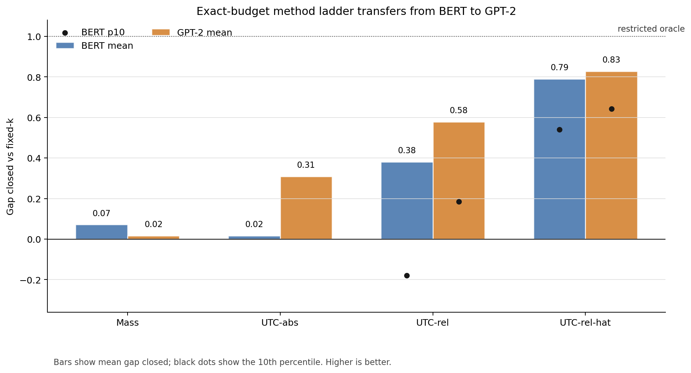
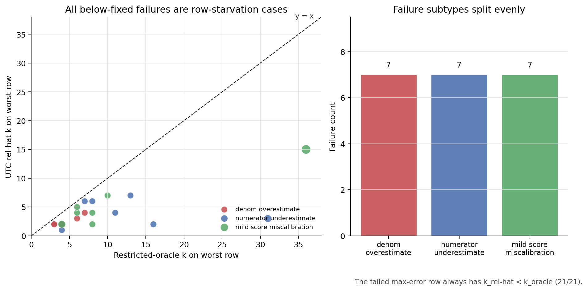

项目本体见 GitHub 仓库 [value-aware-sparse-attention](https://github.com/r1skers/value-aware-sparse-attention)。前两篇分别完成了：

- [Artifact-6.1：公式推导与现象观察](/artifacts/06-1-formulas-and-phenomenon-observation/)：从分解式 $\|o-\tilde o\|=\delta\|\mu_R-\mu_S\|$ 建立误差信号层级。
- [Artifact-6.2：Cheap Value Proxies](/artifacts/06-2-cheap-value-proxies/)：在合成数据上尝试不读 dropped V 的 cheap value proxy，得到 UTC / hybrid-b 这条阶段性路线。

这篇记录切进真实 attention map 之后发生的事。中间并不只是简简单单"把合成实验换成真实数据复现一遍"，而是要逼出合成台架中看不到的失败模式。

概述：

> BERT 暴露了 absolute scorer 和 relative objective 的错配，推动 UTC-abs 修成 UTC-rel-hat；exact-budget 协议排除了 comparable-row 筛选偏差；GPT-2 零修改迁移说明 rel-hat 不是 BERT-only trick。最终结果不是完美策略，而是一个跨模型存活、边界清楚的 leading cheap value-aware scorer candidate。

## 1. 引入：上真实 attention 的原因

合成阶段已经论述：

$$
\|o-\tilde o\|=\delta\|\mu_R-\mu_S\|.
$$

也就是说，剪枝误差有两个因子：

- $\delta$：剪掉多少 probability mass，Q,K-only。
- $\|\mu_R-\mu_S\|$：保留部分和剪掉部分的 value 质心距离，value-aware。

合成数据上，UTC proxy

$$
\hat\mu_R=\frac{\sum_i v_i-\sum_{i\in S}v_i}{|R|}
$$

在高熵 regime 能追回 restricted oracle 的一部分优势。但合成台架有几个无法逃开的任意选择：

- entropy regime 是用 `q_scale` 造出来的；
- value vectors 主要是 iid Gaussian；
- sink token、标点、special token 等真实结构不存在；
- mixed-regime 里的分组阈值也是人为设计的。

所以引入真实 attention，看看模型会给出怎样的答卷。

## 2. BERT 提取：先确认量尺没有坏

第一步用 `bert-base-uncased`，从 20 Newsgroups 文档中抽真实 attention head 的 $P,V$。为了避免分析假的东西，做了两个 sanity check：

```text
1. 从 Q,K 权重重算 softmax attention，与模型返回的 attention 对齐到约 1e-6。
2. 在真实 BERT 的每个 head 上，分解式仍然浮点级成立。
```

这一步确认了两件事：

- 公式不是只在 iid 合成数据上成立；
- 后面所有误差分析确实是在真实 attention map 上做的。

第一批结果很快出现了双重信号。一方面，合成主结论在高熵 BERT head 上存活：

```text
diffuse BERT head:
mass 有害
UTC 有效
```

这说明高熵区 value geometry 重要，不是纯合成幻觉。

另一方面，BERT 立刻打脸了 Stage 1 的自信：有些 head 上所有 adaptive 方法都输给 fixed。诊断后发现，真实模型里会出现 punctuation / sink row、小输出范数、relative error 目标叠加的结构。原来的 absolute scorer 并没有对齐真正要优化的量。

## 3. 从 UTC-abs 到 UTC-rel-hat

Stage 1 的 UTC scorer 是 absolute 形式：

$$
E_{\text{abs}}(k)=\delta(k)\|\hat\mu_R(k)-\mu_S(k)\|.
$$

它预测的是绝对输出误差。但真实评测里我们更关心 relative error：

$$
\frac{\|o-\tilde o\|}{\|o\|+\eta}.
$$

BERT 的 sink row 让这个差异变得不可忽略：有些行绝对误差不算最大，但 $\|o\|$ 很小，于是相对误差会爆。

第一版修法是 retained-denominator：

$$
E_{\text{rel}}(k)=
\frac{\delta(k)\|\hat\mu_R(k)-\mu_S(k)\|}
{\|\mu_S(k)\|+\eta}.
$$

它确实修了一部分 BERT failure，但很快又暴露新问题：小 $k$ 或 sink row 里，$\|\mu_S\|$ 本身不稳定，可能让分数爆炸。

最终得到的是 rel-hat：

$$
\hat o(k)=(1-\delta(k))\mu_S(k)+\delta(k)\hat\mu_R(k),
$$

$$
E_{\text{rel-hat}}(k)=
\frac{\delta(k)\|\hat\mu_R(k)-\mu_S(k)\|}
{\|\hat o(k)\|+\eta}.
$$

这一步的意义不是"又调了一个分母"，而是把 proxy 对齐到 restricted oracle 真正卡的目标量：相对输出误差。$\hat o$ 仍然只用 retained V 和 sequence-level / prefix value summary，不逐 query 扫 dropped V。

五个锚点测试里，rel-hat 修掉了 rel 的爆炸，也保住了 abs 的主场：

```text
synth q=0.25 b40: abs 0.668, rel 0.111, rel-hat 0.900
synth q=1.0  b40: abs -0.066, rel 0.711, rel-hat 0.711
BERT L11 h9 k=64: abs -0.714, rel 0.869, rel-hat 0.930
BERT L11 h9 k=16: abs -0.273, rel -3.053, rel-hat 0.461
BERT L0  h4 k=64: abs 0.527, rel 0.360, rel-hat 0.756
```

这里仍然不能宣布胜利，因为这些锚点参与了设计。关键是后面的 held-out 和大覆盖。

## 4. Held-out BERT：rel-hat 第一次过关

在没有调公式的 held-out BERT sweep 上，rel-hat 的表现是：

```text
rel-hat >= max(abs, rel): 约 89% / 94%
catastrophic failures: 0
```

这一步把 rel-hat 从"单个失败案例上的修补"推进成了真正的候选 scorer。更重要的是，它保留了一个方法论教训：

> predictor correlation 不等于 allocation quality；最终要看同预算下的误差分配结果。

后续所有真实数据实验都围绕这个标准展开。

## 5. Stage 2B：大 BERT sweep 暴露出的评测协议问题

接下来扩大到：

```text
10 docs × 12 layers × 12 heads × 3 budgets = 4320 head-budget rows
```

在原来的 threshold-calibrated protocol 里，每个方法通过阈值决定每行 $k$：

```text
score(row, k) <= threshold 就停
```

在能够匹配目标预算的 comparable rows 上，rel-hat 很强：

```text
comparable rows: 718 / 4320

method       mean gap  median    p10      min
mass        -0.143   -0.031   -0.980   -5.917
UTC-abs     -0.054    0.044   -0.836   -5.741
UTC-rel     -0.973    0.296   -4.916  -48.846
UTC-rel-hat  0.676    0.699    0.328   -0.482
```

但问题也很明显：只有 718/4320 行严格 comparable。真实 BERT 里很多 head 太尖锐，score 很快饱和，阈值法无法自然花满给定预算。

这不是小瑕疵，而是评测协议漏洞。如果一个方法平均只花 12 个 token，另一个 fixed-k 花 32 个 token，它们不能直接比较。

所以 Stage 2B 的正确结论是两条：

1. 在 comparable rows 上，rel-hat 是明显领先的 scorer candidate。
2. 真实 attention 里 saturation / budget non-binding 是主现象，必须修评测协议。

## 6. Stage 2C：exact-budget 排除 comparable-row 偏差

为了回答"是不是只在 comparable 子集里赢了"，Stage 2C 改成 exact-budget protocol：

```text
每个方法都构造 score(row, k)
然后强制花掉同样的总 token budget
```

这相当于定成本测误差；之前的 global-epsilon 想法则是定质量测成本。两者是对偶关系。我们先做 exact-budget，因为它最直接排除了筛选偏差。

完整 4320 行全部进入比较：

```text
rel-hat <= min(abs, rel): 3539/4320 = 0.819
rel-hat <= mass:          4273/4320 = 0.989
rel-hat worse than fixed:   21/4320
```

gap-closed 分布：

```text
method       mean gap  median gap  p10 gap   mean max_rel
mass            0.071       0.245   -0.980        0.6036
UTC-abs         0.017       0.208   -1.090        0.6140
UTC-rel         0.380       0.813   -0.179        0.4997
UTC-rel-hat     0.790       0.838    0.541        0.3589
```



这一步是整段真实数据实验的关键转折：rel-hat 的优势不是 comparable-row filtering 造成的评测伪影。在严格同预算下，它仍然吃掉了 fixed 到 restricted oracle 差距的大约 79%。

但它也不是完美策略。21/4320 below-fixed rows 是真实失败，不再能用"预算不公平"解释。

## 7. 21 个失败行：紧预算下的 max-risk row starvation

对 21 个 rel-hat below-fixed case 做 query-row 级诊断，结果非常整齐：

```text
by budget: {8: 18, 16: 2, 32: 1}
by layer:  L10/L11 占 15/21

k_rel_hat < k_oracle: 21/21
k_rel_hat = k_oracle:  0
k_rel_hat > k_oracle:  0
```

也就是说，失败不是 rel-hat 给这些 worst row 太多 token，也不是预算没花满；恰好相反：

> rel-hat 低估了真正决定 max error 的 query row，于是给它们的 $k$ 比 restricted oracle 少，导致 worst-row relative error 被顶爆。

我们把这个失效模式命名为：

```text
max-risk row starvation under tight exact budgets
```

三类子机制刚好各 7 个：

```text
denom_overestimate_starvation:        7
numerator_underestimate_starvation:   7
mild_score_miscalibration_starvation: 7
```

典型例子：

```text
doc=39 L11 h2 k=8: q="t",     k_relhat/oracle/fixed=2/4/8
doc=37 L10 h3 k=8: q="drug",  k_relhat/oracle/fixed=2/4/8
doc=17 L6  h1 k=8: q="[CLS]", k_relhat/oracle/fixed=3/6/8
```



这里有一个反转：我们原本怀疑的是 $\hat o$ cancellation，即分母过小导致 score 爆炸、预算被 hoard。实际主机制更像相反方向：$\|\hat o\|$ 偏大或 numerator 偏小，risk 被低估，于是 max-risk row 被饿到。

这个诊断很重要，因为它把 21 个黑点变成了明确边界：rel-hat 平均分配很强，但 worst-row objective 对少数漏掉的行极度敏感。

## 8. GPT-2：跨模型验证

到这里还有一个最大的疑虑：rel-hat 会不会只是 BERT 结构上调出来的？

所以下一步不是先修 guard，而是做跨模型验证。把整套方法零修改搬到 GPT-2 small：

```text
model: gpt2
layers: 0, 5, 11
heads: all
docs: 3 held-out 20 Newsgroups documents
max tokens: 128
budgets: 8, 16, 32
protocol: exact-budget
```

GPT-2 是 causal attention，所以 UTC 的 $\sum_i v_i$ 变成 causal prefix sum。这个改变不是额外成本，反而很自然：prefix value summary 正是 causal kernel 容易维护的量。

预登记写在跑之前：

1. rel-hat 是唯一正均值 scorer。
2. rel-hat 在多数 rows 上超过 max(abs, rel)。
3. rel-hat 没有 catastrophic failure。
4. 若有失败，仍应是单侧 starvation。

结果：

```text
method       mean gap  median  p10
mass            0.017   0.265  -1.186
UTC-abs         0.309   0.602  -0.842
UTC-rel         0.579   0.837   0.185
UTC-rel-hat     0.828   0.881   0.642

rel-hat >= max(abs, rel): 250/324 = 0.772
rel-hat catastrophic (< -1): 0
rel-hat below fixed: 3/324 = 0.9%
```

预登记的第 1 条字面失败：GPT-2 上所有方法均值都为正，"只有 rel-hat 正均值"是 BERT 的 punctuation / sink 结构特有现象，不可泛化。

但更重要的阶梯关系完整迁移：

```text
rel-hat > rel > abs > mass
```

所以对"是不是 BERT 过拟合"的回答是：

> 当前最强测试下，不支持 BERT-only trick 假设。BERT-specific 的是 baseline 失败有多惨，不是 rel-hat 的优势。

## 9. 现在到底算好不好

最终效果不是"碾压级好"，而是"研究上很有价值地好"。

BERT exact-budget：

```text
mean gap closed = 0.790
p10 = 0.541
below fixed = 21 / 4320
```

GPT-2 exact-budget：

```text
mean gap closed = 0.828
p10 = 0.642
below fixed = 3 / 324
```

这说明 rel-hat 能稳定追回 fixed 到 restricted oracle 差距的大约 80%，并且跨 encoder / decoder attention 存活。但它没有追平 restricted oracle，也没有消除所有 below-fixed case。

所以它的定位应该是：

```text
不是：最终 sparse attention 系统
而是：跨模型存活的 leading cheap value-aware scorer candidate
```

## 10. 当前边界与下一步

这条线到这里，证据链大致是：

```text
恒等式
-> 合成信号层级
-> cheap value proxy
-> BERT 真实失败
-> rel-hat 修正
-> exact-budget 协议
-> starvation 边界
-> GPT-2 跨模型验证
```

还剩两个大边界：

### 10.1 Metric boundary

目前优化的是 attention output space 的 relative error：

$$
\frac{\|o-\tilde o\|}{\|o\|+\eta}.
$$

但真实 transformer 里还会过 $W_O$、residual、MLP、logits。attention output error 好，不等于 downstream loss 一定好。下一步需要测：

```text
W_O 后的误差
hidden-state drift
logit drift
也许最终是 task loss / perplexity
```

这条边界是下一篇 [Artifact-6.4：Metric Boundary](/artifacts/06-4-metric-boundary/) 的主题：结论是局部误差控制能过 $W_O$ 投影，但到 next-token KL 就不再是行为 oracle。

### 10.2 Failure boundary

BERT 有 21 个 starvation failure，GPT-2 有 3 个 below-fixed case。它们不是灾难性普遍失败，但足够说明方法还有边界。

最自然的修法不是换一个全局 denominator，而是 guard：

```text
如果 tail weights 离 uniform 很远，说明 UTC 不可信；
这类行给一个保护性 k floor 或 trust-gated correction。
```

这可以针对已知失效模式，而不是继续在全局上调 scorer。

## 11. 这篇的结论

真实数据阶段最大的收获不是某个数字，而是问题被逐步逼清楚了。

在 BERT 之前，我们只有：

> value geometry 在高熵区重要，UTC 也许能便宜估计它。

切进真实数据之后，结论变成：

> UTC-abs 目标错配，UTC-rel 分母不稳，UTC-rel-hat 更接近 restricted oracle 的 relative objective；在 BERT exact-budget 4320 rows 和 GPT-2 causal attention 上，它都稳定领先 Q,K-only / abs / retained-denominator baselines，但会在 tight budget 下饿死少数 max-risk rows。

这不是 SOTA 宣称，而是一个更可靠的研究式结果：方法有效、协议干净、失败边界明确、下一步清楚。
