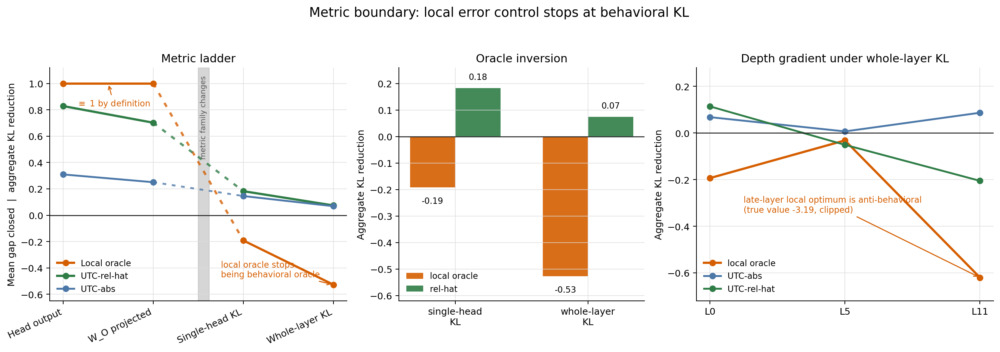

Project repository:
[value-aware-sparse-attention](https://github.com/r1skers/value-aware-sparse-attention).

By the end of [Artifact-6.3](/en/artifacts/06-3-real-attention-cross-model/),
UTC-rel-hat was a strong **local sparse-attention scorer**. It worked on BERT
and GPT-2 attention-output relative error under exact-budget evaluation.

But local attention error is not what the model ultimately outputs.

The model sees the perturbation after $W_O$, residual streams, later layers,
LayerNorm, MLPs, and the LM head. So the final question is:

> Can local attention-error control serve as a proxy for model behavior?

The short answer:

> It transfers through $W_O$ with attenuation, but it does not become a
> next-token KL oracle. Local error is not a behavioral oracle.

## 1. The Metric Boundary Question

For one attention row, local relative error is

$$
E_i(k)=\frac{\|o_i-\tilde o_i(k)\|}{\|o_i\|+\eta}.
$$

UTC-rel-hat estimates

$$
\widehat E_{\text{rel-hat}}(k)=\frac{\delta(k)\lVert\hat\mu_R(k)-\mu_S(k)\rVert}{\lVert\hat o(k)\rVert+\eta}.
$$

This is aligned with the local restricted oracle. But next-token behavior is
about logits:

$$
z_t=f_{\text{rest}}(o_1,\ldots,o_n),
$$

and the downstream metric is

$$
D_{\mathrm{KL}}
\left(
p_{\text{dense}}(x_{t+1}\mid x_{\le t})
\;\|\;
p_{\text{sparse}}(x_{t+1}\mid x_{\le t})
\right).
$$

These two objectives are separated by:

- $W_O$ direction reweighting;
- downstream mixing and residual paths;
- token-position importance;
- head and layer redundancy;
- the nonlinearity of softmax/KL.

Stage 4 asks how far the local scorer story survives.

## 2. Stage 4A: W_O Projection

The first boundary test evaluates error after the attention output projection:

$$
\|(o-\tilde o)W_O\|.
$$

Result:

```text
BERT rel-hat:
head-space mean gap       0.790
W_O-projected mean gap    0.755

GPT-2 rel-hat:
head-space mean gap       0.828
W_O-projected mean gap    0.702
```

The ladder survives, but attenuates. This rules out the strongest negative
story: the project was not optimizing a completely irrelevant local direction.

## 3. Stage 4B: Single-Head GPT-2 KL

Next, patch one GPT-2 head at a time:

```text
choose one doc/layer/head/budget
replace that head's attention context with sparse context
continue the real GPT-2 forward pass
measure next-token KL against dense GPT-2
```

Dense reconstruction check:

```text
layer 0  max logit diff 0.00387, mean 8.7e-05
layer 5  max logit diff 0.00066, mean 2.3e-05
layer 11 max logit diff 0.00012, mean 7.2e-06
```

This check caught an early patching bug, where non-target heads were
accidentally replaced by raw V instead of dense attention context PV.

Per-configuration mean-KL improvement:

```text
projected_oracle  -0.407
mass              -0.083
UTC-abs           -0.042
UTC-rel           -0.205
UTC-rel-hat       -0.091
```

Aggregate mean-KL reduction:

```text
projected_oracle  -0.192
mass              -0.229
UTC-abs            0.146
UTC-rel            0.057
UTC-rel-hat        0.183
```

The important signal is not just that rel-hat is no longer dominant. It is that
the projected local oracle is also worse than fixed under KL.

That means the local gap-closed axis is not the behavioral KL axis.

## 4. Stage 4C: Whole-Layer KL

Single-head intervention may be too weak and redundancy-dominated. Stage 4C
patches all heads in a layer simultaneously:

```text
choose one GPT-2 layer / budget
sparsify all heads in that layer
continue the model forward
measure next-token KL
```

The signal becomes healthier:

```text
Stage 4B single-head fixed mean KL: 0.00303
Stage 4C whole-layer fixed mean KL: 0.02578
```

But the local scorer ladder still does not return.

Per-configuration mean-KL improvement:

```text
projected_oracle  -1.554
mass              -0.146
UTC-abs            0.096
UTC-rel           -0.262
UTC-rel-hat       -0.026
```

Aggregate mean-KL reduction:

```text
projected_oracle  -0.527
mass              -0.193
UTC-abs            0.069
UTC-rel           -0.049
UTC-rel-hat        0.074
```

Whole-layer intervention fixes part of the measurement problem, but not the
target mismatch.

## 5. The Boundary Figure



The three panels show:

- the metric ladder: head-space and $W_O$ preserve the local story; KL breaks it;
- oracle inversion: local projected oracle becomes bad under behavioral KL;
- depth gradient: the mismatch grows near the readout side of the model.

Whole-layer KL by layer:

```text
layer 0:
  UTC-rel-hat aggregate KL reduction       +0.114

layer 5:
  UTC-rel-hat aggregate KL reduction       -0.051

layer 11:
  UTC-rel-hat aggregate KL reduction       -0.205
  projected-oracle aggregate KL reduction  -3.194
```

The negative result has structure: local fidelity is still more meaningful in
early layers, then becomes increasingly misaligned near the readout structure.

## 6. What This Does and Does Not Mean

Stage 4 does not invalidate the earlier results:

- the decomposition remains exact;
- value geometry still matters for local sparse-attention error;
- UTC-rel-hat remains a cheap value-aware local scorer;
- BERT/GPT-2 local results and $W_O$ results remain intact.

It answers a different question:

> Can local sparse-attention error automatically become a model-behavior metric?

Answer: no.

The downstream path is

$$
\Delta o
\rightarrow
\Delta oW_O
\rightarrow
\text{residual stream}
\rightarrow
\text{later blocks}
\rightarrow
\Delta z
\rightarrow
D_{\mathrm{KL}}.
$$

The first part can be controlled by value geometry. The latter part needs
position, depth, direction, redundancy, and readout sensitivity.

## 7. Final Boundary Claim

Artifact-6 started with a vague question:

```text
What happens when we prune attention?
```

It ends with a calibrated map:

```text
1. local error = dropped mass × value centroid displacement
2. dropped mass and value geometry trade dominance across entropy regimes
3. cheap value-aware proxies can recover much of the local restricted-oracle gap
4. this transfers to real BERT/GPT-2 attention and through W_O
5. next-token KL requires a new behavioral reference axis
```

The final claim:

> Value-aware local sparse-attention error can be controlled cheaply and
> transfers through $W_O$ with attenuation, but local restricted oracles are not
> behavioral oracles under next-token KL.

Further work would be a new project: KL-aware / readout-aware sparse attention,
with a behavioral oracle, broader model coverage, and eventually real sparse
kernels. That is outside this artifact's scope.
