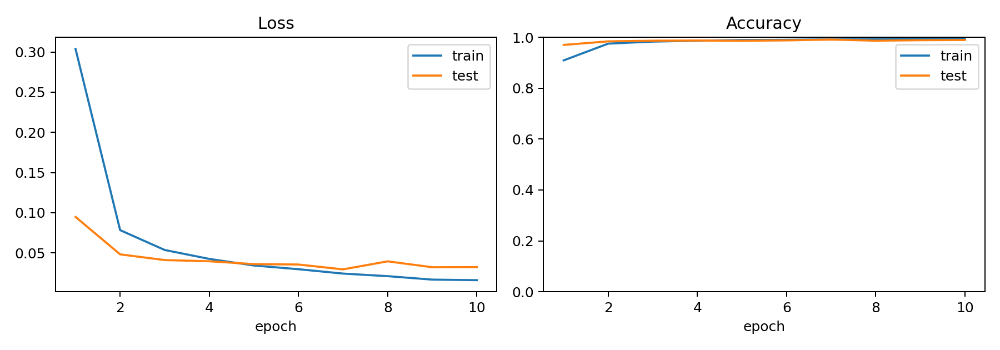
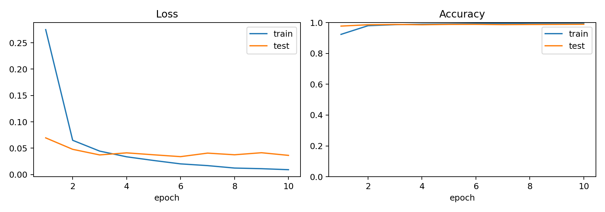
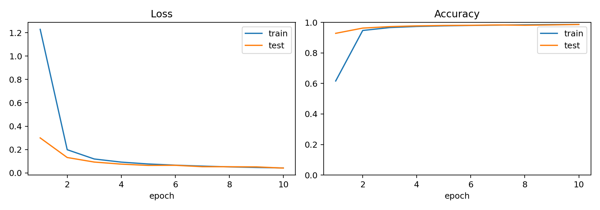
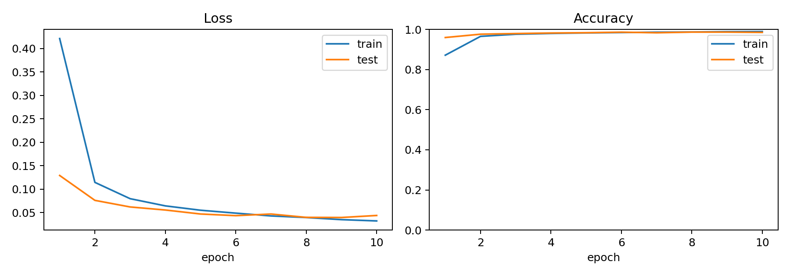

# 机器学习 / CNN 与视觉表征：从 LeNet-5 到 Modern CNN

上一篇里我已经把 VAE 从 MLP 改成了 CNN-VAE，这一篇我们来拆一下 CNN，从最经典的 LeNet-5 开始。


## 写在前面

LeNet-5 是 CNN 的一个模型，也就是说两者其实是同一个链条：

```text
LeNet-5 paper-like:
32x32 input -> C1 -> S2 -> C3 -> S4 -> C5 -> F6 -> RBF prototype

Modern CNN:
32x32 input -> Conv/Activation/Pool -> Conv/Activation/Pool -> Conv -> Linear classifier
```

## 从论文里的 LeNet-5 开始

首先有个要注意的是 LeNet-5 的输入不是 MNIST 原始的 28x28，而是 32x32。按论文里的解释：把数字放在更大的画布里，可以避免笔画端点或者角落特征刚好落在高层特征提取器的感受野中心之外。

从结构上看，32x32 也刚好让后面的尺寸一路对齐：

| 层 | 操作 | 输出 shape | 直觉 |
| --- | --- | --- | --- |
| Input | 32x32 灰度图 | 1x32x32 | MNIST 28x28 外围补边 |
| C1 | 5x5 卷积，6 个特征图 | 6x28x28 | 用 6 个 detector 扫全图 |
| S2 | 2x2 subsampling | 6x14x14 | 降采样，保留局部响应 |
| C3 | 5x5 卷积，16 个特征图 | 16x10x10 | 组合 S2 的低级特征 |
| S4 | 2x2 subsampling | 16x5x5 | 再次压缩空间尺寸 |
| C5 | 5x5 卷积，120 个特征图 | 120x1x1 | 从局部结构转成整体表示 |
| F6 | 全连接，84 维 | 84 | 更抽象的类别相关表示 |
| Output | RBF prototype | 10 | 和 10 个类别原型比较距离 |

主要注意这个链条：

```text
Convolution -> Subsampling -> Convolution -> Subsampling -> Representation -> Classifier
```

也就是 `C-S-C-S` 流程。卷积负责找局部模式，池化/下采样负责压缩位置细节，后面的层再把低级模式组合成更高级的模式。

## 论文版和现代版的差别

读论文时我一开始以为 LeNet-5 跟今天的 CNN 差不多：卷积、池化、全连接、softmax。真的拆下去之后才发现，它和现代写法有几个关键差别。

第一，S2 和 S4 不是今天最常见的 max pooling。论文里的 subsampling 是：

```text
2x2 区域求和/平均 -> 乘一个可训练系数 alpha -> 加 bias -> 过激活函数
```

也就是说，S 层本身有可学习参数。

第二，激活函数不是 ReLU，而是 scaled tanh。而今天 ReLU 更常见，是因为它计算简单、梯度更不容易在正区间饱和；但在 LeNet-5 的年代，tanh/sigmoid 系列还很自然。

第三，输出层不是现代分类里最常见的 linear logits + cross entropy，而是把 F6 的表示拿去和每个类别的 prototype 比较。距离越小，说明越像那个类别。

## Paper-Like 复现

代码里我保留了一版尽量贴近论文的实现：

```text
src/models_paper.py
src/train_paper.py
```

主要保留了：

| 组件 | 论文味道 | 代码里的处理 |
| --- | --- | --- |
| 激活函数 | scaled tanh | 自定义 `ScaledTanh` |
| S2/S4 | 可训练 subsampling | 每个通道有自己的 scale 和 bias |
| C3 | 部分连接 | 按论文连接表选择 S2 feature maps |
| C5 | 5x5 卷积到 1x1 | 等价于对整个 S4 空间做卷积 |
| Output | RBF prototype | 输出到每个类别原型的距离 |

不过训练目标这里我没有完全照搬论文的 energy loss，而是为了训练稳定，把距离取负后用了交叉熵 `CrossEntropyLoss`：

```text
loss = CrossEntropyLoss(-distances, target)
```

## Modern CNN 尝试

```text
src/models.py
src/train.py
```

核心变化有三个：

1. 输出层从 RBF prototype 改成 `Linear(84, 10)`。
2. 损失函数直接对 logits 使用 `CrossEntropyLoss`。
3. 激活函数、通道数、池化方式都做成配置项。

这时候 classifier 的作用就很清楚了：前面的卷积层负责把图像变成特征表示，classifier 负责把这个表示映射成 10 个类别分数。

```text
features -> classifier -> logits -> argmax -> predicted class
```

这里的 logits 是 10 个未经归一化的分数；训练时 `CrossEntropyLoss` 会在内部做 log-softmax，预测时直接取最大分数对应的类别。

## 实验一：激活函数

我先试了几种激活函数：

控制变量：都使用 `classic` 通道配置、`maxpool`、训练 10 epochs。

| 激活函数 | 第 1 轮 train loss | 最后一轮 train loss | 最后一轮 test loss | 最后一轮 test acc | 最佳 test acc |
| --- | ---: | ---: | ---: | ---: | ---: |
| ReLU | 0.3039 | 0.0160 | 0.0322 | 98.95% | 99.12% |
| Tanh | 0.2750 | 0.0093 | 0.0365 | 98.91% | 98.91% |
| Sigmoid | 1.2289 | 0.0425 | 0.0414 | 98.64% | 98.64% |

这符合直觉：MNIST 比较简单，所以 ReLU 和 tanh 未必会拉开巨大差距；但 sigmoid 因为输出范围和梯度性质，训练早期更容易慢。







这里最明显的是 sigmoid：第一轮 train loss 直接到了 1.2289，比 ReLU 和 tanh 高很多。后面它也能追上来，但收敛速度和最终 accuracy 都略弱一点。ReLU 和 tanh 在 MNIST 上差距不大，需要进一步的调参区分。
## 实验二：通道数

三个档位：

控制变量：都使用 `ReLU`、`maxpool`、训练 10 epochs。

| 档位 | C1/C3/C5 通道数 | 参数量 | 最后一轮 train loss | 最后一轮 test loss | 最后一轮 test acc | 最佳 test acc |
| --- | --- | ---: | ---: | ---: | ---: | ---: |
| small | 4 / 8 / 60 | 18,946 | 0.0323 | 0.0439 | 98.52% | 98.67% |
| classic | 6 / 16 / 120 | 61,706 | 0.0160 | 0.0322 | 98.95% | 99.12% |
| large | 12 / 32 / 240 | 223,278 | 0.0096 | 0.0268 | 99.13% | 99.36% |

从 MNIST 上看，large 的效果很好，这不奇怪。它给了模型更多 detector 和组合空间。只是在更难的数据集上，通道数变大也会带来过拟合、训练时间和计算量的问题。

这里不继续调参，是因为这篇的主要目的是理解 LeNet-5 的结构。




从结果看，通道数变大之后 train loss 和 test loss 都更低，最佳 test acc 也最高。不过这组实验也很容易把人带进“继续加参数”的方向，所以这里我只把它当成一个结构理解实验：通道数越多，模型能同时保留的 detector 和特征组合越多。

## 实验三：池化方式

池化这里比较了：

| 池化 | 做法 | 直觉 |
| --- | --- | --- |
| AvgPool | 局部区域取平均 | 更平滑，更接近论文 subsampling |
| MaxPool | 局部区域取最大值 | 更强调“有没有强响应” |

控制变量：都使用 `ReLU`、`classic` 通道配置、训练 10 epochs。

| 池化方式 | 最后一轮 train loss | 最后一轮 test loss | 最后一轮 test acc | 最佳 test acc |
| --- | ---: | ---: | ---: | ---: |
| AvgPool | 0.0258 | 0.0330 | 98.92% | 98.92% |
| MaxPool | 0.0160 | 0.0322 | 98.95% | 99.12% |

在 MNIST 上，max pooling 的表现更好一点。这个结果也符合直觉：识别数字时，某个局部笔画特征是否强烈出现，往往比这个区域的平均响应更关键。


别忘了论文里的 S2/S4 并不是现代 MaxPool。

```text
LeNet-5 paper: trainable subsampling
Modern CNN: max/avg pooling
```

## 图像直觉

如果只看 accuracy 和 loss 有点过于抽象，所以做了 C1 卷积核和中间 feature maps 的可视化。

学出来的 C1 filters：


这张图展示的是“detector 本身”。每一个小块都是一个 5x5 卷积核。训练刚开始时它们是随机初始化的，后来通过反向传播逐渐变成对某些局部模式敏感的检测器。

再看某个样本经过 C1、S2、C3 后的特征图：


这里的 feature map 展示的是“detector 扫完整张图之后，在哪里反应强”。亮的地方不等于模型已经知道答案，而是说明这个卷积核在这些位置上和局部图像模式比较匹配。

后面的反向传播会根据最终 loss 来判断：这些响应到底帮没帮上正确分类。如果某个响应帮助模型把 7 判成 7，它相关路径上的参数就会被往有利方向调整；如果它把模型带偏了，梯度就会把相关参数往反方向推。

## 总结

几个基本思想：

1. 卷积核不是手工设计的模板，而是随机初始化后通过梯度下降学出来的 detector。
2. 一层卷积可以同时学习多个 detector，所以输出会有多个 feature maps。
3. 浅层更像在找边缘、笔画、局部结构，深层更像在组合这些结构。
4. 池化会牺牲精确位置，换来更小的尺寸和更强的位置鲁棒性。
5. 现代 CNN 把论文里的很多组件替换成了更直接、更稳定的训练习惯，比如 ReLU、MaxPool、Linear classifier 和 CrossEntropyLoss。
