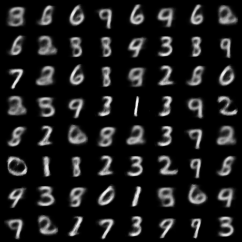
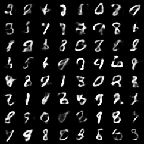
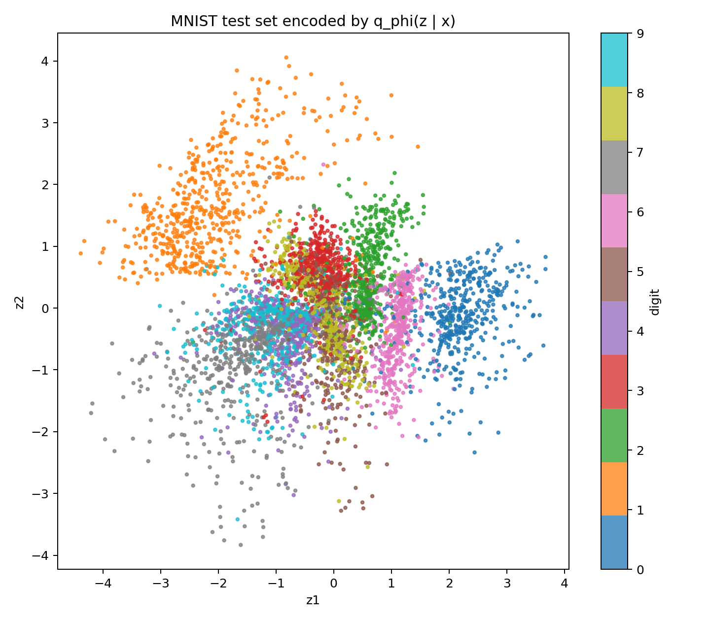
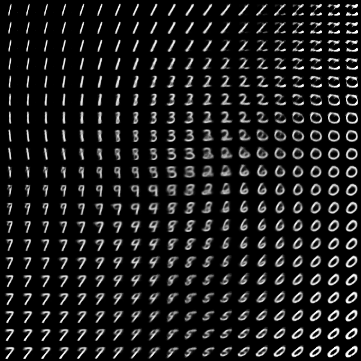

# 机器学习 / 生成模型：VAE 的最小复现

上一篇：[VAE：基本思想与 ELBO 推导](/notes/笔记-机器学习-生成模型-vae基本思想与elbo推导/)

论文链接：[Auto-Encoding Variational Bayes](https://arxiv.org/abs/1312.6114)

代码仓库：`paper-reforge/Variational_AutoEncoder`

这篇是 VAE 学习笔记的下篇。上篇主要处理论文里的问题设定、ELBO 推导和 reparameterization trick；这一篇把公式落到一个 PyTorch 实现上，看看一个普通 MLP-VAE 在 MNIST 上能学到什么。

# 复现目标

复现 VAE 最核心的训练闭环：

$$\begin{aligned} x \rightarrow q_{\phi}(z \mid x) \rightarrow z \rightarrow p_{\theta}(x \mid z) \end{aligned}$$

详细来说：

1. encoder 输入图片 $x$，输出隐变量分布的参数。
2. 通过 reparameterization trick 从这个分布中采样 $z$。
3. decoder 输入 $z$，输出重构图片的像素概率。
4. 用 reconstruction loss 和 KL loss 共同训练模型。

# 从公式到代码

## Encoder：输出分布参数

VAE 里的 encoder 是输出近似后验分布的参数：

$$\begin{aligned} q_{\phi}(z \mid x)=\mathcal{N}\left(\mu_{\phi}(x), \mathrm{diag}(\sigma_{\phi}^{2}(x))\right) \end{aligned}$$

在实现里，encoder 输出的是 `mu` 和 `logvar`：

```python
mu = self.mu(h)
logvar = self.logvar(h)
```

这里用 `logvar` 而不是直接输出 $\sigma$，是因为方差需要为正，输出 log variance 会更稳定。

## Reparameterization：让采样可微

直接从 $q_{\phi}(z \mid x)$ 采样会让随机性挡在反向传播路径中。VAE 的处理方式是把随机性拆出来：

$$\begin{aligned} \epsilon \sim \mathcal{N}(0,I), \qquad z=\mu_{\phi}(x)+\sigma_{\phi}(x)\odot\epsilon \end{aligned}$$

代码里对应：

```python
std = torch.exp(0.5 * logvar)
eps = torch.randn_like(std)
z = mu + std * eps
```

这样一来，随机性来自固定噪声 $\epsilon$，而 $z$ 对 `mu` 和 `logvar` 的依赖仍然是可微的。

## Decoder：输出像素概率

MNIST 图片经过 `ToTensor()` 后，每个像素都在 $[0,1]$ 之间。因此这个最小复现把 decoder 输出理解为 Bernoulli 分布的参数：

$$\begin{aligned} p_{\theta}(x \mid z)=\prod_{j=1}^{784}\mathrm{Bernoulli}(x_j;\pi_{\theta,j}(z)) \end{aligned}$$

也就是说，decoder 吐出的是每个像素为 1 的概率：

$$\begin{aligned} \pi_{\theta}(z) \in [0,1]^{784} \end{aligned}$$

所以输出层用了 `Sigmoid`，把结果压到 $[0,1]$。

## Loss：负 ELBO

上篇推到的 ELBO 是：

$$\begin{aligned} \mathcal{L}(\theta,\phi;x)=\mathbb{E}_{q_{\phi}(z \mid x)}[\log p_{\theta}(x \mid z)]-D_{\mathrm{KL}}\left(q_{\phi}(z \mid x)\middle\|p(z)\right) \end{aligned}$$

训练时通常最小化负 ELBO：

$$\begin{aligned} \mathrm{loss}=\mathrm{reconstruction\ loss}+\mathrm{KL\ loss} \end{aligned}$$

在这个 MNIST 版本里，reconstruction loss 使用 binary cross entropy：

$$\begin{aligned} -\log p_{\theta}(x \mid z)=-\sum_{j=1}^{784}\left[x_j\log \pi_{\theta,j}(z)+(1-x_j)\log(1-\pi_{\theta,j}(z))\right] \end{aligned}$$

KL 项使用 diagonal Gaussian posterior 到 standard normal prior 的闭式解：

$$\begin{aligned} D_{\mathrm{KL}}\left(q_{\phi}(z \mid x)\middle\|p(z)\right)=-\frac{1}{2}\sum_j\left(1+\log\sigma_j^2-\mu_j^2-\sigma_j^2\right) \end{aligned}$$

代码里的训练目标就是：

```python
loss = recon_loss + kl_loss
```

# 实验设置

这次复现使用最小 MLP 结构：

| item | value |
|---|---|
| dataset | MNIST |
| model | MLP VAE |
| input_dim | 784 |
| hidden_dim | 400 |
| latent_dim | 2 / 20 / 50 |
| epochs | 20 |
| optimizer | Adam |
| likelihood | Bernoulli over pixels |
| device | CPU |

这里先不引入 CNN。原因是目标不是刷图像质量，而是验证 VAE 的核心训练闭环。

# Baseline：latent_dim = 20

先看 `latent_dim = 20` 的 baseline。训练 20 个 epoch 后，最终指标如下：

| split | loss | recon | KL |
|---|---:|---:|---:|
| train | 104.1901 | 78.5278 | 25.6623 |
| test | 104.1232 | 78.8769 | 25.2463 |

几个现象比较符合预期：

- loss 在前几个 epoch 下降很快，后面逐渐变平稳。
- test loss 和 train loss 接近，没有明显过拟合。
- reconstruction 比从 prior sample 出来的 generation 更清晰。
- 生成图已经有数字形状，但整体偏模糊，这是 MLP-VAE baseline 很正常的结果。

从这里可以确认，最小 VAE 的训练闭环已经跑通了。

# Latent Dimension 对比

接着对比 `latent_dim = 2 / 20 / 50`。

| latent_dim | test loss | test recon | test KL | 观察 |
|---:|---:|---:|---:|---|
| 2 | 151.1283 | 144.9927 | 6.1356 | 重构较弱，但 prior samples 更规整 |
| 20 | 104.1232 | 78.8769 | 25.2463 | baseline，重构和生成比较平衡 |
| 50 | 103.7298 | 76.7843 | 26.9455 | 重构最好，但 prior samples 不一定最好 |

一个很有意思的点是：latent dimension 变大后，重构指标确实更好，但生成质量并没有线性变好。

`latent_dim = 2` 的瓶颈很强，模型被迫把信息压进一个很小的二维空间里，所以 reconstruction 指标较差。但也因为空间很小，decoder 更容易在 prior 附近学出连续、规整的结构，所以直接从 prior 采样时看起来反而更稳定。

`latent_dim = 50` 的表达能力更强，因此 reconstruction 最好。但高维 prior 空间里有很多区域训练时未必被充分覆盖，随机采样更容易落到 decoder 不稳定的位置，所以生成图不一定比二维版本更好。

## 生成样本对比

`latent_dim = 2`：



`latent_dim = 20`：


`latent_dim = 50`：



从视觉上看，二维版本的样本更有整体数字形状；20 维和 50 维虽然重构能力更强，但 prior sampling 的结果更容易出现模糊和不稳定形状。

# 二维隐空间观察

`latent_dim = 2` 有一个额外好处：可以直接把隐空间画出来。

## Latent Scatter



这个图是把测试集输入 encoder 后，取 $\mu_{\phi}(x)$ 作为每张图片在二维隐空间中的位置。

可以看到，不同数字出现了一定聚类，但类之间仍然有明显重叠。这很正常，因为二维空间容量有限，不可能完美分开所有手写数字。不过它已经说明 encoder 学到的不是随机投影，而是带有类别和形状结构的连续表示。

## Latent Manifold



这个图是在二维平面上取一张规则网格，把每个网格点当成 $z$ 输入 decoder 得到的结果。

比较直观的观察是：

- 左侧更像 `1` / `7`。
- 中间区域会过渡到 `2` / `3` / `6` / `9`。
- 右侧更像 `0`。
- 在隐空间中移动时，生成结果会连续变化。

这正是 VAE 很有意思的地方：它不是只记住训练集里的图片，而是在隐空间中学到了一个可以连续移动的生成表面。

# 小结

经过这次最小复现，对 VAE 的理解可以压缩成：

1. encoder 不是简单压缩图片，而是输出隐变量分布的参数。
2. reparameterization trick 把随机采样改写成可微路径。
3. decoder 输出的是生成观测数据的概率分布参数。
4. 代码里的 BCE + KL 正是负 ELBO。
5. latent dimension 越大，重构通常更强，但 prior sampling 的视觉质量不一定同步变好。

所以 VAE 的核心并非只是“把图片压缩再还原”，而是在学习两个概率映射：

$$\begin{aligned} x \rightarrow q_{\phi}(z \mid x), \qquad z \rightarrow p_{\theta}(x \mid z) \end{aligned}$$

这两个方向合在一起，才构成了 VAE 的完整训练闭环。

# 后续方向

继续有这几个方向：

1. 把 MLP 换成 CNN-VAE，提高图像质量。
2. 尝试 $\beta$-VAE，观察 KL 权重对隐空间的影响。
3. 做一个二维 latent space 交互式可视化。
4. 继续读 VAE 后续论文，看它如何发展到更强的生成模型。
