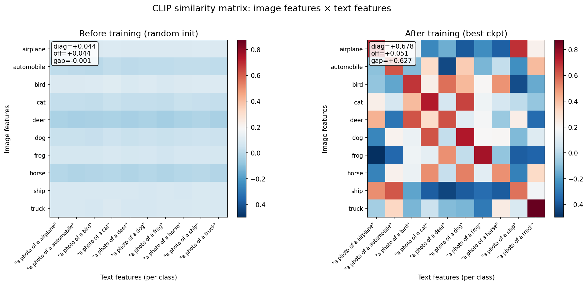

# 机器学习 / CLIP 与多模态对齐：从对比学习到图文共享空间

上一篇笔记把 ViT 从 patch embedding 推到了 CLS-based 分类。这一篇接着把 ViT 和 NLP Transformer 编码器**拼到同一个 (image, text) 空间里**——这就是 CLIP (Contrastive Language–Image Pre-training)。题目里"从对比学习到图文共享空间"概括了这一站的全部新东西：图像和文本经过两个独立的塔，被拉到同一个 d 维球面上，匹配 pair 互相接近、不匹配 pair 互相远离。这套机制让一个模型既能做 image retrieval，又能做 zero-shot 分类，还能给后面的 BLIP / LLaVA 当 representation extractor。

复现代码：[paper-reforge/CLIP](https://github.com/r1skers/paper-reforge/tree/main/CLIP)
论文链接：[Learning Transferable Visual Models From Natural Language Supervision (Radford et al., 2021)](https://arxiv.org/abs/2103.00020)

---

# Abstract

- **问题**：在 CLIP 之前，视觉模型几乎都靠 ImageNet 1000 类的人工标注训练——类别空间是**闭集**，训练时见过的类别 = 推理时能识别的类别。想加新类、做新任务都得重新标。如何摆脱这种"标注瓶颈"？
- **解决方法**：用互联网爬来的 **4 亿对 (image, caption)** 训练，让一个 image encoder 和一个 text encoder 把匹配 pair 映射到向量空间相近位置、不匹配 pair 映射到远位置。推理时把任意分类任务翻译成"图像 vs 类名文本"的相似度匹配。
- **配件**：
  1. **两塔架构** = ViT image encoder + causal Transformer text encoder，**完全独立**，没有 cross-attention
  2. **共享空间投影** = 两塔最后各接一个 `Linear(d_model, d_shared, bias=False)`，把不同模态拉到同一个 d 维空间
  3. **对称 InfoNCE loss** = 把"image→text 检索"和"text→image 检索"两个方向的 cross-entropy 取平均
  4. **L2 normalize** = 把 feature 推到单位球面，让内积 = cosine similarity
  5. **Learnable temperature τ** = `1/τ = exp(logit_scale)`，模型自己学最优 softmax 尖锐度
  6. **EOS feature extraction** = causal mask 下只有最后一个位置看得到全句，所以取 EOS 位置的输出当 sentence representation
- **核心结论**：CLIP 的贡献是**范式**而非架构——所有组件 (ViT、Transformer、InfoNCE) 都是现成的。它的革命性来自两件事：用自然语言代替 label 让类别空间**变成开集**；用对比学习而非生成在 4 亿 pair 上把它做到工业规模。

---

# 1. Motivation：从 closed-set label 到 open-set natural language

CNN / ViT 时代的训练范式：

```text
ImageNet 1400 万张图 × 人工标注一个 label
  → 训一个 nn.Linear(d_model, 1000) 分类头
  → 模型只认得这 1000 类
```

这个范式有三个**结构性限制**，CLIP 同时打掉了三个：

| 限制 | 具体表现 | 影响 |
|---|---|---|
| **标注成本** | 1400 万张图全靠人标 | 繁琐的重复劳动 |
| **闭集 (closed-set)** | 训练时见过的类别 = 推理时能识别的类别 | 给一张"独角兽"图，模型只会从 1000 类里挑最像的——它**不知道自己不知道** |
| **任务僵化** | 一个模型 = 一个任务 | 经常换新模型 |

CLIP 的回答是：**不用 label，用自然语言**。

## 自然语言作为监督信号的两个新性质

OpenAI 从互联网爬 4 亿对 (image, alt-text) pair——caption 是**免费**的（网页里就有）、**丰富**的（同一只猫可能写成 "a cat" / "my Siamese" / "Whiskers on the windowsill"）、**开放**的（caption 空间没有 ImageNet 那种"只能从 1000 类里选"的限制）。

更关键的是推理时：

```python
# 想分 CIFAR-10？现场造 10 个文本，编码成 10 个 text feature
text_features = text_encoder([f"a photo of a {c}" for c in cifar10_classes])

# 想做医学影像分类？换一组类名再编码一次
text_features = text_encoder(["a CT scan of healthy lung", "a CT scan of pneumonia"])

# 同一个模型 → 任意分类任务 → 零额外训练
prediction = (image_encoder(image) @ text_features.T).argmax()
```

> 同样是"海量数据 + 大模型"，但用**自然语言**而非 label 训练，把"分类器权重"从"固定的可学参数 `nn.Linear`"变成"由文本现场生成的向量"。这就是 zero-shot 能力的根因——不是模型变聪明，是分类器变成了 text encoder 的输出。

## CLIP 的出现

**CLIP 没发明任何新组件** ：

- Image encoder 是 ViT (2020) 或 ResNet (2015) 的现成网络
- Text encoder 是 GPT-style causal Transformer (2018)
- Contrastive loss 是 SimCLR (2020) 已经做过的事
- L2 normalize + cosine similarity 是上世纪 80 年代就有的技术

它的贡献是：

1. 把"用自然语言做监督"做到了**工业规模**（4 亿 pair）
2. **证明了这种范式 zero-shot 能打过监督模型**——同一个 CLIP 模型 zero-shot ImageNet top-1 是 76.2%，和 supervised ResNet-50 (76.1%) 持平

这是**方法论 + 工程**的胜利，不是架构的胜利。这也是为什么后来的 BLIP / LLaVA / Stable Diffusion 都不去改 CLIP 的架构，而是改训练方式和数据。

---

# 2. InfoNCE：从"对齐"到"分类"

CLIP 数学的核心是把"让 image 和 text feature 对齐"翻译成一个**可优化的目标**。

## 2.1 第一层翻译：alignment → similarity

最朴素的想法：让两个 encoder 各自把 image 和 text 映射到同一个向量空间 $\mathbb{R}^d$，然后"对齐"就是说——

```text
匹配的 (image, text) pair → 向量相似度高
不匹配的 (image, text) pair → 向量相似度低
```

记号：

- $\mathbf{v}_i = f_\text{img}(x_i^\text{img}) \in \mathbb{R}^d$
- $\mathbf{u}_i = f_\text{txt}(x_i^\text{txt}) \in \mathbb{R}^d$
- $s_{ij} = \mathbf{v}_i^\top \mathbf{u}_j$ （L2 normalize 之后等价于 cosine）

理想状态：对 batch 内的 $B$ 对 $\{(x_i^\text{img}, x_i^\text{txt})\}_{i=1}^B$，

$$
s_{ii} \gg s_{ij}, \quad \forall j \neq i
$$

但 $\gg$ 不是可微目标。需要再翻译一次。

## 2.2 第二层翻译：similarity → cross-entropy

这里有一个**很关键的视角切换**——所有 contrastive learning 全家桶 (SimCLR / MoCo / CLIP) 共用：

> **把"找匹配"重新表述成一个 B 选 1 的分类问题**：
>
> 给定 image $\mathbf{v}_i$，从 batch 里 $B$ 个 text $\{\mathbf{u}_1, ..., \mathbf{u}_B\}$ 中**挑出**正确的那个（即 $\mathbf{u}_i$）。

这是一个 $B$ 选 1 分类问题，类别 logits 就是 $s_{i1}, ..., s_{iB}$，正确答案的 index 就是 $i$。loss 自然就是 cross-entropy。**这就是 InfoNCE 的雏形**：

$$
\mathcal{L}_{i \to t}(i) = -\log \frac{\exp(s_{ii})}{\sum_{j=1}^{B} \exp(s_{ij})}
$$

写出来之后一切就变得**机械**了——它就是 softmax + nll，和 ImageNet 分类没有本质区别，只不过"类别数" $B$ 是 batch size、"类别向量"是 batch 内的 text features 而非 learnable 分类器权重。

## 2.3 惩罚——contrastive 的灵魂

把 loss 展开：

$$
\mathcal{L}_{i \to t}(i) = -s_{ii} + \log \sum_{j=1}^B \exp(s_{ij})
$$

- 第一项 $-s_{ii}$：**正样本相似度越大，loss 越小** → 拉近匹配对
- 第二项 $\log \sum_j \exp(s_{ij})$ 是 **LogSumExp** ≈ $\max_j s_{ij}$（尺度大时趋于 max 的 soft 版本）

LogSumExp 在惩罚什么？

> **batch 里任何一个负样本相似度太大**。哪怕只有一个 $s_{ij}$（$j \neq i$）冒头变大，LogSumExp 就会上涨，loss 就会增加。

这就是 contrastive loss 的核心思想：**正样本要被拉近，同时所有负样本要被推远**。

> 几何图像：想象 $B$ 个 image 和 $B$ 个 text 都在单位球面上。这个 loss 在做的事情就是把第 $i$ 个 image 和它的 text 拉到一起，同时把其他 $B-1$ 个 text 推到远处。

## 2.4 Batch size 与 contrastive learning 的关系

分母里有 $B-1$ 个负样本，所以 $B$ 越大，模型被迫学到的判别性越强：

- $B = 2$：只需要"和这一个负样本不一样"，**判别压力极小**
- $B = 32768$（CLIP 原版）：要"和 32767 个负样本都不一样"，**学到的表征极有判别性**

CLIP 原论文把 batch size 从 8k 降到 4k，性能掉一截。这就是为什么 contrastive learning 是 *"the bigger the batch the better"* 的领域。

**对复现中 toy-scale CPU 实验的影响**：batch=128 学到的 alignment 强度有上限。不是模型不行，是 batch size 的物理限制。这也是为什么在 CIFAR-10 实验里 sim_gap 推到 0.45 就算成功——比 random baseline 显著高就证明信号学到了。

---

# 3. Symmetric Loss

InfoNCE 给出的是**单方向** loss：固定 image 当 anchor，从 B 个 text 里挑匹配。但 batch 里同样可以反过来：固定 text 当 anchor，从 B 个 image 里挑匹配。CLIP 同时算两个方向取平均：

$$
\mathcal{L}_\text{CLIP} = \frac{1}{2} \left(
\underbrace{-\log \frac{\exp(s_{ii})}{\sum_j \exp(s_{ij})}}_{i \to t,\ \text{row softmax}}
+
\underbrace{-\log \frac{\exp(s_{ii})}{\sum_j \exp(s_{ji})}}_{t \to i,\ \text{column softmax}}
\right)
$$

代码就是两行：

```python
loss_i2t = F.cross_entropy(logits,    arange(B))   # 沿行 softmax
loss_t2i = F.cross_entropy(logits.T,  arange(B))   # 沿列 softmax
loss = (loss_i2t + loss_t2i) / 2
```

但**为什么必须 symmetric**？

## 3.1 行 vs 列：两个不同的判别任务

直观地说：

- **i → t**（沿行 softmax）：「给我一张图，从 4 个文本里找匹配」——这是 **text retrieval** 任务
- **t → i**（沿列 softmax）：「给我一条文本，从 4 张图里找匹配」——这是 **image retrieval** 任务

i → t 检查的是**每一行**：对角线元素 > 该行其他元素。
t → i 检查的是**每一列**：对角线元素 > 该列其他元素。

## 3.2 单方向漏掉的具体失败模式

假设训练只用 i → t，模型偷懒 produce 这样一个 4×4 similarity matrix：

```text
                text_0   text_1   text_2   text_3
       img_0  [  0.9      0.7      0.1      0.05 ]
       img_1  [  0.2      0.8      0.2      0.1  ]
       img_2  [  0.1      0.75     0.85     0.1  ]
       img_3  [  0.1      0.7      0.1      0.95 ]
```

**逐行检查 (i → t)**：每行对角线都是该行最大值 → loss 很低 ✓

但盯着 **column 1** 看：`[0.7, 0.8, 0.75, 0.7]`——`text_1` 对**所有四张图都很相似**！这意味着 `text_1` 这个向量**学得很差**——它没有判别性，几乎和谁都像。

但 i → t 完全发现不了这个问题，因为它只看行。

t → i 立刻就抓住了：对 column 1 做 softmax 要求 `text_1` 和 `image_1` 的相似度（0.8）显著大于和其他图的相似度——`0.7` 和 `0.75` 离得太近，loss 拉高，模型被迫把 `text_1` 推开 `img_0` 和 `img_2`。

> **i → t 沿行检查，t → i 沿列检查**。两个方向覆盖了不同的失败模式：单方向有"行 OK 但列坍缩"或"列 OK 但行坍缩"的盲区。Symmetric loss 同时约束矩阵的行结构和列结构，让对角线既是行最大也是列最大。

## 3.3 一个漂亮的数学性质

Symmetric loss 在转置下不变：$\mathcal{L}_\text{CLIP}(S) = \mathcal{L}_\text{CLIP}(S^\top)$。我在 `tests/test_loss.py` 里专门写了这个测试：

```python
def test_loss_symmetric_in_transpose():
    for B in [3, 5, 8]:
        logits = torch.randn(B, B, dtype=torch.float64) * 2.0
        loss_S  = info_nce_symmetric(logits).item()
        loss_ST = info_nce_symmetric(logits.T).item()
        assert abs(loss_S - loss_ST) < 1e-12
```

float64 下两边差 < $10^{-12}$ —— 这是数学层面的相等，不是数值意外。

---

# 4. 温度 τ：softmax 的"软硬度"旋钮

温度看起来是个小超参，实际上是 contrastive learning 的命脉。**注意：它和学习率不一样**。

## 4.1 完整的 InfoNCE 公式

把温度装进 loss：

$$
\mathcal{L} = -\log \frac{\exp(s_{ii}/\tau)}{\sum_j \exp(s_{ij}/\tau)}
$$

代码里更常见的写法是把 $1/\tau$ 单独叫 `logit_scale`：

$$
\text{logits} = \frac{1}{\tau} \cdot S = \text{logit\_scale} \cdot S
$$

## 4.2 温度的物理含义：softmax 尖锐度

具体感受一下不同 τ 下 softmax 的行为：

假设原始 similarity 是 `[1.0, 0.8, 0.6, 0.4]`（第一个是正样本）。

| τ | scaled logits | softmax | 含义 |
|---|---|---|---|
| $\tau = 1.0$ | `[1.0, 0.8, 0.6, 0.4]` | `[0.35, 0.29, 0.23, 0.19]` | 几乎均匀 |
| $\tau = 0.1$ | `[10, 8, 6, 4]` | `[0.84, 0.11, 0.02, 0.003]` | 集中在正样本 |
| $\tau = 0.01$ | `[100, 80, 60, 40]` | `[~1, ~0, ~0, ~0]` | 完全 one-hot |
| $\tau = 10$ | `[0.1, 0.08, 0.06, 0.04]` | `[0.26, 0.25, 0.25, 0.24]` | 完全均匀 |

- **τ → 0**（极硬）：softmax 退化成 argmax，只关注 top match
- **τ → ∞**（极软）：softmax 退化成 uniform，所有负样本被一视同仁

## 4.3 温度 vs 学习率：致命的区分

| | 学习率 η | 温度 τ |
|---|---|---|
| 作用对象 | 参数更新步长 | softmax 输入的尺度 |
| 改变它会让模型学到**不一样的东西**吗？ | **不会**（只改速度） | **会**（改变学到的几何） |

- `lr=0.1` 和 `lr=0.01` 训出来的模型——理论上**学到的东西是一样的**，只是收敛速度不同。给足训练步数都收敛到同一个最小值。
- `τ=0.01` 和 `τ=1.0` 训出来的模型——**学到的表征几何完全不同**。前者学到一个"边界尖锐、密切关注 hardest negative"的特征空间；后者学到一个"宽松、均匀分布"的空间。**不是同一个最小值的快慢之分，是不同最小值**。

为什么差别这么大？温度在 softmax **之前**作用，会改变"哪些负样本被关注、被关注多少"——这直接改变了梯度的**方向**，不只是大小。学习率只缩放梯度长度，不改方向。

> **更准确的类比**：温度更像 attention 模块里的 $\sqrt{d_k}$ 那个缩放——它决定 softmax 落在"几乎 argmax"还是"几乎 uniform"区，**塑造模型关注什么**。

## 4.4 温度的隐藏功能：自动 hard negative mining

写出正样本 logit 的梯度：

$$
\frac{\partial \mathcal{L}}{\partial s_{ii}} = -\frac{1 - p_i}{\tau}, \quad
\frac{\partial \mathcal{L}}{\partial s_{ij}} = \frac{p_j}{\tau} \quad (j \neq i)
$$

其中 $p_j$ 是负样本 $j$ 的 softmax 概率。$p_j$ 大 = 这个负样本被错误地预测为可能匹配 = **困难负样本**。它在反向传播里得到的"推开"梯度也大。这就是 contrastive learning **自动做 hard negative mining** 的机制！

- τ 小 → softmax 尖锐 → 只有最像正样本的少数几个负样本被认为"困难" → 模型只关注 hardest negatives → 学到的边界尖锐
- τ 大 → softmax 平滑 → 所有负样本被均匀关注 → 学到的边界宽松

## 4.5 Learnable τ + log-scale + clamp

CLIP 不固定 τ，而是**学一个**：

```python
self.logit_scale = nn.Parameter(torch.ones([]) * np.log(1/0.07))  # init τ=0.07

# forward:
logit_scale = self.logit_scale.exp().clamp(max=np.log(100))
logits = logit_scale * image_features @ text_features.T
```

三个设计决策，每个都有理由：

1. **Learnable**：不同数据集、不同 batch size、不同训练阶段最优 τ 不一样。Learnable 让模型自己找。
2. **log-scale**：存的是 $\log(1/\tau)$，forward 里 `.exp()`。理由：
   - $1/\tau$ 必须为正 → `exp()` 保证这一点
   - 跨数量级的参数应该在 log 空间学（同一个梯度步长对小值是巨变、对大值是微调）
3. **Clamp 上限**：$\tau \to 0$ 时梯度爆炸。CLIP 原版 clamp 到 $1/\tau \le 100$（$\tau \ge 0.01$）。这是保险丝——不让 τ 在训练中冲到 0 然后死掉。

训练完的 CLIP τ 通常稳定在 ~0.01 附近——τ 被学到了 clamp 边缘。这本身揭示了 contrastive learning 的一个事实：**模型总是想要更尖锐的 softmax**。

## 4.6 Batch size ↔ τ 的耦合

| | Big batch | Small batch |
|---|---|---|
| 每个 anchor 的负样本数 | 32k - 1 | 127 |
| hardest negative 是不是真"困难" | 是（语义难） | 不一定（可能是 unlucky） |
| 应该用的 τ | 小（敢于关注 hardest） | 大（信任不了 hardest） |

 toy 实验 batch=128，所以用 `init_temperature=0.2`（比 CLIP 原版 0.07 大）、`max_logit_scale=log(20)`（比原版 `log(100)` 收紧）。这是 small-batch contrastive learning 的标准 hack。

> 这对 dial（batch size 和 τ）是 contrastive learning 的**核心耦合**——调一个必须考虑另一个。

---

# 5. L2 Normalize：把对比学习放到单位球面上

InfoNCE 看起来不用 L2 normalize 也能算，但**实际上必须 normalize**——而且 normalize 和温度必须**同时存在**。

## 5.1  normalize 的意义

光是用内积有个**捷径漏洞**：它对向量 norm 敏感。

```text
v_a = [1, 0],     u_a = [1, 0]      → 内积 = 1
v_b = [10, 0],    u_b = [10, 0]     → 内积 = 100
```

方向完全一致但相似度差 100 倍。如果模型学会**把所有向量 norm 拉爆**，所有正样本相似度都会变大——但这是个**捷径**，没有真正学到方向上的对齐。

更糟糕：训练初期，image encoder 输出 norm 可能 ~10，text encoder 输出 norm 可能 ~1，两边尺度不一致，softmax 分布偏掉。

## 5.2 Normalize 的几何

L2 normalize 强制把所有向量推到**单位球面**：

$$
\hat{\mathbf{v}} = \frac{\mathbf{v}}{\|\mathbf{v}\|_2}, \quad \|\hat{\mathbf{v}}\|_2 = 1
$$

之后内积变成：

$$
\hat{\mathbf{v}}^\top \hat{\mathbf{u}} = \cos\theta \in [-1, 1]
$$

剥离了 norm，只剩**方向**这一个信号。

## 5.3 Normalize 和温度必须同时存在

**只 normalize 不加温度**：similarity ∈ [-1, 1]，softmax 输入永远在这范围，$\exp(1)/\exp(-1) \approx 7.4$，softmax 永远是"软的"。模型无法学到尖锐判别。

**不 normalize 但加温度**：模型可以通过**拉大 norm** 来变相调整 scale，把 τ 绕过去。

**而**：

$$
\boxed{\text{logit}_{ij} = \frac{1}{\tau} \cdot \cos(\hat{\mathbf{v}}_i, \hat{\mathbf{u}}_j)}
$$

Normalize 把方向和尺度解耦，τ 重新引入一个**可控的**尺度。这是 contrastive learning 的标准 recipe。

## 5.4 Alignment + Uniformity

Wang & Isola (2020) 有个漂亮的分析：

> 好的 contrastive 表征 = alignment + uniformity
>
> - **Alignment**：正样本对在球面上**靠近**（InfoNCE 的分子）
> - **Uniformity**：所有样本在球面上**均匀分布**（InfoNCE 的分母——推开所有负样本 = 把球面铺满）

这两个性质**只在球面这个紧致几何上**才能被精确量化。不 normalize 这套理论框架就建不起来。

后面 §11 的 similarity heatmap 会直接看到这种几何在 toy 实验里**自发涌现**。

---

# 6. Text Encoder：Causal Transformer + EOS Feature

CLIP 的 text encoder 是个 **GPT-style** 的 Transformer（causal mask），不是 BERT-style（bidirectional）。这一节讲两个 design choice。

## 6.1 为什么 CLIP text encoder 用 causal

这是个**工程惯性 + 实用主义**决策，不是理论必然：

1. **复用 GPT 的训练 stack**：2021 年 OpenAI 内部 GPT 系列的 codebase 都是 causal Transformer 的，直接复用工程经验
2. **保留 LM 副产品的可能性**：causal 让 text encoder 同时能做下一个 token 预测（虽然 CLIP 没加 LM loss，但保留这条路）
3. **和 text 的序列本质匹配**：text 有自然时间顺序，causal 也算合理

后来的 BLIP / SigLIP 部分变体用 bidirectional，retrieval 性能略好（1-2 pp），但 CLIP 用 causal 已经是事实标准，因为 checkpoint 太流行。

## 6.2 Causal mask：key 维度的上三角 -inf

```python
def build_causal_mask(L):
    mask = torch.full((L, L), float('-inf'))
    mask = torch.triu(mask, diagonal=1)
    return mask
```

mask 形状 (L, L)，**严格上三角是 -inf**（主对角线保留 0——query 必须能看自己，否则 softmax 出 NaN 行）：

```text
        k=0    k=1    k=2    k=3
q=0  [  0   -inf   -inf   -inf ]   ← 位置 0 只看自己
q=1  [  0    0    -inf   -inf ]
q=2  [  0    0     0    -inf ]
q=3  [  0    0     0     0   ]   ← 最后位置看到所有过去
```

mask 直接 **additive** 加到 scaled-dot scores 上：

```python
S = Q @ K.transpose(-2, -1) / math.sqrt(d_k)
if attn_mask is not None:
    S = S + attn_mask                  # broadcast (L,L) → (B,h,L,L)
attn = F.softmax(S, dim=-1)
```

这和 Transformer/ViT 阶段的 padding mask（multiplicative `masked_fill`）不一样——additive 更通用，causal / padding / 自定义 mask 都能加在一起。

## 6.3 EOS feature extraction：CLIP 最 sneaky 的一个细节

ViT 取 sentence feature 用的是 **CLS token**（位置 0 的输出）。CLIP text encoder 用什么？

**取 EOS token 位置的输出**：

```python
# tokenize 之后:
#   tokens = [SOS, "a", "photo", "of", "a", "cat", EOS, PAD, PAD, ...]
#   positions: 0     1     2    3    4    5    6   7    8

# 通过 text transformer 后得到 x: (B, L, d)
text_features = x[torch.arange(B), eos_pos]   # (B, d)
```

**为什么是 EOS 而不是 SOS（即位置 0）？**

回到 causal mask 看：
- 位置 0 (SOS) 编码时**只能看到自己**，对整句话一无所知
- 位置 EOS 编码时**能看到前面所有 token**
- 所以 EOS 位置是**唯一一个汇聚了整句话信息的位置**

> 这是 causal attention 的直接后果——CLS-at-start 在 causal 模型里没有意义，必须用 "summary-at-end" 风格。BERT 用 CLS 在开头能 work 是因为它 bidirectional，位置 0 能看到所有 token。

## 6.4 一组容易混的概念

> **因**：CLIP 选了 causal mask（工程原因）→
> **果**：SOS 位置看不到后面 →
> **必然结论**：必须用 EOS 位置当 summary

**不是**：「因为第一个 token 不重要 → 所以用 causal → 所以取 EOS」。

如果哪天有人做 bidirectional 版的 CLIP（SigLIP 部分变体就是），它完全可以用 CLS-at-position-0，照样 work。**CLS 和 EOS 在功能上等价（都是"汇聚整个序列的位置"），区别只是 mask 决定的——和语言学没关系**。

---

# 7. Image Encoder：ViT 复用，末尾换 Projection

Image encoder 几乎就是上一篇的 ViT，只是**砍掉分类头，换成 `Linear(d_model, d_shared, bias=False)`**：

```python
class ImageEncoderViT(nn.Module):
    def forward(self, images):
        x = self.patch_embed(images)              # (B, N, d_model)
        B = x.shape[0]
        cls = self.cls_token.expand(B, -1, -1)
        x = torch.cat([cls, x], dim=1)            # (B, N+1, d_model)
        x = x + self.pos_embed
        for blk in self.blocks:
            x = blk(x)                            # bidirectional, no mask
        x = self.final_norm(x)
        cls_out = x[:, 0]                          # (B, d_model)
        return self.image_projection(cls_out)     # (B, d_shared)
```

唯一新东西是末尾的 `image_projection`：

```python
self.image_projection = nn.Linear(d_model, d_shared, bias=False)
```

**为什么 bias=False**：和 `text_projection` 一致——共享空间里我们关心方向 (cosine geometry)，bias 会引入偏移破坏几何。

**为什么需要 projection（即使 d_model = d_shared）**：
1. Image encoder 和 text encoder 的 internal d_model 不一定一致，projection 让它们对齐到同一个 d_shared
2. Projection 是 image 和 text representation space 之间唯一可独立调节的桥梁，训练时它承担把两个 space 拉到对齐的工作

## 两塔的结构对照

| Stage | Text | Image |
|---|---|---|
| Input | (B, L) token ids | (B, 3, 32, 32) |
| Tokenization | `Embedding` + learned PE | PatchEmbedConv + CLS + learned PE |
| Backbone | $N \times$ CausalEncoderBlock | $N \times$ EncoderBlock (bidirectional) |
| Pooling | `x[arange(B), eos_pos]` | `x[:, 0]`（CLS slice） |
| Projection | `Linear(d_model, d_shared, bias=False)` | `Linear(d_model, d_shared, bias=False)` |
| Output | (B, d_shared) | (B, d_shared) |

**对齐发生在 `d_shared` 这一层**——之前两塔走的是各自的内部表征空间，从 projection 开始进入同一个空间。

---

# 8. CLIPModel：双塔合体的完整 forward

把所有组件串起来，CLIP 训练 step 就 6 行：

```python
# 1. 各自编码
image_features = image_encoder(images)              # (B, d_shared)
text_features  = text_encoder(tokens, eos_pos)      # (B, d_shared)

# 2. L2 normalize → 推到单位球面
image_features = F.normalize(image_features, dim=-1)
text_features  = F.normalize(text_features,  dim=-1)

# 3. Clamp + exp 得 1/τ
with torch.no_grad():
    self.logit_scale.clamp_(max=self.max_logit_scale)
logit_scale = self.logit_scale.exp()

# 4. Similarity matrix
logits_per_image = logit_scale * image_features @ text_features.T   # (B, B)
logits_per_text  = logits_per_image.T

# 5. Symmetric InfoNCE
labels = torch.arange(B, device=logits.device)
loss = (F.cross_entropy(logits_per_image, labels)
        + F.cross_entropy(logits_per_text,  labels)) / 2

# 6. Backprop + step
loss.backward()
optimizer.step()
```

这 6 步对应 §2-§5 推导。

---


# 9. 实验：CIFAR-10 + 模板 caption (pipeline sanity)

CLIP 真正的 retrieval 训练需要 (image, real-caption) 对，比如 Flickr8k 或 COCO。但 toy-scale 上，我们用 **CIFAR-10 + 模板生成 caption** 跑一个 sanity check——目的不是真学到 retrieval，而是验证：

1. forward 两塔 + InfoNCE 反传链路通
2. loss 真的下降
3. similarity matrix 对角线真的变亮

## 9.1 数据策略：随机模板 caption

```python
TEMPLATES = [
    "a photo of a {}",
    "a blurry photo of a {}",
    "a black and white photo of a {}",
    "a low quality photo of a {}",
    "a close up of a {}",
    "a photo of one {}",
    "a small photo of a {}",
]
CIFAR10_CLASSES = ["airplane", "automobile", "bird", "cat", "deer",
                    "dog", "frog", "horse", "ship", "truck"]
```

每张图在 `__getitem__` 里**随机选一个模板**，所以同一张 dog 图，这个 epoch 配 "a photo of a dog"，下一个 epoch 可能配 "a blurry photo of a dog"——给模型看到"dog"这个词在不同 caption 上下文里的稳定性，是 CLIP 学到判别性的关键。

## 9.2 配置

```text
img_size=32, patch_size=4, in_chans=3
img_d_model=128, img_depth=2, img_num_heads=4
txt_d_model=128, txt_depth=2, txt_num_heads=4, max_len=16
d_shared=128
init_temperature=0.2, max_logit_scale=log(20)
AdamW(lr=3e-4, weight_decay=0.01) + CosineAnnealingLR
batch=128, epochs=3, device=cpu
```

## 9.3 训练曲线

```text
epoch  train_loss  test_loss  sim_diag  sim_off   sim_gap   τ        lr
0      (baseline)  4.852      0.000     0.000     0.000     0.200    -
1      4.300       4.062      +0.536    +0.180    +0.356    0.198    2.25e-4
2      3.984       3.937      +0.571    +0.143    +0.428    0.194    7.5e-5
3      3.850       3.818      +0.590    +0.144    +0.447    0.191    0.0
```

CPU 训完 3 epoch ~4 分钟，sim_gap 从 0 推到 +0.447。

## 9.4 验收三个标准

| 标准 | 期望 | 实际 | 评判 |
|---|---|---|---|
| `test_loss` 显著 < baseline | < $\log(128) \approx 4.85$ | **3.82** | ✅ |
| `sim_gap` > 0 且单调增长 | > 0.05 | 0.36 → 0.43 → 0.45 | ✅ |
| τ 不爆 | 不到 clamp 上限 | 0.20 → 0.19 | ✅ |

> Matched pair 的 cosine ≈ 0.59，mismatched pair 的 cosine ≈ 0.14。在 128 维球面上**正样本和负样本之间有 0.45 cosine 的 margin**——已经可以做 retrieval / zero-shot 分类了。

## 9.5 一个 subtle 的"tied positives"问题

CIFAR-10 只有 10 类、7 个模板，所以 $7 \times 10 = 70$ 个 distinct caption。batch=128 内必然有大量 caption 重复——比如 batch 里 5 张 dog 图，可能 2 张都被分到 "a photo of a dog" 这个**完全相同**的 caption。

这时 InfoNCE 的 `labels = arange(B)` 是有"**标签噪声**"的——模型把 dog_image_2 拉向 dog_image_1 的 caption 行（其实是正确的事，因为 caption 一样），但会被 row-softmax 当成"分错类"惩罚。

这就是为什么 sim_gap 升到 0.45 后增速放缓——理论上限被 tied positives 卡住了。M5 用 Flickr8k 时每张图有独特 caption，这个问题就消失。

**对 CLIP 原版的启示**：这也是 OpenAI 为什么用 400M 真实 caption 而不是模板。真实 caption 几乎没有重复，标签噪声极低。

---

# 10. Visualization：语义几何在球面上自发涌现

跑训练完 load best.pt，对每个 CIFAR-10 类取一张图、配同一个 `"a photo of a {class}"` 模板，画两张 similarity heatmap——一张训练前（random init）、一张训练后。



## 10.1 左图（训练前）：均匀的噪声

```text
diag = +0.044    off = +0.044    gap = -0.001
```

一片均匀的淡蓝——random init 下 image features 和 text features 都是球面上的随机向量，两个 d=128 维单位向量的内积期望趋于 0。这是**"啥都没学"的 baseline**，正符合理论预期。

## 10.2 右图（训练后）：清晰的对角线 + 语义结构

```text
diag = +0.678    off = +0.051    gap = +0.627
```

注意右图 gap 0.627 比训练曲线里报的 batch-level 0.447 高——因为 visualize 每个 class 只用一张图，**没有 tied positives 问题**，所以是真正的"无标签噪声"理论上限。

但右图真正震撼的地方**不是对角线**，而是**非对角的语义结构**。仔细看几对：

**车辆簇**（airplane / automobile / ship / truck 互相之间偏红）：
- `automobile × truck`：明显的正相关 → 模型学到"两个都是 vehicle"
- `airplane × ship`：弱正相关 → 都有 sky/water/horizon 背景
- `truck × automobile`：明显正相关 → 形状颜色都相似

**动物簇**（bird / cat / deer / dog / frog / horse 互相之间偏红）：
- `bird × cat` / `bird × dog`：偏红 → 同样是小型 furry 动物
- `dog × cat`：正相关 → 经典的"猫狗很像"
- `horse × deer`：偏红 → 大型有蹄类

**最反相关的两个**：
- `frog × airplane`：深蓝（< -0.4）——CIFAR-10 里语义最远的两个 concept

## 10.3 这就是 alignment + uniformity 的可视化

> 训完的特征空间不是"10 个孤立点 + 90 个完全无关的点"，而是 **10 个点在球面上按语义距离自然分布**——动物聚一边、车辆聚一边、frog 和 airplane 在球面的两极。

这是 CLIP 的核心 magic：**它不是把 caption 当成 label 学，而是把整个 caption space 的语义几何 distill 进 image feature space**。即使只训 3 epoch、用 7 个模板、CPU 上跑，这个几何就已经浮现出来了——而且**没人告诉模型 frog 和 airplane 应该在球面两极**，这个结构纯粹是 InfoNCE + L2 normalize 自己学出来的。

CLIP 在 400M pair 上训出来的特征空间，本质上是同样的几何，只是更精细、更鲁棒、更高维。

---

# 11. 总结

## 概念 checklist

- CLIP 的贡献是**范式（用自然语言代替 label）**而非**架构**——所有组件都是现成的
- InfoNCE 是把"找匹配"重新表述成 **B 选 1 的 cross-entropy 分类**——分母是"竞争池"，决定模型被迫和谁不一样
- Symmetric loss = 同时约束 similarity matrix 的**行结构和列结构**，单方向有盲区
- 温度 τ 是 softmax 尖锐度旋钮，**不等价于学习率**——它改变学到的几何，不只是速度
- Batch size 和 τ 是 contrastive learning 的**核心耦合**——小 batch 用大 τ，大 batch 用小 τ
- L2 normalize 把内积变 cosine，让 contrastive learning 在**单位球面**上运行——和温度必须**同时存在**
- CLIP text encoder 用 causal 是工程惯性（复用 GPT stack），**因此**必须取 **EOS feature** 而非 SOS
- Image encoder 几乎就是 ViT，**砍掉分类头换成 `Linear(d_model, d_shared, bias=False)`**
- "Tied positives"是模板 caption 的固有限制，真实 caption 数据集没这个问题

---

# 复现仓库

完整代码：[github.com/r1skers/paper-reforge/tree/main/CLIP](https://github.com/r1skers/paper-reforge/tree/main/CLIP)

```text
CLIP/
├── src/
│   ├── attention.py            <- vendored (from Transformer/)
│   ├── transformer_block.py    <- vendored (from Transformer/)
│   ├── patch_embed.py          <- vendored (from ViT/)
│   ├── tokenizer.py            <- 极简 word-level tokenizer
│   ├── causal_attention.py     <- CausalMultiHeadSelfAttention (additive mask)
│   ├── text_encoder.py         <- TextTransformer (causal + EOS feature)
│   ├── image_encoder.py        <- ImageEncoderViT (ViT 复用, 末尾换 projection)
│   ├── clip_model.py           <- CLIPModel (双塔 + L2 normalize + learnable τ)
│   ├── loss.py                 <- InfoNCE PyTorch (F.cross_entropy × 2 + 平均)
│   └── data.py                 <- CIFAR10ClipDataset (随机模板 caption)
├── tests/
│   ├── test_tokenizer.py
│   ├── test_text_encoder.py    <- 含 causal property 关键测试
│   ├── test_image_encoder.py
│   ├── test_clip_model.py      <- 含 logit_scale clamp + grad flow 测试
│   └── test_loss.py            <- 含 boundary + symmetric-in-transpose 测试
├── experiments/
│   ├── train_cifar.py          <- CIFAR-10 模板 sanity 训练
│   └── visualize_similarity.py <- before/after similarity heatmap
└── outputs/
    └── smoke/                   <- log.csv + best.pt + similarity.png
```

