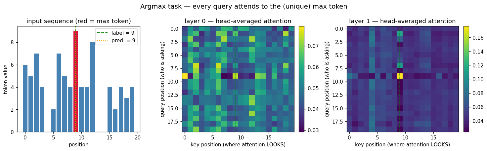
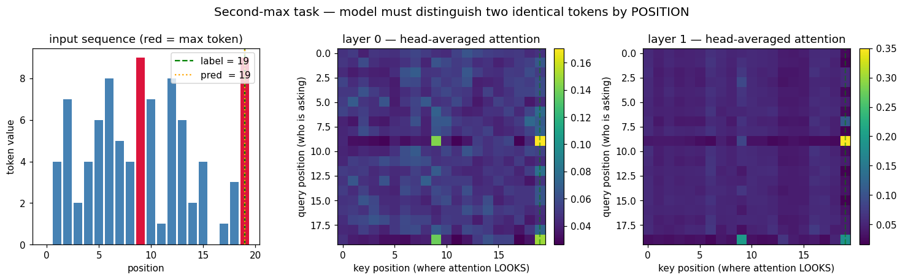

# Machine Learning / Transformer and Sequence Modeling: From Attention to the Encoder

The previous group of notes walked CNNs from LeNet-5 all the way to ResNet. This note switches to Transformers. Attention is not a small tweak on CNN/RNN — it is a fundamentally different sequence-processing operator. So this note starts from motivation, walks through to the encoder block, and lands on a minimal PyTorch reforge with ablations on two synthetic tasks.

Reforge code: [paper-reforge/Transformer](https://github.com/r1skers/paper-reforge/tree/main/Transformer)
Paper: [Attention Is All You Need (Vaswani et al., 2017)](https://arxiv.org/abs/1706.03762)

---

# Abstract

- **Problem**: CNNs use a local receptive field for sequences — long-range dependencies must travel through stacked layers. RNNs process sequentially, compressing long-sequence information into a fixed-size hidden state repeatedly, and cannot be parallelized.
- **Solution**: **Self-attention** lets any two positions in the sequence interact directly, with the interaction being **content-based** (by content similarity) rather than **position-based** (by distance).
- **Building blocks**:
  1. **Scaled dot-product** to keep softmax from saturating
  2. **Multi-head** for parallel learning of different correlation patterns
  3. **Sinusoidal PE** to inject positional information explicitly (attention itself is permutation-equivariant)
  4. **Pre-norm + residual** for stable training of deep stacks (warmup-free)

---

# 1. Motivation: Why We Need Attention

CNNs and RNNs each have their limits on sequences:

| Architecture | Interaction type | Long-range handling | Parallelism |
| --- | --- | --- | --- |
| CNN | local receptive field | stack depth (expand receptive field per layer) | high (conv parallelizable) |
| RNN | sequential bottleneck | step through hidden state | low (sequential dependency) |
| Attention | content-based global | direct any-to-any | high (matmul parallelizable) |

**Core idea**:

> Let any two positions in the sequence interact directly, with the interaction strength determined by their **content**.

CNN is position-based local interaction, RNN is position-based stepwise interaction, attention is **content-based global interaction** — that's the essential difference.

## Soft Lookup Intuition

The cleanest way I find to read attention: think of it as a **soft version of a dictionary lookup**.

Hard lookup (regular dictionary):

```text
Given query q, with (key_i, value_i) pairs in the dictionary.
Find the entry whose key_i == q, return value_i.
```

But continuous vectors cannot be "exactly equal". Soft version:

```text
Compute similarity with every key -> get weights -> weighted average all values.
The output is not a single value, but a weighted mixture of all values.
```

Every token plays **Q (what I want), K (the index of what I can offer), V (the actual content I carry)** simultaneously. Each role is a **separate learnable linear projection** of the same input. That's why it's called **self-attention** — Q/K/V all come from the same input.

---

# 2. Scaled Dot-Product Attention

## The Formula

Let the input be $X \in \mathbb{R}^{n \times d}$. The three role projections:

$$Q = X W_Q \in \mathbb{R}^{n \times d_k},\quad K = X W_K \in \mathbb{R}^{n \times d_k},\quad V = X W_V \in \mathbb{R}^{n \times d_v}$$

Similarity scores (dot product):

$$S = \frac{Q K^\top}{\sqrt{d_k}} \in \mathbb{R}^{n \times n}$$

$S[i, j]$ is the similarity between the query at position $i$ and the key at position $j$.

Row-wise softmax:

$$A = \mathrm{softmax}_{\text{row}}(S) \in \mathbb{R}^{n \times n}$$

Each row sums to 1 — a probability distribution: "how much $i$ attends to every $j$".

Weighted values:

$$\mathrm{Attention}(Q, K, V) = A V \in \mathbb{R}^{n \times d_v}$$

Row $i$ of the output = the weighted sum of all values weighted by $A[i, :]$.

## Why Divide by $\sqrt{d_k}$

Intuition: if every component of $q_i, k_j$ is approximately i.i.d. with mean 0 and variance 1, then $\langle q_i, k_j \rangle = \sum_l q_{il} k_{jl}$ is a sum of $d_k$ zero-mean products. Its variance is $\approx d_k$, std $\approx \sqrt{d_k}$.

A larger $d_k$ makes the scores larger in magnitude. softmax(large values) approaches one-hot — gradients saturate and training becomes unstable or simply cannot make progress.

Dividing by $\sqrt{d_k}$ pulls the score std back to $\sim 1$, keeping softmax outputs "soft" and gradients healthy.

> **Dividing by $\sqrt{d_k}$ prevents softmax from degenerating into argmax as the dimension grows.** This is an optimization issue, not an overfitting one.

I ran a small ablation: random weights, three $d_k$ settings, measuring the attention matrix "sharpness" (the mean of the per-row max attention weight). Result (from the ablation in `attention_numpy.py`):

```text
   d_k | with sqrt(d_k) | no sqrt(d_k)
   ---------------------------------------
     4 |     0.579      |     0.763
    64 |     0.438      |     0.882
   512 |     0.585      |     1.000   <- saturated
```

Without $\sqrt{d_k}$, at $d_k=512$ the attention degenerates into one-hot. With it, the sharpness stays between 0.4 and 0.6 regardless of $d_k$.

---

# 3. Multi-Head Attention

## Why

A single attention head can only learn **one** correlation pattern. But dependencies in language and vision are multi-relational — the same token may simultaneously need syntactic, semantic, and locality relations. Forcing all of these into a single distribution makes them interfere with each other.

Multi-head idea:

> Run $h$ independent attentions in parallel, each in a different subspace learning a different correlation pattern, then merge them.

## Shapes

Let $d_{\text{model}} = 8$, $h = 2$, so $d_k = d_v = d_{\text{model}} / h = 4$.

```text
X                 : (n, 8)
W_Q^(i)           : (8, 4)            for i = 1..h
Q^(i) = X W_Q^(i) : (n, 4)            K^(i), V^(i) similarly

head_i = softmax(Q^(i) K^(i)^T / sqrt(d_k)) V^(i)  : (n, 4)

concat(head_1, head_2)            : (n, 8)     = (n, h * d_v)

W_O                                : (8, 8)
Output = concat(...) W_O           : (n, 8)    back to d_model
```

Two key points:
1. **$d_k = d_{\text{model}}/h$ is a parameter-count convention** — it keeps the total parameter count roughly equal to a single-head version. Not mathematically required.
2. **$W_O$ is mandatory** — geometrically, concat is "block-independent" (dimensions $0..d_k$ come from head 1, $d_k..2d_k$ from head 2). Without $W_O$ the heads cannot share information. $W_O$ is a $(d_{\text{model}}, d_{\text{model}})$ learnable linear that **mixes** the $h$ heads.

## Implementation Trick: One Big Projection + Reshape

In practice we never instantiate $h$ separate $W_Q$ matrices. Instead, **one big projection** `W_Q : (d_model, d_model)` is applied, then we reshape to `(n, h, d_k)` and transpose to `(h, n, d_k)`, and run all $h$ attentions in **parallel**.

PyTorch with batch dim B:

```python
# self.W_Q = nn.Linear(d_model, d_model, bias=False)
Q = self.W_Q(x)                                  # (B, n, d_model)
Q = Q.reshape(B, n, h, d_k).transpose(1, 2)      # (B, h, n, d_k)
# K, V similarly
S = Q @ K.transpose(-2, -1) / math.sqrt(d_k)     # (B, h, n, n)
attn = F.softmax(S, dim=-1)
head_out = attn @ V                              # (B, h, n, d_k)
output = head_out.transpose(1, 2).reshape(B, n, d_model)
output = self.W_O(output)
```

A few subtleties:
- Use `.transpose(-2, -1)`, not `.T` — the latter reverses all axes and breaks on 3D/4D tensors.
- Use `.reshape()`, not `.view()` — `view` requires contiguous storage, and after `transpose` it usually is not.
- `bias=False` on the Q/K/V projections matches the original paper.

## Numerical Validation

I first wrote a numpy reference (`attention_numpy.py`), then implemented PyTorch's `MultiHeadSelfAttention` (nn.Module). I then **transposed the numpy $W_Q$ and copied it into PyTorch's `nn.Linear.weight`** (PyTorch stores weight as `(out, in)`, the transpose of numpy's `(in, out)` convention).

Maximum element-wise difference under float64:

```text
max |out_torch  - out_numpy |  = 6.22e-15
max |attn_torch - attn_numpy|  = 2.22e-16
```

That's the float64 machine-precision floor — **algorithmically bit-equivalent**.

---

# 4. Masking

## Padding Mask

Sequences in a batch have different lengths and are padded to a common length. Attention must not look at padding (it's garbage). The fix: before softmax, set the entire **key column** corresponding to a pad to $-\infty$:

$$S[:, j_{\text{pad}}] \leftarrow -\infty,\quad A = \mathrm{softmax}(S)\implies A[:, j_{\text{pad}}] = 0$$

Because $\mathrm{softmax}(-\infty) = 0$ strictly, and $-\infty$ contributes nothing in the backward pass.

PyTorch:

```python
# mask shape (B, n): True = real, False = pad
m = mask[:, None, None, :]                    # (B, 1, 1, n) broadcasts to (B, h, n, n)
S = S.masked_fill(~m, float('-inf'))
```

**Important detail**: only mask **key columns**, not **query rows**. If a query row has all keys set to $-\infty$, softmax returns $\mathrm{NaN}$ (numerator and denominator both 0). A pad position as a query is not used in the loss anyway — its output can be garbage, but **it must not produce NaNs that poison the whole batch**.

---

# 5. Positional Encoding

## Why

Self-attention is **permutation-equivariant**:

> Permute the tokens and the attention output permutes the same way, but the content is identical — it has no idea which token came first.

But language and vision cannot do without positional information ("dog chases cat" $\neq$ "cat chases dog"). So Transformer must **inject positional information explicitly** into the token embeddings.

## Sinusoidal PE

The original paper:

$$\mathrm{PE}[pos, 2i] = \sin\!\left(\frac{pos}{10000^{2i / d_{\text{model}}}}\right),\quad \mathrm{PE}[pos, 2i+1] = \cos\!\left(\frac{pos}{10000^{2i / d_{\text{model}}}}\right)$$

Even dimensions use sin, odd use cos. Frequencies decay geometrically along the dimension — wavelengths span from $2\pi$ up to $10000 \cdot 2\pi$.

## Three Design Reasons

### (1) Multi-Frequency Encoding

Each (sin, cos) pair corresponds to a single frequency component. Low dim → high frequency (fine-grained positions, neighboring tokens distinguishable); high dim → low frequency (coarse positions, long-range structure).

> The whole $d_{\text{model}}$ dimension is filled with a **geometric decay of frequencies**. This is the Fourier-decomposition idea: position = a superposition of frequency components.

### (2) Relative Positions as a Linear Transform

For any fixed offset $k$, $\mathrm{PE}[pos+k]$ can be written as a **linear transform** of $\mathrm{PE}[pos]$ (via sum-to-product identities).

In matrix form:

$$\begin{bmatrix} \sin(\theta(pos+k)) \\ \cos(\theta(pos+k)) \end{bmatrix} = \begin{bmatrix} \cos(\theta k) & \sin(\theta k) \\ -\sin(\theta k) & \cos(\theta k) \end{bmatrix} \begin{bmatrix} \sin(\theta \cdot pos) \\ \cos(\theta \cdot pos) \end{bmatrix}$$

Each (sin, cos) pair forms a unit vector in a 2D plane, and offset $k$ corresponds to a **rotation by angle** $\theta k$ in that plane.

**Why sin and cos must be paired**: a sole sin doesn't work. $\sin(\theta(pos+k)) = \sin(\theta pos)\cos(\theta k) + \cos(\theta pos)\sin(\theta k)$ — you need an independent $\cos(\theta pos)$ to express the result as a linear transform of $\sin(\theta pos)$. Without cos, the linear relation breaks.

This 2D rotation structure was later pushed all the way in **RoPE (Rotary Position Embedding)** — LLaMA, GPT-NeoX, etc. all use it.

### (3) Extrapolation (in theory)

Because PE is a deterministic function, it can produce values for sequences longer than seen in training. The practical effect is limited, but it is more elegant in principle than learned PE.

## Sinusoidal vs Learned PE

| Scheme | Where used |
| --- | --- |
| Sinusoidal | Original Transformer (2017), buffer (not trained) |
| Learned | BERT, ViT — one `nn.Parameter` vector per position |

ViT actually uses learned PE. The paper tried both and they performed similarly, but learned PE needs a fixed maximum length.

## Implementation: Buffer, Not Parameter

```python
pos = torch.arange(max_len).unsqueeze(1).float()                # (max_len, 1)
div_term = torch.exp(-math.log(10000.0)
                     * torch.arange(0, d_model, 2).float()
                     / d_model)                                  # (d_model/2,)

pe = torch.zeros(max_len, d_model)
pe[:, 0::2] = torch.sin(pos * div_term)
pe[:, 1::2] = torch.cos(pos * div_term)

self.register_buffer('pe', pe)
```

**Two idioms worth flagging**:

1. **Log-space frequency computation**: prefer `torch.exp(-log(10000) * arange / d_model)` over `1 / 10000 ** (...)`. The former is numerically stable and is the standard form in every reference implementation. (`torch.pow(base, x)` internally evaluates to `exp(x * log(base))` for non-integer exponents anyway.)

2. **`register_buffer`, not `nn.Parameter`**: a buffer moves with the model via `.to(device)`, is saved/loaded with `save/load`, but **does not receive gradients**.

   If you accidentally use `nn.Parameter(pe)`, the optimizer will update pe during training, and the sinusoidal table will **drift into some learned thing of its own** — neither pure sinusoidal nor a proper learned PE.

---

# 6. Encoder Block

## Components

- **LayerNorm**: normalizes each sample along the feature dim
- **Residual**: $x + \mathrm{Sublayer}(x)$, from ResNet
- **FFN (Position-wise Feed-Forward)**: a two-layer MLP with ReLU/GeLU in between, $d_{\text{ff}} = 4 d_{\text{model}}$

## LayerNorm vs BatchNorm

Why does Transformer use LN instead of BN?

| Axis | BN | LN |
| --- | --- | --- |
| What statistics depend on | batch dim (across samples, same channel) | feature dim (within a sample) |
| Inference | uses running stats | computes on the fly |
| Variable sequence length | hard | unaffected |
| Small batch size | noisy stats | unaffected |

**The point**: LN normalizes per sample independently — **completely batch-independent**. In NLP, batch sizes are small and sequence lengths vary, so BN's statistical assumptions just don't hold. LN does within-sample, cross-feature normalization (**vertical slice**); BN does cross-sample, same-feature normalization (**horizontal slice**). From an ECE / signal-processing background these are two clearly different ideas.

## Pre-Norm vs Post-Norm

The two arrangements:

```python
# Post-norm (original 2017):
x  = LayerNorm(x + MHA(x))
y  = LayerNorm(x + FFN(x))

# Pre-norm (the modern default, GPT/LLaMA/ViT):
x  = x + MHA(LayerNorm(x))
y  = x + FFN(LayerNorm(x))
```

The difference looks small but the training behavior changes drastically.

**The key is the residual path**:

- Post-norm: after the residual is added, an LN squeezes it. Gradients on the backward pass must pass through LN at every layer; the LN gain/bias scales them. Deep stacks accumulate distortion — **warmup is mandatory** (the original paper uses 4000 warmup steps).
- Pre-norm: LN lives inside the sublayer, and the **residual path is $x \to x + \mathrm{Sublayer}(\mathrm{LN}(x))$ — an identity highway**. Gradients flow from the deepest layer back to the shallow layers without any decay.

> **One-liner**: pre-norm keeps the residual path as identity, giving gradients a **highway** that crosses the whole network undistorted.

Trade-off: pre-norm outputs grow in scale with depth (nothing renormalizes them later), so pre-norm architectures usually add a **final LN** at the very end:

```text
input -> Embedding + PE -> [Block × L] -> final LayerNorm -> output
```

## FFN: Position-Wise Channel Mixing

```text
FFN(x) = activation(x W_1 + b_1) W_2 + b_2
```

- $W_1 \in \mathbb{R}^{d_{\text{model}} \times d_{\text{ff}}}$, $W_2 \in \mathbb{R}^{d_{\text{ff}} \times d_{\text{model}}}$, usually $d_{\text{ff}} = 4 d_{\text{model}}$
- Activation: ReLU (paper) → GeLU (BERT) → SwiGLU (LLaMA) — getting smoother / gated over time
- **Position-wise** means the same MLP is applied to **every position** (shared across the positional dim, nonlinear over the $d_{\text{model}}$ dim within each position)

## Why Attention + FFN Alternate

```text
Attention :  flow of information between tokens   <- token mixing (horizontal)
FFN       :  nonlinearity within each token       <- channel mixing (vertical)
```

- Attention itself is nearly linear (softmax-weighted average). **Its only nonlinearity comes from softmax**, which is a **weak** nonlinearity (essentially a normalizer) — it does not provide universal function approximation.
- FFN does not let positions communicate, but it provides nonlinear capacity within a position.

The alternation = **horizontal communication + vertical nonlinearity**. This is where Transformer's expressive power comes from.

> **Drop the FFN and stack only attention** → you get **rank collapse**: pure attention stacks make token representations converge layer by layer, eventually almost identical across positions. Reference: *Attention is Not All You Need: Pure Attention Loses Rank Doubly Exponentially with Depth* (2021).

---

# 7. The Full Encoder Model

The full encoder-only Transformer:

```text
int tokens (B, n)
    -> nn.Embedding(vocab_size, d_model)         : (B, n, d_model)
    -> [+ SinusoidalPositionalEncoding]           : (B, n, d_model)
    -> N x EncoderBlock                           : (B, n, d_model)
    -> final LayerNorm                            : (B, n, d_model)
    -> task-specific head                         : depends
```

For our "point-to-a-position" task, the head is a **shared `nn.Linear(d_model, 1)`**:

```python
logits = self.score_head(h).squeeze(-1)   # (B, n, d_model) -> (B, n, 1) -> (B, n)
```

This layer is shared (one set of weights for all positions). Each position produces a scalar independently; the resulting `(B, n)` logits are trained with `F.cross_entropy(logits, y)` — treating sequence length $n$ as the number of classes.

**This is a pointer head**: the model doesn't output a class but a distribution over "which input position I'm pointing to". BERT's SQuAD QA head and DETR's query-based detection are built on this idea.

Why is score_head shared rather than per-position?

- **Position invariance**: "am I the answer?" is a content question, not a positional one
- **Generalization**: a shared head transfers to any sequence length
- **Parameter count**: $(d_{\text{model}}, 1)$ vs $(n \cdot d_{\text{model}}, n)$ — hundreds of times fewer parameters

Where does positional info come from? It is already in PE — each position's representation is `token_emb + PE(i) + globally-attended information`. score_head just reads this signature; it's shared but can still discriminate.

---

# 8. Experiment 1: Argmax Position Task

## Task

Input: a length-$n$ integer sequence with values in $[0, V)$, with **exactly one position** holding $V-1$ (a unique max).
Output: the position of that max in $[0, n)$.

Data generation:

```python
# Sample base values < max
x = torch.randint(0, vocab_size - 1, (B, n))
# Pick a random max position per row
y = torch.randint(0, n, (B,))
# Plant the (unique) max via advanced indexing
x[torch.arange(B), y] = vocab_size - 1
```

`x[torch.arange(B), y]` is one of PyTorch's most common **advanced indexing** patterns — **"pick one element per row"**. Equivalent to a for-loop `x[i, y[i]] = ...`, but vectorized.

## Training

Config: `vocab=10, n=20, d_model=32, heads=4, layers=2, lr=1e-3, batch=64, steps=2000`.

```text
device = cpu
model params = 25,569
step    0:  init_loss = 2.9592   init_acc = 0.033   (random baseline ~ 0.050)
step  100:  train_loss = 0.0099   val_loss = 0.0098   val_acc = 1.000
step  200:  train_loss = 0.0044   ...                val_acc = 1.000
...
step 2000:  train_loss = 0.0001   val_loss = 0.0001   val_acc = 1.000
final accuracy = 1.000   total time = 15.7s
```

Two theoretical checkpoints:

1. **init_loss = 2.9592** ≈ $\log(20) = 2.996$. That is exactly the cross-entropy of a uniform distribution over 20 classes — **the experiment matches the theoretical value precisely**, confirming that initialization and the loss computation are correct.
2. **init_acc = 0.033** ≈ $1/n = 0.05$, well within statistical noise.

Convergence is absurdly fast — 100% accuracy in 100 steps. Reason: the task is highly structured and the 25k-param model has plenty of redundant capacity.

## Ablation: All 6 Variants Hit 100%

| variant | use_pe | layers | heads | final_acc | steps_to_95 |
| --- | --- | --- | --- | --- | --- |
| baseline | True  | 2 | 4 | 1.000 | 100 |
| no_pe    | False | 2 | 4 | 1.000 | 100 |
| 1_layer  | True  | 1 | 4 | 1.000 | 100 |
| 4_layers | True  | 4 | 4 | 1.000 | 100 |
| 1_head   | True  | 2 | 1 | 1.000 | 100 |
| 8_heads  | True  | 2 | 8 | 1.000 | 100 |

**Every variant saturates — even `no_pe` is at 100%**. This actually exposed a misconception of mine: I thought "since the output is an index, PE must be necessary". Actually:

> This task is **content-addressable** (find "the one with value 9"), not **position-addressable**. All the model needs is to recognize "my content is 9" — it doesn't need to know which position it is. **Position information is implicit in the (B, n) output layout, not required from PE**.

**Methodological lesson on ablation**:

> If every variant works, the model is probably not particularly robust — the task simply isn't saturating the model. The signal lives at the capacity boundary.

Compare with Stage-1 ResNet: plain20 vs resnet20 on CIFAR-10 are close. The real gap appears in plain56 vs resnet56 — depth has to push the degradation issue to the surface.

---

# 9. Experiment 2: Second-Max Position Task (Forces PE)

## Task

To genuinely force PE necessity, change the task to:

> The sequence has **two identical max tokens** (positions $p_1 < p_2$, both with value $V-1$). Output **$p_2$** — the second occurrence.

Data generation:

```python
# Base values < max
x = torch.randint(0, vocab_size - 1, (B, n))
# Pick two distinct positions per row via the argsort-of-random trick
rand_scores = torch.rand(B, n)
perm = rand_scores.argsort(dim=-1)             # a random permutation per row
pos = perm[:, :2]                              # take the first two
pos, _ = pos.sort(dim=-1)                      # sort so that p1 < p2
p1, p2 = pos[:, 0], pos[:, 1]

# Plant identical max at both positions
batch_idx = torch.arange(B)
x[batch_idx, p1] = vocab_size - 1
x[batch_idx, p2] = vocab_size - 1
return x, p2                                   # label = p2
```

**Key idiom**: `argsort(torch.rand(B, n), dim=-1)` is a batched random permutation. `torch.randperm` is single-row only; this trick gives $B$ independent permutations in one shot.

## Why This Task **Requires** PE

At the two max positions:

- The token embeddings are strictly equal (same token id)
- Without PE: their queries are strictly equal, K/V too → attention outputs strictly equal
- score_head is a shared linear → **scores at both positions are strictly equal**
- `argmax(logits)` breaks ties by returning the **lower** index in PyTorch → always predicts $p_1$
- But ground truth is $p_2$ → accuracy = **strictly 0**

It must fail mathematically — not just "statistically close to 0".

## Ablation Results

| variant | use_pe | layers | heads | **final_acc** | steps_to_95 |
| --- | --- | --- | --- | --- | --- |
| baseline | True  | 2 | 4 | **1.000** | 100 |
| **no_pe**    | **False** | 2 | 4 | **0.000** | **----** |
| 1_layer  | True  | 1 | 4 | 1.000 | 100 |
| 4_layers | True  | 4 | 4 | 1.000 | 100 |
| 1_head   | True  | 2 | 1 | 1.000 | 100 |
| 8_heads  | True  | 2 | 8 | 1.000 | 100 |

**`no_pe` is exactly 0.000**; every other config hits 100%. **The PE-necessity prediction reasoned out conceptually shows up in the code precisely.**

---

# 10. Attention Visualization

Run a trained model on a sample sequence and capture the attention matrix from each EncoderBlock's `self.attn` via **forward hooks**:

```python
captured = {}
def make_hook(idx):
    def hook(module, inputs, outputs):
        captured[idx] = outputs[1].detach().cpu()   # outputs = (out, attn)
    return hook

for i, block in enumerate(model.blocks):
    block.attn.register_forward_hook(make_hook(i))

model.eval()
with torch.no_grad():
    logits = model(x)
# captured[0], captured[1] hold per-block attention weights, shape (B, h, n, n)
```

## Attention on the Argmax Task



- **Left**: input sequence (red bar = max token at position 9, green dashed = label = 9, orange dotted = pred = 9)
- **Middle**: layer 0 head-averaged attention — fairly uniform colors; the model is still "feeling around"
- **Right**: layer 1 head-averaged attention — **a bright vertical stripe at column 9** — every query is heavily attending to key position 9

**How to read this**: the y-axis is the query position ("who is asking"), the x-axis is the key position ("where is it looking"). Each **row** is a query's softmax distribution (sums to 1). A vertical bright stripe means **every row** lights up at the same column — "the whole class is looking at student #9's answer".

## Attention on the Second-Max Task



- **Left**: two red bars (positions 9 and 19), label = 19, pred = 19
- **Middle**: layer 0 shows two attention hotspots (both max positions are detected)
- **Right**: layer 1 has **a strong vertical stripe at column 19, and column 9 is dim** — the model has explicitly chosen the second max

**Same architecture, same training schedule, the only change is the task switching from "find the unique max" to "find the second max"** — the attention pattern moves from "stripe at the max" to "stripe at the second max".

The layer-to-layer evolution is also worth noting: layer 0 messy → layer 1 focused. This is the canonical Transformer multilayer picture — **deeper layers refine, shallow layers do the broad scan**.

## Attention Map vs Logits Are Two Different Things

Worth keeping straight:
- **Attention map**: information flow (which positions pass signals to which)
- **score_head output (logits)**: decision (which position wins)

---

# 11. Wrap-Up

## Idiom Checklist

PyTorch idioms I picked up in this module:

- **Stable softmax**: `exp(x - x.max(dim=-1, keepdims=True))` to avoid overflow
- **Multi-head reshape**: `(B, n, d_model) -> (B, n, h, d_k) -> (B, h, n, d_k)` — reshape first, then transpose
- **Batched transpose**: `.transpose(-2, -1)`, not `.T` (which reverses all axes)
- **Safe reshape**: use `.reshape()` after a transpose, not `.view()`
- **Mask broadcast**: `mask[:, None, None, :]` → `(B, 1, 1, n)`, broadcasts across head and query dims
- **`masked_fill(~m, -inf)`** — note the mask direction (True = keep)
- **`register_buffer` instead of `nn.Parameter`** for a fixed PE table
- **`@torch.no_grad()` decorator** for eval functions
- **`F.cross_entropy(logits, y)`** + the three-step `zero_grad / backward / step`
- **`model.token_emb.weight.grad` non-zero** = the autograd chain is intact
- **Forward hook** for capturing intermediate tensors without modifying the model
- **`x[torch.arange(B), y]` advanced indexing**: "pick one element per row"
- **`argsort(torch.rand(B, n))`** as a batched random permutation

## Concept Checklist

- Attention is **content-based global interaction**, while CNN/RNN are **position-based**
- The `/sqrt(d_k)` factor prevents softmax saturation — not overfitting
- $W_O$ in multi-head is the mixer; it cannot be dropped
- Sinusoidal PE's sin/cos pairing forms a **2D rotation** — the precursor to RoPE
- Pre-norm's **identity highway** is what makes deep stacks stable
- **Attention communicates, FFN thinks** — the nonlinearity comes from FFN
- BN normalizes across samples (horizontal); LN normalizes within a sample (vertical)
- Ablation methodology: **if all variants work**, the task is not saturating the model

---

# Reforge Repository

Full code: [github.com/r1skers/paper-reforge/tree/main/Transformer](https://github.com/r1skers/paper-reforge/tree/main/Transformer)

```
Transformer/
├── src/
│   ├── attention_numpy.py       <- numpy reference (gold standard)
│   ├── attention.py             <- MultiHeadSelfAttention (PyTorch nn.Module)
│   ├── positional_encoding.py   <- SinusoidalPositionalEncoding
│   ├── transformer_block.py     <- PositionWiseFFN + EncoderBlock (pre-norm)
│   ├── model.py                 <- ArgmaxPositionModel (full encoder + pointer head)
│   └── data.py                  <- gen_argmax_batch + gen_second_max_batch
├── tests/                       <- tests, 100% green
└── experiments/
    ├── train.py                 <- training script
    ├── ablation.py              <- argmax ablation
    ├── ablation_second_max.py   <- second-max ablation (PE-necessity evidence)
    └── visualize_attention.py   <- attention visualization
```
