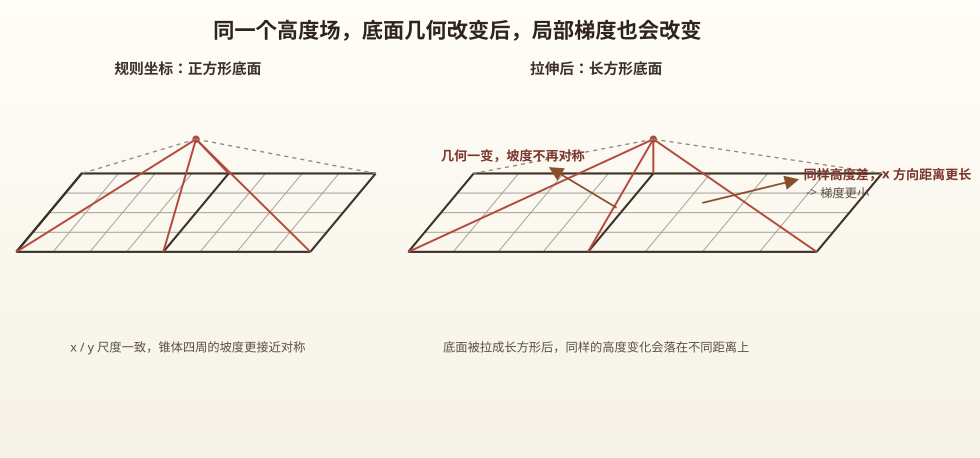

# Part 1：问题背景与空间场构造

这一组“计算科学与高可靠系统设计”笔记，会以项目 `orogeny-inversion-validation-lab` 为主实例，
顺着它的实际 pipeline，把一个计算问题从

**初始场构造 -> 网格几何 -> forward 求解 -> 观测生成 -> 参数反演 -> 验证评估**

这条链完整走一遍。

## 1. 背景问题设计

这里先不急着写离散公式，而是先把问题对象定下来：  
我们希望构建一个二维地形图，并让它随时间演化，用来模拟一个简化的地形扩散过程。

## 2.场构造

接下来先把最基本的空间对象构造出来。

### 2.1.最普通的二维地形

最自然的起点，是先构建一个类似直角坐标系的规则网格。  
这时每个位置都可以写成 $(x,y)$，再给它配一个高度值 $h$，就得到 $(x,y,h)$。  

直观上，这表示的是：某个空间位置，以及这个位置对应的地形高度。  
在项目里，`build_base_terrain.py` 做的就是这一步，先生成一张规则网格上的初始地形图。

### 2.2.复杂变化：不规则坐标

如果一直停留在规则网格上，那么每个格点之间的距离都默认相同。  
但真实地形对应的空间几何往往不会这么整齐，所以项目里又补了一步：  
在保留同一个 $h$ 的前提下，重新生成一套非均匀坐标。  

也就是说，变化的不是地形值本身，而是这些地形值落在空间中的位置。  
这一步可以理解成：同一个 $h$，从原来的规则坐标，重新映射到一套非均匀物理坐标上。  

这样一来，相邻点之间的距离就不再统一，后面计算梯度、通量时，几何就会真正参与进来。

### 2.3.观念变化：时间加入导致的静态量变为变化量

如果只把 $(x,y,h)$ 看成一张静态地形图，那么我们关注的只是“某一点有多高”。  
但一旦目标变成“地形随时间如何变化”，问题就变了。  

这时我们不能再只把某个离散点看成一个孤立的值，而要把它看成一个会和周围交换的局部区域。  
也正因为如此，后面真正进入 forward solver 时，必须开始关注：

- 梯度：因为距离变了以后，同样的高度差会对应不同的坡度；
- 通量：因为上下左右会通过边界交换“量”；
- control volume：因为这些交换量最终要落到一个具体的小区域上；
- 边界条件：因为系统与外界是否交换，也会影响整体演化。

所以 Part 1 到这里真正完成的是一件事：  
先把后面整个计算过程真正依赖的空间对象和几何直觉立住。  
