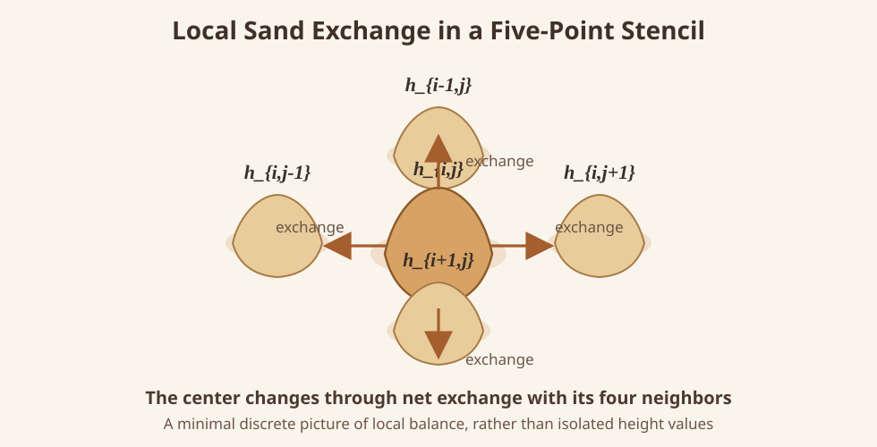

# Part 2: From Terrain to Temporal Evolution

The main point of Part 2 is simple: we are no longer describing a terrain as a static object, but as a field that changes over time.

By the end of Part 1, we already have a computable spatial object:

- the initial height field `h0`
- the physical coordinates `x_coords` and `y_coords`

At this point, the question shifts from "what does the terrain look like?" to "how will this terrain change next?"

## 1. A Static Terrain Becomes an Initial Condition

In Part 1, `h0` was still an initial terrain map.  
In Part 2, it becomes the initial condition of the PDE:

$$
h(x,y,0)=h_0(x,y)
$$

In other words, `h0` now represents the state of the system at `t=0`.

## 2. Adding an Evolution Law

An initial terrain alone is not enough.  
We also need to tell the system why it changes, and according to what law.  
The project uses

$$
\frac{\partial h}{\partial t} = \nabla \cdot \left( \kappa(x,y)\,\nabla h \right)
$$

where:

- $h(x,y,t)$ is the time-dependent height field;
- $\kappa(x,y)$ is the spatially varying diffusion strength;
- the equation specifies how the height field evolves once the initial terrain and $\kappa(x,y)$ are given.

If we ignore the formal details for a moment, this is simply a local diffusion process:  
higher regions spread toward lower regions, while the speed of that spreading is controlled by $\kappa$.

## 3. A Change in View: Temporal Evolution as Local Balance

At this point, the focus is no longer how high a point is, but how much it exchanges with the surrounding region during one time step.

That means a discrete point is no longer treated as an isolated value.  
Instead, it is treated as a local region that exchanges with its four neighbors.  
Once we draw a boundary around such a region, the question naturally becomes:

**how much quantity crosses the boundary of this region?**

That is why flux, control volumes, and boundary conditions appear later.  
Time evolution can be written as an update rule precisely because we are doing local balance accounting.

## 4. Gradient, $\kappa$, and Flux

Using a sand-flow picture, the gradient tells us where the surface is steeper and in which direction material tends to move.  
$\kappa$ describes how responsive that local region is to such motion, or how easily diffusion happens there.

So a useful first memory aid is:

- the gradient determines the tendency to flow;
- $\kappa$ determines the efficiency of that flow.

From this viewpoint, the flux across a face can be roughly understood as "$\kappa$ times slope":

$$
q \sim -\,\kappa \nabla h
$$

The minus sign just means that the flow goes toward lower height.  
This is also why geometry is no longer only background information in Part 2: different distances change the gradient, different gradients change the flux, and the flux changes the next state.

## 5. From One Update to a Full Trajectory

What the forward solver actually does can be compressed into a direct chain:

1. read the current `h`;
2. combine it with `x_coords`, `y_coords`, and $\kappa(x,y)$ to estimate local exchanges;
3. compute the net inflow and outflow;
4. obtain the next height field;
5. repeat to form

$$
h^0,\ h^1,\ h^2,\ \dots,\ h^N
$$

Only at this point does a static terrain map become a temporal trajectory.  
That trajectory is the truth used later for observation generation and parameter inversion.

## 6. CFL: Checking Whether the Timeline Can Be Marched Safely

Because the project uses explicit time marching, the step size `dt` cannot be chosen arbitrarily.  
If one step is too large, the numerical solution may become unstable immediately, and the entire trajectory loses credibility.

So before marching forward, the solver must check the CFL condition.  
This usually depends on:

- the maximum diffusion strength $\kappa_{\max}$
- the smallest grid scales $dx_{\min}$ and $dy_{\min}$

The reason is intuitive: the most dangerous region is where diffusion is strongest and the mesh is finest.  
Only after confirming that the combination $h0 + \kappa + geometry$ can be marched stably does the forward trajectory become meaningful.
