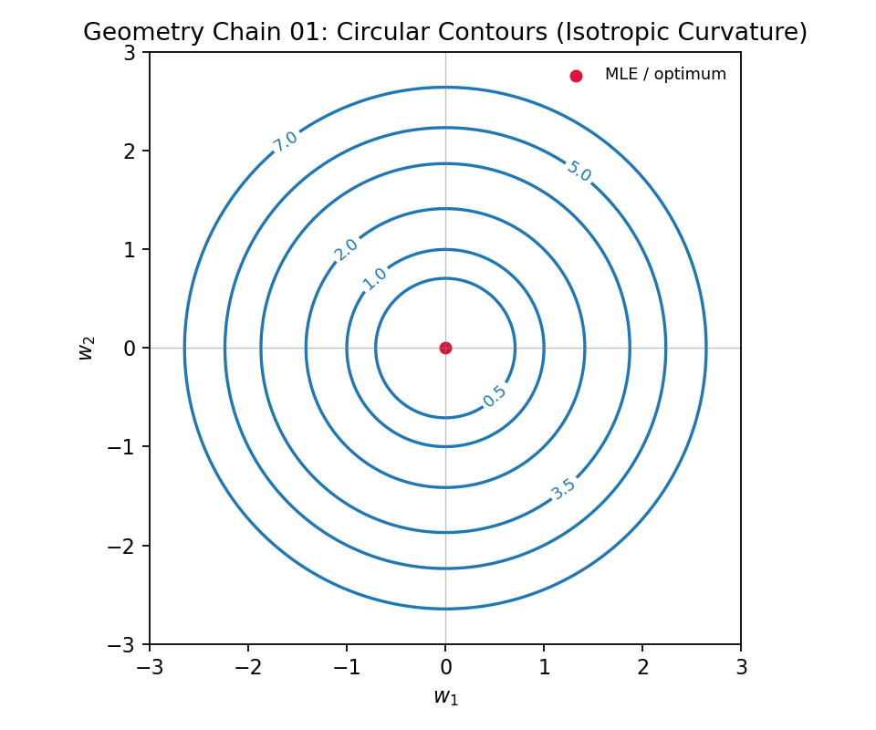

---
date: '2026-03-04T21:00:00+09:00'
draft: false
title: 'Linear Algebra Part 1: Singular Matrices and Parameter Identifiability'
summary: "Starting from singular matrices, this note builds the chain from likelihood and MLE to Hessian/FIM diagnostics, profile likelihood verification, and sensitivity-based inversion workflow."
description: "A practical note linking singular matrices, likelihood geometry, identifiability diagnostics, and inversion workflow."
tags: ["Linear Algebra", "Singular Matrix", "Identifiability", "FIM", "Profile Likelihood", "Sensitivity Analysis", "Inverse Problem"]
categories: ["Crucible"]
---

# Linear Algebra Part 1: Singular Matrices and Parameter Identifiability

Main idea: a singular matrix is not just “non-invertible.” In parameter estimation, it means information gaps, and eventually unidentifiability.

---

## 0. Parameter-Space Matrix View

Let the parameter vector be

$$
\theta=[\theta_1,\theta_2,\dots,\theta_p]^\top\in\mathbb{R}^p
$$

Parameter estimation searches an optimum in parameter space and uses matrices to describe local geometry near that point.

A standard local quadratic form is

$$
\Delta f \approx \frac12\,\Delta\theta^\top H(\theta)\,\Delta\theta
$$

where $H$ is the Hessian and $\Delta\theta$ is a parameter perturbation.

---

## 1. Singular Matrix: Definition and Intuition

For a square matrix $A\in\mathbb{R}^{n\times n}$, the following are equivalent:

1. $\det(A)=0$.
2. $\mathrm{rank}(A)\lt n$.
3. There exists nonzero $v$ such that $Av=0$ (nontrivial null space).
4. $A^{-1}$ does not exist.

A concrete $3\times3$ example:

$$
A=
\begin{bmatrix}
1 & 2 & 3\\
2 & 4 & 6\\
1 & 1 & 1
\end{bmatrix}
$$

Row 2 is twice row 1, so rows are linearly dependent; therefore $\mathrm{rank}(A)=2\lt 3$ and $\det(A)=0$.

Geometrically, at least one direction is flattened, i.e., information-dimension loss.

---

## 2. Likelihood Function

Distinction:

- Probability: parameters $\theta$ are fixed, data $y$ are random.
- Likelihood: data $y$ are fixed (already observed), parameters $\theta$ are variable.

Formally:

$$
\mathcal{L}(\theta)=p\!\left(y^{\mathrm{obs}}\mid\theta\right)
$$

Under Gaussian-noise approximation, maximizing likelihood is equivalent to minimizing NLL:

$$
-\log \mathcal{L}(\theta)
\propto
\frac{1}{2}\sum_i\big(y_i^{\mathrm{obs}}-y_i(\theta)\big)^2
$$

This directly prepares the Hessian view in 3.1.

## 3. Maximum Likelihood Estimation (MLE)

Given likelihood, first locate the summit (optimal point):

$$
\begin{aligned}
\hat{\theta}_{\mathrm{MLE}}
&= \arg\max_\theta \mathcal{L}(\theta) \\
&= \arg\min_\theta \big(-\log\mathcal{L}(\theta)\big)
\end{aligned}
$$

First-order optimality:

$$
\nabla_\theta \log\mathcal{L}(\hat{\theta}) = 0
\quad
\text{(equivalently)}
\quad
\nabla_\theta \mathrm{NLL}(\hat{\theta}) = 0
$$

First-order tells location only. Reliability needs second-order information.

### 3.1 Hessian and Its Link to Likelihood

Hessian is the second-order coefficient matrix controlling local curvature.

$$
f(\theta)\approx f(\theta_0)+\nabla f(\theta_0)^\top(\theta-\theta_0)+\frac12(\theta-\theta_0)^\top H(\theta_0)(\theta-\theta_0)
$$

If $f$ is NLL, Hessian quantifies how sharply or flatly likelihood changes with parameters.

$$
H(\theta)=\nabla_\theta^2 f(\theta),\qquad
H_{ij}=\frac{\partial^2 f}{\partial\theta_i\partial\theta_j}
$$

In 2D:

$$
H=
\begin{bmatrix}
\frac{\partial^2 f}{\partial x^2} & \frac{\partial^2 f}{\partial x\partial y}\\
\frac{\partial^2 f}{\partial y\partial x} & \frac{\partial^2 f}{\partial y^2}
\end{bmatrix}
$$

Directional curvature:

$$
\kappa_v=v^\top H v
$$

Unified interpretation (principal direction = eigenvector, principal curvature = eigenvalue):

1. Large eigenvalue: sharper direction, stronger constraint.
2. Small eigenvalue: flatter direction, weaker constraint.
3. Zero or near-zero eigenvalue: near-flat valley, weak or non-identifiable direction.

### 3.2 FIM: Credibility in Expectation

Hessian is local curvature from one dataset/trajectory; FIM is expected curvature over the data distribution:

$$
I(\theta)=-\mathbb{E}\!\left[\nabla_\theta^2\log p(y\mid\theta)\right].
$$

So FIM is an average credibility measure across multiple trajectories/observations under the same physical setting.

### 3.3 Unreliable Cases (Alarm Conditions)

Practical alarm rules:

1. Near-zero minimum eigenvalue:

$$
\lambda_{\min}(H)\approx 0
\quad \text{or} \quad
\lambda_{\min}(I)\approx 0
$$

2. Large condition number:

$$
\kappa(H)=\frac{\lambda_{\max}(H)}{\lambda_{\min}(H)}
\quad \text{or} \quad
\kappa(I)=\frac{\lambda_{\max}(I)}{\lambda_{\min}(I)}
$$

If $\kappa$ is huge (e.g., $10^6\sim10^8$), the problem is ill-conditioned and noise-sensitive.

3. Covariance inflation:

$$
\mathrm{Cov}(\hat{\theta})\approx H^{-1}
\quad \text{or} \quad
\mathrm{Cov}(\hat{\theta})\approx I^{-1}
$$

Large diagonal terms indicate high uncertainty and low trust.

In short: Hessian/FIM raise alarms; profile likelihood verifies.

### 3.4 Profile Likelihood: Verify True Unidentifiability

Alarm signals are local diagnostics. Local pathology does not always mean global unidentifiability.

Core purpose:
**check whether a parameter can be compensated by others over a broad range, i.e., effectively unidentifiable.**

Fix $\theta_i$, optimize the rest:

$$
\mathrm{PL}(\theta_i)=\min_{\theta_{-i}}\ \mathcal{L}(\theta_i,\theta_{-i})
$$

Reading rules:
1. Flat over a wide interval: weak or non-identifiable.
2. Clear basin with rising sides: typically identifiable.

### 3.5 Sensitivity Analysis: Who Drives the Output

If Hessian/FIM and profile likelihood answer “can we identify,” sensitivity answers “which parameters are worth prioritizing.”

#### 3.5.1 Local Sensitivity

$$
S_{ij}=\frac{\partial y_i}{\partial \theta_j}\cdot\frac{\theta_j}{y_i}
$$

Larger $|S_{ij}|$ means stronger output response; persistently small $|S_{ij}|$ usually implies harder reliable identification.

#### 3.5.2 Global Sensitivity (Brief)

When nonlinearity is strong, add global methods (e.g., Morris/Sobol) to evaluate average contribution and interaction over the feasible range.

Practical loop:
first filter insensitive parameters, then do Hessian/FIM alarms and profile-likelihood verification on key parameters.

---

## Appendix: Practical Inversion Workflow

1. Define inversion setup: parameters $\theta$, observations $y^{\mathrm{obs}}$, objective $J(\theta)$, and bounds.
2. Run sensitivity first to reduce dimension.
3. Run FIM/Hessian diagnostics near initial points.
4. If alarms appear, verify with profile likelihood.
5. Perform optimization (GD / L-BFGS-B, with constraints/regularization).
6. Post-check residual quality, interval stability, and multi-start consistency.

Summary:
**Sensitivity filter -> FIM alarm -> profile verification -> optimization.**

---

## Appendix: Geometry Chain

### Figure 1: Circular Contours (Isotropic Curvature)

This is a local paraboloid-like summit:
$f=w_1^2+w_2^2$, with constant Hessian $H=2I$ (nonzero), same curvature in all directions.

### Figure 2: Tilted Elliptic Contours (Parameter Coupling)

A coupled quadratic form:

$$
f(w_1,w_2)=a\,w_1^2+b\,w_1w_2+c\,w_2^2
$$

The cross term $w_1w_2$ (coefficient $b$) is the coupling source. If $b\neq 0$, effects can be partially compensated and contours rotate.

$$
H=
\begin{bmatrix}
2a & b\\
b & 2c
\end{bmatrix}
$$

Eigenvectors define principal directions, eigenvalues define directional curvature:
small eigenvalue -> flatter long axis, large eigenvalue -> steeper short axis.

### Figure 3: Near-Degenerate Valley (Near-Singular)

When one eigenvalue is very small ($\lambda\approx 0$), contours stretch heavily into an almost flat valley.
If it reaches $\lambda=0$, singular behavior appears: no curvature in that direction, information collapse, and near-zero output response along that direction.

### Figure 4: Profile Likelihood as 1D Projection

This figure is directly linked to Figure 3:
left panel selects points on the valley line; gray dashed links map them to profile values on the right.
The right curve is a 1D compression of the 2D landscape under “fix $\theta_i$, optimize the others.”

Reading rules:
1. Sharp/narrow profile: strong identifiability.
2. Wide/flat profile: weak identifiability.
3. Near-horizontal profile: near-unidentifiable range.
