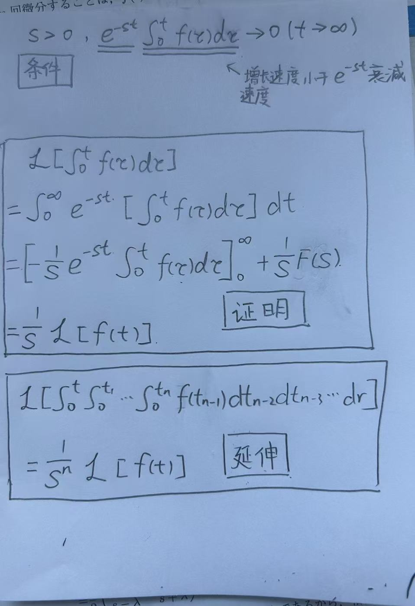
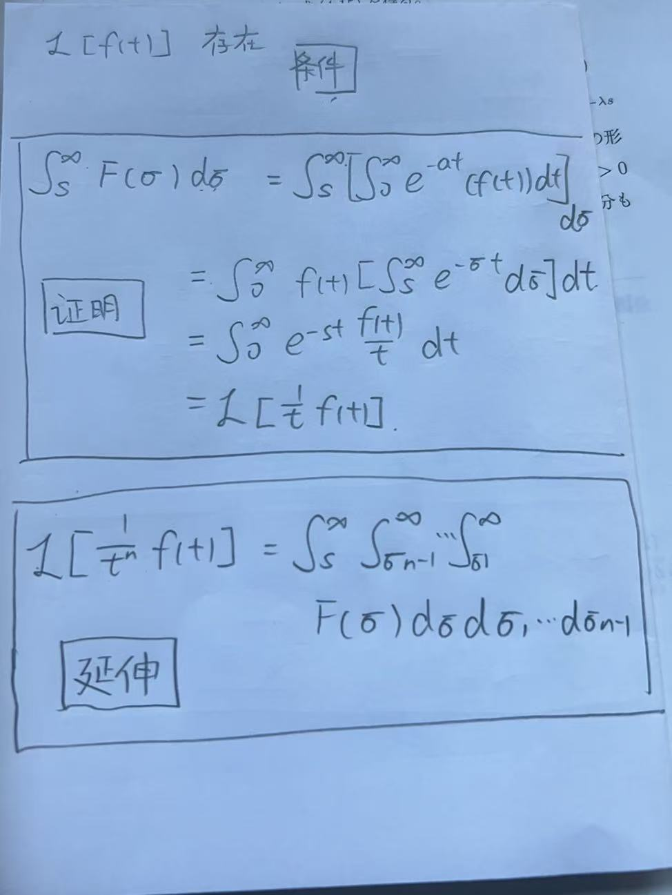

---
date: '2025-11-12T10:17:00+09:00'
draft: false
title: '线性系统第2部分：拉普拉斯变换'
summary: "整理拉普拉斯变换的分析式、逆变换、核心性质与常用变换对，并用于后续电路与系统求解。"
tags: [ "Laplace Transform", "Convolution", "Sampling", "Signal & Systems"]
categories: ["Crucible"]
---

# 拉普拉斯变换

---

## 分析公式

$$F(s) =\mathcal{L}[f(t)] = \int_{0}^{\infty} e^{-st} f(t)dt$$

## 合成公式

$$f(t) = \mathcal{L}^{-1}[F(s)] = \frac{1}{2\pi j} \int_{\gamma - j\infty}^{\gamma + j\infty} e^{st} F(s)ds$$

## 拉普拉斯变换性质

### 基本性质

#### 线性性质

$$\mathcal{L}[{a \cdot f(t) + b \cdot g(t)}] = a \cdot F(s) + b \cdot G(s)$$

***

#### 缩放性质

$$\mathcal{L}[{f(a \cdot t)}] = \frac{1}{|a|} \cdot F\left(\frac{s}{a}\right)$$

### 常见进阶性质

#### 时域微分（t）

$$\mathcal{L}\left[ f'(t) \right] = s\mathcal{L}[f(t)] - f(0)$$
  

***

#### 时域积分（t）

$$\mathcal{L}\left[ \int_{0}^{t} f(\tau) d\tau \right] = \frac{1}{s}\mathcal{L}[f(t)]$$
  

***

#### 频域微分（s）

$$\frac{d}{ds} \mathcal{L}[f(t)] = \mathcal{L}\left[ -tf(t) \right] $$
  

***

#### 频域积分（s）

$$\mathcal{L}\left[ \frac{1}{t}f(t) \right] = \int_{s}^{\infty} F(\sigma) d\sigma$$
  

***

#### 时域平移（t）

$$\mathcal{L}\left[ f(t-\lambda) u(t-\lambda) \right] = e^{-\lambda s} \mathcal{L}[f(t)]$$

***

#### 频域平移（s）

$$\mathcal{L}\left[ e^{\sigma t} f(t) \right] = F(s-\sigma)$$

## 常用变换对

| $f(t)$ | $F(s)$ |
|---|---|
| $1$ | $\dfrac{1}{s}$ |
| $t^n\ (n=0,1,2,\dots)$ | $\dfrac{n!}{s^{n+1}}$ |
| $e^{at}$ | $\dfrac{1}{s-a}$ |
| $\sin(bt)$ | $\dfrac{b}{s^2+b^2}$ |
| $\cos(bt)$ | $\dfrac{s}{s^2+b^2}$ |
| $\sinh(bt)$ | $\dfrac{b}{s^2-b^2}$ |
| $\cosh(bt)$ | $\dfrac{s}{s^2-b^2}$ |
| $e^{at}\sin(bt)$ | $\dfrac{b}{(s-a)^2+b^2}$ |
| $e^{at}\cos(bt)$ | $\dfrac{s-a}{(s-a)^2+b^2}$ |
| $u(t-a)$ | $\dfrac{e^{-as}}{s}$ |
| $(t-a)u(t-a)$ | $\dfrac{e^{-as}}{s^2}$ |
| $\delta(t)$ | $1$ |
| $\delta(t-a)$ | $e^{-as}$ |

## 练习

### 1. 拉普拉斯变换练习

[基本拉普拉斯变换练习](基本拉普拉斯变换练习.pdf)  
[拉普拉斯逆变换及实际应用](拉普拉斯逆变换及实际应用.pdf)  
[较复杂拉普拉斯应用](较复杂拉普拉斯应用.pdf)
