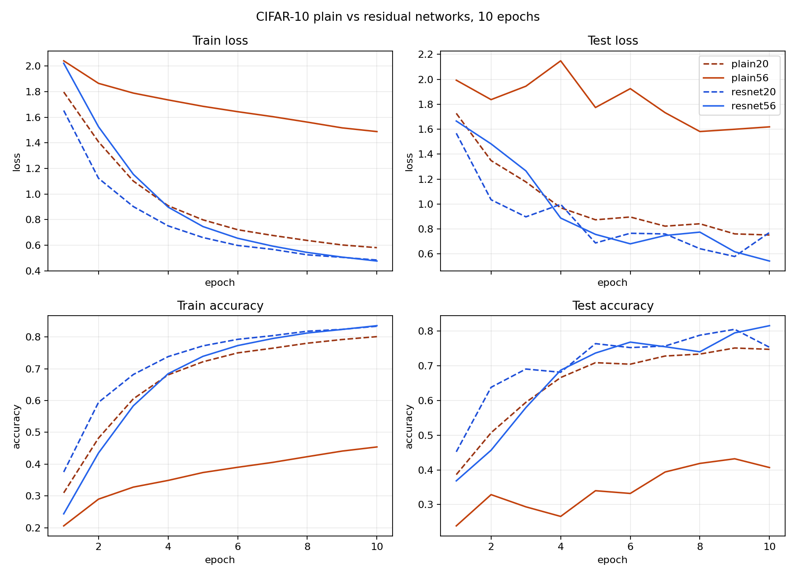

# Machine Learning / CNN and Visual Representation: ResNet, Residual Learning and the Degradation Problem

Paper: [Deep Residual Learning for Image Recognition](https://arxiv.org/abs/1512.03385)

Code and experiment notes: `paper-reforge/ResNet`

## Before Starting

VGG showed an important direction:

```text
deeper and more regular CNNs can learn stronger visual representations.
```

But there is a problem:

```text
If we keep making a plain CNN deeper, will training always get better?
```

ResNet's answer is: not necessarily.

A deeper plain network may not only perform worse on the test set. It may even fail to fit the training set well. This is not ordinary overfitting. It is the degradation problem described in the paper.

## What ResNet Tries to Solve

The first thing to separate is overfitting from degradation.

Overfitting usually means:

```text
high train accuracy
low test accuracy
```

The model memorizes the training set but does not generalize well.

The degradation problem in ResNet is different:

```text
when the network becomes deeper
train error becomes higher
test error also becomes higher
```

In other words, the model does not even fit the training set well.

This is counterintuitive. A deeper network should theoretically be able to imitate a shallower one:

```text
earlier layers work normally
extra layers learn identity mappings
```

Then it should at least not be worse than the shallow network.

But in a plain network, it is not easy for a stack of convolution, BN, and ReLU layers to learn `H(x)=x` by itself. As depth increases, existing features are easier to disturb, and gradients must travel through a longer path.

## Residual Learning: Learning a Correction

The method proposed in the paper is residual learning.

A normal block directly learns a mapping:

```text
x -> H(x)
```

ResNet changes this to:

```text
H(x) = F(x) + x
```

So the convolution branch learns:

```text
F(x) = H(x) - x
```

Here `x` is an intermediate feature map. `F(x)` is the correction produced by the residual branch.

If a block really needs to change the features, `F(x)` can learn a useful nonzero transformation.

If a block temporarily does not need to change the features, it only needs:

```text
F(x) ≈ 0
```

Then:

```text
H(x) ≈ x
```

This is easier than asking a plain block to directly learn the full identity mapping.

In code, the core is:

```python
out = self.residual(x)
out = out + self.shortcut(x)
return self.relu(out)
```

## CIFAR-style ResNet Architecture

The paper uses a simple architecture on CIFAR-10. The input is:

```text
32 x 32 x 3
```

The first layer is:

```text
3x3 conv, 16 channels
```

Then there are three stages:

```text
stage1: 32 x 32, 16 channels
stage2: 16 x 16, 32 channels
stage3: 8 x 8, 64 channels
```

When entering a new stage:

```text
spatial size halves
channel count doubles
```

The network ends with:

```text
global average pooling
10-way fully connected layer
```

The depth formula for CIFAR ResNet is:

```text
6n + 2
```

because:

```text
stem conv: 1
3 stages, each with n blocks
each block has 2 conv layers
final fc: 1
```

So:

```text
1 + 3 * n * 2 + 1 = 6n + 2
```

For the reproduced models:

```text
ResNet-20: n = 3, 3 blocks per stage
ResNet-56: n = 9, 9 blocks per stage
```

## Reproduction Experiment

Fully reproducing ImageNet ResNet-50/101/152 is expensive, so this note uses a lightweight CIFAR-10 reproduction to reproduce the paper's key phenomenon:

```text
plain networks degrade when made deeper
residual networks remain trainable when made deeper
```

In this reproduction, the main architecture, dataset, and training settings are kept as consistent as possible. The only main comparison is whether there is a shortcut, and what happens when depth increases from 20 to 56.

The four compared models are:

```text
plain-20
plain-56
resnet-20
resnet-56
```

Training setup:

```text
dataset = CIFAR-10
epochs = 10
batch size = 128
optimizer = SGD
learning rate = 0.1
momentum = 0.9
weight decay = 1e-4
augmentation = random crop + horizontal flip
```

Ten epochs are not enough for a final CIFAR-10 benchmark because the long learning-rate decay phase has not really happened. But they are enough to observe the difference between plain and residual networks.

## Results

The best results after 10 epochs are:

| Model | best train acc | best test acc |
| --- | ---: | ---: |
| plain-20 | 79.18% | 75.13% |
| plain-56 | 44.12% | 43.20% |
| resnet-20 | 82.37% | 80.52% |
| resnet-56 | 83.53% | 81.57% |

The comparison curves:



The clearest case is `plain-56`. It is not only bad on the test set. It also fails to fit the training set:

```text
plain-56 best train acc = 44.12%
plain-56 best test acc  = 43.20%
```

So the issue is not overfitting. The deeper plain network itself becomes hard to optimize.

In contrast, `resnet-56` does not collapse:

```text
resnet-56 best train acc = 83.53%
resnet-56 best test acc  = 81.57%
```

## Why Residual Connections Help

Intuitively, a plain network is like a long processing pipeline:

```text
x -> layer1 -> layer2 -> ... -> layer56 -> output
```

Every layer must process the features from the previous layer. If the extra layers are not learned well, they may not just be useless. They may damage features that were already useful.

The shortcut in ResNet is like a safe path beside each block:

```text
keep the existing feature x
let the convolution branch learn only the correction F(x)
output = x + F(x)
```

If the correction is useful, the model improves the representation.

If the correction is not useful yet, the model can more easily stay close to identity and does not have to force every block to rewrite all features.

From the backward perspective, the shortcut also gives gradients a more direct path. Roughly:

```text
y = F(x) + x
dy/dx = dF/dx + 1
```

The `+1` means the gradient does not fully depend on the derivative of the convolution branch, making it easier to pass through many layers.

## Not Simply "The Deeper, the Better"

The paper also includes an extreme experiment:

```text
ResNet-1202
```

The CIFAR ResNet formula is:

```text
6n + 2
```

So:

```text
1202 = 6 * 200 + 2
```

That means each stage has 200 BasicBlocks.

This model can be trained, which shows that residual connections push the optimization wall for extremely deep networks much farther away. But its test result is worse than ResNet-110.

So ResNet does not mean deeper is always better.

It means:

```text
residual learning makes deeper networks trainable
```

Generalization still depends on dataset size, parameter count, regularization, training schedule, and other factors.

## ResNet as a Visual Backbone

The paper also shows that ResNet transfers well to object detection.

The authors replace the VGG-16 backbone in Faster R-CNN with ResNet-101 while keeping the detection implementation the same. Results improve clearly on PASCAL VOC and COCO.

This means ResNet is not only important for ImageNet classification:

```text
strong classification backbone
-> stronger detection backbone
-> stronger visual representation
```

This is why ResNet later became a basic backbone for many vision tasks.

## Summary

The core of ResNet is not simply stacking more layers. It is making the act of stacking more layers optimizable.

The real problem addressed by the paper is:

```text
plain networks degrade when made deeper
```

Its core method is:

```text
H(x) = F(x) + x
```

Each block learns a residual correction instead of directly learning the full mapping.

The reproduction shows the same phenomenon:

```text
plain-56 clearly degrades
resnet-56 trains stably
```

One-sentence summary:

```text
VGG shows that depth is valuable; ResNet makes depth truly trainable.
```

