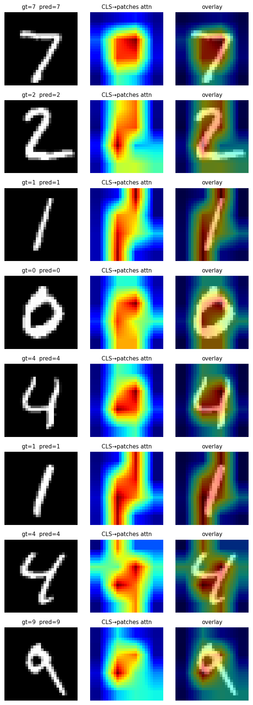

# Machine Learning / ViT and Visual Transformers: From Patches to Attention-Based Classification

The previous note walked Transformer encoders from self-attention all the way to the pre-norm encoder block. This one takes the **same Transformer encoder and moves it onto vision tasks** — i.e., ViT (Vision Transformer). The subtitle "from image patches to attention-based classification" captures everything new in this module: instead of letting conv layers scan the image, we cut it into patches, flatten them, and feed the resulting sequence into a Transformer.

Reforge code: [paper-reforge/ViT](https://github.com/r1skers/paper-reforge/tree/main/ViT)
Paper: [An Image is Worth 16x16 Words (Dosovitskiy et al., 2020)](https://arxiv.org/abs/2010.11929)

---

# Abstract

- **Problem**: Before ViT, CV SOTA was dominated by CNNs. CNNs ride two inductive biases — locality + translation equivariance — that make them extremely sample-efficient on small / medium data. Meanwhile, Transformers in NLP had outpaced every task-specific architecture in the large-data regime. Could CV repeat that move?
- **Solution**: Slice the image into non-overlapping 16×16 patches, project each flattened patch into a token, prepend a CLS, add a learnable position embedding, and **reuse the NLP Transformer encoder unchanged**.
- **Building blocks**:
  1. **PatchEmbed** = Conv2d(kernel=P, stride=P) ≡ slice + flatten + Linear (mathematically equivalent)
  2. **CLS token** = a shared `nn.Parameter` at sequence position 0 (carried over from BERT)
  3. **Learnable 1D PE** = learn it directly; no sinusoidal (image resolution is fixed, no extrapolation needed)
  4. **Reused** Transformer EncoderBlock × L, architecture unchanged
  5. **Classification head** = take `z_L[:, 0]`, apply LN, apply Linear — **BERT's tanh pooler is dropped**
- **Bottom line**: with enough data, a pure Transformer with no image-specific priors beats CNNs; but on small/medium data ViT loses to ResNet — **inductive bias is a substitute for data**.

---

# 1. Motivation: Why an Image Can Be Treated as a "Sentence"

CNNs process images like this:

```text
image (C, H, W) -> conv1 -> conv2 -> ... -> feature map -> head
```

Every conv layer scans the image with a small window. The two inductive biases — **locality** (only see neighbors) and **translation equivariance** (the same window sweeps everywhere) — are baked into the architecture. This is why CNNs dominated ImageNet-era vision: the prior "this is how to process an image" is structural, no need to learn it from data.

But Transformers in NLP went the other direction: the architecture carries **almost no language-specific prior**, relying on data + capacity to learn linguistic regularities. With enough data, this "blank slate" architecture beat sequential-bias models like LSTM.

ViT's bet:

> **With enough data, a pure Transformer can learn finer visual regularities than CNN's hand-coded priors — locality is not something we have to write into the architecture.**

The paper validates this bet via JFT-300M large-scale pre-training + downstream verification:
- Training ViT from scratch on ImageNet-1k: ViT < ResNet (data isn't enough; loses on inductive bias)
- Pre-train on JFT-300M, fine-tune on ImageNet: ViT > ResNet (enough data; lacking priors becomes an advantage)

That's the empirical backing for "large scale training trumps inductive bias".

---

# 2. PatchEmbed: Image → Token Sequence

This is ViT's **only genuinely new input-side component**. It does one thing:

```text
(B, C, H, W)  ──PatchEmbed──>  (B, N, d_model)
   one image                     N d_model-dim tokens
```

After this, the Transformer no longer knows the input is a 2D image — it's just a length-N token sequence, structurally indistinguishable from a sentence in NLP. **This is the literal meaning of the paper's title "An Image is Worth 16×16 Words"**.

## Two Mathematically Equivalent Implementations

The paper describes it as a three-step "slice + flatten + Linear":

```text
Step 1.  Cut (C, H, W) into N = (H/P)·(W/P) non-overlapping (C, P, P) patches
Step 2.  Flatten each patch into a C·P·P vector
Step 3.  Apply a shared Linear(C·P·P, d_model)
```

But almost every actual implementation writes it as a single `nn.Conv2d`:

```python
self.proj = nn.Conv2d(C, d_model, kernel_size=P, stride=P)
```

**The two implementations are bit-exact equivalent.** Why:

| | slice + Linear | Conv2d(stride=kernel) |
|---|---|---|
| Input | one (C, P, P) patch | one window of (C, P, P) |
| Operation | flatten to `R^{C·P²}`, apply Linear | inner product with the (C, P, P) kernel |
| Parameters | `W_lin ∈ R^{d, C·P²}` | `W_conv ∈ R^{d, C, P, P}` |

**The key**: `W_lin = W_conv.flatten(1)` — flatten the last three dims (C, P, P) into one. Both paths use the **same 48 numbers** (CIFAR-10 patch=4 case), just arranged as 3D vs 1D. PyTorch's default C-major flattening order is consistent on both sides, so the elementwise outputs are identical.

## stride = kernel Is the Key

If PatchEmbed uses a conv, why isn't ViT **just a CNN**? Stride.

- **stride < kernel**: windows slide and overlap → CNN-style feature extraction, output is a dense feature map
- **stride = kernel**: windows touch but don't overlap → tokenization, output is N independent tokens
- **stride > kernel**: windows skip → information loss, not used

So with the same `nn.Conv2d` operator, **stride determines whether it's a "feature extractor" or a "tokenizer"**. ViT picks stride=kernel — conv is a one-shot input compressor, not the backbone. After that, the Transformer encoder handles global interactions between N independent tokens.

## Numerical Verification (bit-exact)

I wrote two independent implementations (`PatchEmbedConv` and `PatchEmbedUnfold`) and tested a weight-transfer equivalence:

```python
# Build both modules with the same config and cast to float64
conv   = PatchEmbedConv  (img_size=32, patch_size=4, in_chans=3, d_model=128).double()
unfold = PatchEmbedUnfold(img_size=32, patch_size=4, in_chans=3, d_model=128).double()

# Copy conv weights into the linear layer with the correct flattening
with torch.no_grad():
    # conv.proj.weight: (128, 3, 4, 4) → flatten(1) → (128, 48)
    unfold.proj.weight.copy_(conv.proj.weight.flatten(1))
    unfold.proj.bias  .copy_(conv.proj.bias)

x = torch.randn(2, 3, 32, 32, dtype=torch.float64)
max_diff = (conv(x) - unfold(x)).abs().max().item()
assert max_diff < 1e-12     # measured max_diff ~ 1e-15
```

Under float64, the two outputs differ by $\sim 10^{-15}$ — machine precision floor, i.e. **algorithmically bit-equivalent**. Not "timm writes it this way so it's right" — they are mathematically guaranteed to be the same regardless of which form you choose.

---

# 3. CLS Token: A Summary Slot Borrowed from BERT

PatchEmbed produces N tokens, but classification ultimately needs a single d_model representation. Two legitimate ways to reduce N → 1:

1. **GAP** (Global Average Pooling): uniform mean over all N token outputs
2. **CLS token**: stick a "summary-only token" at the front of the sequence and read its output

ViT picks CLS, copying **BERT's design** (Devlin et al., 2018) verbatim:

```python
self.cls_token = nn.Parameter(torch.zeros(1, 1, d_model))

# forward:
cls = self.cls_token.expand(B, -1, -1)        # (1,1,d) → (B,1,d)
x = torch.cat([cls, x], dim=1)                # (B, N+1, d)
```

## Why CLS Learns to "Summarize"

CLS **does not come from any patch** — it's an independent shared `nn.Parameter`, the same initial vector for every image. But inside self-attention it is treated **completely symmetrically** with patch tokens, no special handling:

```text
At each layer:
  Q_cls (from CLS's current state) × K_all (keys of every token)
    -> attention weights α
  α × V_all (values of every token)
    -> CLS's new state
```

After L rounds of "ask → aggregate the weighted sum of values", the final CLS state `z_L^0` ends up encoding global image semantics. **CLS is never supervised directly** — gradient from the classification loss flows back end-to-end and tells `cls_token`: "tune this starting vector to make the L-layer output as easy to classify as possible".

## A Pair of Easy-to-Conflate Concepts

ViT has two close-sounding but very different things:

| Object | Shape | Learnable? | Image-dependent? |
|---|---|---|---|
| `cls_token` | (1, 1, d) | ✅ | ❌ (shared across all images) |
| `z_L^0` (CLS-position final output) | (B, d) | ❌ (intermediate tensor) | ✅ |

> `cls_token` is like an **empty glass bottle** — only one per model, fixed shape.
> `z_L^0` is the **bottle filled with water** — the same empty bottle dipped into different image "pools" comes back filled with different water each time.

Training shapes the **bottle**, not the water.

## CLS vs GAP in Practice

The paper's Appendix D measures both, and they perform almost identically — with one detail: **GAP needs a smaller learning rate to converge stably**. So picking CLS is mostly about BERT alignment + tuning robustness, not mathematical necessity.

---

# 4. Learnable Position Embedding

Self-attention is **permutation-equivariant** — permute tokens and the output permutes the same way but with identical content. So Transformers must inject position information explicitly, or the model treats the image as an "unordered bag of patches".

ViT uses learnable 1D PE:

```python
self.pos_embed = nn.Parameter(torch.zeros(1, N + 1, d_model))     # +1 for CLS

# forward, straight addition:
x = x + self.pos_embed       # broadcast (B, N+1, d) + (1, N+1, d)
```

## Why Learnable Instead of Sinusoidal

| | NLP Transformer | ViT |
|---|---|---|
| Choice | sinusoidal (hand-crafted) | learnable (learned from scratch) |
| Main driver | variable sequence length, must extrapolate | fixed input resolution, no extrapolation needed |
| Implementation | `register_buffer` | `nn.Parameter` |

The paper's Appendix D.4 measures three PE choices:
- No PE: ImageNet top-1 ≈ 64%
- Sinusoidal 1D: ≈ 77.5%
- Learnable 1D: ≈ 77.6%
- Learnable 2D (row + col concatenated): ≈ 77.6%

→ **The presence of PE matters a lot (13 points). The specific form does not (0.1 points).** The paper picks learnable mostly because it is simpler to implement.

## A Counterintuitive Observation: Learnable 1D Self-Discovers 2D Structure

Intuitively, images are 2D, so PE should be 2D-aware. But the paper's Fig 10 shows: after training, the similarity matrix of the 196 learnable PEs **spontaneously exhibits 2D grid structure** — PEs in the same row / column are closer to each other.

In other words, **even with 1D indexing, the model learns "position 14 and position 15 are horizontal neighbors" directly from data**. This is a clean validation of ViT's core thesis: the "2D" prior is redundant — give the model enough data and it discovers 2D structure on its own. It also explains why 2D-aware PE doesn't help.

## A Silent-Bug Warning

```python
# ✅ correct: trains with gradient
self.pos_embed = nn.Parameter(torch.zeros(1, N+1, d))

# ❌ wrong: stays at initial zeros forever, equivalent to "no PE"
self.register_buffer('pos_embed', torch.zeros(1, N+1, d))
```

The wrong form does not raise an error, but the model loses ~13 accuracy points silently. My `test_pos_embed_is_learnable` test guards against this specifically:

```python
assert isinstance(model.pos_embed, nn.Parameter), "silent bug if it isn't"
assert model.pos_embed.requires_grad
```

---

# 5. Reusing the Transformer EncoderBlock

The ViT backbone **copies the pre-norm encoder block** from the NLP Transformer unchanged. I `import` it directly; no rewriting:

```python
# ViT/src/vit.py
sys.path.append(str(_TRANSFORMER_SRC))   # add Transformer/src to sys.path
from transformer_block import EncoderBlock

# later:
self.blocks = nn.ModuleList([
    EncoderBlock(d_model, num_heads, d_ff=d_ff,
                 dropout=dropout, activation='gelu')
    for _ in range(depth)
])
```

Two small details to keep in mind:

1. **Use `nn.ModuleList`, not a plain Python list** — only the former registers submodules so the optimizer can see their parameters. A plain list "looks correct" but the network simply does not train.
2. **Use GELU instead of ReLU in the FFN** — the only architectural difference between ViT and the original Transformer. BERT also uses GELU, so this migration is natural.

The EncoderBlock itself (pre-norm, identity-highway, token mixing vs. channel mixing) was covered in the previous note. Not repeating it here.

## A Pre-Norm Tail

Pre-norm puts LN **inside** each sublayer:

```python
x = x + Sublayer(LN(x))     # the residual path is bare, no LN
```

So the output of the last block, `z_L`, **is not normalized on its way out** — it's "previous layer + an LN-normed correction". Feeding that directly to the classifier is numerically unstable.

Fix: add one extra LN after the encoder stack, corresponding to `LN(z_L^0)` in eqn (4):

```python
self.norm = nn.LayerNorm(d_model)
# forward:
x = self.norm(x)                    # (B, N+1, d)
cls_out = x[:, 0]                   # (B, d) — take the CLS position
```

---

# 6. Classification Head: One Linear, No Pooler

```python
self.head = nn.Linear(d_model, num_classes)
```

That's it, one line. **No hidden layer, no nonlinearity, no dropout.**

BERT stuffed a `tanh(W @ z + b)` pooler in here for the NSP pretraining task. ViT has no NSP, so the pooler is **deliberately removed**.

Why is this still enough? Because `z_L^0` after L layers of attention is already a highly structured image representation — **linear separability is sufficient**, an extra nonlinearity is redundant. The paper measured adding an MLP head and saw no meaningful improvement.

---

# 7. The Full ViT in Five Steps

Stitching all the pieces together, ViT's forward pass is 8 lines:

```python
def forward(self, x):
    # Stage 1: PatchEmbed
    x = self.patch_embed(x)                       # (B,C,H,W) → (B, N, d)

    # Stage 2: prepend CLS + add PE
    B = x.shape[0]
    cls = self.cls_token.expand(B, -1, -1)
    x = torch.cat([cls, x], dim=1)                # (B, N+1, d)
    x = x + self.pos_embed

    # Stage 3: L × EncoderBlock (reused from the Transformer module)
    for blk in self.blocks:
        x = blk(x)

    # Stage 4: final LN, take CLS
    x = self.norm(x)
    cls_out = x[:, 0]                             # (B, d)

    # Stage 5: classifier head
    return self.head(cls_out)                     # (B, num_classes)
```

**70% reuses** EncoderBlock + MultiHeadSelfAttention from the Transformer module. **30% new**: PatchEmbed + CLS + PE + classification head.

---

# 8. Inductive Bias: ViT's Core Trade-off

The paper's §3.1 explicitly compares ViT's inductive bias against CNN's:

| Prior | CNN | ViT |
|---|---|---|
| Locality (look at neighbors) | ✅ every conv layer | ❌ self-attention is global |
| Translation equivariance | ✅ every conv layer | weak (only inside the FFN) |
| 2D grid structure | ✅ kernels are 2D | residual (only at the patch-cut step) |

**CNN is "biases all the way down"; ViT is "almost a bare Transformer".** Both sides of this trade-off:

- **Cost (small data)**: ImageNet-1k from-scratch ViT < ResNet. The model has to learn the priors from data; small samples can't deliver them.
- **Reward (large data)**: after JFT-300M pre-training, ViT > ResNet. No prior to bind the model, so it can learn richer visual regularities than CNN's hard-coded biases.

> **Inductive bias is a substitute for data — when data is scarce, the prior helps; when data is plentiful, the prior is a ceiling.**

This is the full meaning of "large scale training trumps inductive bias".

---

# 9. Experiment 1: MNIST (smoke test)

## Config

```text
img_size=28, patch_size=7, in_chans=1, num_classes=10
d_model=64, depth=4, num_heads=4, dropout=0.1
N = (28/7)² = 16 tokens
AdamW(lr=3e-4, weight_decay=0.05) + CosineAnnealingLR
batch=128, epochs=10, device=cpu
```

## Training Curve

```text
ep   1/10  train loss=0.96  acc=68.6%   test loss=0.48  acc=85.16%   lr=2.93e-04   t=48s
ep   2/10  train loss=0.44  acc=86.1%   test loss=0.27  acc=91.83%   lr=2.71e-04   t=48s
ep   3/10  train loss=0.28  acc=91.5%   test loss=0.19  acc=94.47%   lr=2.38e-04   t=50s
ep   5/10  train loss=0.17  acc=94.8%   test loss=0.14  acc=95.59%   lr=1.50e-04   t=47s
ep  10/10  train loss=0.10  acc=97.0%   test loss=0.10  acc=97.00%   lr=0.00e+00   t=46s
```

10 epochs on CPU in ~8 minutes; final test_acc 97.00%.

## A Few Checks

1. **train_acc ≈ test_acc** (96.96% vs 97.00%): no overfitting, model capacity is well matched to task difficulty.
2. **Loss decreases monotonically** in both train and test: healthy training.
3. **Cosine schedule works as expected**: lr smoothly decays from 3e-4 to 0.
4. **97% is reasonable**: against ResNet's typical 99%+ on MNIST, the ~2-point gap is mostly ViT's inductive-bias shortfall on a small dataset. **This 2-point gap will balloon into tens of points once we move to CIFAR-10.**

---

# 10. Experiment 2: CIFAR-10 (Inductive-Bias Gap)

## Config (**same model capacity as MNIST**, only the data changes)

```text
img_size=32, patch_size=8, in_chans=3, num_classes=10
d_model=64, depth=4, num_heads=4, dropout=0.1
N = (32/8)² = 16 tokens                            # intentionally identical to MNIST
+ data augmentation: RandomCrop(padding=4) + HorizontalFlip
epochs=15, all other hyperparameters same as MNIST
```

## Training Curve

```text
ep   1/15  train loss=1.91  acc=28.2%   test loss=1.81  acc=33.79%
ep   5/15  train loss=1.53  acc=43.8%   test loss=1.47  acc=47.11%
ep  10/15  train loss=1.36  acc=50.4%   test loss=1.34  acc=51.54%
ep  15/15  train loss=1.31  acc=52.5%   test loss=1.28  acc=53.77%   best 53.89% @ ep 14
```

15 epochs on CPU in ~11 minutes; best test_acc **53.89%**.

## The Core Data: A 43-Point Inductive-Bias Gap

Putting both experiments side by side:

| Dataset | Model config | Task difficulty | test_acc |
|---|---|---|---|
| MNIST | (N=16, d=64, L=4) | easy (centered grayscale digits) | **97.00%** |
| CIFAR-10 | (N=16, d=64, L=4) | medium (natural images, 3-channel) | **53.89%** |
| Gap | identical ViT, only data changes | | **−43.1 pp** |

Compare to my Stage-1 ResNet20 on CIFAR-10 (typical level ~91%) — **on the same small-data regime, ResNet's locality prior gives it a 35+ point head start**.

This is the most direct evidence I have for the paper's "much less image-specific inductive bias" claim. **The model is identical; only the images get harder, and the model collapses** — because ViT has no CNN-style "I natively understand image structure" prior, so harder images expose the gap.

## Two Detail Observations

1. **train_acc < test_acc** (52.5% vs 53.8%): not a bug. The training set is perturbed by RandomCrop + Flip, so it's harder than the clean test set. This inversion is actually evidence that augmentation is working.

2. **The model is significantly underfit**: loss is still trending down at 1.30 but acc has plateaued. This capacity is fully utilized; only scaling to patch=4 / d=128 / depth=6 unlocks further headroom. **Even a ViT-Base on CIFAR-10 still loses to a comparable ResNet — the inductive-bias gap is structural, not something capacity can close.**

---

# 11. Attention Visualization

## Hook + CLS Attention Slice

Reusing the forward-hook idiom from the previous note, attaching a hook to each EncoderBlock's `.attn`:

```python
attn_maps = {}
def make_hook(idx):
    def hook(module, inputs, outputs):
        attn_maps[idx] = outputs[1].detach().cpu()    # (B, H, N+1, N+1)
    return hook

for i, blk in enumerate(model.blocks):
    blk.attn.register_forward_hook(make_hook(i))
```

After one forward pass, `attn_maps[l]` holds the attention for layer l, shape `(B, H, N+1, N+1)`.

What we want is **CLS's attention to every patch**, so slice `attn[:, :, 0, 1:]` → `(B, H, N)` and reduce over heads:

```python
cls_attn = attn[:, :, 0, 1:].mean(dim=1)    # (B, N)
```

Reshape `(B, N)` to `(B, 1, √N, √N)`, bilinearly upsample to `(B, img_size, img_size)`, normalize per image — and you have a heatmap.

## Single-Layer Attention Has Limits

Looking at the sharpest single-head attention from **layer 0**:

- "4": hot spot lands right on the cross-intersection (the only discriminating feature of a 4) ✓
- "9": hot spot on the upper loop ✓
- "1": hot spot on the upper hook + vertical stroke ✓
- but "0" and "2"'s hot spots drift into the empty background ✗
- A visible 4×4 patch-grid blockiness across all images ✗

**Two reasons for the hit-or-miss**:
1. Late layers in ViT have nearly uniform attention (each token has already aggregated global info); early layers are more local but only see local information.
2. Different heads attend to different patterns; picking one head doesn't capture the model's overall discriminative reasoning.

## Attention Rollout (the canonical choice)

The paper's Fig 6 uses **attention rollout** (Abnar & Zuidema 2020) — chain-multiply all-layer attention matrices to get "cumulative attention from input to output":

$$
\tilde{A}_\ell = 0.5\, A_\ell + 0.5\, I, \quad
\text{rollout} = \tilde{A}_L \cdot \tilde{A}_{L-1} \cdots \tilde{A}_1
$$

Two key points:

1. **`0.5*A + 0.5*I`**: adding an identity at each layer accounts for the residual path (half the information flows via attention, half via the residual). Both `A` and `I` are row-stochastic, so `0.5*A + 0.5*I` is too — no renormalization needed.
2. **Left-multiply**: since `z_l = A_l @ z_{l-1}`, the chained application puts new layers on the LEFT of the running product.

Code:

```python
def attention_rollout(attn_maps, head_reduce="mean"):
    L = len(attn_maps)
    first = attn_maps[0].mean(dim=1)              # (B, N+1, N+1)
    B, n, _ = first.shape
    I = torch.eye(n).expand(B, n, n)

    rollout = 0.5 * first + 0.5 * I
    for l in range(1, L):
        A_l = 0.5 * attn_maps[l].mean(dim=1) + 0.5 * I
        rollout = A_l @ rollout                   # left-multiply
    return rollout[:, 0, 1:]                      # CLS row, drop CLS→CLS
```

## Rollout Effect



Switching to rollout gives a clear visual improvement:

- **Two "1"s**: heat traces the entire vertical stroke, and the two images show highly consistent patterns
- **"0"**: heat covers the left side and top arc of the loop — the closed-loop structure is identified
- **Two "4"s**: heat sits on the cross intersection — the actual discriminative feature
- **"9"**: heat tightly locks onto the upper loop
- **"7"**: heat covers the entire top horizontal fold
- **Grid blockiness almost gone**: multilayer composition smooths out the hard edges

**Consistency** is rollout's biggest win — same-class samples (two "1"s, two "4"s) show the same attention pattern, meaning the model learned a **stable discriminative attention pattern per class**, not a per-image guess.

> Rollout shows the model's overall discriminative logic, not a single layer's transient activity — which is why the paper uses it for the main figure.

---

# 12. Wrap-Up

## Idiom Checklist

New PyTorch idioms (on top of the Transformer note):

- **`nn.Conv2d(stride=kernel)`**: treat conv as a tokenizer, not a feature extractor
- **`F.unfold(x, kernel, stride)`**: slice an image into `(B, C·k·k, N)` patch columns
- **`weight.flatten(1)`**: collapse conv's `(out, in, kH, kW)` to `(out, in·kH·kW)` for Linear alignment
- **`.expand(B, -1, -1)`**: zero-copy batch broadcast (vs `.repeat`, which actually copies)
- **`nn.Parameter(torch.zeros(1, N+1, d))`, not buffer**: the silent-bug firewall for learnable PE
- **`nn.ModuleList([... for _ in range(L)])`**: stack depth with auto submodule registration
- **`F.interpolate(x, size, mode='bilinear')`**: upsample patch grid to image resolution
- **`sys.path.append` instead of `insert(0, ...)`**: cross-module imports should let local files win (learned the hard way via a `data.py` name conflict)

## Concept Checklist

- ViT's "new" parts are only PatchEmbed + CLS + learnable PE + classification head; **the backbone is 100% reused from the Transformer module**
- PatchEmbed is mathematically ≡ "slice + flatten + Linear" — bit-exact equivalent
- A stride=kernel conv is a tokenizer, not CNN — disabuses "ViT is a CNN variant" claims
- CLS provides a "summary slot"; PE provides "position info" — **orthogonal**; losing PE is fatal, losing CLS is recoverable via GAP
- `cls_token` (the parameter, shared across images) and `z_L^0` (the per-image intermediate output) are two different things
- Inductive bias is a trade-off — **the prior substitutes for data**; less prior demands more data to compensate
- Attention rollout shows the model's overall discriminative logic; single-layer attention shows transient activity — prefer rollout for visualization
- ViT losing to a comparable ResNet on CIFAR-10 is **structural**, not something capacity can close

## A Personal Takeaway

By the end of this module, my understanding of "what is ViT doing" shifted from a vague "image-side Transformer" into a concrete **module-level mental map**:

```text
image  ──Conv2d(stride=kernel)──>  N tokens
                  +CLS                        + learnable PE
                                                |
                                                v
                            L × EncoderBlock (borrowed from NLP Transformer)
                                                |
                                                v
                                          take z_L[:, 0]
                                                |
                                                v
                                       LN → Linear → logits
```

Each arrow stands for a specific design decision (why conv and not unfold? why CLS and not GAP? why learnable and not sinusoidal?), and every decision has a "task constraint" or "engineering convenience" reasoning behind it. This is what makes ViT stop being "a paper architecture I have to memorize" and start being "an engineering choice naturally falling out of a few trade-offs" — which is the biggest dividend of writing code + running experiments: **the architecture stops being dead, and the model stops being a black box**.

---

# Reforge Repository

Full code: [github.com/r1skers/paper-reforge/tree/main/ViT](https://github.com/r1skers/paper-reforge/tree/main/ViT)

```text
ViT/
├── 2010.11929_ViT.pdf
├── src/
│   ├── patch_embed.py          <- PatchEmbedConv + PatchEmbedUnfold (dual impls)
│   ├── vit.py                  <- ViT model (reuses EncoderBlock)
│   └── data.py                 <- MNIST + CIFAR-10 dataloaders
├── tests/
│   ├── test_patch_embed.py     <- 5 tests (including bit-exact)
│   └── test_vit.py             <- 5 tests (including silent-bug firewall)
├── experiments/
│   ├── train.py                <- AdamW + CosineAnnealingLR + best-ckpt saving
│   └── visualize_attention.py  <- both single_layer and rollout modes
└── outputs/
    ├── default/                <- MNIST experiment
    └── cifar10_smoke/          <- CIFAR-10 experiment
```
