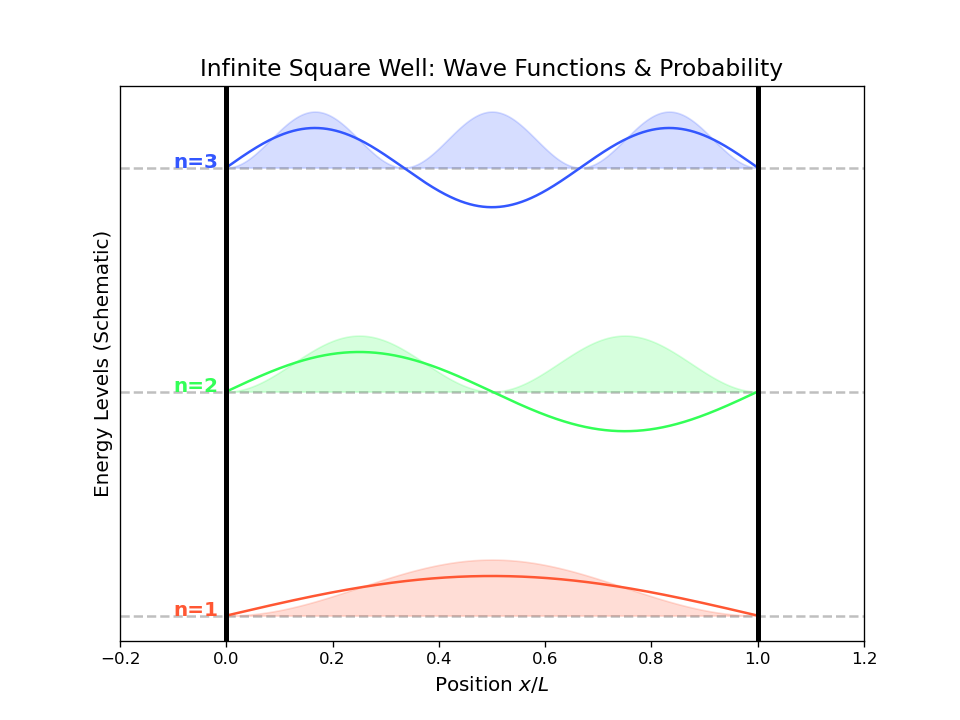
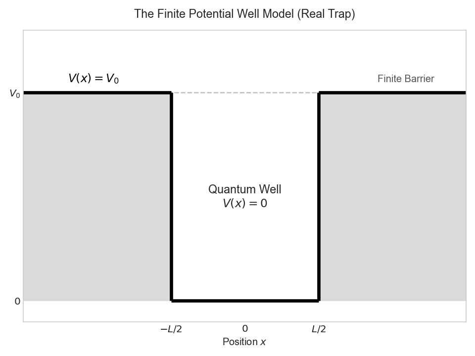

---
date: '2025-11-22T10:17:00+09:00'
draft: false
title: '量子力学第1部分：从薛定谔方程到波函数'
summary: "从工程视角回顾量子力学基础：经典理论失效、波粒二象性、薛定谔方程推导与势阱波函数可视化。"
tags: ["Quantum Mechanics", "Physics", "Python", "Matplotlib", "Schrödinger Equation"]
categories: ["Crucible"]
---

这篇文章最初是为了备考整理，但在复习过程中我越来越意识到量子力学在工程中的基础地位，因此决定把完整思路系统写下来。  
# 阅读后小结

### 1. 推导波函数时为什么只重点看 x 方向？

**根本原因是：在 y、z 方向没有势阱约束，只有 x 方向存在受限边界。**<p>
• x 方向：电子被势阱束缚，形成“驻波”，因此出现离散能级，这是需要量子求解的核心。<p>
• y、z 方向：没有势垒，电子近似自由粒子，表现为“行波”，能量连续，用经典图像即可近似处理。<p>

### 2. 为什么推导中常使用复指数形式（含虚数项）？

本节目标是得到自由电子色散关系 $E=\frac{p^2}{2m}$。由德布罗意关系可写为：  

$$E=\hbar \omega = \frac{(\hbar k)^2}{2m}$$

这意味着方程必须体现 $\omega$（频率）与 $k^2$（波数平方）成正比。<p>
若使用纯实函数形式：  

$$\Psi = \cos(kx - \omega t)$$

对应能量项（时间导数）：
 
$$\frac{\partial \Psi}{\partial t} = \omega \sin(kx - \omega t)$$

对应动量平方项（空间二阶导）：  
对应到空间变量 $x$，需要做二阶导数：

$$\frac{\partial^2 \Psi}{\partial x^2} = -k^2 \cos(kx - \omega t)$$

可以看到左右两侧出现 $\sin$ 与 $\cos$ 的相位不一致，难以形成稳定的本征方程匹配；因此采用复指数 $e^{i(kx-\omega t)}$ 更自然、也更便于算符求解。  
### 3. 为什么经典波动方程不能直接用于电子？

本质原因：电子与光子遵循不同的能量-动量关系（色散关系）。<p>

经典波动方程为：  

$$\frac{\partial^2 \Psi}{\partial x^2} - \frac{1}{v^2} \frac{\partial^2 \Psi}{\partial t^2} = 0$$

它隐含关系：  

$$p^2 \propto E^2 \quad \text{or} \quad E \propto p$$

对光子：$E=cp$，能量与动量线性相关，因此与经典波动方程相容。  

对非相对论电子（有质量 $m$）：满足牛顿动能关系  

$$E = \frac{p^2}{2m}$$

这意味着 $E\propto p^2$。映射到算符后是“时间一阶导”对应“空间二阶导”，与经典方程结构不一致。<p>
结论：电子波是有质量且有色散的，需要使用薛定谔方程而不是经典波动方程。  

# 引言

在工程研究中必须引入量子力学，一个最直接的原因是摩尔定律正在逼近尺度极限。晶体管从微米级缩小到今天手机与 FPGA 常见的 3nm、2nm，甚至向 1nm 靠近后，量子效应已经不能忽略。  

# 经典理论的失效与二象性
## 经典力学的适用边界
经典力学在高速、微观尺度和极端条件下会失效。速度接近光速时经典动量与速度叠加不再准确；在原子与粒子尺度上，波粒二象性与不确定性原理等现象也超出经典框架。  
## 波粒二象性

### 光的波动性

光的波动性来自大量实验事实，不仅有杨氏双缝干涉，还有衍射、偏振等结果。基于这些实验可得到下列关系：<p>

#### 光波关系（Maxwell 框架）
$$c=f\lambda$$
$c$：光速
$f$：频率
$\lambda$：波长

### 光的粒子性
光的粒子性同样由实验确认（如康普顿效应），并体现在离散能量与动量表达式中：<p>
#### 光子的能量

$$E=hf=h\frac{c}{\lambda}=h\frac{\omega}{2\pi}=\hbar\omega$$

$h$：普朗克常数

$\hbar$：约化普朗克常数，$\hbar=\frac{h}{2\pi}$

#### 光子的动量
$$p=\frac{h}{\lambda}=h\frac{k}{2\pi}=\hbar k$$

$k$：波数（单位空间相位变化率）

### 电子的波粒二象性
#### 德布罗意波
由光子的动量关系 $p=\frac{h}{\lambda}$ 类比可得电子的德布罗意关系：  

$$\lambda=\frac{h}{p}=\frac{h}{mv}$$

$m$：质量
$v$：速度

### 哥本哈根诠释
1. 量子系统状态可由波函数完整描述；波函数编码了观测者可获得的信息。<p>
2. 量子描述是概率性的，事件概率由波函数模平方给出。<p>
3. 不确定性原理指出位置与动量不能同时精确确定。  

# 波函数

## 一维波函数推导

根据欧拉公式：  

$$e^{ix}=cos(x)+isin(x)$$

可将沿 x 方向传播的波写成：  

$$\Psi(x,t)=Acos(k(x-vt)+\theta_0)$$

并利用关系：  

$$v=f\lambda=\frac{\omega}{2\pi} \cdot \frac{2\pi}{k}=\frac{\omega}{k}$$

与欧拉公式结合可知，上式本质上是在取复指数形式的实部：  

$$\Psi(x,t)=Acos(kx-\omega t+\theta_0)=\mathrm{Re}[Ae^{i(kx-\omega t+\theta_0)}]$$

将 $Ae^{i\theta_0}$ 记为复振幅 $\widetilde{A}$，可把波函数简写为：  

$$ \Psi(x,t)=\widetilde{A}e^{i(kx-\omega t)}$$

## Born 统计解释与归一化
### Born 统计解释
这里要回答“波函数究竟表示什么”。Born 在 1926 年提出统计解释：波函数本身不可直接观测，但其模平方对应概率密度。<p>
核心思想是：波函数本身不能直接测量，但其模平方给出粒子在某处出现的概率密度。  
$$P(x, t) = |\Psi(x, t)|^2 = \Psi^*(x, t) \cdot \Psi(x, t)$$


### 归一化条件
既然 $|\Psi|^2$ 是概率密度，则全空间概率和必须为 1（粒子一定在某处）。  
如果沿整个 x 轴寻找该电子，总概率必须是 100%（即 1）。  

$$\int_{-\infty}^{+\infty} |\Psi(x, t)|^2 \ dx = 1$$


归一化的核心作用是确定振幅常数 $\widetilde{A}$；否则方程只能给比例而非可计算预测。  

## 经典波动方程（达朗贝尔方程）

从波函数出发，分别对 $x,t$ 做二阶求导：

$$\frac{\partial^2 \Psi}{\partial x^2} = (ik)^2 \Psi = -k^2 \Psi$$

$$\frac{\partial^2 \Psi}{\partial t^2} = (-i\omega)^2 \Psi = -\omega^2 \Psi$$

由 \( v=\frac{\omega}{k} \Rightarrow k^2=\frac{\omega^2}{v^2} \)，代入可得到经典波动方程：  

$$\left(\frac{\partial^2}{\partial x^2} - \frac{1}{v^2} \frac{\partial^2}{\partial t^2}\right)\Psi(x,t)= 0$$

该方程描述真空中的经典电磁波传播规律，但并不适用于电子。<p>

# 薛定谔方程
## 推导
从总能量守恒（动能 + 势能）出发：  

$$E=K(t)+V(t)=\frac{p^2}{2m}+V(t)$$

引入两个常用量子算符：  

$$\hat{p} = -i\hbar \frac{\partial}{\partial x}$$

$$\hat{E} = i\hbar \frac{\partial}{\partial t}$$

两侧同时作用于 $\Psi(x,t)$：

$$[-\frac{\hbar^2}{2m}\frac{\partial^2}{\partial x^2}+V(t)]\Psi(x,t)=i\hbar\frac{\partial}{\partial t}\Psi(x,t)$$

将括号项记为哈密顿算符 $\hat H$：

$$\hat{H}\Psi(x,t)=i\hbar\frac{\partial}{\partial t}\Psi(x,t)$$

## 含时薛定谔方程
从下式开始：

$$\hat{H}\Psi(x,t)=i\hbar\frac{\partial}{\partial t}\Psi(x,t)$$

先作变量分离：

$$\Psi(x,t)=\psi(x)f(t)$$

代回原方程：

$$\frac{1}{\psi(x)} \left[ -\frac{\hbar^2}{2m} \frac{d^2 \psi(x)}{dx^2} \right] + V(x) = \frac{i\hbar}{f(t)} \frac{df(t)}{dt}=E$$

也可写成哈密顿算符形式：

$$\frac{\hat{H}\psi(x)}{\psi(x)}=\frac{i\hbar}{f(t)}\frac{df(t)}{dt}$$

等号左侧仅与空间有关，右侧仅与时间有关，因此它们都必须等于常数 $E$。  

## 定态薛定谔方程

由含时薛定谔方程可得：

$$\frac{1}{\psi(x)} \left[ -\frac{\hbar^2}{2m} \frac{d^2 \psi(x)}{dx^2} \right] + V(x) = \frac{i\hbar}{f(t)} \frac{df(t)}{dt}=E$$

两边同乘 $\psi(x)$：

$$-\frac{\hbar^2}{2m} \frac{d^2 \psi(x)}{dx^2} + V(x)\psi(x)=E\psi(x)$$

整理为：

$$\psi(x) \left[ -\frac{\hbar^2}{2m} \frac{d^2}{dx^2}+V(x) \right]=E\psi(x)$$

写成哈密顿算符形式：

$$\hat{H}\psi=E\psi$$

# 量子势阱（薛定谔方程的直接应用）

## 无限深势阱
    无限深方势阱示意图
  
  <br> 

先看最简单模型：宽度为 $L$ 的一维无限深势阱。阱内势能为 0，阱外势能无穷大，电子被完全束缚在阱内。<p>
阱内（$0 < x < L$）满足 $V(x)=0$，电子可在阱内传播。<p>
阱外（其余区域）满足 $V(x)=\infty$，电子到达该处的概率为 0。  

推导步骤如下：<p>
势能与时间无关，因此使用定态薛定谔方程 $\hat{H}\psi=E\psi$，在阱内 $V(x)=0$ 得到：  
首先，由于势能不显含时间，采用定态薛定谔方程 $\hat{H}\psi=E\psi$；再结合阱内 $V(x)=0$，可得：  
$$-\frac{\hbar^2}{2m} \frac{d^2 \psi}{dx^2} = E \psi$$

整理为：

$$\frac{d^2 \psi}{dx^2} + \frac{2mE}{\hbar^2} \psi = 0$$

结合之前的 $E=\frac{p^2}{2m}$ 可化为 Helmholtz 形式：

$$\frac{d^2 \psi}{dx^2} + k^2 \psi = 0$$

该常微分方程通解为：

$$\psi(x) = A \sin(kx) + B \cos(kx)$$

再施加边界条件（墙上概率为 0）：

$$\psi(0)=B=0$$

$$\psi(L)=A\sin(kL)=0$$

因此量子化条件为 $kL=n\pi \ (n=1,2,3,\dots)$。  

归一化时，由于阱外波函数为 0，可写为：

$$\int_{0}^{L} |\psi(x)|^2 \ dx = 1$$

代入 $\psi(x)=A\sin\left(\frac{n\pi x}{L}\right)$：

$$A^2 \int_{0}^{L} \sin^2\left( \frac{n\pi x}{L} \right) \ dx = 1$$

通过降幂积分可解得：

$$A^2 = \frac{2}{L} \implies A = \sqrt{\frac{2}{L}}$$

归一化本征函数为：

$$\psi_n(x) = \sqrt{\frac{2}{L}} \sin\left( \frac{n\pi x}{L} \right)$$

$$E_n = \frac{\hbar^2 k^2}{2m} = \frac{n^2 \pi^2 \hbar^2}{2m L^2}$$

### Python 仿真

#### 代码

```python
import numpy as np
import matplotlib.pyplot as plt

# --- 1. 物理参数设定 ---
L = 1.0          # 势井宽度 (比如 1nm)
x = np.linspace(0, L, 1000)  # 在 0 到 L 之间生成 1000 个点

# --- 2. 定义波函数 ---
# 公式: psi = sqrt(2/L) * sin(n * pi * x / L)
def get_psi(n, x, L):
    return np.sqrt(2/L) * np.sin(n * np.pi * x / L)

# --- 3. 绘图设置 ---
plt.figure(figsize=(8, 6), dpi=120) # 设置画布大小和清晰度
plt.title("Infinite Square Well: Wave Functions & Probability", fontsize=14)
plt.xlabel("Position $x/L$", fontsize=12)
plt.ylabel("Energy Levels (Schematic)", fontsize=12)

# 为了美观，我们设定一些颜色
colors = ['#FF5733', '#33FF57', '#3357FF'] # 红、绿、蓝
levels = [1, 2, 3] # 我们画前三个能级

# --- 4. 循环画出 n=1, 2, 3 ---
for i, n in enumerate(levels):
    # 计算波函数
    psi = get_psi(n, x, L)
    
    # 计算概率密度 |psi|^2
    prob = psi**2
    
    # 设定一个基准高度，代表能量 E_n
    # 为了显示清楚，我们人工拉开间距，不完全按 n^2 比例，否则 n=1 会被压扁
    energy_level = n * 40 
    
    # 画基准线 (虚线)
    plt.axhline(y=energy_level, color='gray', linestyle='--', alpha=0.5)
    plt.text(-0.1, energy_level, f'n={n}', color=colors[i], fontweight='bold', fontsize=12)
    
    # 画波函数 (实线) - 这里的 + energy_level 是为了把它平移上去
    # 乘以 5 是为了放大波幅，让它在图上看得更清楚
    plt.plot(x, psi * 5 + energy_level, color=colors[i], label=f'$\psi_{n}(x)$')
    
    # 画概率密度 (填充颜色)
    # fill_between(x轴, 下限, 上限)
    plt.fill_between(x, energy_level, (prob * 5) + energy_level, 
                     color=colors[i], alpha=0.2, label=f'$|\psi_{n}|^2$ Probability')

# --- 5. 画势井的墙壁 ---
plt.axvline(0, color='black', linewidth=3)
plt.axvline(L, color='black', linewidth=3)
plt.text(0, 0, 'V = $\infty$', ha='right', va='bottom', fontsize=12)
plt.text(L, 0, 'V = $\infty$', ha='left', va='bottom', fontsize=12)

# 隐藏 Y 轴刻度 (因为是示意图)
plt.yticks([])
plt.xlim(-0.2, 1.2) # 留一点边距

# 导出建议: plt.savefig('quantum_well.png')
plt.show()
```
#### 图像输出
  
    无限深势阱的能量图
  
  <br> 

要点：<p>
1. 阴影面积代表概率分布。<p>
2. 波函数过零点处概率为 0；波函数正负号体现相位信息。  

## 有限深势阱
    有限深方势阱示意图
  
  <br> 

类似地，对有限深势阱有：  

$$
V(x) =
\begin{cases}
  0, & |x| < \frac{L}{2} \\\\
  V_0, & \text{otherwise}
\end{cases}
$$

解题需要分三区：区 I（左侧阱外）、区 II（阱内）、区 III（右侧阱外）。区 II 与无限深势阱形式相同：<p>
先看区 II（$-\frac{L}{2}<x<\frac{L}{2}$），其形式与无限深势阱相同：  

$$\psi'' + k^2\psi = 0$$

其数学通解为：

$$\psi_{II}(x) = A_2\cos(kx) +B_2\sin(kx)$$

区 I（$x<-\frac{L}{2}$）：

$$\psi'' - \kappa^2\psi = 0$$

数学通解：

$$\psi_I(x) = A_1e^{\kappa x} + B_1e^{-\kappa x}$$

物理约束：$x\to-\infty$ 时发散项必须去掉。<p>
最终保留：
因此最终解可写为：  

$$\psi_I(x) = A_1e^{\kappa x}$$

区 III（$x>\frac{L}{2}$）：

$$\psi'' - \kappa^2\psi = 0$$

数学通解：

$$\psi_{III}(x) = A_3e^{\kappa x} + B_3e^{-\kappa x}$$

同理，$x\to+\infty$ 时发散项去掉，得到：

$$\psi_{III}(x) = B_3e^{-\kappa x}$$

利用边界连续条件可得到超越方程，从而求允许能级与对应概率分布：

$$k \tan(kL/2) = \kappa$$

### Python 仿真

#### 代码

```python
import numpy as np
import matplotlib.pyplot as plt

# --- 1. 设定示意性参数 ---
L = 2.0           # 井宽 (示意值，比如 2nm，从 -1 到 1)
V0 = 10.0         # 墙高 (示意值)
x = np.linspace(-L*1.5, L*1.5, 1000) # 画宽一点，展示墙外

# 定义区域
inside_mask = np.abs(x) <= L/2
outside_mask = np.abs(x) > L/2

# --- 2. 构造示意性波函数 (非精确解，仅做视觉展示) ---
# 我们需要手动调整 k (波数) 和 kappa (衰减系数) 来让图看起来像真的
# 关键点：能量越高(n越大)，kappa越小(衰减越慢，渗透越深)

def get_schematic_psi(n, x, L):
    psi = np.zeros_like(x)
    
    # --- 手动调参区 (Magic Numbers for visuals) ---
    if n == 1:   # 基态 (偶对称 cos)
        E_schematic = 2.0
        k = np.pi / (L * 1.1)  # 波长比无限井稍微长一点点
        kappa = 3.5            # 衰减较快
        
        # 井内
        psi[inside_mask] = np.cos(k * x[inside_mask])
        # 边界值 (用于缝合)
        boundary_val = np.cos(k * L/2)
        # 井外 (指数衰减)
        psi[outside_mask] = boundary_val * np.exp(-kappa * (np.abs(x[outside_mask]) - L/2))
        
    elif n == 2: # 第一激发态 (奇对称 sin)
        E_schematic = 7.5
        k = 2 * np.pi / (L * 1.15)
        kappa = 1.5            # 能量高了，衰减变慢了 (渗透更深!)
        
        # 井内
        psi[inside_mask] = np.sin(k * x[inside_mask])
        # 边界值
        boundary_val = np.sin(k * L/2)
        # 井外 (指数衰减，注意要乘 sign(x) 保持奇对称)
        psi[outside_mask] = boundary_val * np.exp(-kappa * (np.abs(x[outside_mask]) - L/2)) * np.sign(x[outside_mask])
        
    # 归一化视觉幅度
    psi = psi / np.max(np.abs(psi))
    return psi, E_schematic

# --- 3. 绘图设置 ---
plt.figure(figsize=(10, 7), dpi=120)
plt.style.use('seaborn-v0_8-whitegrid')

# 画势阱 V(x) 的轮廓
V_x = np.zeros_like(x)
V_x[outside_mask] = V0
plt.plot(x, V_x, color='black', linewidth=3, alpha=0.6, label='Potential $V(x)$')
plt.fill_between(x, V_x, V0+2, color='gray', alpha=0.2) # 给墙壁上色

# --- 4. 循环画出能级 n=1, n=2 ---
colors = ['#E63946', '#1D3557'] # 红、蓝
states = [1, 2]

for i, n in enumerate(states):
    psi, E_level = get_schematic_psi(n, x, L)
    prob = psi**2
    
    # 画能级基准线
    plt.axhline(E_level, color=colors[i], linestyle='--', alpha=0.5)
    plt.text(-L*1.4, E_level, f'State n={n}\n(Bound)', color=colors[i], va='center', fontweight='bold')
    
    # 画波函数 (稍微放大一点平移到能级上)
    scale_factor = 1.5
    plt.plot(x, psi * scale_factor + E_level, color=colors[i], linewidth=2, alpha=0.8, label=f'$\psi_{n}$')
    
    # 画概率密度 (重点展示渗透！)
    plt.fill_between(x, E_level, prob * scale_factor + E_level, color=colors[i], alpha=0.3)

# --- 5. 装饰图表 ---
# 标出关键区域
plt.axvline(-L/2, color='black', linestyle=':', alpha=0.5)
plt.axvline(L/2, color='black', linestyle=':', alpha=0.5)
plt.text(0, -1, 'Inside Well ($V=0$)\nOscillation', ha='center', fontsize=11)
plt.text(-L, -1, 'Barrier ($V=V_0$)\nDecay', ha='center', fontsize=11)
plt.text(L, -1, 'Barrier ($V=V_0$)\nDecay', ha='center', fontsize=11)

# 标注 V0
plt.text(L*1.1, V0, '$V_0$ (Barrier Height)', va='center', fontsize=12)

# 重点：标注渗透现象
plt.annotate('Penetration (Quantum Tunneling Tail)', 
             xy=(L/2 + 0.2, E_level + 0.2), 
             xytext=(L/2 + 0.8, E_level + 2),
             arrowprops=dict(facecolor='black', arrowstyle='->'),
             fontsize=10, color='darkblue')


plt.title('Finite Potential Well: Wave Function Penetration (Schematic)', fontsize=14)
plt.xlabel('Position $x$ (Center origin)', fontsize=12)
plt.ylabel('Energy', fontsize=12)
plt.yticks([]) # 隐藏Y轴刻度
plt.xticks([-L/2, 0, L/2], ['$-L/2$', '$0$', '$L/2$']) # 设置X轴刻度
plt.xlim(-L*1.5, L*1.5)
plt.ylim(-2, V0 + 3)
plt.legend(loc='upper right')

plt.tight_layout()
plt.show()
# plt.savefig('finite_well_schematic.png')
```
#### 图像输出
  
    有限深势阱的能量图
  
  <br> 

要点：<p>
1. 比较低能态（红）与高能态（蓝）：高能态在势垒中的尾部衰减更慢、渗透更深。<p>
2. 阱外阴影表示“经典禁区中的非零概率”，这正是隧穿效应的根源。  

# 总结与不确定性原理
## 海森堡不确定性原理
在这篇结尾，必须面对量子力学最核心也最反直觉的结论：海森堡不确定性原理。<p>
为什么无限深势阱中 $n$ 不能取 0？若 $n=0$ 则 $E=0,p=0$，电子“静止不动”。这在经典力学可接受，但在量子体系中不允许，因为位置与动量不能同时精确确定。  
在无限深势阱里，若设量子数 $n=0$，会得到 $E=0$ 与 $p=0$，看似合理却与量子约束冲突；根本原因是位置与动量不能同时被精确确定。  

$$\sigma_x \sigma_p \geq \frac{\hbar}{2}$$

$\sigma_x$：位置的不确定度
$\sigma_p$：动量的不确定度

从傅里叶观点看：空间分布越窄（位置越确定），动量谱就越宽（动量越不确定）。因此当势阱很窄时，电子动量涨落增大，零点能不可避免。<p>

这给工程带来可控性：通过调节势阱宽度 $L$（例如材料厚度），可以精确改变能级 $E_n$，进而调控发光波长，这正是量子阱激光器的重要物理基础。  
