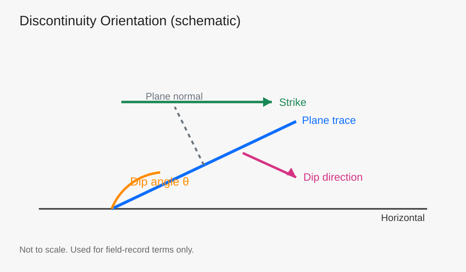
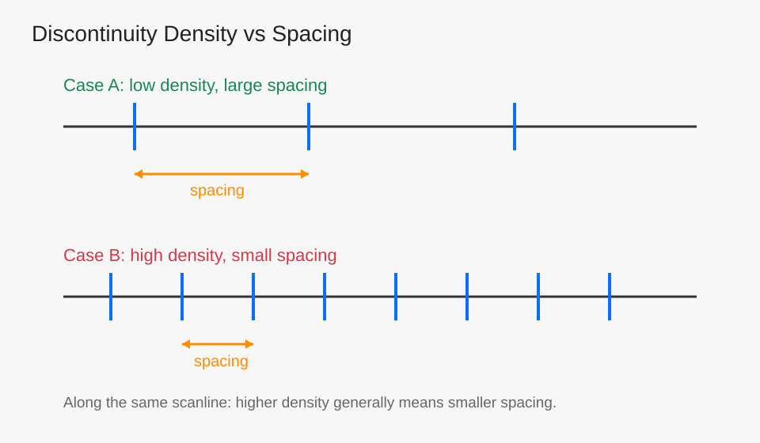

---
date: '2026-03-01T18:25:00+09:00'
draft: false
title: '岩体力学 Part 1：矿物组成、结构特征与结构面基础'
summary: "基于课堂速记，系统梳理岩石矿物组成、颗粒与胶结特征、风化指标、结构面特征量和岩体结构类型，作为后续强度与稳定性分析的基础底板。"
description: "岩体力学基础：矿物组成、微观结构、风化指标、结构面特征量与岩体结构类型。"
tags: ["Rock Mechanics", "Petrophysics", "Engineering Geology", "Mineralogy", "Discontinuity", "Weathering"]
categories: ["Crucible"]
---

# 岩体力学 Part 1：矿物组成、结构特征与结构面基础

这篇定位为“入门底图”：先把岩体材料与结构逻辑讲清楚，再进入后续的强度、变形与稳定性分析。  

主线是：矿物组成 -> 颗粒与胶结 -> 风化变化 -> 结构面分类与定量描述 -> 岩体结构类型。  

---

## 1. 组成岩石的主要矿物

### 1.1 硅酸盐类（常见于火成岩）

常见矿物：长石、辉石、角闪石、橄榄石。  

常见特征：多为粒状或柱状晶形，骨架效应较强，通常强度较高、抗变形能力较好。  

### 1.2 黏土类矿物

常见类型：高岭石、蒙脱石、伊利石。  

常见特征：片状/鳞片状结构，整体刚度和强度通常较低，含水后变形敏感性更强。  

### 1.3 碳酸盐类

典型化学组分可写作：$Ca^{2+}$、$Mg^{2+}$、$CO_3^{2-}$。  

常见类型：方解石、白云石、文石（霰石）。  

常见特征：与酸反应明显，部分环境下易溶蚀；岩体致密时强度可较高，但裂隙发育或风化后力学性能下降较快。  

---

## 2. 结构特征：颗粒与胶结

### 2.1 颗粒形态对力学行为的影响

从“咬合-嵌锁”角度，可做课堂级排序：粒状 > 片状 > 鳞片状。  

其意义是：越容易形成空间骨架，通常越有利于承载与稳定。  

### 2.2 胶结类型的工程直觉

入门层面的经验判断可记为：硅质胶结通常较强，铁质次之，钙质再后，泥质胶结相对较弱。  

该判断用于快速预判，后续仍需结合试验数据与岩性资料校正。  

---

## 3. 风化与可测指标

风化会改变岩体完整性、结构面状态以及波传播特征。  

常用快速指标包括：波速、波速比。  

一般规律可表述为：风化加剧 -> 裂隙增多与胶结弱化 -> 波速下降。  

---

## 4. 结构面基础分类

### 4.1 原生结构面

与成岩过程直接相关，常见来源包括沉积、岩浆和变质过程。  

### 4.2 次生结构面

由后期地质作用形成，如构造活动、卸荷与风化改造。  

### 4.3 压剪性（构造性）结构面

对剪切强度和整体稳定性影响显著，是工程分析中的重点对象。  

---

## 5. 结构面特征量（定量描述）

本节可视为现场记录与参数化建模的最小描述集合。  

### 5.1 产状：走向、倾向、倾角

产状定义了结构面的空间几何位置，是楔体识别和稳定性计算的首要输入。  

*图：结构面产状示意（非比例尺）

### 5.2 连续性系数（示意写法）

可用下式表达结构面连续性：

$$
k_1=\frac{\sum a}{\sum a+\sum b}
$$

其中 $a$ 可理解为连续段长度，$b$ 为中断段长度；$k_1$ 越大，结构面连续性越强。  

*图：沿测线的连续段与中断段示意

### 5.3 迹长

迹长越大，结构面越可能控制块体边界并形成潜在滑移路径。  

### 5.4 密度与间距

常见记录方式包括线密度（单位长度内结构面条数）和平均间距。  

在同一量测条件下，密度增大通常对应间距减小，岩体完整性趋于降低。  

*图：同一测线下密度与间距关系示意

### 5.5 张开度、粗糙度系数与充填

1. 张开度：主要影响渗流通道与法向刚度。  
2. 粗糙度系数：影响剪切咬合作用与抗剪强度。  
3. 充填：充填物类型与厚度会显著改变结构面强度和变形行为。

---

## 6. 岩体结构类型（课堂速记版）

结合课堂内容，可先按四类典型结构建立直觉框架：  

1. 整体块状：完整性较好，结构面控制作用相对弱。  
2. 层状：各向异性明显，层面控制变形与滑移。  
3. 碎裂状：结构面密集，块体尺度小，稳定性对支护条件更敏感。  
4. 散体状：完整岩块少，整体性差，工程扰动下易产生较大变形。

*图：岩体结构类型示意

---

## 7. 小结

这篇的核心价值在于建立“材料组成-结构特征-工程行为”的认知链。  

后续学习建议按以下顺序衔接：  

1. 强度准则：Mohr-Coulomb、Hoek-Brown。  
2. 结构面力学：法向闭合、剪切滑移与峰后行为。  
3. 工程场景：边坡、隧洞、地下采场的稳定性评价。

