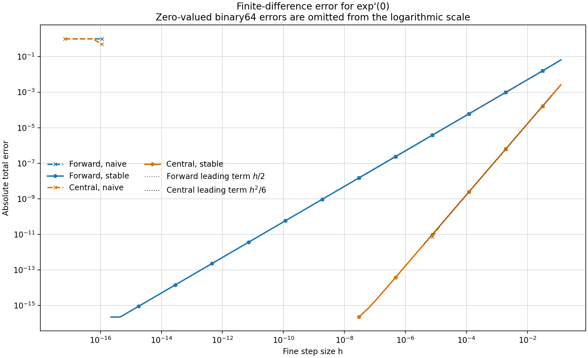

Taylor remainders do more than explain error after the fact. They can be used to control it. Consider

\[
A=f'(0)=1,\qquad f(x)=e^x.
\]

## 1. How Error Scales With Step Size

The forward difference is

\[
A_h=\frac{e^h-1}{h}.
\]

Taylor expansion gives

\[
A_h
=1+\frac h2+O(h^2),
\]

so

\[
E(h)=A_h-A\approx\frac h2.
\]

The central difference is

\[
A_h^{(c)}
=\frac{e^h-e^{-h}}{2h}
=\frac{\sinh h}{h},
\]

with

\[
A_h^{(c)}
=1+\frac{h^2}{6}+O(h^4).
\]

Symmetry removes the first-order term.

More generally, if

\[
A_h=A+Ch^p+O(h^{p+1}),
\qquad C\ne0,
\]

then

\[
\frac{E(h)}{E(h/2)}\approx2^p.
\]

Halving \(h\) divides a first-order error by about \(2\), and a second-order error by about \(4\).

## 2. Estimate Order Without Knowing the Truth

Usually \(A\) is unknown, so \(E(h)\) cannot be measured directly. Differences between scales still preserve the leading structure:

\[
A_{h/2}-A_h
\approx
C(2^{-p}-1)h^p.
\]

Using \(A_h,A_{h/2},A_{h/4}\),

\[
\boxed{
p_{\mathrm{obs}}
\approx
\log_2
\left|
\frac{A_{h/2}-A_h}
{A_{h/4}-A_{h/2}}
\right|.
}
\]

This infers an unknown error law from self-similarity across scales. It works only after the computation enters an asymptotic region where one term dominates; competing errors make the observed order drift.

## 3. Richardson Extrapolation Cancels the Leading Term

From

\[
A_h=A+Ch^p+\cdots,
\qquad
A_{h/2}=A+C2^{-p}h^p+\cdots,
\]

construct

\[
\boxed{
\widehat A=
\frac{2^pA_{h/2}-A_h}{2^p-1}.
}
\]

The \(Ch^p\) term vanishes. Geometrically, regard \(A_h\) as a point approaching the intercept \(A\) along the coordinate \(h^p\). Fit the leading line through two finite-step values and extrapolate it to \(h=0\).

This is not merely “use a smaller step.” It combines two imperfect approximations whose errors repeat with a predictable scale law.

## 4. Why \(h\) Cannot Shrink Forever

Naive forward differencing evaluates

\[
\frac{\operatorname{fl}(e^h)-1}{h}.
\]

Truncation decreases with \(h\), but cancellation and roundoff are amplified by division. A common model is

\[
E_{\mathrm{total}}(h)
\approx
C_1h^p+C_2\frac{u}{h}.
\]

Large \(h\) is truncation-dominated; very small \(h\) is floating-point-dominated.

Stable representations change the second path:

- use \(\operatorname{expm1}(h)/h\) for the forward difference;
- use \(\sinh(h)/h\) for the central difference.

On the right, the stable curves follow the leading terms \(h/2\) and \(h^2/6\); their log--log slopes reveal the truncation orders. At tiny steps, naive formulas fail through input rounding and cancellation. Stable formulas preserve the small quantity much longer; some errors round exactly to zero and are omitted from the logarithmic axis.

## 5. A Reusable Deterministic Workflow

1. Derive \(A_h=A+Ch^p+\cdots\).
2. Predict sign, scale ratio, and log--log slope before running.
3. Compute \(h,h/2,h/4\).
4. Estimate \(p_{\mathrm{obs}}\) from adjacent-scale differences.
5. Apply Richardson extrapolation only after the leading order stabilizes.
6. Keep reducing \(h\) to locate where roundoff or another source takes over.
7. Compare algebraically equivalent implementations with different numerical paths.

Source code, CSV data, and metadata are available in the [Taylor experiments in Error Atlas](https://github.com/r1skers/error-atlas/tree/main/topics/taylor-expansion/experiments).

---

**Next:** [Taylor 6: Putting Noise Into the Error Budget](/en/notes/systems/error-analysis/taylor-expansion/note-error-taylor-6-statistical-noise/)
