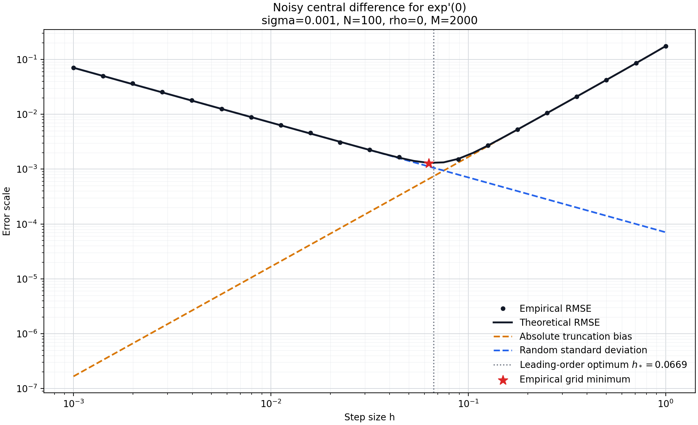

The deterministic model describes competition between truncation and roundoff. Function values may also come from sensors, stochastic simulation, or minibatch estimates, so observation noise must enter the same budget.

Continue estimating

\[
A=f'(0)=1,\qquad f(x)=e^x.
\]

One noisy central difference is

\[
D_i(h)=
\frac{[e^h+\varepsilon_{i,+}]
-[e^{-h}+\varepsilon_{i,-}]}{2h}.
\]

One estimator averages \(N\) observations:

\[
\bar D_{h,N}
=\frac1N\sum_{i=1}^{N}D_i(h).
\]

## 1. Separate \(N\) From \(M\)

- \(N\) is the inner sample count used to construct one estimate; it changes the estimator variance.
- \(M\) is the number of independent repetitions of the whole estimator; it measures bias, variance, and RMSE by Monte Carlo.

Increasing \(M\) makes the performance measurement more precise. It does not improve the estimator being measured or change the theoretical optimal step.

## 2. Truncation Bias

The noise-free central difference is

\[
\frac{e^h-e^{-h}}{2h}
=\frac{\sinh h}{h}.
\]

Its exact bias is

\[
b(h)=\frac{\sinh h}{h}-1,
\]

and for small \(h\),

\[
b(h)=\frac{h^2}{6}+O(h^4).
\]

## 3. Propagating Correlated Noise

Let \(Z_1,Z_2\) be independent standard normal variables and define

\[
\varepsilon_+=\sigma Z_1,
\]

\[
\varepsilon_-=
\sigma\left(
\rho Z_1+\sqrt{1-\rho^2}Z_2
\right).
\]

Both sides have standard deviation \(\sigma\) and correlation \(\rho\). After differencing and averaging \(N\) observations,

\[
\boxed{
V(h,N,\rho)=
\operatorname{Var}(\bar D_{h,N})=
\frac{\sigma^2(1-\rho)}{2Nh^2}.
}
\]

Three control laws appear:

- averaging reduces random standard deviation as \(N^{-1/2}\);
- division amplifies it as \(h^{-1}\);
- positive common-mode correlation is canceled by the difference.

## 4. MSE Puts Bias and Variance on One Scale

Write

\[
\bar D_{h,N}=A+b(h)+\xi,
\qquad \mathbb E[\xi]=0.
\]

Then

\[
\operatorname{MSE}=
\mathbb E[(\bar D_{h,N}-A)^2]
=b(h)^2+V(h,N,\rho).
\]

Therefore

\[
\boxed{
\operatorname{RMSE}(h,N,\rho)=
\sqrt{
\left(\frac{\sinh h}{h}-1\right)^2
+
\frac{\sigma^2(1-\rho)}{2Nh^2}
}.
}
\]

Bias and random standard deviation are not added directly. MSE combines bias squared and variance.

## 5. The U-Shape Need Not Be Symmetric

Use

\[
b(h)\approx Ch^2,
\qquad C=\frac16,
\]

and define

\[
K=\frac{\sigma^2(1-\rho)}{2N}.
\]

Then

\[
\operatorname{MSE}(h)
\approx
C^2h^4+\frac{K}{h^2}.
\]

Differentiation yields

\[
\boxed{
h_*=
\left(
\frac{\sigma^2(1-\rho)}
{4NC^2}
\right)^{1/6}.
}
\]

The optimum does not come from a symmetric U-shape or equal component values. It comes from cancellation of derivatives:

\[
\frac{K}{h_*^2}
=2C^2h_*^4.
\]

At the optimum, random variance is twice the squared bias.

## 6. Predictions and Experimental Results

With

\[
\sigma=10^{-3},\qquad N=100,\qquad\rho=0,
\]

the leading-order prediction is

\[
h_*\approx0.06694.
\]

Before running, the model predicts:

- random noise dominates on the left, with log--log slope \(-1\);
- truncation bias dominates on the right, with slope about \(2\);
- quadrupling \(N\) halves the random standard deviation;
- halving \(h\) divides truncation bias by about \(4\) and doubles random standard deviation.

Using 41 logarithmically spaced step sizes and \(M=2000\) repetitions per step:

- the theoretical left slope is \(-1.0000\);
- the theoretical right slope is \(2.0541\);
- theoretical and empirical grid minima both occur at \(h=0.06310\);
- the median relative difference between theoretical and empirical RMSE is about \(0.60\%\);
- the maximum relative difference is about \(3.18\%\).

The experiment supports one unified model of Taylor truncation bias, correlated-noise propagation, sample averaging, and MSE optimization.

## 7. Machine Error Remains After Theoretical Cancellation

When \(\rho=1\),

\[
\varepsilon_+=\varepsilon_-,
\]

so common noise cancels exactly in real arithmetic. The program still computes

\[
\operatorname{fl}(e^h+\varepsilon),
\qquad
\operatorname{fl}(e^{-h}+\varepsilon)
\]

at different locations on the floating-point grid. The two additions leave different rounding traces. After common noise cancels, the experiment still observes residual fluctuations of order \(10^{-16}\).

\[
\boxed{
\text{Is an unexplained residual stochastic variation, or new implementation error?}
}
\]

The complete experiment, tests, and closed-book rewrite are preserved in [Error Atlas](https://github.com/r1skers/error-atlas/tree/main/topics/taylor-expansion/experiments). This completes the Taylor topic: starting from a remainder definition, we obtain an error-control process that can be derived, predicted, run, and audited.

---

**Topic complete:** [Return to the Taylor Expansion parent page](/en/notes/systems/error-analysis/taylor-expansion/)
