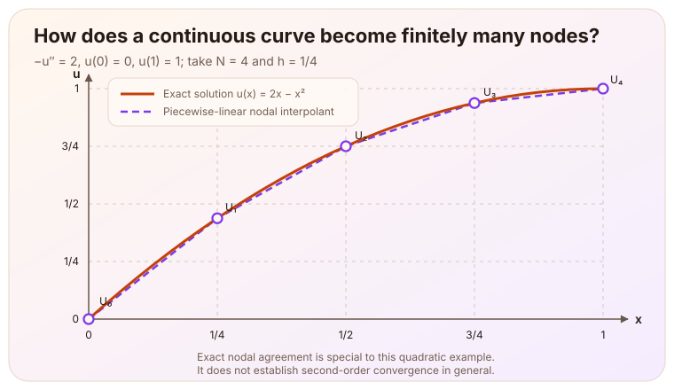
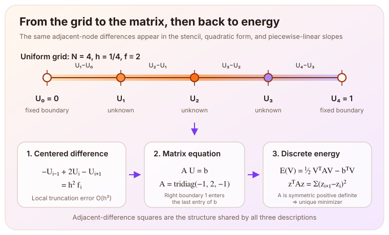

> This article is based on the second stage (M2: one-dimensional finite differences, matrices, and discrete energy) of the [Poisson equation learning thread](/en/notes/systems/poisson-equation/). The key steps were completed with hints and corrections; this stage did not yet include a numerical solve, grid convergence study, or performance experiment. The $O(h^2)$ in this article is the local truncation error of the centered difference, not the global error of the final numerical solution.

# From a Continuous Curve to Finitely Many Numbers

The [previous article](/en/notes/systems/poisson-equation/variation-unique-minimum/) started from a one-dimensional electrostatic potential problem and obtained

$$
-u''=f,
$$

then showed that the solution satisfying the weak form is the unique minimizer of the continuous energy

$$
J[v]=\int_0^1\left[\frac12(v')^2-fv\right]dx.
$$

That statement describes a function over the whole interval, while a computer can ultimately store only finitely many numbers. The next question is therefore: **how can a set of potential values at grid points approximate the whole curve while preserving as much of the original structure as possible?**

Consider the following dimensionless one-dimensional electrostatic potential problem:

$$
-u''(x)=f(x),\qquad 0\lt x\lt1,
\qquad u(0)=0,\qquad u(1)=1.
$$

The potential is zero at the left endpoint and one at the right endpoint. Using unequal endpoint values makes the contribution of the boundary conditions to the discrete equations directly visible. For the hand calculation, take

$$
f(x)\equiv2.
$$

All quantities in this example have been nondimensionalized. The exact solution of the continuous problem is

$$
u(x)=2x-x^2.
$$

The figure below shows the smooth analytic curve, five uniformly spaced grid nodes, and the piecewise-linear function obtained by joining the nodal values. Because the solution is quadratic, the centered second-difference formula is exact at every interior node. The grid still contains only finitely many samples, however, and the line segments between them still differ from the original smooth curve.

# The Centered Difference

Divide $[0,1]$ uniformly into $N$ subintervals:

$$
x_i=ih,\qquad h=\frac1N,
\qquad i=0,1,\ldots,N.
$$

First examine the exact solution near an interior node $x_i$. Write

$$
u_i=u(x_i).
$$

If $u$ is $C^4$ in the relevant neighborhood and its fourth derivative remains bounded as the grid is refined, Taylor expansion to the right and left gives

$$
\begin{aligned}
u_{i+1}
&=u_i+hu_i'+\frac{h^2}{2}u_i''
+\frac{h^3}{6}u_i'''+O(h^4),\\
u_{i-1}
&=u_i-hu_i'+\frac{h^2}{2}u_i''
-\frac{h^3}{6}u_i'''+O(h^4).
\end{aligned}
$$

Adding the two expansions cancels the odd-order terms:

$$
u_{i+1}-2u_i+u_{i-1}
=h^2u_i''+O(h^4).
$$

Dividing by $h^2$ gives the centered-difference formula

$$
u''(x_i)
=\frac{u_{i+1}-2u_i+u_{i-1}}{h^2}+O(h^2).
$$

Replacing $u''$ in $-u''=f$ with the centered approximation and dropping its $O(h^2)$ truncation term defines the discrete problem. This step also changes notation, and the two families of values must be kept apart: $u_i=u(x_i)$ samples the exact solution at the nodes, whereas $U_i$ is **defined** by the algebraic system below.

$$
-U_{i-1}+2U_i-U_{i+1}=h^2f_i,
\qquad f_i=f(x_i),
\qquad i=1,\ldots,N-1.
$$

Discarding the remainder is precisely where the discretization error enters: in general $U_i\neq u_i$. Everything below about the matrix and the discrete energy concerns $U_i$, and holds regardless of how far apart the two families are.

# Incorporating the Boundary Conditions

Now take $N=4$, so $h=1/4$. Of the five nodes, $U_0=0$ and $U_4=1$ are known. Only

$$
U_1,\quad U_2,\quad U_3
$$

must be solved for. The equations at the three interior nodes are

$$
\begin{aligned}
2U_1-U_2 &= h^2f_1,\\
-U_1+2U_2-U_3 &= h^2f_2,\\
-U_2+2U_3-U_4 &= h^2f_3.
\end{aligned}
$$

The last equation contains the known boundary value $U_4=1$. Moving it to the right-hand side gives

$$
-U_2+2U_3=h^2f_3+1.
$$

The discrete system can therefore be written as

$$
A\mathbf U=\mathbf b,
$$

where

$$
A=
\begin{pmatrix}
2&-1&0\\
-1&2&-1\\
0&-1&2
\end{pmatrix},
\qquad
\mathbf U=
\begin{pmatrix}U_1\\U_2\\U_3\end{pmatrix},
$$

$$
\mathbf b=
\begin{pmatrix}
h^2f_1\\h^2f_2\\h^2f_3+1
\end{pmatrix}
\;=\;
\begin{pmatrix}
1/8\\1/8\\9/8
\end{pmatrix}.
$$

The final $+1$ on the right is not an extra charge source. It is the contribution left after moving the known boundary potential to the other side. The left boundary value $U_0=0$ enters the first row in the same way, but its value is zero, so it leaves no visible term.

# The Matrix Records Differences Between Adjacent Potentials

Write any set of interior candidate potentials as

$$
\mathbf V=(V_1,V_2,V_3)^T,
\qquad V_0=0,\quad V_4=1,
$$

with the endpoints fixed at the same values as the discrete solution. Its difference from that solution is

$$
\mathbf z=\mathbf V-\mathbf U=(z_1,z_2,z_3)^T.
$$

Here $z_i$ is the difference between the candidate potential and the discrete solution at the same node; it is not the potential difference between adjacent nodes. Because $\mathbf V$ and $\mathbf U$ have the same fixed boundary values, their difference vanishes at the endpoints, so extend the notation by setting

$$
z_0=z_4=0.
$$

Expanding the matrix quadratic form directly gives

$$
\begin{aligned}
\mathbf z^TA\mathbf z
&=2z_1^2+2z_2^2+2z_3^2-2z_1z_2-2z_2z_3\\
&=z_1^2+(z_2-z_1)^2+(z_3-z_2)^2+z_3^2\\
&=\sum_{i=0}^{3}(z_{i+1}-z_i)^2.
\end{aligned}
$$

This sum of squares is clearly nonnegative. If it is zero, every adjacent difference must be zero, so

$$
z_0=z_1=z_2=z_3=z_4.
$$

The fixed-boundary conditions $z_0=z_4=0$ then imply $\mathbf z=0$. Therefore,

$$
\mathbf z\ne0
\quad\Longrightarrow\quad
\mathbf z^TA\mathbf z>0.
$$

The matrix also satisfies $A^T=A$, so $A$ is symmetric positive definite. The fixed boundary conditions matter again here: they exclude the zero-energy variation in which the same constant is added at every node.

# From the Matrix Quadratic Form Back to the Integral of a Squared Derivative

To make the connection with the continuous energy from the previous article explicit, join the nodal values $z_i$ by straight lines between adjacent nodes. This produces a piecewise-linear function $w_h$. On $(x_i,x_{i+1})$, its slope is constant:

$$
w_h'(x)=\frac{z_{i+1}-z_i}{h}.
$$

Although $w_h'$ need not be classically defined at the nodes, finitely many nodes do not affect the integral. On each subinterval,

$$
\int_{x_i}^{x_{i+1}}|w_h'|^2dx
=h\left(\frac{z_{i+1}-z_i}{h}\right)^2.
$$

Summing over the four subintervals gives

$$
\int_0^1|w_h'|^2dx
=\frac1h\sum_{i=0}^{3}(z_{i+1}-z_i)^2
=\frac1h\mathbf z^TA\mathbf z.
$$

This is the bridge between the continuous structure and the discrete matrix: the quadratic form of $A$ is not an arbitrary algebraic expression. It records the discrete slope energy created by changes between adjacent nodes.

The piecewise-linear function is introduced here only to explain the relationship between the integral and the matrix exactly. The discrete equation used here was derived from the centered difference, so this interpretation alone does not turn the method into a finite element method.

# The Discrete Equation Is Also a Minimization Problem

Return to the candidate vector $\mathbf V$ above, whose endpoints remain fixed at $V_0=0$ and $V_4=1$. Define its discrete energy by

$$
J_h(\mathbf V)
=\frac1{2h}\sum_{i=0}^{3}(V_{i+1}-V_i)^2
-h\sum_{i=1}^{3}f_iV_i.
$$

Let $v_h$ denote the piecewise-linear interpolant of these nodal values. The first term is one half of the integral of $|v_h'|^2$. The second term applies the composite trapezoidal rule to the source term. In this example, $f\equiv2$, so $fv_h$ is linear on each subinterval and the trapezoidal rule is exact. That conclusion does not extend directly to a general variable source.

If the endpoint contributions from the trapezoidal rule are written out, they add only a fixed constant independent of the interior unknowns, so they have been omitted from $J_h$ above. Expanding the adjacent-difference squares rewrites the discrete energy as

$$
J_h(\mathbf V)
=\frac1h
\underbrace{\left(
\frac12\mathbf V^TA\mathbf V-\mathbf b^T\mathbf V
\right)}_{E_h(\mathbf V)}
+\frac1{2h}.
$$

The final $1/(2h)$ comes from the $V_4^2=1$ left over when $(V_4-V_3)^2$ is expanded; the $-2V_3$ produced by that same expansion is absorbed exactly by the $+1$ in the last entry of $\mathbf b$, which is where moving the known boundary value to the right-hand side meets the discrete energy. The constant is independent of the interior unknowns and changes neither the stationary point nor the minimizer, so it is enough to study

$$
E_h(\mathbf V)=\frac12\mathbf V^TA\mathbf V-\mathbf b^T\mathbf V.
$$

Along an arbitrary nodal direction $\mathbf r$, consider $\mathbf V+t\mathbf r$. Its first-order variation is

$$
\left.\frac{d}{dt}E_h(\mathbf V+t\mathbf r)\right|_{t=0}
=\mathbf r^T(A\mathbf V-\mathbf b).
$$

This vanishes in every direction if and only if

$$
A\mathbf V=\mathbf b.
$$

Thus, setting the first variation of the discrete energy to zero returns exactly the grid equations assembled earlier from the centered difference.

# Why Is the Discrete Solution the Unique Minimizer?

Suppose $\mathbf U$ satisfies

$$
A\mathbf U=\mathbf b,
$$

and take any other candidate vector $\mathbf V$. Let $\mathbf z=\mathbf V-\mathbf U$. Expanding the energy difference gives

$$
\begin{aligned}
E_h(\mathbf U+\mathbf z)-E_h(\mathbf U)
&=\frac12(\mathbf U^TA\mathbf z+\mathbf z^TA\mathbf U)
+\frac12\mathbf z^TA\mathbf z-\mathbf b^T\mathbf z\\
&=\mathbf z^T(A\mathbf U-\mathbf b)
+\frac12\mathbf z^TA\mathbf z\\
&=\frac12\mathbf z^TA\mathbf z.
\end{aligned}
$$

Because $A\mathbf U=\mathbf b$, the first term vanishes. Positive definiteness of $A$ makes the second term strictly positive whenever $\mathbf z\ne0$. Therefore,

$$
E_h(\mathbf U+\mathbf z)>E_h(\mathbf U).
$$

Hence $\mathbf U$ is the unique global minimizer of both $E_h$ and $J_h$. Positive definiteness also means that $A\mathbf z=0$ has only the zero solution. The finite-dimensional square matrix $A$ is therefore invertible, so every right-hand side $\mathbf b$ has a unique discrete solution. This existence result applies only to the present finite-dimensional system; it does not replace an existence theory for the continuous Poisson equation.

Restoring the grid scale and using the piecewise-linear function $w_h$ defined above gives

$$
J_h(\mathbf U+\mathbf z)-J_h(\mathbf U)
=\frac1{2h}\mathbf z^TA\mathbf z
=\frac12\int_0^1|w_h'|^2dx.
$$

This has exactly the same structure as the continuous energy difference from the previous article,

$$
J[u+w]-J[u]=\frac12\int_0^1|w'|^2dx.
$$

In the continuous problem, the squared derivative controls the cost of moving away from the true solution. In the discrete problem, a matrix quadratic form built from differences between adjacent nodes plays the same role.

# What Has This Step Established?

| Step | Result | Current limit |
|---|---|---|
| Centered difference | Under a local $C^4$ assumption, the truncation error of the second-derivative approximation is $O(h^2)$ | This does not yet establish the global solution error for the full boundary-value problem |
| Matrix assembly | Nonzero boundary values enter the right-hand side after known terms are moved across | The numerical potential has not yet been solved for |
| Quadratic form | $A$ is symmetric positive definite, and adjacent-difference squares explain strict positivity | The result applies to the present one-dimensional fixed-boundary matrix |
| Discrete energy | The stationarity condition is equivalent to $A\mathbf U=\mathbf b$, and the discrete solution is the unique global minimizer | Exactness of the source-term quadrature depends on the constant source and quadrature rule used in this example |

One caution deserves emphasis: with $f\equiv2$, the continuous solution is quadratic, so the centered difference behaves unusually well at the nodes. Even if the computed nodal values later agree exactly with the analytic solution, this example cannot establish second-order global convergence for general smooth problems. A real error study needs a smooth manufactured solution that the difference formula does not reproduce exactly, several grid resolutions, and a separation between discretization error and iteration error.

# Next Step

The one-dimensional problem now forms a complete chain:

$$
\text{continuous equation}
\longrightarrow
\text{centered difference}
\longrightarrow
A\mathbf U=\mathbf b
\longrightarrow
\text{the unique minimizer of the discrete energy}.
$$

The next stage will extend the same ideas to the two-dimensional unit square: the one-dimensional second difference is replaced by the five-point Laplacian stencil, and the discrete system then leads to Jacobi iteration and a CPU implementation. Two new questions will need answers there: why does the iteration converge, and why does it become slower as the grid is refined?

---

The centered difference and the derivation of its local truncation error under smoothness assumptions follow MIT 18.330, *Introduction to Numerical Analysis*, [Chapter 2, §2.2](https://live.ocw.mit.edu/courses/18-330-introduction-to-numerical-analysis-spring-2012/aab35b69b416758992779e2ad508b286_MIT18_330S12_Chapter2.pdf). The relationship among symmetric positive definite matrices, quadratic forms, and minima follows MIT 18.06SC, [*Positive Definite Matrices and Minima*](https://ocw.mit.edu/courses/18-06sc-linear-algebra-fall-2011/d163e012754258d3b374548504d8a18a_MIT18_06SCF11_Ses3.3sum.pdf). The nonhomogeneous boundary terms, source vector, piecewise-linear integral, and energy difference are expanded step by step for the present one-dimensional example.
