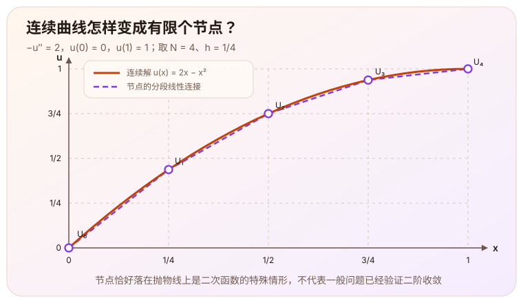
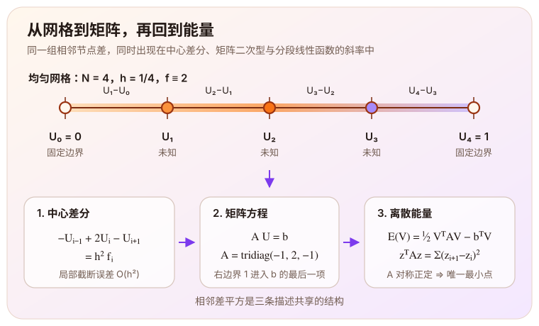

> 这是根据[泊松方程学习主线](/notes/systems/poisson-equation/)第二阶段（M2，一维差分、矩阵与离散能量）的记录整理。关键步骤经过了提示和纠错；本阶段尚未进行数值求解、网格收敛或性能实验。文中的 $O(h^2)$ 是中心差分的局部截断误差，不能直接当作最终数值解的全局误差。

# 从连续曲线到有限个数

[上一篇](/notes/systems/poisson-equation/variation-unique-minimum/)从一维静电势问题出发，得到

$$
-u''=f,
$$

并说明满足弱形式的解是连续能量

$$
J[v]=\int_0^1\left[\frac12(v')^2-fv\right]dx
$$

的唯一最小点。这个结论描述的是一整条函数，但计算机最终只能保存有限个数。于是下一步的问题变成：**怎样用一组网格点上的电势近似整条曲线，而且尽量保留原问题的结构？**

这次采用一个无量纲的一维静电势例子：

$$
-u''(x)=f(x),\qquad 0\lt x\lt1,
\qquad u(0)=0,\qquad u(1)=1.
$$

左端电势为零，右端电势为一。选择不同端点，是为了让边界条件进入离散方程的过程能够直接看见。手算例子进一步取

$$
f(x)\equiv2.
$$

这里的数字已经无量纲化。这个例子的连续解析解是

$$
u(x)=2x-x^2.
$$

下图同时画出光滑的解析曲线、五个均匀网格节点，以及由节点值连接成的分段线性函数。这个例子是二次函数，中心差分在这些节点上恰好精确；节点仍然只是有限个数，节点之间的折线也仍不同于原来的光滑曲线。

# 中心差分

把 $[0,1]$ 均匀分成 $N$ 段：

$$
x_i=ih,\qquad h=\frac1N,
\qquad i=0,1,\ldots,N.
$$

先在一个内部节点 $x_i$ 附近考察精确解。记

$$
u_i=u(x_i).
$$

若 $u$ 在相关邻域内属于 $C^4$，且四阶导数在网格缩小时保持有界，就可以分别向左右作 Taylor 展开：

$$
\begin{aligned}
u_{i+1}
&=u_i+hu_i'+\frac{h^2}{2}u_i''
+\frac{h^3}{6}u_i'''+O(h^4),\\
u_{i-1}
&=u_i-hu_i'+\frac{h^2}{2}u_i''
-\frac{h^3}{6}u_i'''+O(h^4).
\end{aligned}
$$

两式相加时，奇数阶项互相抵消：

$$
u_{i+1}-2u_i+u_{i-1}
=h^2u_i''+O(h^4).
$$

再除以 $h^2$，得到中心差分公式

$$
u''(x_i)
=\frac{u_{i+1}-2u_i+u_{i-1}}{h^2}+O(h^2).
$$

把中心差分代入 $-u''=f$，丢掉 $O(h^2)$ 余项，就得到离散问题。这一步同时换了记号，两套值要分清：$u_i=u(x_i)$ 是精确解在节点上的采样，$U_i$ 则由下面这组代数方程**定义**。

$$
-U_{i-1}+2U_i-U_{i+1}=h^2f_i,
\qquad f_i=f(x_i),
\qquad i=1,\ldots,N-1.
$$

丢掉余项的地方，正是离散误差进入的地方：$U_i$ 一般并不等于 $u_i$。后面所有关于矩阵和离散能量的结论都是关于 $U_i$ 的，它们成立与否不依赖这两者相差多少。

# 边界条件带入

现在取 $N=4$，因此 $h=1/4$。五个节点中，$U_0=0$、$U_4=1$ 已知，只有

$$
U_1,\quad U_2,\quad U_3
$$

需要求解。三个内部节点的方程分别是

$$
\begin{aligned}
2U_1-U_2 &= h^2f_1,\\
-U_1+2U_2-U_3 &= h^2f_2,\\
-U_2+2U_3-U_4 &= h^2f_3.
\end{aligned}
$$

最后一式含有已知边界值 $U_4=1$。将它移到右侧，得到

$$
-U_2+2U_3=h^2f_3+1.
$$

于是离散系统可以写成

$$
A\mathbf U=\mathbf b,
$$

其中

$$
A=
\begin{pmatrix}
2&-1&0\\
-1&2&-1\\
0&-1&2
\end{pmatrix},
\qquad
\mathbf U=
\begin{pmatrix}U_1\\U_2\\U_3\end{pmatrix},
$$

$$
\mathbf b=
\begin{pmatrix}
h^2f_1\\h^2f_2\\h^2f_3+1
\end{pmatrix}
\;=\;
\begin{pmatrix}
1/8\\1/8\\9/8
\end{pmatrix}.
$$

右端最后的 $+1$ 不是额外的电荷源，而是已知边界电势移项留下的贡献。左端的 $U_0=0$ 也以同样方式进入第一行，只是它的数值为零，所以没有留下可见的项。

# 矩阵记录相邻电势差

把任意一组内部候选电势记作

$$
\mathbf V=(V_1,V_2,V_3)^T,
\qquad V_0=0,\quad V_4=1,
$$

端点取与离散解相同的固定值。它与离散解之差记作

$$
\mathbf z=\mathbf V-\mathbf U=(z_1,z_2,z_3)^T.
$$

$z_i$ 表示同一个节点上两条候选电势之差，并不是相邻节点的电势差。因为两条候选曲线具有相同的固定边界，端点上的差为零，所以补上

$$
z_0=z_4=0.
$$

直接展开矩阵二次型：

$$
\begin{aligned}
\mathbf z^TA\mathbf z
&=2z_1^2+2z_2^2+2z_3^2-2z_1z_2-2z_2z_3\\
&=z_1^2+(z_2-z_1)^2+(z_3-z_2)^2+z_3^2\\
&=\sum_{i=0}^{3}(z_{i+1}-z_i)^2.
\end{aligned}
$$

这个平方和显然非负。若它等于零，每个相邻差都必须为零，于是

$$
z_0=z_1=z_2=z_3=z_4.
$$

再由固定边界给出的 $z_0=z_4=0$，得到 $\mathbf z=0$。因此

$$
\mathbf z\ne0
\quad\Longrightarrow\quad
\mathbf z^TA\mathbf z>0.
$$

矩阵 $A$ 又满足 $A^T=A$，所以它是对称正定矩阵。固定边界在这里再次发挥作用：它排除了“所有节点同时增加同一个常数”这种零能量变化。

# 从矩阵二次型回到导数平方积分

为了看清它和上一篇连续能量的联系，把节点值 $z_i$ 在每两个相邻节点之间用直线连接，得到分段线性函数 $w_h$。在区间 $(x_i,x_{i+1})$ 内，它的斜率恒为

$$
w_h'(x)=\frac{z_{i+1}-z_i}{h}.
$$

虽然 $w_h'$ 在节点处可能没有经典意义，但有限个节点不影响积分。每一段的导数平方积分为

$$
\int_{x_i}^{x_{i+1}}|w_h'|^2dx
=h\left(\frac{z_{i+1}-z_i}{h}\right)^2.
$$

对四段求和：

$$
\int_0^1|w_h'|^2dx
=\frac1h\sum_{i=0}^{3}(z_{i+1}-z_i)^2
=\frac1h\mathbf z^TA\mathbf z.
$$

这就是连续结构与离散矩阵之间的桥梁：$A$ 的二次型并不是一个凭空出现的代数表达式，它记录的正是相邻节点变化形成的离散斜率能量。

这里引入分段线性函数只是为了精确解释积分与矩阵的关系。当前离散方程仍然是从中心差分定义出来的，不能仅凭这一步就把整个方法称为有限元法。

# 离散方程也是一个最小化问题

回到上面那组候选电势 $\mathbf V$，端点仍固定为 $V_0=0$、$V_4=1$。它对应的离散能量取为

$$
J_h(\mathbf V)
=\frac1{2h}\sum_{i=0}^{3}(V_{i+1}-V_i)^2
-h\sum_{i=1}^{3}f_iV_i.
$$

第一项是分段线性插值函数导数平方积分的一半。第二项使用节点梯形求积处理源项。本例 $f\equiv2$，所以 $fv_h$ 在每个小区间上是线性函数，梯形求积恰好精确；一般的变源问题不能直接沿用这个结论。

若把梯形求积的端点源项也写出来，它只贡献一个与内部未知数无关的固定常数，因此已经在上面的 $J_h$ 中省略。再把相邻差平方展开，可以将这个离散能量整理为

$$
J_h(\mathbf V)
=\frac1h
\underbrace{\left(
\frac12\mathbf V^TA\mathbf V-\mathbf b^T\mathbf V
\right)}_{E_h(\mathbf V)}
+\frac1{2h}.
$$

最后的 $1/(2h)$ 来自展开 $(V_4-V_3)^2$ 时留下的 $V_4^2=1$；同一次展开给出的 $-2V_3$，正好被 $\mathbf b$ 最后一项的 $+1$ 抵消掉——边界移项和离散能量在这里对上了。这个常数与内部未知数无关，不会改变驻点或最小点，因此只需要研究

$$
E_h(\mathbf V)=\frac12\mathbf V^TA\mathbf V-\mathbf b^T\mathbf V.
$$

沿任意节点方向 $\mathbf r$ 考察 $\mathbf V+t\mathbf r$，一阶变化为

$$
\left.\frac{d}{dt}E_h(\mathbf V+t\mathbf r)\right|_{t=0}
=\mathbf r^T(A\mathbf V-\mathbf b).
$$

它对所有方向都为零，当且仅当

$$
A\mathbf V=\mathbf b.
$$

也就是说，对离散能量求驻点，正好返回之前由中心差分组装出的网格方程。

# 为什么离散解是唯一最小点？

设 $\mathbf U$ 满足

$$
A\mathbf U=\mathbf b,
$$

任取另一组候选节点 $\mathbf V$，令 $\mathbf z=\mathbf V-\mathbf U$。展开能量差：

$$
\begin{aligned}
E_h(\mathbf U+\mathbf z)-E_h(\mathbf U)
&=\frac12(\mathbf U^TA\mathbf z+\mathbf z^TA\mathbf U)
+\frac12\mathbf z^TA\mathbf z-\mathbf b^T\mathbf z\\
&=\mathbf z^T(A\mathbf U-\mathbf b)
+\frac12\mathbf z^TA\mathbf z\\
&=\frac12\mathbf z^TA\mathbf z.
\end{aligned}
$$

第一项由离散方程抵消；第二项由 $A$ 的正定性严格控制。因此只要 $\mathbf z\ne0$，就有

$$
E_h(\mathbf U+\mathbf z)>E_h(\mathbf U).
$$

所以 $\mathbf U$ 是 $E_h$，也是 $J_h$ 的唯一全局最小点。正定性还意味着 $A\mathbf z=0$ 只有零解；有限维方阵 $A$ 因而可逆，每个右端向量 $\mathbf b$ 都对应唯一的离散解。这个存在性结论只属于当前有限维系统，并不代替连续泊松方程的存在性理论。

还原网格尺度，并使用前面的分段线性函数 $w_h$，得到

$$
J_h(\mathbf U+\mathbf z)-J_h(\mathbf U)
=\frac1{2h}\mathbf z^TA\mathbf z
=\frac12\int_0^1|w_h'|^2dx.
$$

它与上一篇的连续能量差

$$
J[u+w]-J[u]=\frac12\int_0^1|w'|^2dx
$$

具有完全相同的结构：连续问题用函数导数的平方控制偏离真解的代价，离散问题用相邻节点差组成的矩阵二次型完成同一件事。

# 这一步证明了什么？

| 环节 | 已得到的结论 | 当前边界 |
|---|---|---|
| 中心差分 | 在局部 $C^4$ 条件下，二阶导数近似的截断误差为 $O(h^2)$ | 尚未推出整个边值问题的全局解误差 |
| 矩阵组装 | 非零边界通过移项进入右端向量 | 尚未实际求解数值电势 |
| 二次型 | $A$ 对称正定，相邻差平方解释严格正性 | 结论针对当前一维固定边界矩阵 |
| 离散能量 | 驻点条件等价于 $A\mathbf U=\mathbf b$，离散解是唯一全局最小点 | 源项积分的精确性依赖本例常源项与求积选择 |

尤其要注意：本例 $f\equiv2$ 的连续解是二次函数，中心差分会在节点上表现得过于理想。即使之后求出的节点值与解析解完全相同，也不能用这个例子证明一般光滑问题具有二阶全局收敛率。真正的误差验证需要换一个不会被差分格式精确再现的光滑解，至少比较多档网格，并把离散误差与迭代误差分开。

# 下一步

一维问题现在已经形成一条完整链条：

$$
\text{连续方程}
\longrightarrow
\text{中心差分}
\longrightarrow
A\mathbf U=\mathbf b
\longrightarrow
\text{离散能量的唯一最小点}.
$$

下一阶段会把相同思路扩展到二维单位正方形：二阶导数变成五点格式，离散系统再进入 Jacobi 迭代与 CPU 实现。到那时还要回答两个新问题：迭代为什么收敛，以及为什么网格变细后会越来越慢。

---

中心差分及局部光滑误差分析参考 MIT 18.330 *Introduction to Numerical Analysis*, [Chapter 2, §2.2](https://live.ocw.mit.edu/courses/18-330-introduction-to-numerical-analysis-spring-2012/aab35b69b416758992779e2ad508b286_MIT18_330S12_Chapter2.pdf)。对称正定矩阵、二次型与极小值的对应参考 MIT 18.06SC [*Positive Definite Matrices and Minima*](https://ocw.mit.edu/courses/18-06sc-linear-algebra-fall-2011/d163e012754258d3b374548504d8a18a_MIT18_06SCF11_Ses3.3sum.pdf)。本文中的非齐次边界、源项向量、分段线性积分和能量差按当前一维例子逐步展开。
