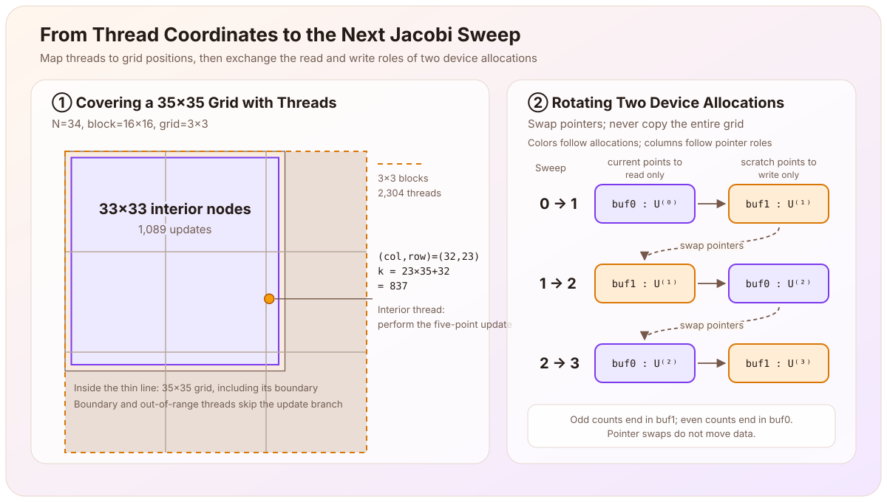

> This article records the fourth stage (M4: CUDA consistency) of the [Poisson equation learning thread](/en/notes/systems/poisson-equation/). The [preceding article](/en/notes/systems/poisson-equation/two-dimensional-jacobi-cpu/) derived and validated the CPU Jacobi implementation. In this stage, I implemented the CUDA kernel, launch and status checks, and fixed-count device-side double buffering. The validation driver and experiment packaging were supplied by the assistant, and I ran the remote GPU experiments on AutoDL. The corresponding learning-repository tag is `milestone-04-cuda`.

The preceding article discretized the two-dimensional Poisson equation

$$
-\Delta u=f,
\qquad
u|_{\partial\Omega}=0
$$

with the five-point stencil and obtained the Jacobi update

$$
U_{i,j}^{(k+1)}
=\frac14\left(
U_{i-1,j}^{(k)}+U_{i+1,j}^{(k)}
+U_{i,j-1}^{(k)}+U_{i,j+1}^{(k)}
+h^2f_{i,j}
\right).
$$

Moving to the GPU does not change this formula. What changes is who computes each interior node and how the old and new values are retained between sweeps:

$$
\boxed{
\text{Each grid position has a corresponding CUDA thread; only threads on interior nodes perform a five-point update.}
}
$$

The goal of M4 is therefore to check whether the following implementation chain preserves the same discrete algorithm:

$$
\text{two-dimensional thread coordinates}
\longrightarrow
\text{grid node and linear array index}
\longrightarrow
\text{five-point update}
\longrightarrow
\text{the next double-buffered sweep}.
$$

# How Does a Thread Find a Grid Point?

Including the boundary, the grid contains $N+1$ points in each direction. With a two-dimensional CUDA block and grid, a thread obtains its global column and row from

$$
\begin{aligned}
\text{col}&=\text{blockIdx.x}\cdot\text{blockDim.x}+\text{threadIdx.x},\\
\text{row}&=\text{blockIdx.y}\cdot\text{blockDim.y}+\text{threadIdx.y}.
\end{aligned}
$$

The grid is stored in row-major order, so the two-dimensional position maps to

$$
\text{k}=\text{row}\,(N+1)+\text{col}.
$$

Here, `k` follows the variable name in the code and denotes a linear array index. It is different from the superscript $k$ in $U^{(k)}$, which counts Jacobi sweeps.

The kernel is

```cpp
__global__ void jacobi_step_kernel(
    int N, double h2,
    const double* old, const double* f, double* next
) {
    int col = blockIdx.x * blockDim.x + threadIdx.x;
    int row = blockIdx.y * blockDim.y + threadIdx.y;
    int k = row * (N + 1) + col;

    if (row > 0 && row < N && col > 0 && col < N) {
        next[k] = 0.25 * (
            old[k - 1] + old[k + 1]
          + old[k - (N + 1)] + old[k + (N + 1)]
          + h2 * f[k]
        );
    }
}
```

The entries `k-1` and `k+1` are the left and right neighbors; `k-(N+1)` and `k+(N+1)` are the neighbors above and below. The easy point to confuse is that numbering a thread inside a block and laying out the two-dimensional grid in an array are two successive mappings. A block is not simply one contiguous segment of the array.

[](cuda-grid-and-buffer.en.svg)

## Why Test $N=34$ in Particular?

The program uses $16\times16$ blocks. When $N=34$, the complete grid is $35\times35$, so each direction requires

$$
\left\lceil\frac{35}{16}\right\rceil=3
$$

blocks. The launch therefore contains $3\times3=9$ blocks and $9\times256=2304$ threads. Only

$$
(N-1)^2=33^2=1089
$$

interior nodes are updated.

The remaining threads either land on the physical boundary or outside the $35\times35$ grid. Neither kind satisfies `row > 0 && row < N && col > 0 && col < N`, so neither enters the update branch.

For example, with `blockIdx=(2,1)` and `threadIdx=(0,7)`, we obtain

$$
\text{col}=2\cdot16+0=32,\qquad
\text{row}=1\cdot16+7=23,\qquad
\text{k}=23\times35+32=837.
$$

Both coordinates lie between $1$ and $33$, so this thread updates an interior node. Working through this concrete example also corrected my initial misunderstanding of the number of launched threads and the linear index.

# The Kernel Does Not Compute the Boundary

The kernel writes only interior points. Consequently, the statement that “the boundary remains zero” relies on an easily missed precondition: the caller initializes the boundaries of both device buffers to zero. No later sweep touches those entries, so they remain zero.

This is also why the tests assign nonzero values to the boundary of $f$. A correct implementation reads only `f[k]` at interior positions, so the boundary values of $f$ must not enter the computation. An incorrect index or boundary condition then has a chance to reveal itself.

# One Launch Has Two Error-Checking Moments

The host computes the grid dimensions by rounding up, launches the kernel, and performs two checks:

```cpp
dim3 block(16, 16);
dim3 gridDim(
    ((N + 1) + block.x - 1) / block.x,
    ((N + 1) + block.y - 1) / block.y
);

jacobi_step_kernel<<<gridDim, block>>>(N, h2, old, f, next);
check_cuda(cudaGetLastError(), "Jacobi launch");
check_cuda(cudaDeviceSynchronize(), "Jacobi execution");
```

The assistant supplied `check_cuda`, a small helper that throws an exception with the operation name whenever the status is not `cudaSuccess`; I chose the two locations at which it is called. `cudaGetLastError()` checks whether the launch has already reported an error. `cudaDeviceSynchronize()` waits for preceding device work to finish and brings execution-time errors back to the host. The current correctness-first implementation synchronizes after every sweep. Whether those synchronizations should be reduced, and how the code should be timed, are performance questions for the next stage.

# Several Sweeps Exchange Pointers Only

Jacobi sweep $k+1$ must read every value from sweep $k$. Values written earlier in the same sweep must not feed back into later updates. Two nonoverlapping arrays are therefore still required: one read-only buffer and one write-only buffer.

The device-side loop is

```cpp
double* jacobi_iterations(
    double* current, double* scratch, const double* f,
    int N, double h2, int iterations
) {
    for (int i = 0; i < iterations; ++i) {
        jacobi_step(current, f, scratch, N, h2);
        std::swap(current, scratch);
    }
    return current;
}
```

The loop neither copies the complete grid nor allocates device memory. `std::swap` exchanges only the values of two local pointers, thereby exchanging the read and write roles of the two device allocations for the next sweep. The loop invariant is

$$
\boxed{
\begin{aligned}
&\text{At the start of a sweep, current points to }U^{(k)}\text{;}\\
&\text{the sweep writes scratch, and after the swap current points to }U^{(k+1)}\text{.}
\end{aligned}
}
$$

To distinguish the pointers from the allocations they reference, call the two fixed device allocations initially referenced by `current` and `scratch` buf0 and buf1. The right half of the figure uses these names. Zero sweeps return buf0, an odd number of sweeps leaves the result in buf1, and an even number returns it to buf0. After three sweeps, the result is in buf1, but the pointer swaps have not moved the data.

# How Should CPU and GPU Results Be Compared?

Two images that look alike are not enough to check a kernel. The comparison fixes the following conditions:

- the same $N$, $h^2$, initial state, source term, and zero boundary;
- double precision on both CPU and GPU;
- exactly the same fixed sweep count, with no separate stopping conditions;
- comparison of all $(N+1)^2$ positions, including the boundary;
- for one sweep, verification that the read-only inputs `old` and `f` remain unchanged; for several sweeps, verification that `f` remains unchanged; and in both modes, an exact zero-boundary check;
- a predetermined interior tolerance
  $$
  |U_{\mathrm{GPU}}-U_{\mathrm{CPU}}|
  \le 10^{-12}\max(1,|U_{\mathrm{CPU}}|).
  $$

The tests also initialize the output buffer with NaNs in the interior and zeros on the boundary. A missed interior write leaves a NaN behind, while a kernel that incorrectly writes the boundary fails the exact-zero check.

## One Sweep: Isolate One Update

The one-sweep comparison uses three inputs, with $N=2,4,34$. The small grids expose boundary and degenerate cases; $N=34$ covers multiple blocks, a dimension that is not divisible by the block width, and surplus threads.

| $N$ | Complete nodes | Maximum absolute difference | Inputs unchanged | Boundary zero | Result |
|---:|---:|---:|:---:|:---:|:---:|
| 2 | 9 | $0$ | yes | yes | PASS |
| 4 | 25 | $0$ | yes | yes | PASS |
| 34 | 1225 | $0$ | yes | yes | PASS |

The CPU and GPU outputs are equal point by point after one sweep in all three cases. This checks one set of indices and five-point updates for the current inputs; it does not check pointer exchange over several sweeps.

## Fixed Sweep Counts: Check Buffer Parity and Accumulated Results

For each $N$, the multi-sweep comparison runs $0,1,2,3,16,101$ sweeps, giving 18 cases in total. Zero sweeps can reveal an unconditional extra update; odd and even counts check the returned pointer; and the longer runs check the accumulated result after repeated exchanges.

| $N$ | 0 sweeps | 1 sweep | 2 sweeps | 3 sweeps | 16 sweeps | 101 sweeps |
|---:|---:|---:|---:|---:|---:|---:|
| 2 | $0$ | $0$ | $0$ | $0$ | $0$ | $0$ |
| 4 | $0$ | $0$ | $0$ | $0$ | $0$ | $0$ |
| 34 | $0$ | $0$ | $4.34\times10^{-19}$ | $4.34\times10^{-19}$ | $0$ | $1.11\times10^{-16}$ |

Each entry is the maximum value of $|U_{\mathrm{GPU}}-U_{\mathrm{CPU}}|$ for that case. All 18 cases pass, `f` remains unchanged, and the boundary stays zero. The returned pointer also has the expected parity: odd counts return the caller's `scratch` allocation (buf1), while even counts return its `current` allocation (buf0).

# What Does $1.11\times10^{-16}$ Mean?

A few $N=34$ cases are not bitwise equal. The largest difference, $1.11\times10^{-16}$, is nevertheless almost four orders of magnitude below the $10^{-12}$ tolerance at that point, a factor of about 9,000, and lies at the scale of the last bits of double precision. This supports a limited conclusion: on the current hardware, with these compiler options and these test cases, the fixed-count CPU and GPU results agree within the predetermined tolerance.

It does not show that CPU and GPU results will always be bitwise identical. Their compilers may select different floating-point instruction sequences for the same expression, for example by making different fused multiply-add choices. The generated instructions were not inspected in this experiment, so this remains a hypothesis to test rather than an established source of the difference.

# What Has This Stage Established?

The experiment ran on an NVIDIA GeForce RTX 3080 Ti on AutoDL, with compute capability 8.6, `nvcc 11.8`, C++17, `-O2 -arch=native`, and FP64. The CPU reference and GPU kernel were built by the same `nvcc` command; `nvcc` delegated the host code to the system C++ compiler, whose version was not archived. CUDA 13.2 in `nvidia-smi` is the highest CUDA version supported by the driver, not the compiler version used here.

| Part | Established result | Current boundary |
|---|---|---|
| Thread mapping | Two-dimensional thread coordinates map correctly to the row-major grid, and the interior guard excludes surplus threads | Memory coalescing, warp divergence, and the best block dimensions have not been analyzed |
| Boundary handling | Both buffers begin with a zero boundary, the kernel writes only interior nodes, and the nonzero boundary of $f$ does not enter the tested computation | Only the current homogeneous Dirichlet boundary is covered |
| Double buffering | The fixed-count device loop reads one complete old sweep and writes one complete new sweep, returning the correct allocation for odd and even counts | The cost of synchronizing after every sweep has not been measured |
| One-sweep comparison | The three CPU/GPU one-sweep outputs are equal point by point | The cases are limited and do not imply bitwise equality for every input |
| Multi-sweep comparison | All 18 fixed-count cases agree within $10^{-12}\max(1,\lvert U_{\mathrm{CPU}}\rvert)$ | Residual stopping, continuous-solution error, and iterations to first convergence have not been checked |

The loop closed in M4 is

$$
\boxed{
\text{the same Jacobi formula}
\longrightarrow
\text{thread and array mapping}
\longrightarrow
\text{device-side double buffering}
\longrightarrow
\text{pointwise fixed-count CPU/GPU comparison}.
}
$$

Within the current experiments, the GPU implementation reproduces the CPU discrete iteration. This stage has not yet answered how far the discrete solution lies from the continuous solution, when iteration should stop, where the floating-point difference comes from, or how much faster the GPU actually is.

# Next Step

M5 will measure these questions separately: use a known continuous solution to check the two-dimensional grid-convergence error, compare the first sweep count that meets a common residual threshold, investigate the CPU/GPU rounding difference, and compare performance after removing unnecessary synchronizations and defining warm-up and timing scopes.

---

The CUDA hierarchy of grids, blocks, `blockIdx`, and `threadIdx` follows the official NVIDIA [*CUDA Programming Guide: Writing SIMT Kernels*](https://docs.nvidia.com/cuda/cuda-programming-guide/02-basics/writing-cuda-kernels.html). The waiting and asynchronous-error semantics of `cudaDeviceSynchronize()` follow [*CUDA Runtime API: Device Management*](https://docs.nvidia.com/cuda/cuda-runtime-api/cuda_runtime_api/group__CUDART__DEVICE.html). The kernel, device-side double buffering, three one-sweep cases, and eighteen fixed-count results come from the implementation and archived experiments in the current learning project.
