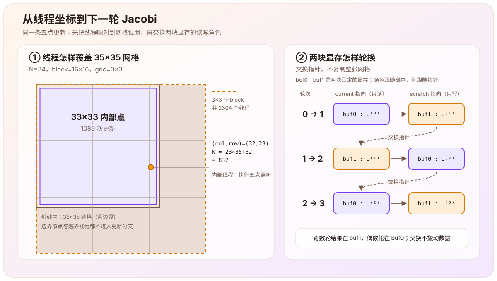

> 这篇文章根据[泊松方程学习主线](/notes/systems/poisson-equation/)第四阶段（M4，CUDA 一致性）的记录整理。[上一篇](/notes/systems/poisson-equation/two-dimensional-jacobi-cpu/)已经得到并校验了 CPU Jacobi；这一阶段由我实现 CUDA kernel、启动与状态检查，以及设备端固定轮数双缓冲。校验驱动和实验打包由助手提供，远程 GPU 实验由我在 AutoDL 上运行。对应学习仓库标签为 `milestone-04-cuda`。

上一篇把二维泊松方程

$$
-\Delta u=f,
\qquad
u|_{\partial\Omega}=0
$$

离散成五点格式，并整理出 Jacobi 更新：

$$
U_{i,j}^{(k+1)}
=\frac14\left(
U_{i-1,j}^{(k)}+U_{i+1,j}^{(k)}
+U_{i,j-1}^{(k)}+U_{i,j+1}^{(k)}
+h^2f_{i,j}
\right).
$$

搬到 GPU 以后，这条公式没有变化。变化的是谁来计算每个内部节点，以及两轮之间怎样保存旧值和新值：

$$
\boxed{
\text{每个网格位置对应一个 CUDA 线程；只有落在内部点上的线程才执行一次五点更新。}
}
$$

所以 M4 的目标是检查下面这条实现链是否保持了同一个离散算法：

$$
\text{二维线程坐标}
\longrightarrow
\text{网格节点与一维数组下标}
\longrightarrow
\text{五点更新}
\longrightarrow
\text{双缓冲中的下一轮}.
$$

# 一个线程怎样找到一个网格点？

包括边界在内，网格每个方向有 $N+1$ 个点。CUDA 使用二维 block 和二维 grid 后，线程对应的全局列、行是

$$
\begin{aligned}
\text{col}&=\text{blockIdx.x}\cdot\text{blockDim.x}+\text{threadIdx.x},\\
\text{row}&=\text{blockIdx.y}\cdot\text{blockDim.y}+\text{threadIdx.y}.
\end{aligned}
$$

网格在内存中按行连续存放，因此二维位置再映射成

$$
\text{k}=\text{row}\,(N+1)+\text{col}.
$$

这里的 `k` 沿用代码里的变量名，表示一维数组下标；它与公式中表示迭代轮次的上标 $k$（如 $U^{(k)}$）不是同一个量。

实际 kernel 如下：

```cpp
__global__ void jacobi_step_kernel(
    int N, double h2,
    const double* old, const double* f, double* next
) {
    int col = blockIdx.x * blockDim.x + threadIdx.x;
    int row = blockIdx.y * blockDim.y + threadIdx.y;
    int k = row * (N + 1) + col;

    if (row > 0 && row < N && col > 0 && col < N) {
        next[k] = 0.25 * (
            old[k - 1] + old[k + 1]
          + old[k - (N + 1)] + old[k + (N + 1)]
          + h2 * f[k]
        );
    }
}
```

`k-1`、`k+1` 是左右邻点，`k-(N+1)`、`k+(N+1)` 是上下邻点。这里最容易混淆的是：线程在 block 中怎样编号，与二维网格在数组中怎样排布，是两个连续的映射步骤，不能把一个 block 直接当成数组中的一段。

[](cuda-grid-and-buffer.svg)

## 为什么专门检查 $N=34$？

程序使用 $16\times16$ 的 block。$N=34$ 时完整网格是 $35\times35$，每个方向都需要

$$
\left\lceil\frac{35}{16}\right\rceil=3
$$

个 block，因此一共启动 $3\times3=9$ 个 block、$9\times256=2304$ 个线程。真正更新的内部点只有

$$
(N-1)^2=33^2=1089.
$$

其余线程有两种：落在物理边界上的线程，以及超出 $35\times35$ 网格范围的线程。二者都不满足 `row > 0 && row < N && col > 0 && col < N`，不会进入更新分支。

例如 `blockIdx=(2,1)`、`threadIdx=(0,7)` 时，

$$
\text{col}=2\cdot16+0=32,\qquad
\text{row}=1\cdot16+7=23,\qquad
\text{k}=23\times35+32=837.
$$

行列都在 $1$ 到 $33$ 之间，所以这个线程会更新内部节点。这个具体计算也纠正了我最初对启动线程数和一维下标的错误理解。

# 边界不是 kernel 算出来的

kernel 只写内部点，所以“边界保持为零”还依赖一个容易漏掉的前提：调用者事先把两块设备缓冲区的边界都初始化为零。之后每一轮都不再触碰边界，它才会一直保持零值。

这也就是为什么测试中把 $f$ 的边界设成非零。正确实现只读取内部位置的 `f[k]`，因此这些边界值不应进入计算；如果索引或边界判断写错，测试就有机会把问题暴露出来。

# 一次启动需要检查两个时刻

host 端用向上取整计算 grid 尺寸，然后启动 kernel：

```cpp
dim3 block(16, 16);
dim3 gridDim(
    ((N + 1) + block.x - 1) / block.x,
    ((N + 1) + block.y - 1) / block.y
);

jacobi_step_kernel<<<gridDim, block>>>(N, h2, old, f, next);
check_cuda(cudaGetLastError(), "Jacobi launch");
check_cuda(cudaDeviceSynchronize(), "Jacobi execution");
```

`check_cuda` 是助手提供的辅助函数，只负责在状态不是 `cudaSuccess` 时带着操作名抛出异常；在哪两个位置检查是我加的。`cudaGetLastError()` 检查启动阶段是否已经报告错误；`cudaDeviceSynchronize()` 等待此前的设备工作完成，也让执行期间的错误回到 host。当前版本每一轮都会同步，目的是先建立清楚的正确性边界。是否应减少同步、怎样计时，属于下一阶段的性能问题。

# 多轮迭代只交换指针

Jacobi 第 $k+1$ 轮必须全部读取第 $k$ 轮，不能让刚写出的值混入同一轮。因此仍然需要两块互不重叠的数组：一块只读，一块只写。

设备端循环是：

```cpp
double* jacobi_iterations(
    double* current, double* scratch, const double* f,
    int N, double h2, int iterations
) {
    for (int i = 0; i < iterations; ++i) {
        jacobi_step(current, f, scratch, N, h2);
        std::swap(current, scratch);
    }
    return current;
}
```

这里没有复制整张网格，也没有在循环中分配显存。`std::swap` 只交换两个局部指针的值，也就是交换两块显存下一轮的读写角色。循环不变量可以写成：

$$
\boxed{
\begin{aligned}
&\text{每轮开始时，current 指向 }U^{(k)}\text{；}\\
&\text{本轮写入 scratch，交换后 current 指向 }U^{(k+1)}\text{。}
\end{aligned}
}
$$

为了区分“指针”和“它指向的那块显存”，把调用时由 `current`、`scratch` 指向的两块显存分别叫作 buf0、buf1，上图右半部分用的就是这两个名字。零轮返回 buf0，奇数轮结果在 buf1，偶数轮结果回到 buf0；三轮后结果位于 buf1，但数据从未因为交换指针而搬家。

# 怎样比较 CPU 与 GPU？

“图形看起来相同”不足以检查 kernel。对照实验固定以下条件：

- 同一个 $N$、$h^2$、初值、源项和零边界；
- CPU 与 GPU 都使用双精度；
- 固定执行同样的轮数，不使用不同的停止条件；
- 回传并比较包括边界在内的全部 $(N+1)^2$ 个位置；
- 单步检查要求只读输入 `old` 和 `f` 未被改写；多轮检查要求 `f` 未变，并在两种模式下都要求边界精确为零；
- 内部点采用预先设定的容差
  $$
  |U_{\mathrm{GPU}}-U_{\mathrm{CPU}}|
  \le 10^{-12}\max(1,|U_{\mathrm{CPU}}|).
  $$

测试还把输出缓冲区的内部预置为 NaN、边界预置为零。如果某个内部线程漏写，NaN 会保留下来；如果 kernel 越界写到边界，精确零检查会失败。

## 单步：先隔离一轮更新

单步对照使用 $N=2,4,34$ 三组输入。小网格便于暴露边界和退化情形，$N=34$ 则覆盖多 block、不能整除 block 尺寸以及额外线程。

| $N$ | 完整节点数 | 最大绝对差 | 输入未变 | 边界为零 | 结果 |
|---:|---:|---:|:---:|:---:|:---:|
| 2 | 9 | $0$ | 是 | 是 | PASS |
| 4 | 25 | $0$ | 是 | 是 | PASS |
| 34 | 1225 | $0$ | 是 | 是 | PASS |

这三组的一轮 CPU/GPU 输出逐点相等。它验证了当前输入下的一次索引和五点更新，没有验证多轮指针交换。

## 固定轮数：再检查奇偶缓冲与累计结果

多轮对照对每个 $N$ 执行 $0,1,2,3,16,101$ 轮，共 18 组。零轮可以发现无条件多跑一轮，奇数和偶数轮可以检查返回指针，较长轮数则检查重复交换后的累计结果。

| $N$ | 0 轮 | 1 轮 | 2 轮 | 3 轮 | 16 轮 | 101 轮 |
|---:|---:|---:|---:|---:|---:|---:|
| 2 | $0$ | $0$ | $0$ | $0$ | $0$ | $0$ |
| 4 | $0$ | $0$ | $0$ | $0$ | $0$ | $0$ |
| 34 | $0$ | $0$ | $4.34\times10^{-19}$ | $4.34\times10^{-19}$ | $0$ | $1.11\times10^{-16}$ |

表中是各组 $|U_{\mathrm{GPU}}-U_{\mathrm{CPU}}|$ 的最大值。18 组全部通过，`f` 未被改写，边界保持零；返回的指针也符合预期：奇数轮是调用者传入的 `scratch`（buf1），偶数轮是 `current`（buf0）。

# $1.11\times10^{-16}$ 说明了什么？

$N=34$ 的少数组合没有逐位相等，但最大差 $1.11\times10^{-16}$ 仍比该点的容差 $10^{-12}$ 小将近四个数量级（约 9000 倍），处在双精度末位的尺度。这足以支持一个有限的结论：在当前硬件、编译选项和这些用例下，CPU 与 GPU 的固定轮数结果在既定容差内一致。

它不能支持“CPU 与 GPU 永远逐位一致”。CPU 与 GPU 编译器可能对同一表达式选用不同的浮点指令组合，例如是否合并乘加；但本次没有检查生成指令，所以这只是待验证的解释，不能写成已经确定的误差来源。

# 这一阶段证明了什么？

实验运行于 AutoDL 的 NVIDIA GeForce RTX 3080 Ti（compute capability 8.6），使用 `nvcc 11.8`、C++17、`-O2 -arch=native` 和 FP64。CPU 参考与 GPU kernel 由同一条 `nvcc` 命令编译，其中主机代码交给系统的 C++ 编译器，本次没有归档它的版本。`nvidia-smi` 显示的 CUDA 13.2 是驱动所支持的最高 CUDA 版本，不是本次编译器版本。

| 部分 | 已得到的结论 | 当前边界 |
|---|---|---|
| 线程映射 | 二维线程坐标正确映射到行优先网格，额外线程由内部点判断屏蔽 | 尚未分析访存合并、warp 分歧或最佳 block 尺寸 |
| 边界处理 | 两块缓冲区预置零边界，kernel 只写内部点；测试中非零的 $f$ 边界没有参与计算 | 只覆盖当前的齐次 Dirichlet 边界 |
| 双缓冲 | 固定轮数设备循环保持整轮读旧写新，奇偶轮返回正确缓冲区 | 每轮同步的性能代价尚未测量 |
| 单步对照 | 3 组 CPU/GPU 单步结果逐点相等 | 用例有限，不能外推为所有输入逐位相等 |
| 多轮对照 | 18 组固定轮数结果在 $10^{-12}\max(1,\lvert U_{\mathrm{CPU}}\rvert)$ 内一致 | 没有检查残差停止、连续解误差或首次收敛轮数 |

M4 建立的闭环是：

$$
\boxed{
\text{同一 Jacobi 公式}
\longrightarrow
\text{线程与数组映射}
\longrightarrow
\text{设备端双缓冲}
\longrightarrow
\text{CPU/GPU 固定轮数逐项对照}.
}
$$

这说明 GPU 版本在当前实验范围内复现了 CPU 的离散迭代过程。它还没有回答离散解离连续解多远、何时应停止、浮点差异来自哪里，以及 GPU 实际快多少。

# 下一步

M5 将把这些问题拆开测量：用已知连续解检查二维网格收敛误差，用同一残差阈值比较首次达到条件的轮数，进一步定位 CPU/GPU 舍入差异，并在去掉不必要同步、规范预热和计时范围后比较性能。

---

CUDA 的 grid、block、`blockIdx` 与 `threadIdx` 层级参考 NVIDIA 官方 [*CUDA Programming Guide: Writing SIMT Kernels*](https://docs.nvidia.com/cuda/cuda-programming-guide/02-basics/writing-cuda-kernels.html)。`cudaDeviceSynchronize()` 的等待与异步错误返回语义参考 [*CUDA Runtime API: Device Management*](https://docs.nvidia.com/cuda/cuda-runtime-api/cuda_runtime_api/group__CUDART__DEVICE.html)。本文中的 kernel、设备端双缓冲、3 组单步及 18 组固定轮数结果来自当前学习项目的实现与归档实验。
