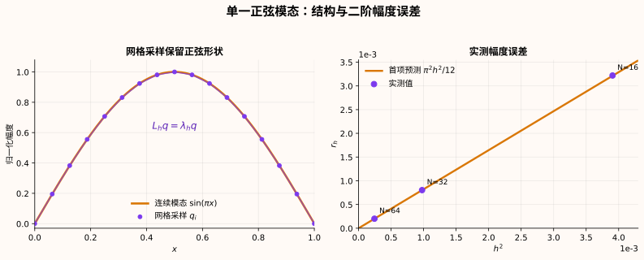

> 这是[泊松方程学习主线](/notes/systems/poisson-equation/)在 M2 与 M3 之间的一次实验检查。推导经过了提示与纠错；矩阵组装和直接求解由我完成，实验数据来自实际运行。它只验证一维、常系数、零 Dirichlet 边界下的固定单一模态，不是一般源项的完整收敛性证明。

# 从理想情况出发

[上一篇](/notes/systems/poisson-equation/centered-difference-discrete-energy/)从中心差分得到离散系统

$$
A\mathbf U=\mathbf b,
$$

并说明离散解也是一个能量的唯一最小点。右端 $\mathbf b$ 由源项采样与已知边界值的移项两部分组成；本文的例子两端都取零，所以 $\mathbf b=h^2\mathbf F$，其中 $\mathbf F$ 的分量就是 $f_i=f(x_i)$。

不过，上一篇的手算例子取 $f=2$，连续解恰好是二次函数。中心差分能够精确计算二次函数的二阶导数，所以节点值即使完全正确，也不能据此判断一般问题的误差怎样随网格缩小。

这次换一个不会被中心差分精确再现、同时又能算清楚的问题：

$$
\boxed{
-u''(x)=f(x),
\qquad 0\lt x\lt1,
\qquad u(0)=u(1)=0.
}
$$

先不急着指定 $f$。把方程两边分开看，它们承担着不同的角色：

| 方程的一边 | 对象 | 要回答的问题 |
|---|---|---|
| 左边 $-u''$ | 作用在未知电势 $u$ 上的算子 | 它怎样改变一种空间形状？ |
| 右边 $f$ | 已知源项 | 它由哪些空间形状组成？ |

求解泊松方程，就是找到一个 $u$，使左边经过算子处理后的结果与右边的源项逐个分量相等。

在一维静电势的解释中，$E=-u'$ 是电场，因此 $-u''=E'$ 描述电场沿空间的变化率，而 $f$ 来自给定的电荷分布。左边规定系统怎样响应，右边规定系统受到怎样的激励。

# 左边：算子怎样处理一种形状？

## 连续算子的自然模式

暂时把右端放下，先问一个只属于算子的问题：哪些函数经过 $-d^2/dx^2$ 后，形状不变，只改变幅度？这就是特征问题

$$
-\psi''=\lambda\psi,
\qquad \psi(0)=\psi(1)=0.
$$

对每个正整数 $n$，取

$$
\psi_n(x)=\sin(n\pi x),
$$

就有

$$
-\psi_n''(x)=(n\pi)^2\psi_n(x).
$$

因此

$$
\boxed{
\mathcal L\psi_n=\lambda_n\psi_n,
\qquad
\mathcal L=-\frac{d^2}{dx^2},
\qquad
\lambda_n=(n\pi)^2.
}
$$

正弦是零边界下这个算子的自然模式。这是左边算子的性质，与右端最终选择什么 $f$ 无关；它并没有假设实际电势必须是某一个正弦函数。

## 离散算子的自然模式

把区间均匀分成 $N$ 段：

$$
h=\frac1N,
\qquad x_i=ih,
\qquad i=0,1,\ldots,N.
$$

内部节点上的中心差分算子记为

$$
(L_h\mathbf U)_i
=\frac{2U_i-U_{i-1}-U_{i+1}}{h^2}.
$$

沿用上一篇的记号，$A$ 是主对角为 $2$、相邻对角为 $-1$ 的未缩放矩阵，因此

$$
L_h=\frac{A}{h^2}.
$$

这里的 $h^2$ 与选择正弦无关。Taylor 展开给出

$$
2u_i-u_{i-1}-u_{i+1}
=-h^2u''(x_i)+O(h^4),
$$

所以近似 $-u''$ 时必须除以 $h^2$。从离散能量也会得到相同的尺度：

$$
J_h(\mathbf U)
=\frac1{2h}\sum_{i=0}^{N-1}(U_{i+1}-U_i)^2
-h\sum_{i=1}^{N-1}f_iU_i.
$$

对内部节点 $U_i$ 求偏导并令其为零，得到

$$
\frac{2U_i-U_{i-1}-U_{i+1}}h-hf_i=0.
$$

把整个方程除以 $h$，就是 $(L_h\mathbf U)_i=f_i$。Taylor 展开说明这个缩放为何近似二阶导数，离散能量说明它怎样出现在驻点方程里。

现在采样连续正弦：

$$
q_i^{(n)}=\sin(n\pi ih).
$$

令 $\theta=n\pi h$，利用

$$
\sin((i-1)\theta)+\sin((i+1)\theta)
=2\sin(i\theta)\cos\theta,
$$

可得

$$
\begin{aligned}
(L_h\mathbf q^{(n)})_i
&=\frac{2\sin(i\theta)-\sin((i-1)\theta)-\sin((i+1)\theta)}{h^2}\\
&=\frac{2(1-\cos\theta)}{h^2}\sin(i\theta).
\end{aligned}
$$

所以网格上的正弦采样仍是精确特征向量：

$$
\boxed{
L_h\mathbf q^{(n)}=\lambda_{n,h}\mathbf q^{(n)},
\qquad
\lambda_{n,h}
=\frac4{h^2}\sin^2\left(\frac{n\pi h}{2}\right).
}
$$

未缩放矩阵 $A$ 与 $L_h$ 具有相同的特征向量，但特征值的尺度不同。若记 $A$ 的特征值为 $\mu_{n,h}$，则

$$
\mu_{n,h}=4\sin^2\left(\frac{n\pi h}{2}\right),
\qquad
\lambda_{n,h}=\frac{\mu_{n,h}}{h^2}.
$$

# 右边：源项怎样拆成这些模式？

现在回到右端 $f$。若先考虑一个有限的连续正弦组合

$$
f(x)=\sum_{n=1}^{M}c_n\psi_n(x),
$$

那么线性性允许每个模态独立响应。设

$$
u(x)=\sum_{n=1}^{M}a_n\psi_n(x),
$$

代入左边后得到

$$
-u''(x)=\sum_{n=1}^{M}a_n\lambda_n\psi_n(x).
$$

与右边逐个模态配平，就有

$$
a_n\lambda_n=c_n,
\qquad
\boxed{a_n=\frac{c_n}{\lambda_n}}.
$$

一般函数的无限正弦展开需要在合适的函数空间中讨论收敛；本文不借这个例子补做完整的 Fourier 理论。有限维离散问题则没有这层困难。

固定网格后，一共有 $N-1$ 个内部正弦向量：

$$
q_j^{(n)}=\sin\left(\frac{n\pi j}{N}\right),
\qquad n=1,2,\ldots,N-1.
$$

它们满足离散正交关系

$$
\sum_{j=1}^{N-1}q_j^{(n)}q_j^{(m)}
=\frac N2\,\delta_{nm}.
$$

这 $N-1$ 个非零且两两正交的向量构成 $\mathbb R^{N-1}$ 的一组基。因此任意离散源项都能唯一写成

$$
\mathbf F=\sum_{n=1}^{N-1}c_n\mathbf q^{(n)}.
$$

离散解相应地是

$$
\boxed{
\mathbf U=L_h^{-1}\mathbf F
=\sum_{n=1}^{N-1}
\frac{c_n}{\lambda_{n,h}}\mathbf q^{(n)}.
}
$$

这就是两边相遇的地方：右边负责给出每个正弦模态的源项系数 $c_n$，左边的特征值决定这个模态在解里被缩放多少。

| 层面 | 源项分解 | 解的对应分量 |
|---|---|---|
| 连续 | $c_n\psi_n$ | $(c_n/\lambda_n)\psi_n$ |
| 离散 | $c_n\mathbf q^{(n)}$ | $(c_n/\lambda_{n,h})\mathbf q^{(n)}$ |

所以一般电势不是单个正弦，而是多个正弦模态的叠加。只有当右端恰好只有一个模态时，解才是同一个正弦形状。

# 让两边各只剩一个模态

为了把连续与离散的差别单独暴露出来，本次实验主动选择

$$
f(x)=\sin(\pi x).
$$

右边此时只有 $n=1$ 一个模态，$c_1=1$。代入前面的 $a_n=c_n/\lambda_n$，连续解为

$$
u(x)=a_1\sin(\pi x),
\qquad
a_1=\frac1{\lambda_1}=\frac1{\pi^2},
$$

离散解则为

$$
\mathbf U=a_{1,h}\mathbf q^{(1)},
\qquad
a_{1,h}=\frac1{\lambda_{1,h}}.
$$

形状在两边都保持不变，于是误差只剩下连续幅度与离散幅度的差别。这是为了设计一个容易解释的实验，不是对一般电势形状的假设。

# 连续与离散的差别落在哪里？

固定 $n$，令 $h\to0$。由

$$
\cos\theta
=1-\frac{\theta^2}{2}+\frac{\theta^4}{24}+O(\theta^6),
$$

可以展开离散特征值：

$$
\begin{aligned}
\lambda_{n,h}
&=\frac{2[1-\cos(n\pi h)]}{h^2}\\
&=(n\pi)^2-\frac{(n\pi)^4}{12}h^2+O(h^4).
\end{aligned}
$$

也就是

$$
\boxed{
\lambda_{n,h}
=\lambda_n-\frac{(n\pi)^4}{12}h^2+O(h^4).
}
$$

离散特征值比连续特征值略小。定义带符号的相对幅度误差

$$
r_h
=\frac{1/\lambda_{n,h}-1/\lambda_n}{1/\lambda_n}
=\frac{\lambda_n}{\lambda_{n,h}}-1,
$$

由离散特征值的精确表达式可得

$$
r_h
=\left[
\frac{n\pi h}{2\sin(n\pi h/2)}
\right]^2-1,
$$

进一步展开：

$$
\boxed{
r_h=\frac{(n\pi)^2}{12}h^2+O(h^4).
}
$$

特征值的负偏差经过取倒数，变成了解幅度的正偏差。因此离散解的幅度略大，而且网格间距减半时，首项预测

$$
\frac{r_{h/2}}{r_h}\longrightarrow\frac14.
$$

这里始终要求固定 $n$ 再缩小 $h$，不能把这个展开直接套到频率随网格增长的最高频模态上。

# 用矩阵求解检查这个预测

实验固定 $n=1$，依次取

$$
N=16, 32, 64.
$$

代码没有用 $\mathbf q^{(1)}/\lambda_{1,h}$ 直接生成答案，而是独立组装三对角矩阵 $A$，构造 $h^2\mathbf F$，再用 `float64` 求解

$$
A\mathbf U=h^2\mathbf F.
$$

求解完成后，解析离散解

$$
\mathbf U_{\mathrm{ref}}
=\frac{\mathbf q^{(1)}}{\lambda_{1,h}}
$$

才作为独立参考。程序同时计算两种量。

第一种是离散参考误差：

$$
e_{\mathrm{ref}}
=\frac{\|\mathbf U-\mathbf U_{\mathrm{ref}}\|_2}
{\|\mathbf U_{\mathrm{ref}}\|_2}.
$$

它检查矩阵符号、节点数量、$h^2$ 因子与线性系统求解是否一致。

第二种先把数值解投影到正弦方向，测量幅度

$$
\widehat a_{1,h}
=\frac{(\mathbf q^{(1)})^T\mathbf U}
{(\mathbf q^{(1)})^T\mathbf q^{(1)}},
$$

再计算

$$
r_{\mathrm{measured}}=\pi^2\widehat a_{1,h}-1.
$$

它比较的是离散解与连续解的幅度。投影避免了在正弦零点附近逐点相除；保留 $e_{\mathrm{ref}}$ 则避免单个投影值掩盖向量中其他方向的实现错误。

# 三档网格的实际结果

运行环境为 Python 3.13.12、NumPy 2.4.6。实际输出为：

| $N$ | $h$ | $r_{\mathrm{measured}}$ | 首项预测 $\pi^2h^2/12$ | 上一档/本档 | $e_{\mathrm{ref}}$ |
|---:|---:|---:|---:|---:|---:|
| 16 | 0.0625000 | $3.218964\times10^{-3}$ | $3.212762\times10^{-3}$ | — | $1.854\times10^{-16}$ |
| 32 | 0.0312500 | $8.035777\times10^{-4}$ | $8.031905\times10^{-4}$ | 4.005791 | $2.963\times10^{-15}$ |
| 64 | 0.0156250 | $2.008218\times10^{-4}$ | $2.007976\times10^{-4}$ | 4.001446 | $8.569\times10^{-15}$ |

三个现象与推导一致：

1. 实测幅度误差均为正，说明离散解的幅度略大；
2. 实测值逐渐接近首项 $\pi^2h^2/12$；
3. $h$ 每减半一次，误差约缩小四倍。

用

$$
p=\log_2\frac{r_h}{r_{h/2}}
$$

计算观测阶，前后两组分别约为 $2.002$ 和 $2.001$，接近理论预测的 $p=2$。

$e_{\mathrm{ref}}$ 则只有 $10^{-16}$ 到 $10^{-14}$ 量级。这说明程序准确解出了它所组装的离散方程，却不表示离散解已经等于连续解。需要注意，$\mathbf U_{\mathrm{ref}}$ 本身也是用浮点算出来的，所以 $e_{\mathrm{ref}}$ 不是纯粹的线性求解器误差，只能说明两者在双精度范围内一致。这里比较的是两个不同层次：

$$
\underbrace{\mathbf U-\mathbf U_{\mathrm{ref}}}_{\text{实现与线性求解校验}}
\qquad\text{和}\qquad
\underbrace{\mathbf U_{\mathrm{ref}}-u|_{\mathrm{grid}}}_{\text{离散化误差}}.
$$

# 总结

以 $-u''=f$ 为中心，这次得到的结构是：

$$
\boxed{
\begin{aligned}
&\text{左边：连续与离散算子都有正弦自然模式}\\
&\text{右边：源项可以分解到这些模式上}\\
&\text{配平：每个解系数等于源项系数除以对应特征值}\\
&\text{误差：}\lambda_n\text{ 与 }\lambda_{n,h}\text{ 的差变成解的幅度差}.
\end{aligned}
}
$$

这也澄清了正弦在本文中的位置：

$$
\boxed{
\text{正弦是算子的模式，不是对电势形状的预设。}
}
$$

完整的离散正弦基可以表示任意离散源项和解，但本次数值实验只检查了固定的 $n=1$、三个网格和一个一维常系数问题。它没有证明一般源项的全局二阶收敛，没有检查高频模态，也没有涉及迭代误差或性能。稠密直接求解在这里只用于验证离散方程。

下一阶段进入二维单位正方形。连续算子从 $-u''$ 变成 $-\Delta u$，三点格式变成五点格式，直接求解也将让位于 Jacobi 迭代。这里的模态观点还会再次出现，用来解释 Jacobi 为什么收敛，以及网格变细后为什么会越来越慢。

---

连续正弦特征函数与泊松方程的系数求解参考 MIT 18.303 [Lecture 2 Summary](https://ocw.mit.edu/courses/18-303-linear-partial-differential-equations-analysis-and-numerics-fall-2014/d2d752d0d3370cc8fee328fcf07afd37_MIT18_303F14_Lecture2.pdf)；讲义把算子写成 $\hat A=d^2/dx^2$，在 $[0,L]$ 上给出特征函数 $\sin(n\pi x/L)$ 与特征值 $-(n\pi/L)^2$，本文取 $\mathcal L=-d^2/dx^2$ 且 $L=1$，因此特征值为 $+(n\pi)^2$。离散三对角矩阵及正弦特征向量练习参考 Durham University COMP4187 [Finite Differences](https://teaching.wence.uk/comp4187/exercises/finite-differences/#eigenvalues-and-eigenvectors)。本文的幅度误差展开、三档网格设计和数值结果按当前学习项目逐步推导与复现。
