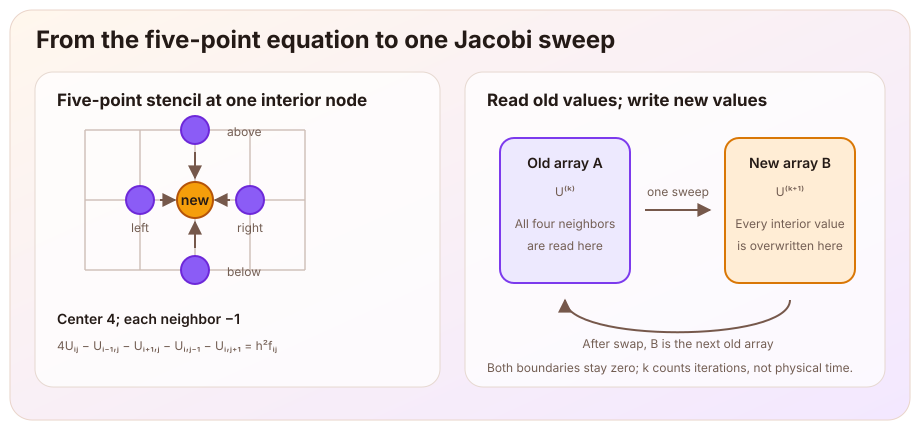

> This article records the third stage (M3: the two-dimensional five-point stencil, Jacobi iteration, and CPU implementation) of the [Poisson equation learning thread](/en/notes/systems/poisson-equation/). The five-point stencil and convergence analysis were completed with guidance and corrections. I implemented the three core functions: one Jacobi sweep, fixed-count double-buffered iteration, and the maximum residual. The input and output support, independent reference solver, and plots were supplied by the assistant. The corresponding learning-repository tag is `milestone-03-cpu`. This article checks the discrete equation and its iterative solution; it does not yet verify two-dimensional continuous-solution error, CUDA agreement, or performance.

# From a Line to a Plane

The preceding articles studied the one-dimensional equation

$$
-u''=f.
$$

The [discrete-energy article](/en/notes/systems/poisson-equation/centered-difference-discrete-energy/) turned it into a tridiagonal linear system. The [sine-mode article](/notes/systems/poisson-equation/sine-mode-convergence/) then examined how the continuous and discrete operators act on different spatial modes. This stage moves to the two-dimensional unit square:

$$
\boxed{
-\Delta u=f
\quad\text{in }\Omega=(0,1)^2,
\qquad
u=0
\quad\text{on }\partial\Omega.
}
$$

Here

$$
\Delta u=u_{xx}+u_{yy}.
$$

In the electrostatic interpretation, a specified charge source again determines the potential in a uniform medium, but the potential can now vary in both the $x$ and $y$ directions. The potential is fixed at zero along all four sides.

Divide each direction uniformly into $N$ subintervals:

$$
h=\frac1N,
\qquad
(x_i,y_j)=(ih,jh),
\qquad
i,j=0,1,\ldots,N.
$$

The full array, including the boundary, contains $(N+1)^2$ entries. The actual unknowns are the $(N-1)^2$ interior values. Write $U_{i,j}$ for the discrete potential and $f_{i,j}=f(x_i,y_j)$ for the sampled source. The vector formed from these interior source samples is denoted by $\mathbf F$.

# Two Three-Point Formulas Form One Five-Point Stencil

Hold $j$ fixed and use the one-dimensional centered difference in the $x$ direction; then hold $i$ fixed and do the same in the $y$ direction:

$$
\begin{aligned}
-u_{xx}(x_i,y_j)
&\approx
\frac{2U_{i,j}-U_{i-1,j}-U_{i+1,j}}{h^2},\\
-u_{yy}(x_i,y_j)
&\approx
\frac{2U_{i,j}-U_{i,j-1}-U_{i,j+1}}{h^2}.
\end{aligned}
$$

Adding them gives the five-point discretization of the two-dimensional Poisson equation:

$$
\boxed{
4U_{i,j}
-U_{i-1,j}-U_{i+1,j}
-U_{i,j-1}-U_{i,j+1}
=h^2f_{i,j}.
}
$$

The center coefficient is $4$ because the $x$ and $y$ directions each contribute $2$. Each of the four direct neighbors has coefficient $-1$. This equality defines the discrete problem; it does not claim that samples of the continuous solution satisfy it exactly. When the relevant fourth partial derivatives are locally continuous and bounded, the centered difference in each direction has local truncation error $O(h^2)$. This fact alone still does not establish the global solution error of the full boundary-value problem.

# From the Static Equation to a Jacobi Update

Solve the five-point equation for its center value:

$$
\boxed{
U_{i,j}^{(k+1)}
=\frac{
U_{i-1,j}^{(k)}+U_{i+1,j}^{(k)}
+U_{i,j-1}^{(k)}+U_{i,j+1}^{(k)}
+h^2f_{i,j}
}{4}.
}
$$

This is the Jacobi iteration used here. The superscript $k$ is an iteration count, not a power or physical time. The source remains fixed, and every boundary value remains zero.

Rearranging the equation produces an update rule, but does not by itself prove that the rule converges. The implementation has another equally important requirement: all four values on the right must come from iteration $k$, while every value on the left belongs to the common iteration $k+1$.

[](five-point-double-buffer.en.svg)

If values are overwritten in place, later nodes read a mixture of old and new data. The resulting method is no longer the Jacobi iteration written above. The implementation therefore uses two arrays:

- `old` stores iteration $k$ and is read only during the sweep;
- `next` receives iteration $k+1$, and every interior entry is overwritten;
- after the sweep, the two arrays exchange roles.

The boundary stays zero in both arrays. Swapping their roles does not require allocating a new full grid on every iteration.

# Why Does It Converge?

Fix a grid. Let $U^*$ be the exact solution of the five-point linear system and define the iteration error by

$$
e_{i,j}^{(k)}=U_{i,j}^{(k)}-U_{i,j}^*.
$$

The vector $U^*$ satisfies the same Jacobi fixed-point equation. Subtracting that equation from the numerical update cancels the source:

$$
\boxed{
e_{i,j}^{(k+1)}
=\frac{
e_{i-1,j}^{(k)}+e_{i+1,j}^{(k)}
+e_{i,j-1}^{(k)}+e_{i,j+1}^{(k)}
}{4}.
}
$$

The source determines the target $U^*$, while the four-neighbor averaging rule determines how the error propagates.

Following the one-dimensional sine-mode argument, consider the two-dimensional product modes

$$
\phi_{i,j}^{(p,q)}
=\sin(p\pi ih)\sin(q\pi jh),
\qquad
p,q=1,2,\ldots,N-1.
$$

If the error at one iteration has exactly one of these shapes, substitution into the recurrence and pairing the left-right and up-down neighbors shows that one sweep changes only its amplitude:

$$
e^{(k+1)}=g_{p,q}e^{(k)},
\qquad
\boxed{
g_{p,q}
=\frac{\cos(p\pi/N)+\cos(q\pi/N)}2.
}
$$

The same multiplier follows directly from the [sine-mode article](/notes/systems/poisson-equation/sine-mode-convergence/). There, the unscaled one-dimensional three-point matrix has eigenvalue $\mu_{n,h}=4\sin^2(n\pi h/2)$. The five-point operator is the sum of the three-point operators in the two coordinate directions, so it multiplies $\phi^{(p,q)}$ by $\mu_{p,h}+\mu_{q,h}$. The error recurrence can also be written as the current error minus one quarter of the unscaled five-point operator applied to that error. Hence

$$
g_{p,q}=1-\frac{\mu_{p,h}+\mu_{q,h}}{4}.
$$

Using $\sin^2\theta=(1-\cos2\theta)/2$ reduces this expression to the cosine average above.

Every allowed angle lies strictly inside $(0,\pi)$, so every nonzero mode satisfies

$$
|g_{p,q}|\lt1.
$$

The interior grid has $(N-1)^2$ degrees of freedom. The same number of two-dimensional sine products form an orthogonal basis, so any initial error has a finite expansion

$$
e_{i,j}^{(0)}
=\sum_{p=1}^{N-1}\sum_{q=1}^{N-1}
c_{p,q}\phi_{i,j}^{(p,q)}.
$$

After $k$ sweeps,

$$
e_{i,j}^{(k)}
=\sum_{p=1}^{N-1}\sum_{q=1}^{N-1}
c_{p,q}g_{p,q}^{k}\phi_{i,j}^{(p,q)}.
$$

Here $g_{p,q}^{k}$ is an actual power, unlike the parenthesized iteration superscript in $U^{(k)}$. For fixed $N$, the expansion contains finitely many terms. Every term tends to zero because $|g_{p,q}|\lt1$, and therefore the whole iteration error tends to zero. This is the modal convergence argument for the present square grid with zero boundary values.

# Why Does a Finer Grid Converge More Slowly?

The largest modal amplification factor in absolute value is

$$
\rho_N
=\max_{p,q}|g_{p,q}|
=\boxed{\cos\left(\frac\pi N\right)}.
$$

The positive factor for $(p,q)=(1,1)$ reaches this value, and the negative factor for $(N-1,N-1)$ reaches the same absolute value. A negative factor means that the error changes sign on each sweep, while its amplitude still decays as $|g_{p,q}|^k$. For this unweighted Jacobi method, it is therefore inaccurate to claim that every high-frequency mode disappears rapidly.

To reduce the slowest modal amplitude to one half of its initial value, we need

$$
\rho_N^k\le\frac12.
$$

Since

$$
\cos\left(\frac\pi N\right)
=1-\frac{\pi^2}{2N^2}+O(N^{-4}),
$$

the required number of sweeps satisfies

$$
\boxed{
k_{1/2}(N)
\sim\frac{2\ln2}{\pi^2}N^2.
}
$$

Doubling the number of subintervals per side from $N$ to $2N$ therefore multiplies the number of sweeps required for the same asymptotic reduction of the slowest mode by about four. This is a spectral prediction, not a runtime measurement.

# Residual, Iteration Error, and Per-Sweep Change

The theoretical iteration error

$$
e^{(k)}=U^{(k)}-U^*
$$

requires the exact discrete solution $U^*$, which is normally unavailable during a solve. A computable quantity is the equation residual

$$
\boxed{
r^{(k)}=\mathbf F-L_hU^{(k)}.
}
$$

At an interior node, the discrete operator is

$$
(L_hU)_{i,j}
=\frac{
4U_{i,j}-U_{i-1,j}-U_{i+1,j}
-U_{i,j-1}-U_{i,j+1}
}{h^2}.
$$

Subtracting the current value from the Jacobi update gives an exact identity:

$$
\boxed{
U_{i,j}^{(k+1)}-U_{i,j}^{(k)}
=\frac{h^2}{4}r_{i,j}^{(k)}.
}
$$

A small per-sweep change and a small residual are therefore not the same grid-independent statement. If the stopping rule is fixed as

$$
\|U^{(k+1)}-U^{(k)}\|_\infty\le\delta,
$$

then it is equivalent to permitting

$$
\|r^{(k)}\|_\infty
\le\frac{4\delta}{h^2}.
$$

When $N$ doubles and $h$ halves, the same update threshold permits a residual four times larger. To maintain a fixed residual target $\tau$, the update threshold should scale as $\delta=h^2\tau/4$.

# The CPU Core

The complete $(N+1)\times(N+1)$ grid is stored in row-major order:

```cpp
std::size_t index_of(int i, int j, int N) {
    return static_cast<std::size_t>(j) * (N + 1) + i;
}
```

The inner loop of one Jacobi sweep directly implements the five-point update:

```cpp
for (int j = 1; j < N; ++j) {
    for (int i = 1; i < N; ++i) {
        next[index_of(i, j, N)] = 0.25 * (
            old[index_of(i - 1, j, N)]
          + old[index_of(i + 1, j, N)]
          + old[index_of(i, j - 1, N)]
          + old[index_of(i, j + 1, N)]
          + h2 * f[index_of(i, j, N)]
        );
    }
}
```

The fixed-count iteration function creates two work grids outside the loop, calls the one-sweep function once per iteration, and then executes `swap`. The maximum-residual function traverses the interior nodes directly, evaluates $|\mathbf F-L_hU|$, and retains the largest value. All three functions use `double`. This stage includes no timing, and the direct solver is not part of the C++ core.

# How Do We Know the Program Solves the Same Discrete Problem?

A decreasing residual shows that the current vector is satisfying the discrete equations more accurately. By itself, however, it does not rule out indexing, sign, or assembly mistakes, and it does not verify that the continuous equation was discretized correctly. An independent reference is needed to check whether the indexing, signs, $h^2$, and double buffering all describe the intended five-point equation.

The validation script independently assembles the Python matrix

$$
A=I\otimes T+T\otimes I,
$$

where $T$ is the tridiagonal one-dimensional matrix with $2$ on the main diagonal and $-1$ on the adjacent diagonals. NumPy then directly solves

$$
A\mathbf U_{\mathrm{ref}}=h^2\mathbf F.
$$

The C++ Jacobi solver and Python reference receive identical initial values, sources, and boundaries. Two quantities are recorded: the deviation $D_k$ from the reference and the maximum norm $R_k$ of the residual defined above:

$$
D_k=\|U^{(k)}-U_{\mathrm{ref}}\|_\infty,
\qquad
R_k=\|\mathbf F-L_hU^{(k)}\|_\infty.
$$

$U_{\mathrm{ref}}$ is a double-precision direct-solve reference, not the mathematical exact value $U^*$. Its own residual is checked separately, and the pointwise C++ residual is cross-checked against the Python matrix residual.

The three validation cases are:

1. $N=2$: one interior node with $f=4$, for which the discrete solution is $1/4$ by hand;
2. $N=4$: asymmetric initial values and an asymmetric source, chosen to expose direction, indexing, and overwrite-order errors;
3. $N=8$: zero initial values and the asymmetric smooth source $f(x,y)=1+x+3y+2xy$.

These are three different problems, not three grid resolutions of one continuous problem. They therefore do not form a two-dimensional grid-convergence experiment.

# Measured Results

The experiment ran on Windows 11 with GCC 15.2.0, C++17 `-O2`, Python 3.13.12, and NumPy 2.4.6. C++ used `double`, and Python used `float64`.

| Case | Final sampled sweep | $D_k$ | C++ $R_k$ | Reference residual |
|---|---:|---:|---:|---:|
| $N=2$, one interior node | 2 | $0$ | $0$ | $0$ |
| $N=4$, asymmetric input | 128 | $8.881784\times10^{-16}$ | $1.136868\times10^{-13}$ | $8.526513\times10^{-14}$ |
| $N=8$, asymmetric smooth source | 512 | $1.665335\times10^{-16}$ | $7.105427\times10^{-15}$ | $1.421085\times10^{-14}$ |

The $N=2$ case actually reaches $U=1/4$ after its first sweep. The following plot records the deviation from the reference and the residual for the asymmetric $N=4$ case. The vertical axes use logarithmic scales.

[](jacobi-reference-convergence.en.svg)

For the $N=4$ case:

| $k$ | $D_k$ | $R_k$ |
|---:|---:|---:|
| 0 | $2.490714\times10^2$ | $1.363200\times10^4$ |
| 32 | $1.209259\times10^{-3}$ | $4.272461\times10^{-2}$ |
| 64 | $1.845183\times10^{-8}$ | $6.519258\times10^{-7}$ |
| 96 | $2.824407\times10^{-13}$ | $1.000444\times10^{-11}$ |

Both quantities decrease overall, but they are not numerically equal. The final $D_k$ is close to machine precision. This establishes agreement with the current floating-point reference value, not the true error relative to the exact discrete solution. The pointwise C++ residual and the Python matrix residual also differ at roundoff scale near the end, as expected in double precision.

The data also check the preceding spectral prediction. For $N=4$, the worst factor is $\cos(\pi/4)=1/\sqrt2$, so 32 sweeps should reduce the dominant amplitude by $2^{-16}$. The table gives

$$
\frac{D_{64}}{D_{32}}
=1.525879\times10^{-5},
\qquad
2^{-16}=1.525879\times10^{-5}.
$$

For the $N=8$ case, $D_{128}=1.126352\times10^{-5}$ and $D_{256}=4.471349\times10^{-10}$. Their ratio is $3.969761\times10^{-5}$, while the prediction is $\cos(\pi/8)^{128}=3.969760\times10^{-5}$. The late-stage decay in both cases is controlled by the slowest mode and agrees with the spectral analysis; the residual decreases by the same factor. This checks the contraction per sweep, not runtime or the first iteration at which a specified residual threshold is reached.

# What Has This Stage Established?

| Part | Established result | Current boundary |
|---|---|---|
| Five-point stencil | Centered-difference discretization of the two-dimensional negative Laplacian | The local $O(h^2)$ result has not yet been promoted to a global two-dimensional solution-error result |
| Jacobi analysis | Every two-dimensional sine error mode decays on a fixed grid | This is a guided exact-arithmetic analysis; an unaided complete reproduction has not been checked separately |
| Rate analysis | The worst factor is $\cos(\pi/N)$, the slowest-mode half-life grows as $N^2$, and the late measured contraction ratios for the $N=4$ and $N=8$ cases agree with $\cos(\pi/N)$ | This is not a runtime measurement or a measurement of iterations to a common residual threshold |
| CPU implementation | The one-sweep, fixed-count double-buffered, and maximum-residual functions are implemented and checked | A residual-based automatic stopping loop has not been implemented |
| Independent validation | In three small-grid cases, the iterates approach direct reference solutions of their respective five-point systems | The cases are limited, and the three values of $N$ correspond to different problems |

The central loop closed in this stage is therefore

$$
\boxed{
\text{the five-point stencil defines the discrete problem}
\longrightarrow
\text{Jacobi approaches its discrete solution}
\longrightarrow
\text{residuals and an independent reference check the implementation}.
}
$$

# Next Step

M3 completes the path from a two-dimensional discrete equation to a checkable CPU result. The next stage will move the same Jacobi update to CUDA: which nodes each thread owns, how the two-dimensional indices map to memory, how the boundary remains fixed, and how CPU and GPU results can be compared using the same discrete problem, precision, initial state, and iteration count.

Continuous-solution error, the two-dimensional grid-convergence order, iterations to the first residual-threshold crossing, and actual performance remain for later validation stages.

---

The construction of the two-dimensional five-point stencil follows the University of Pittsburgh MATH2071 page [*Lab 10: Iterative Methods*](https://sites.pitt.edu/~kimwong/lab10/index.html), which combines centered differences in the two coordinate directions into the discrete Poisson equation. The Jacobi update and the sine-transform structure of the two-dimensional discrete Poisson problem follow UC Berkeley CS267, [*Solving the Discrete Poisson Equation*](https://people.eecs.berkeley.edu/~demmel/cs267-1995/lecture24/lecture24.html). Those notes use $n$ interior points per side and write the Jacobi spectral radius as $\cos(\pi/(n+1))$; this article uses $N=n+1$ subintervals per side and therefore writes $\cos(\pi/N)$. The double-buffered implementation, residual identity, three validation cases, and measured outputs were developed and reproduced step by step in the current learning project.
