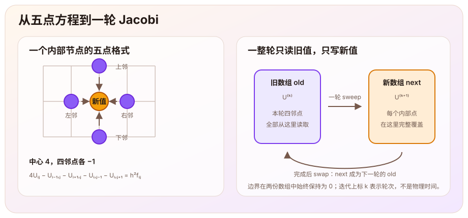
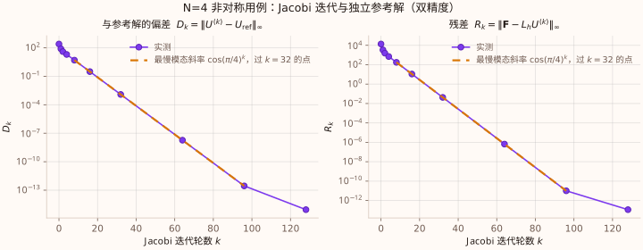

> 这篇文章根据[泊松方程学习主线](/notes/systems/poisson-equation/)第三阶段（M3，二维五点格式、Jacobi 与 CPU）的记录整理。五点格式和收敛分析经过引导与纠错；Jacobi 单步、多轮双缓冲和最大残差三个核心函数由我实现，输入输出、独立参考解和图表由助手提供。对应学习仓库标签为 `milestone-03-cpu`。本文检查的是离散方程及其迭代求解，尚未验证二维连续解误差、CUDA 一致性或性能。

# 从一条线走到一个平面

前面的文章先在一维区间上研究

$$
-u''=f.
$$

[离散能量一篇](/notes/systems/poisson-equation/centered-difference-discrete-energy/)把它变成三对角线性系统，[正弦模态一篇](/notes/systems/poisson-equation/sine-mode-convergence/)又说明连续与离散算子怎样处理不同的空间模式。这一阶段进入二维单位正方形：

$$
\boxed{
-\Delta u=f
\quad\text{in }\Omega=(0,1)^2,
\qquad
u=0
\quad\text{on }\partial\Omega.
}
$$

其中

$$
\Delta u=u_{xx}+u_{yy}.
$$

在静电势的解释下，仍然是在均匀介质中由给定电荷源求电势，只是电势现在可以沿 $x$、$y$ 两个方向变化。四条边界保持零电势。

两个方向都均匀分成 $N$ 个小区间：

$$
h=\frac1N,
\qquad
(x_i,y_j)=(ih,jh),
\qquad
i,j=0,1,\ldots,N.
$$

数组包含边界在内共有 $(N+1)^2$ 个位置，真正未知的内部节点共有 $(N-1)^2$ 个。记 $U_{i,j}$ 为待求的离散电势，$f_{i,j}=f(x_i,y_j)$ 为源项采样，这些采样按节点排成的向量记作 $\mathbf F$。

# 两个三点格式合成一个五点格式

固定 $j$，沿 $x$ 方向使用一维中心差分；固定 $i$，沿 $y$ 方向做同样的事：

$$
\begin{aligned}
-u_{xx}(x_i,y_j)
&\approx
\frac{2U_{i,j}-U_{i-1,j}-U_{i+1,j}}{h^2},\\
-u_{yy}(x_i,y_j)
&\approx
\frac{2U_{i,j}-U_{i,j-1}-U_{i,j+1}}{h^2}.
\end{aligned}
$$

两项相加，就得到二维泊松方程的五点格式：

$$
\boxed{
4U_{i,j}
-U_{i-1,j}-U_{i+1,j}
-U_{i,j-1}-U_{i,j+1}
=h^2f_{i,j}.
}
$$

中心系数为 $4$，因为 $x$、$y$ 两个方向各贡献一个 $2$；四个直接邻点的系数都是 $-1$。这里的等式定义离散问题，而不是说连续解采样后会精确满足它。在局部四阶偏导连续且有界时，两个方向的中心差分都具有 $O(h^2)$ 的局部截断误差；这仍不自动等于完整边值问题的全局解误差。

# 从静态方程得到 Jacobi 更新

把中心点单独解出来：

$$
\boxed{
U_{i,j}^{(k+1)}
=\frac{
U_{i-1,j}^{(k)}+U_{i+1,j}^{(k)}
+U_{i,j-1}^{(k)}+U_{i,j+1}^{(k)}
+h^2f_{i,j}
}{4}.
}
$$

这就是本文使用的 Jacobi 迭代。上标 $k$ 表示迭代轮次，不是幂，也不是物理时间。源项不随轮次改变，边界值始终固定为零。

从方程中移项只能得到一个更新规则，不能单独证明这个规则会收敛。实现上还有一个同样关键的要求：右边四个邻点必须全部来自第 $k$ 轮，左边才是统一的第 $k+1$ 轮。

[](five-point-double-buffer.svg)

如果直接在同一个数组里原地覆盖，后算的节点会读到部分新值，算法就不再是上面的 Jacobi。这里使用两份数组：

- `old` 保存第 $k$ 轮，整轮只读；
- `next` 接收第 $k+1$ 轮，所有内部点都会被覆盖；
- 一轮结束以后交换两个数组的角色。

两份数组的边界都保持为零。交换的是数组角色，并不需要在每一轮重新分配整张网格。

# 为什么它会收敛？

固定一个网格，令 $U^*$ 表示五点线性系统的精确解，定义迭代误差

$$
e_{i,j}^{(k)}=U_{i,j}^{(k)}-U_{i,j}^*.
$$

$U^*$ 也满足同一个 Jacobi 固定点方程。把数值迭代式与固定点式相减，源项正好消失：

$$
\boxed{
e_{i,j}^{(k+1)}
=\frac{
e_{i-1,j}^{(k)}+e_{i+1,j}^{(k)}
+e_{i,j-1}^{(k)}+e_{i,j+1}^{(k)}
}{4}.
}
$$

因此源项决定目标解 $U^*$，而误差怎样传播由这个“四邻点平均”规则决定。

沿用一维正弦模态的思路，观察二维乘积模态

$$
\phi_{i,j}^{(p,q)}
=\sin(p\pi ih)\sin(q\pi jh),
\qquad
p,q=1,2,\ldots,N-1.
$$

若某一轮误差只有一个这样的形状，代入误差递推并把左右、上下邻点分别配对，可以得到它每轮只改变幅度：

$$
e^{(k+1)}=g_{p,q}e^{(k)},
\qquad
\boxed{
g_{p,q}
=\frac{\cos(p\pi/N)+\cos(q\pi/N)}2.
}
$$

这个倍率也可以直接从[正弦模态一篇](/notes/systems/poisson-equation/sine-mode-convergence/)得到。那里一维三点格式的未缩放矩阵有特征值 $\mu_{n,h}=4\sin^2(n\pi h/2)$。五点格式是两个方向的三点格式相加，所以未缩放五点算子作用在 $\phi^{(p,q)}$ 上只是乘以 $\mu_{p,h}+\mu_{q,h}$。误差递推又可以写成“当前误差减去未缩放五点算子作用的四分之一”，于是

$$
g_{p,q}=1-\frac{\mu_{p,h}+\mu_{q,h}}{4}.
$$

用 $\sin^2\theta=\frac{1-\cos2\theta}{2}$ 化简，就回到上面的余弦平均。

允许的角度严格位于 $(0,\pi)$，所以每个非零模态都满足

$$
|g_{p,q}|\lt1.
$$

二维内部网格共有 $(N-1)^2$ 个自由度，而这些二维正弦乘积也恰有 $(N-1)^2$ 个，并且构成一组正交基。任意初始误差都可以写成有限和

$$
e_{i,j}^{(0)}
=\sum_{p=1}^{N-1}\sum_{q=1}^{N-1}
c_{p,q}\phi_{i,j}^{(p,q)}.
$$

第 $k$ 轮则是

$$
e_{i,j}^{(k)}
=\sum_{p=1}^{N-1}\sum_{q=1}^{N-1}
c_{p,q}g_{p,q}^{k}\phi_{i,j}^{(p,q)}.
$$

这里的 $g_{p,q}^{k}$ 是真正的 $k$ 次幂，与 $U^{(k)}$ 表示轮次的带括号上标不同。固定 $N$ 后，这只是有限项求和；每项都因 $|g_{p,q}|\lt1$ 而趋于零，所以整个迭代误差趋于零。这给出了当前零边界方形网格上 Jacobi 收敛的模态解释。

# 为什么网格越细越慢？

所有模态中最坏的幅度倍率是

$$
\rho_N
=\max_{p,q}|g_{p,q}|
=\boxed{\cos\left(\frac\pi N\right)}.
$$

它由 $(p,q)=(1,1)$ 的正倍率达到，也由 $(N-1,N-1)$ 的负倍率以相同绝对值达到。负倍率意味着误差符号逐轮交替，但绝对值仍按 $|g_{p,q}|^k$ 衰减。对这里的未加权 Jacobi，不能笼统地说所有高频误差都消失得很快。

若要把最慢模态的幅度降到初始的一半，需要

$$
\rho_N^k\le\frac12.
$$

由

$$
\cos\left(\frac\pi N\right)
=1-\frac{\pi^2}{2N^2}+O(N^{-4}),
$$

可以得到

$$
\boxed{
k_{1/2}(N)
\sim\frac{2\ln2}{\pi^2}N^2.
}
$$

所以每边小区间数从 $N$ 加倍到 $2N$ 时，最慢模态达到相同相对衰减所需的轮数约变成四倍。这是谱分析给出的渐近预测，不是运行时间测量。

# 残差、迭代误差和每轮改变量

理论中的迭代误差

$$
e^{(k)}=U^{(k)}-U^*
$$

需要知道精确离散解 $U^*$，实际求解时通常无法直接计算。一个可计算的量是方程残差

$$
\boxed{
r^{(k)}=\mathbf F-L_hU^{(k)}.
}
$$

内部节点上的离散算子为

$$
(L_hU)_{i,j}
=\frac{
4U_{i,j}-U_{i-1,j}-U_{i+1,j}
-U_{i,j-1}-U_{i,j+1}
}{h^2}.
$$

把 Jacobi 更新式减去当前值，可以得到一个精确关系：

$$
\boxed{
U_{i,j}^{(k+1)}-U_{i,j}^{(k)}
=\frac{h^2}{4}r_{i,j}^{(k)}.
}
$$

因此，每轮改变量小与残差小并不是脱离网格尺度的同一句话。若固定停止条件

$$
\|U^{(k+1)}-U^{(k)}\|_\infty\le\delta,
$$

它等价于允许

$$
\|r^{(k)}\|_\infty
\le\frac{4\delta}{h^2}.
$$

当 $N$ 加倍、$h$ 减半时，同一个改变量阈值允许的残差上限会扩大四倍。若想维持固定残差要求 $\tau$，改变量阈值应随网格取为 $\delta=h^2\tau/4$。

# CPU 核心实现

数组按行优先存放完整的 $(N+1)\times(N+1)$ 网格：

```cpp
std::size_t index_of(int i, int j, int N) {
    return static_cast<std::size_t>(j) * (N + 1) + i;
}
```

一轮 Jacobi 的核心循环直接对应五点更新：

```cpp
for (int j = 1; j < N; ++j) {
    for (int i = 1; i < N; ++i) {
        next[index_of(i, j, N)] = 0.25 * (
            old[index_of(i - 1, j, N)]
          + old[index_of(i + 1, j, N)]
          + old[index_of(i, j - 1, N)]
          + old[index_of(i, j + 1, N)]
          + h2 * f[index_of(i, j, N)]
        );
    }
}
```

多轮函数在循环外创建两份工作网格，每轮调用一次单步函数，再执行 `swap`。最大残差函数则直接遍历内部节点，计算 $|\mathbf F-L_hU|$ 并保留最大值。三个函数都使用 `double`；本阶段没有计时，也没有把直接求解器放进 C++ 核心。

# 怎样知道程序解的是同一个离散问题？

残差下降说明当前向量在逐步更好地满足离散方程，但它不能单独排除下标、符号或组装错误，也不能验证连续方程是否被正确离散。为了检查下标、符号、$h^2$ 和双缓冲是否共同指向正确的五点方程，还需要一个独立参考。

校验脚本在 Python 中独立组装

$$
A=I\otimes T+T\otimes I,
$$

其中 $T$ 是一维主对角为 $2$、邻对角为 $-1$ 的三对角矩阵。然后用 NumPy 直接求解

$$
A\mathbf U_{\mathrm{ref}}=h^2\mathbf F.
$$

C++ Jacobi 与 Python 参考解接收完全相同的初值、源项和边界。记录两种量：与参考解的偏差 $D_k$，以及前面定义的残差 $r^{(k)}$ 的最大范数 $R_k$：

$$
D_k=\|U^{(k)}-U_{\mathrm{ref}}\|_\infty,
\qquad
R_k=\|\mathbf F-L_hU^{(k)}\|_\infty.
$$

$U_{\mathrm{ref}}$ 是双精度直接求解得到的参考值，不是数学上的精确 $U^*$。参考解自己的残差也单独计算，C++ 逐点残差还与 Python 矩阵残差交叉对照。

三个校验用例分别是：

1. $N=2$：只有一个内部节点，$f=4$，可手算离散解为 $1/4$；
2. $N=4$：使用非对称初值和非对称源项，暴露方向、索引和覆盖顺序问题；
3. $N=8$：从零初值出发，使用非对称光滑源项 $f(x,y)=1+x+3y+2xy$。

这三个用例不是同一个连续问题的三档网格，因此不能把它们当成二维网格收敛实验。

# 实际结果

实验环境为 Windows 11、GCC 15.2.0、C++17 `-O2`、Python 3.13.12 与 NumPy 2.4.6；C++ 使用 `double`，Python 使用 `float64`。

| 用例 | 最后采样轮数 | $D_k$ | C++ $R_k$ | 参考解自身残差 |
|---|---:|---:|---:|---:|
| $N=2$，单内部点 | 2 | $0$ | $0$ | $0$ |
| $N=4$，非对称输入 | 128 | $8.881784\times10^{-16}$ | $1.136868\times10^{-13}$ | $8.526513\times10^{-14}$ |
| $N=8$，非对称光滑源项 | 512 | $1.665335\times10^{-16}$ | $7.105427\times10^{-15}$ | $1.421085\times10^{-14}$ |

$N=2$ 的用例实际在第一轮已经到达 $U=1/4$。下图记录 $N=4$ 非对称用例的参考解差与残差；纵轴采用对数尺度。

[](jacobi-reference-convergence.svg)

在 $N=4$ 用例中：

| $k$ | $D_k$ | $R_k$ |
|---:|---:|---:|
| 0 | $2.490714\times10^2$ | $1.363200\times10^4$ |
| 32 | $1.209259\times10^{-3}$ | $4.272461\times10^{-2}$ |
| 64 | $1.845183\times10^{-8}$ | $6.519258\times10^{-7}$ |
| 96 | $2.824407\times10^{-13}$ | $1.000444\times10^{-11}$ |

两个量整体下降，但数值并不相同。末尾 $D_k$ 接近机器精度，只能说明 C++ 迭代结果与当前浮点参考值一致，不能把它当作相对精确离散解的真实误差。C++ 逐点残差与 Python 矩阵残差在末尾也出现了舍入级差异，这同样属于双精度计算的正常范围。

这组数据还能直接检验前面的速度分析。$N=4$ 时最坏倍率是 $\cos(\pi/4)=1/\sqrt2$，每 32 轮应缩小 $2^{-16}$；表中

$$
\frac{D_{64}}{D_{32}}
=1.525879\times10^{-5},
\qquad
2^{-16}=1.525879\times10^{-5}.
$$

$N=8$ 用例中 $D_{128}=1.126352\times10^{-5}$、$D_{256}=4.471349\times10^{-10}$，比值 $3.969761\times10^{-5}$，预测 $\cos(\pi/8)^{128}=3.969760\times10^{-5}$。两个用例的后期衰减都由最慢模态控制，与谱分析一致；残差按同样的比例下降。这里检验的是每轮收缩因子，不是运行时间，也不是首次达到某个残差阈值所需的轮数。

# 这一阶段证明了什么？

| 部分 | 已得到的结论 | 当前边界 |
|---|---|---|
| 五点格式 | 二维负 Laplace 算子的中心差分离散式 | 局部 $O(h^2)$ 尚未升级为二维全局解误差结论 |
| Jacobi 分析 | 固定网格上所有二维正弦误差模态都衰减 | 属于精确算术下的引导分析，无提示完整复述仍待检查 |
| 速度分析 | 最坏倍率为 $\cos(\pi/N)$，最慢模态减半轮数按 $N^2$ 增长；$N=4$、$8$ 用例的后期实测收缩比与 $\cos(\pi/N)$ 吻合 | 不是实际运行时间或达到统一残差阈值的测量 |
| CPU 实现 | 单步、固定轮数双缓冲和最大残差均已实现并通过检查 | 尚未实现基于残差的自动停止循环 |
| 独立校验 | 三个小网格用例的迭代结果逼近各自五点离散系统的直接参考解 | 用例有限，且三个 $N$ 对应不同问题 |

因此这一阶段最核心的闭环是：

$$
\boxed{
\text{五点格式定义离散问题}
\longrightarrow
\text{Jacobi 逼近离散解}
\longrightarrow
\text{残差与独立参考解检查程序是否真的解对了它}.
}
$$

# 下一步

M3 到这里完成了从二维离散方程到可检查 CPU 结果的过程。下一阶段将把同一个 Jacobi 更新搬到 CUDA：线程负责哪些节点、二维索引怎样映射、边界怎样保持不变，以及 CPU/GPU 如何在相同离散问题、精度、初值和迭代轮数下逐项对照。

连续解误差、二维网格收敛阶、首次达到残差阈值的迭代次数和实际性能仍留到后续验证阶段。

---

二维五点格式参考匹兹堡大学 MATH2071 [*Lab 10: Iterative Methods*](https://sites.pitt.edu/~kimwong/lab10/index.html) 中由两个方向中心差分合成 Poisson 离散方程的步骤。Jacobi 更新和二维离散 Poisson 的正弦变换结构参考 UC Berkeley CS267 [*Solving the Discrete Poisson Equation*](https://people.eecs.berkeley.edu/~demmel/cs267-1995/lecture24/lecture24.html)；讲义以每边 $n$ 个内部点记号，把 Jacobi 谱半径写成 $\cos(\pi/(n+1))$，本文的小区间数 $N=n+1$，因此写作 $\cos(\pi/N)$。本文中的双缓冲实现、残差关系、三个校验用例与实际输出按当前学习项目逐步实现并复现。
