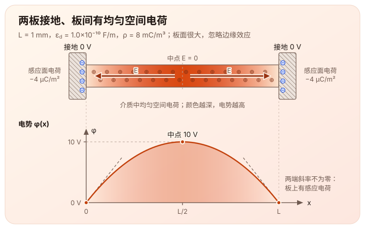

> 这篇文章根据[泊松方程学习主线](/notes/systems/poisson-equation/)第一阶段（M1，一维变分）的学习记录整理。关键步骤经过了提示和纠错。这里没有数值实验；文中例子的解可以直接积分得到，但一般情形下解的存在性还没有用变分方法证明。

# 问题的引入

两块大平行导体板相距 $L=1\,\mathrm{mm}$，都接地。板间填满均匀线性介质，介电率为

$$
\varepsilon_d=1.0\times10^{-10}\,\mathrm{F/m}
$$

（相对介电常数约 11，与硅接近）。介质里有给定且固定的体积自由电荷，密度 $\rho=8\,\mathrm{mC/m^3}$，均匀分布。板面足够大，忽略边缘效应，所有量只沿垂直于板的方向变化。问题：**两板之间每个位置的电势是多少？**

把位置记作 $x\in[0,L]$，电势记作 $\varphi(x)$，电场沿 $x$ 的分量记作 $E(x)$。电场是电势的负梯度：

$$
E=-\frac{d\varphi}{dx}.
$$

高斯定律说穿出一个闭合面的电通量等于它包住的自由电荷。按单位板面积取一薄片 $[x,x+\Delta x]$，两侧通量之差等于薄片内的电荷：

$$
\varepsilon_dE(x+\Delta x)-\varepsilon_dE(x)=\rho\,\Delta x
\qquad\Longrightarrow\qquad
\varepsilon_d\frac{dE}{dx}=\rho.
$$

代入 $E=-\varphi'$，就得到这次要解的方程：

$$
-\varepsilon_d\varphi''=\rho,
\qquad\varphi(0)=\varphi(L)=0.
$$

这里整条电势曲线 $\varphi(x)$ 未知，$\rho$ 是给定的源，微分方程约束介质内部，两个边界条件来自两板接地。

为了把区间缩放到 $[0,1]$，令

$$
\xi=\frac{x}{L},
\qquad u(\xi)=\varphi(L\xi).
$$

$\xi$ 是无量纲的比例坐标（$\xi=0.5$ 就是两板正中间），$u$ 仍然是电势，单位伏特。这次不必平移零点：两板接地，边界本来就是零。于是原问题变成

$$
-u''(\xi)=f(\xi),\qquad 0\lt\xi\lt1,
\qquad u(0)=u(1)=0,
$$

其中

$$
f(\xi)=\frac{L^2\rho}{\varepsilon_d}=80\,\mathrm V.
$$

这里电荷均匀，所以 $f$ 是常数。若电荷随位置变化，$\rho=\rho(x)$，同样的换算给出 $f(\xi)=L^2\rho(L\xi)/\varepsilon_d$；下文的推导对一般的 $f(\xi)$ 都成立。没有体积电荷的区域 $f=0$，方程退化成 Laplace 方程。

到这里，这次要研究的一维泊松方程就出来了。这个简单例子可以直接积分两次求出电势曲线：

$$
u(\xi)=\frac f2\,\xi(1-\xi).
$$

代入 $f=80\,\mathrm V$，中点电势是 $f/8=10\,\mathrm V$，就是上图下方的那条曲线。这只是解析模型给出的示意值，不是测量结果或数值实验。

**为什么实际的电势曲线也可以从一个最小化问题中得到**？这个联系又怎样延伸到之后的离散矩阵与数值计算？

先把候选电势曲线放进一个集合。本文在实值、足够光滑且端点为零的函数上手算：

$$
\mathcal V=\{\,v\in C^1([0,1])\mid v(0)=v(1)=0\,\}.
$$

对任意候选电势曲线 $v\in\mathcal V$，定义

$$
J[v]=\int_0^1\left[\frac12(v')^2-fv\right]d\xi.
$$

$J$ 接收的是一整条候选曲线，输出一个数。第一项衡量曲线在空间中的变化，第二项描述给定电荷与候选电势之间的作用。对于上面的静电模型，它可以由

$$
\mathcal E[\varphi]
=\int_0^L\left[\frac{\varepsilon_d}{2}E^2-\rho\varphi\right]dx,
\qquad E=-\varphi',
$$

经过坐标归一化、再乘上一个正常数得到。具体地，代入 $\varphi(x)=u(x/L)$ 可以验证

$$
\mathcal E[\varphi]=\frac{\varepsilon_d}{L}\,J[u].
$$

两者只差一个正的倍数，所以寻找 $J$ 的最小点不会改变要找的电势曲线。不同物理模型需要重新核对它自己的系数和能量表达式。

这里的“能量”措辞需要注意。$\mathcal E$ 的量纲是 $\mathrm{J/m^2}$（按单位板面积计），第一项 $\frac{\varepsilon_d}{2}E^2$ 确实是静电场的能量密度。但 $\mathcal E$ 不是“系统储存的能量”：在最小点上分部积分给出 $\int_0^L\frac{\varepsilon_d}{2}E^2dx=\frac12\int_0^L\rho\varphi\,dx$，于是 $\mathcal E=-\frac12\int_0^L\rho\varphi\,dx$，正好是场能的相反数。因此下文只把 $\mathcal E$ 视为导出泊松方程的变分泛函，不把它的函数值直接解释为系统储存的静电场能。

# 允许更改候选函数

现在固定同一个电荷分布，两板也保持接地。给定一条候选电势曲线 $v\in\mathcal V$，选择一个扰动方向 $\eta$，令

$$
v_\alpha=v+\alpha\eta.
$$

这里 $\alpha$ 是控制改动幅度和正反的实数（用 $\alpha$ 而不是 $\varepsilon$，避免与介电率混淆），$\eta$ 是描述“怎样改这条曲线”的固定函数。理解上 $\eta$ 不是板间的左右方向，$\alpha$ 也不是时间。因为两板始终接地，候选电势的端点值必须保持为零，所以要求 $\eta(0)=\eta(1)=0$，也就是 $\eta\in\mathcal V$。于是无论 $\alpha$ 取正还是负，$v_\alpha$ 都仍是允许的候选曲线。

端点为零的条件对加法和数乘封闭，$\mathcal V$ 是一个线性空间，候选曲线和扰动方向可以取自同一个集合。这一点依赖于两板同时接地：若两块板接在不同电压上，候选集合就不再对加法封闭（两条候选相加，端点电压会翻倍），需要先减去一个满足边界条件的已知函数，把问题移回零边界。

例如取 $\eta(\xi)=4\xi(1-\xi)$。它在两端等于零，在中点等于一；若 $\alpha=0.1$，就是把候选电势在中点抬高 $0.1\,\mathrm V$，同时两板仍然接地。这里比较的是同一个电荷分布下的不同候选曲线，它们不必事先满足泊松方程；最小化问题正是要从这些候选中找出真正的电势曲线。

把 $v+\alpha\eta$ 代进泛函，平方展开给出一个**精确恒等式**：

$$
\begin{aligned}
J[v+\alpha\eta]-J[v]
&=\alpha\int_0^1(v'\eta'-f\eta)\,d\xi\\
&\quad+\frac{\alpha^2}{2}\int_0^1(\eta')^2\,d\xi.
\end{aligned}
$$

对 $\alpha$ 求导，再取 $\alpha=0$，得到沿 $\eta$ 的一阶变分：

$$
\delta J[v;\eta]
=\left.\frac{d}{d\alpha}J[v+\alpha\eta]\right|_{\alpha=0}
=\int_0^1(v'\eta'-f\eta)\,d\xi.
$$

# 从极小点走到弱形式

现在假设 $u$ 是一个极小点。对每个 $\eta\in\mathcal V$，一元函数 $g(\alpha)=J[u+\alpha\eta]$ 在 $\alpha=0$ 取得局部最小值。由于 $\alpha$ 可以从两侧变化，必要条件是 $g'(0)=0$。因此

$$
\int_0^1u'\eta'\,d\xi=\int_0^1f\eta\,d\xi
\qquad\text{对所有 }\eta\in\mathcal V.
$$

这就是本问题的弱形式。它只涉及 $u$ 的一阶导数。这里的逻辑暂时是“**若存在极小点，则它满足弱形式**”，还没有证明极小点存在，也没有仅凭一阶变分为零就断言它一定是最小值。

这里的 $u$ 和 $\eta$ 都取自 $\mathcal V$。若只要求 $f\in L^2(0,1)$，自然的弱形式要放在 $H_0^1(0,1)$ 中理解，不能未经额外条件就把 $-u''=f$ 当成逐点成立的经典方程。

如果再假设 $u\in C^2([0,1])$、$f\in C([0,1])$，就可以做经典分部积分：

$$
\int_0^1u'\eta'\,d\xi
=[u'\eta]_0^1-\int_0^1u''\eta\,d\xi.
$$

边界项为零的直接原因是 $\eta(0)=\eta(1)=0$，并不要求 $u'$ 在端点为零。放回那两块板看，端点斜率不但不必为零，物理上也不可能为零：$u'(0)=f/2=40\,\mathrm V$、$u'(1)=-40\,\mathrm V$，换回物理量就是两板处的电场 $E(0)=-40\,\mathrm{kV/m}$、$E(L)=40\,\mathrm{kV/m}$，都指向板面。两板各感应出 $-\rho L/2=-4\,\mu\mathrm{C/m^2}$ 的面电荷，合起来正好抵消介质里的全部空间电荷，场线才有地方终止。端点斜率为零意味着那里没有感应面电荷，那是另一种边界条件。

弱形式于是变成

$$
\int_0^1(-u''-f)\eta\,d\xi=0
\qquad\text{对所有 }\eta\in\mathcal V.
$$

关键是“对所有”。如果连续函数 $r=-u''-f$ 在某个内部点为正，它会在附近一小段 $[a,b]\subset(0,1)$ 上保持正值。选一个只在这段内非零、且不恒为零的非负扰动，例如

$$
\eta(\xi)=
\begin{cases}
(\xi-a)^2(b-\xi)^2, & a\le\xi\le b,\\
0, & \text{其余位置},
\end{cases}
$$

它是 $C^1$ 的，端点为零，属于 $\mathcal V$。代进去就会得到 $\int_0^1 r\eta\,d\xi>0$，与上式矛盾。负值情形相同。因此在这些额外的光滑条件下，$r=0$，也就是 $-u''=f$ 在 $(0,1)$ 逐点成立。

# 弱形式为什么给出唯一最小点？

反过来，假设 $u$ 满足弱形式。任取另一个候选函数 $v\in\mathcal V$，令 $w=v-u$。因为 $\mathcal V$ 是线性空间，$w$ 也属于 $\mathcal V$，是允许的扰动方向，而且不必很小。直接比较两个函数的能量：

$$
\begin{aligned}
J[v]-J[u]
&=J[u+w]-J[u]\\
&=\underbrace{\int_0^1(u'w'-fw)\,d\xi}_{=0\text{，由弱形式取 }\eta=w}
+\frac12\int_0^1(w')^2\,d\xi\\
&\geq 0.
\end{aligned}
$$

所以，只要这样的弱解存在，它就是**全局**最小点。换回物理量，这个差值正好是“误差电场”自己的场能：

$$
\mathcal E[\varphi_v]-\mathcal E[\varphi_u]
=\frac{\varepsilon_d}{2}\int_0^L(E_v-E_u)^2dx.
$$

候选曲线比真解多出来的那部分能量，等于它在电场上偏差的平方。

什么时候取等号？在当前光滑情形下，$\int_0^1(w')^2\,d\xi=0$ 意味着 $w'=0$，所以 $w$ 是常数。再用 $w(0)=0$，得到 $w\equiv0$，即 $v=u$。零边界条件在这里排除了任意常数偏移，于是最小点唯一。弱解也至多有一个：若 $u_1,u_2$ 都满足弱形式，两式相减得 $\int_0^1(u_1'-u_2')\eta'\,d\xi=0$，取 $\eta=u_1-u_2$，同样推出 $u_1=u_2$。

最后还差一个方向，才能回答开头的问题。实际的电势曲线是经典解：$u\in C^2([0,1])$ 且 $-u''=f$。把上一节的分部积分反过来读：给方程两边乘上任意 $\eta\in\mathcal V$ 再积分，边界项同样因为 $\eta(0)=\eta(1)=0$ 消失，就得到弱形式。所以经典解满足弱形式，由上面的能量差，它就是 $J$ 唯一的全局最小点。

对那两块板可以直接验证。取 $u=\frac f2\xi(1-\xi)$ 和前面的 $\eta=4\xi(1-\xi)$：

$$
\int_0^1u'\eta'\,d\xi=\frac{2f}{3}=\int_0^1f\eta\,d\xi,
\qquad
\int_0^1(\eta')^2\,d\xi=\frac{16}{3}.
$$

一次项恰好为零，只剩下

$$
J[u+\alpha\eta]-J[u]=\frac83\,\alpha^2.
$$

只要 $\alpha\ne0$，无论把中点电势抬高还是压低，$J$ 都严格变大。

# 总结

这一轮 $\mathcal V$ 串起了三种说法：逐点的微分方程、弱形式和最小化问题。

| 方向 | 额外条件 | 依据 |
|---|---|---|
| 极小点 $\Rightarrow$ 弱形式 | 无 | $\alpha$ 可以从两侧变化，$g'(0)=0$ |
| 弱形式 $\Rightarrow$ 唯一的全局最小点 | 无 | 精确的能量差、$\int_0^1(w')^2\,d\xi\ge0$，零边界排除常数 |
| 弱形式 $\Rightarrow$ $-u''=f$ 逐点成立 | $u\in C^2$，$f$ 连续 | 分部积分，加上任意局部扰动 |
| $-u''=f$ $\Rightarrow$ 弱形式 | $u\in C^2$ | 同一个分部积分反过来读 |

下一步的方向是：唯一性证明里真正用到的是“$\int_0^1(w')^2\,d\xi=0$ 且 $w(0)=0$ 推出 $w\equiv0$”。把 $v$ 变成一串网格值以后，这一步对应什么？这里的平方积分怎样变成一个离散能量，它又怎样连接到差分矩阵？

---

文中的静电模型参考 MIT 公开课教材 [Haus & Melcher, *Electromagnetic Fields and Energy*, Chapter 4](https://ocw.mit.edu/courses/res-6-001-electromagnetic-fields-and-energy-spring-2008/90d4d00780d8c4582a291ad3c691031f_04.pdf) §4.1–4.2。书中以真空介电率写出 $\nabla^2\Phi=-\rho/\varepsilon_0$，这里的均匀介质、一维形式与具体参数是本文的特化。

弱形式与最小化问题的等价参考 Sergey E. Mikhailov 的 [*Variational and Computational Methods for PDEs*](https://www.ltcc.ac.uk/media/london-taught-course-centre/documents/Variational-and-Computational-Methods-for-PDEs-%28APPLIED%29.pdf) §1.1，本文将其中的二维泊松问题特化为一维。由“对所有允许扰动积分为零”推出逐点方程所用的连续版本基本引理，参考 José Figueroa-O’Farrill 的 [*Brief Notes on the Calculus of Variations*](https://webhomes.maths.ed.ac.uk/~jmf/Teaching/Lectures/CoV.pdf#page=4) §4, Theorem 1；本文使用的局部紧支撑扰动是同一论证在当前函数类中的写法。
