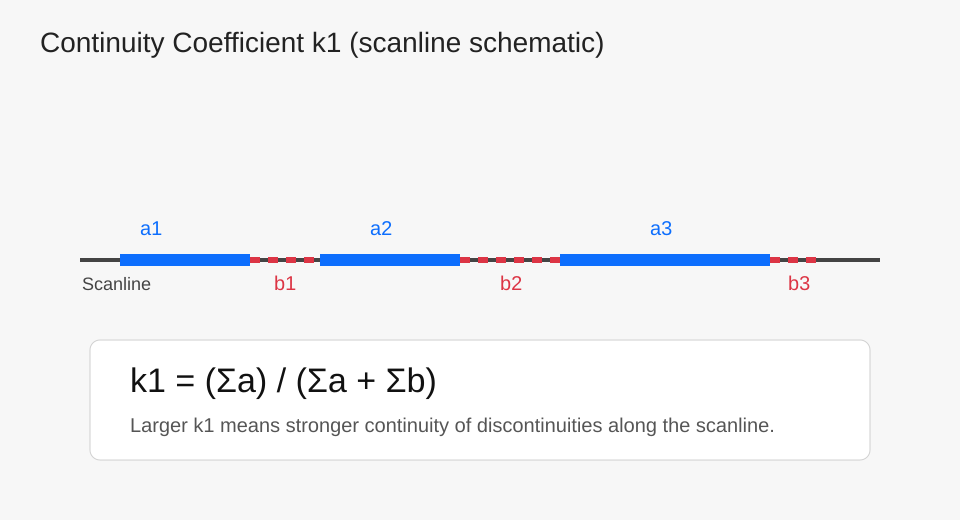
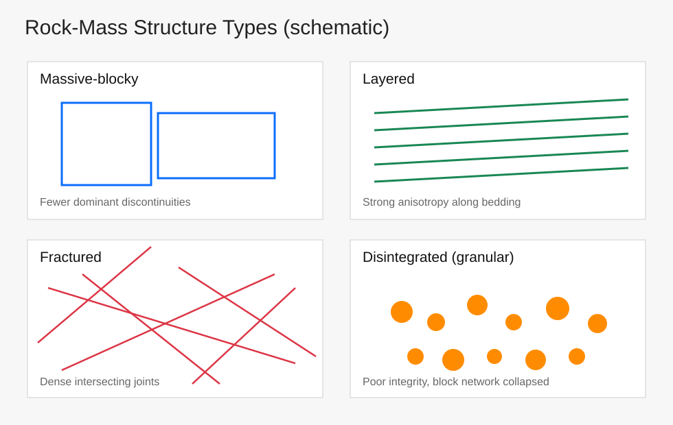

# 岩体力学 Part 1：矿物组成、结构特征与结构面基础
# Rock Mechanics Part 1: Mineral Composition, Structural Features, and Discontinuity Basics

这篇定位为“入门底图”：先把岩体材料与结构逻辑讲清楚，再进入后续的强度、变形与稳定性分析。  
This note is a foundational map: clarify material and structural logic first, then move to strength, deformation, and stability analysis.

主线是：矿物组成 -> 颗粒与胶结 -> 风化变化 -> 结构面分类与定量描述 -> 岩体结构类型。  
The chain is: mineral composition -> particle/cementation features -> weathering effects -> discontinuity classification and quantification -> rock-mass structure types.

---

## 1. 组成岩石的主要矿物
## 1. Major Minerals in Rocks

### 1.1 硅酸盐类（常见于火成岩）
### 1.1 Silicates (common in igneous rocks)

常见矿物：长石、辉石、角闪石、橄榄石。  
Typical minerals: feldspar, pyroxene, amphibole, olivine.

常见特征：多为粒状或柱状晶形，骨架效应较强，通常强度较高、抗变形能力较好。  
Typical features: mainly granular/prismatic crystals with a stronger framework effect, usually showing higher strength and better deformation resistance.

### 1.2 黏土类矿物
### 1.2 Clay Minerals

常见类型：高岭石、蒙脱石、伊利石。  
Typical types: kaolinite, montmorillonite, illite.

常见特征：片状/鳞片状结构，整体刚度和强度通常较低，含水后变形敏感性更强。  
Typical features: platy/flaky texture, generally lower stiffness and strength, and stronger deformation sensitivity under water-content changes.

### 1.3 碳酸盐类
### 1.3 Carbonates

典型化学组分可写作：$Ca^{2+}$、$Mg^{2+}$、$CO_3^{2-}$。  
Typical chemical components can be represented as $Ca^{2+}$, $Mg^{2+}$, and $CO_3^{2-}$.

常见类型：方解石、白云石、文石（霰石）。  
Typical types: calcite, dolomite, aragonite.

常见特征：与酸反应明显，部分环境下易溶蚀；岩体致密时强度可较高，但裂隙发育或风化后力学性能下降较快。  
Typical features: acid-reactive and locally dissolvable; can be strong when dense, but mechanical performance degrades rapidly after fracturing or weathering.

---

## 2. 结构特征：颗粒与胶结
## 2. Structural Features: Particles and Cementation

### 2.1 颗粒形态对力学行为的影响
### 2.1 Influence of Particle Morphology on Mechanics

从“咬合-嵌锁”角度，可做课堂级排序：粒状 > 片状 > 鳞片状。  
From the interlocking perspective, a practical classroom ranking is: granular > platy > flaky.

其意义是：越容易形成空间骨架，通常越有利于承载与稳定。  
The implication is straightforward: structures that form stronger spatial frameworks are generally better for load transfer and stability.

### 2.2 胶结类型的工程直觉
### 2.2 Engineering Intuition for Cementation

入门层面的经验判断可记为：硅质胶结通常较强，铁质次之，钙质再后，泥质胶结相对较弱。  
A practical entry-level heuristic is: siliceous cementation is usually strongest, followed by ferruginous, then calcareous, while argillaceous cementation is relatively weaker.

该判断用于快速预判，后续仍需结合试验数据与岩性资料校正。  
Use this as a quick estimate, then calibrate with laboratory data and lithologic evidence.

---

## 3. 风化与可测指标
## 3. Weathering and Measurable Indicators

风化会改变岩体完整性、结构面状态以及波传播特征。  
Weathering alters rock-mass integrity, discontinuity condition, and wave-propagation behavior.

常用快速指标包括：波速、波速比。  
Common rapid indicators include wave velocity and velocity ratio.

一般规律可表述为：风化加剧 -> 裂隙增多与胶结弱化 -> 波速下降。  
A common trend is: stronger weathering -> more discontinuities and weaker cementation -> lower wave velocity.

---

## 4. 结构面基础分类
## 4. Basic Classification of Discontinuities

### 4.1 原生结构面
### 4.1 Primary Discontinuities

与成岩过程直接相关，常见来源包括沉积、岩浆和变质过程。  
Directly related to rock-forming processes, commonly from sedimentary, magmatic, and metamorphic origins.

### 4.2 次生结构面
### 4.2 Secondary Discontinuities

由后期地质作用形成，如构造活动、卸荷与风化改造。  
Formed by later geological processes, such as tectonics, unloading, and weathering modification.

### 4.3 压剪性（构造性）结构面
### 4.3 Compressional-Shear (Tectonic) Discontinuities

对剪切强度和整体稳定性影响显著，是工程分析中的重点对象。  
They strongly control shear strength and overall stability, so they are key targets in engineering analysis.

---

## 5. 结构面特征量（定量描述）
## 5. Quantitative Descriptors of Discontinuities

本节可视为现场记录与参数化建模的最小描述集合。  
This section can be treated as a minimal descriptor set for field logging and parameterized modeling.

### 5.1 产状：走向、倾向、倾角
### 5.1 Orientation: Strike, Dip Direction, and Dip Angle

产状定义了结构面的空间几何位置，是楔体识别和稳定性计算的首要输入。  
Orientation defines the spatial geometry of discontinuities and is a primary input for wedge identification and stability calculations.

*图：结构面产状示意（非比例尺） / Figure: orientation schematic (not to scale).*

### 5.2 连续性系数（示意写法）
### 5.2 Continuity Coefficient (Illustrative Form)

可用下式表达结构面连续性：

$$
k_1=\frac{\sum a}{\sum a+\sum b}
$$

其中 $a$ 可理解为连续段长度，$b$ 为中断段长度；$k_1$ 越大，结构面连续性越强。  
Here, $a$ represents connected trace length and $b$ interrupted length; larger $k_1$ indicates stronger continuity.

*图：沿测线的连续段与中断段示意 / Figure: connected and interrupted segments along a scanline.*

### 5.3 迹长
### 5.3 Trace Length

迹长越大，结构面越可能控制块体边界并形成潜在滑移路径。  
Longer traces are more likely to control block boundaries and potential sliding paths.

### 5.4 密度与间距
### 5.4 Density and Spacing

常见记录方式包括线密度（单位长度内结构面条数）和平均间距。  
Common records include line density (number of discontinuities per unit length) and average spacing.

在同一量测条件下，密度增大通常对应间距减小，岩体完整性趋于降低。  
Under the same measurement condition, higher density generally corresponds to smaller spacing and lower rock-mass integrity.

*图：同一测线下密度与间距关系示意 / Figure: density-spacing relation on the same scanline.*

### 5.5 张开度、粗糙度系数与充填
### 5.5 Aperture, Roughness Coefficient, and Infilling

1. 张开度：主要影响渗流通道与法向刚度。  
2. 粗糙度系数：影响剪切咬合作用与抗剪强度。  
3. 充填：充填物类型与厚度会显著改变结构面强度和变形行为。

1. Aperture: mainly affects seepage pathways and normal stiffness.  
2. Roughness coefficient: controls interlocking and shear resistance.  
3. Infilling: infill type and thickness significantly alter discontinuity strength and deformation response.

---

## 6. 岩体结构类型（课堂速记版）
## 6. Rock-Mass Structure Types (Classroom Quick Version)

结合课堂内容，可先按四类典型结构建立直觉框架：  
A practical first-pass framework is to classify rock-mass structure into four typical types:

1. 整体块状：完整性较好，结构面控制作用相对弱。  
2. 层状：各向异性明显，层面控制变形与滑移。  
3. 碎裂状：结构面密集，块体尺度小，稳定性对支护条件更敏感。  
4. 散体状：完整岩块少，整体性差，工程扰动下易产生较大变形。

1. Massive-blocky: better integrity and relatively weaker discontinuity control.  
2. Layered: strong anisotropy, with bedding planes dominating deformation and slip.  
3. Fractured: dense discontinuities and small blocks; stability is more sensitive to support conditions.  
4. Disintegrated/granular: few intact blocks, poor integrity, and large deformation under disturbance.

*图：岩体结构类型示意 / Figure: rock-mass structural types (schematic).*

---

## 7. 小结
## 7. Summary

这篇的核心价值在于建立“材料组成-结构特征-工程行为”的认知链。  
The core value of this note is building the cognition chain of "material composition-structural features-engineering behavior."

后续学习建议按以下顺序衔接：  
A practical sequence for follow-up study is:

1. 强度准则：Mohr-Coulomb、Hoek-Brown。  
2. 结构面力学：法向闭合、剪切滑移与峰后行为。  
3. 工程场景：边坡、隧洞、地下采场的稳定性评价。

1. Strength criteria: Mohr-Coulomb and Hoek-Brown.  
2. Discontinuity mechanics: normal closure, shear slip, and post-peak behavior.  
3. Engineering scenarios: stability evaluation for slopes, tunnels, and underground openings.
