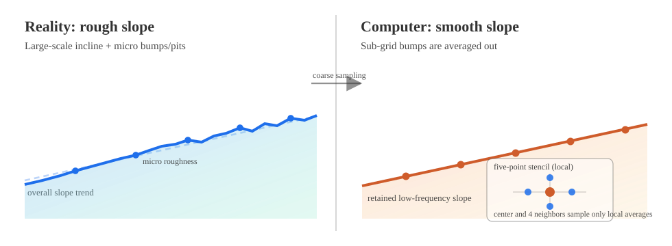
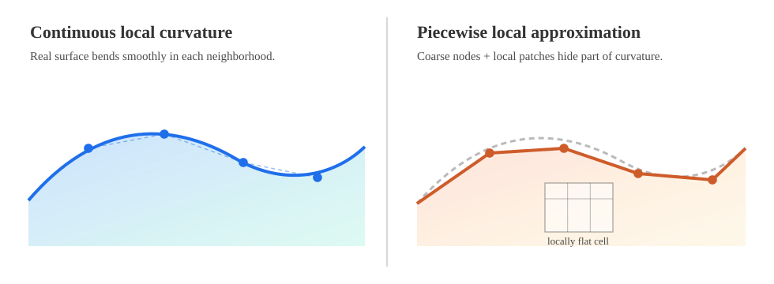

# 偏微分方程：从连续曲率到离散稳定性
# PDE: From Continuous Curvature to Discrete Stability

这篇笔记只做一件事：把“扩散型 PDE”这条线从连续形式走到可计算形式。  
This note does one thing: walk a diffusion-PDE pipeline from continuous form to computable form.

主线是：连续模型 -> 五点差分 -> 显式更新 -> CFL 约束 -> 边界条件。  
The path is: continuous model -> five-point stencil -> explicit update -> CFL constraint -> boundary handling.

先从扩散型偏微分方程的通式出发：  
We start from a generic diffusion-type PDE:

$$
\frac{\partial h}{\partial t}=\kappa\nabla^2 h
$$

这里 $h$ 是场变量（温度、高度、浓度等都可以），$\kappa$ 是扩散系数。  
Here, $h$ is a field variable (temperature, height, concentration, etc.), and $\kappa$ is the diffusion coefficient.

---

## 高斯初值（Gaussian Initial Condition）
## Gaussian Initial Condition for Simulation

做数值实验时，我通常用一个中心高斯包作为初始场：  
For simulation, a centered Gaussian bump is a practical default initial field:

```python
h = np.exp(-((X - L/2)**2 + (Y - L/2)**2) / 0.5)
```

对应连续表达是：  
Its continuous expression is:

$$
h(x,y,0)=\exp\!\left(-\frac{(x-L/2)^2+(y-L/2)^2}{0.5}\right)
$$

它表示一个以 $(L/2,L/2)$ 为峰值的二维高斯分布（正态分布，normal distribution）。分母越小，峰越尖；分母越大，初始分布越宽。  
This is a 2D Gaussian (normal) distribution centered at $(L/2,L/2)$. A smaller denominator gives a sharper peak; a larger one gives a wider initial spread.

---

## 1. 连续视角与计算机视角
## 1. Continuous View vs. Computational View

连续数学里，$\nabla^2 h$ 表示局部曲率；曲率大，扩散驱动力就大。  
In continuous math, $\nabla^2 h$ is local curvature; larger curvature means stronger diffusion drive.

但在计算机里，没有“无限小邻域”，只有网格点和它的邻居。  
On a computer, there is no infinitesimal neighborhood, only grid nodes and their neighbors.

所以可计算直觉变成两句话：  
So the computable intuition becomes two simple rules:

- 如果某点值高于邻居平均，它会往下扩散；  
- If a node is above its neighbor average, it diffuses downward.
- 如果某点值低于邻居平均，它会被周围抬高。  
- If a node is below neighbor average, surrounding nodes lift it.

这就是“连续曲率”在离散网格上的实现方式。  
This is how continuous curvature is realized on a discrete grid.

---

## 2. 一维二阶差分到二维五点差分
## 2. From 1D Second Difference to 2D Five-Point Stencil

这里用两张图拆开看，会更直观：  
Two diagrams make the conflict clearer:

图 A（全局尺度）：现实是“总体斜面 + 微小坑洼”，粗网格会保留斜面趋势、抹平亚网格粗糙度。  
Figure A (global scale): reality is “overall slope + micro roughness”; coarse grids keep the slope trend and smooth out sub-grid roughness.



图 B（局部尺度）：在单个网格邻域里，连续弯曲会被分段近似替代，局部曲率信息被压缩成有限差分。  
Figure B (local scale): within one grid neighborhood, continuous curvature is replaced by piecewise approximation, and curvature information is compressed into finite differences.



这两张图对应同一个结论：五点差分不是“把整个面当平面”，而是“在每个网格点用 5 个样本近似局部二阶信息”。  
Both figures point to one conclusion: the five-point stencil does not flatten the entire surface; it approximates local second-order information using five samples at each grid node.

先看 1D 二阶导数的中心差分：  
Start with the 1D central difference for the second derivative:

$$
\frac{\partial^2 h}{\partial x^2}
\approx
\frac{h(x+\Delta x)-2h(x)+h(x-\Delta x)}{\Delta x^2}
$$

推广到 2D（设 $\Delta x=\Delta y$），得到经典五点格式：  
Extending to 2D (with $\Delta x=\Delta y$) gives the classic five-point stencil:

$$
\nabla^2 h_{i,j}
\approx
\frac{h_{i+1,j}+h_{i-1,j}+h_{i,j+1}+h_{i,j-1}-4h_{i,j}}{\Delta x^2}
$$

这项可以直接读成“邻点和 - 4 倍中心点”，本质上就是离散的局部偏差。  
You can read this as “sum of neighbors - 4 times center,” i.e., a discrete local deviation.

---

## 3. 显式更新格式与 CFL 约束
## 3. Explicit Update and CFL Constraint

时间推进采用前向欧拉（Forward Euler）：  
Use forward Euler for time stepping:

$$
h_{i,j}^{n+1}=h_{i,j}^{n}+\Delta t\,\kappa\nabla^2 h_{i,j}^{n}
$$

代入五点差分后得到显式格式：  
Substituting the five-point stencil gives:

$$
h_{i,j}^{n+1}=h_{i,j}^{n}+\frac{\kappa\Delta t}{\Delta x^2}
\left(h_{i+1,j}^{n}+h_{i-1,j}^{n}+h_{i,j+1}^{n}+h_{i,j-1}^{n}-4h_{i,j}^{n}\right)
$$

整理后更容易看出系数结构：  
Rearranging makes the coefficient structure explicit:

$$
h_{i,j}^{n+1}=\left(1-\frac{4\kappa\Delta t}{\Delta x^2}\right)h_{i,j}^{n}
+\frac{\kappa\Delta t}{\Delta x^2}\left(h_{i+1,j}^{n}+h_{i-1,j}^{n}+h_{i,j+1}^{n}+h_{i,j-1}^{n}\right)
$$

为了避免显式步进炸掉，通常要求中心系数非负：  
To avoid blow-up in explicit stepping, the center coefficient is typically required to be nonnegative:

$$
1-\frac{4\kappa\Delta t}{\Delta x^2}\ge 0
$$

于是得到二维五点显式格式的 CFL 约束：  
Hence the CFL condition for this 2D explicit five-point scheme:

$$
\Delta t \le \frac{\Delta x^2}{4\kappa}
$$

物理上，它限制了“每一步扩散能走多远”：时间步太大，就会超过网格分辨率能承受的传播尺度。  
Physically, it limits how far diffusion can move in one step; if $\Delta t$ is too large, propagation exceeds grid-resolvable scales.

---

## 4. 边界条件：第一类、第二类、第三类
## 4. Boundary Conditions: First, Second, and Third Kind

离散求解里，内点靠差分更新，边界点靠边界条件约束。  
In discrete solving, interior nodes are updated by the stencil, while boundary nodes are constrained by boundary conditions.

下面先用 1D 区间 $x\in[0,L]$ 写公式（2D 时对每条边同理处理）。  
Below we use 1D formulas on $x\in[0,L]$ (apply the same logic to each edge in 2D).

### 第一类（Dirichlet）：给定边界值
### First Kind (Dirichlet): Prescribed Boundary Value

$$
h(0,t)=g_0(t),\quad h(L,t)=g_L(t)
$$

离散实现最直接：每个时间步直接赋值边界点。  
The discrete implementation is direct: assign boundary nodes every time step.

$$
h_0^n=g_0(t_n),\quad h_N^n=g_L(t_n)
$$

### 第二类（Neumann）：给定法向导数（通量）
### Second Kind (Neumann): Prescribed Normal Derivative (Flux)

$$
\frac{\partial h}{\partial x}(0,t)=q_0(t),\quad
\frac{\partial h}{\partial x}(L,t)=q_L(t)
$$

用一阶单边差分离散边界导数：  
Discretize boundary derivatives using one-sided first-order differences:

$$
\frac{h_1^n-h_0^n}{\Delta x}=q_0(t_n),\quad
\frac{h_N^n-h_{N-1}^n}{\Delta x}=q_L(t_n)
$$

也可以等价地先解出边界点值：  
Equivalently, solve boundary node values first:

$$
h_0^n=h_1^n-\Delta x\,q_0(t_n),\quad
h_N^n=h_{N-1}^n+\Delta x\,q_L(t_n)
$$

### 第三类（Robin）：边界值与导数线性组合
### Third Kind (Robin): Linear Combination of Value and Derivative

$$
\alpha_0 h(0,t)+\beta_0 h_x(0,t)=r_0(t),\quad
\alpha_L h(L,t)+\beta_L h_x(L,t)=r_L(t)
$$

左边界可离散为：  
At the left boundary:

$$
\alpha_0 h_0^n+\beta_0\frac{h_1^n-h_0^n}{\Delta x}=r_0(t_n)
$$

解出 $h_0^n$ 后可直接代回更新：  
After solving for $h_0^n$, plug it back into the update:

$$
h_0^n=\frac{r_0(t_n)-(\beta_0/\Delta x)h_1^n}{\alpha_0-\beta_0/\Delta x}
$$

右边界形式同理：  
The right boundary is analogous:

$$
h_N^n=\frac{r_L(t_n)+(\beta_L/\Delta x)h_{N-1}^n}{\alpha_L+\beta_L/\Delta x}
$$

工程实现里，显式格式常用这个顺序：  
In practice, explicit stepping usually follows this order:

1. 用边界条件先更新边界点。  
1. Update boundary nodes from boundary conditions.
2. 用五点差分更新内点。  
2. Update interior nodes with the five-point stencil.
3. 如果是 Dirichlet，再次覆盖边界值防漂移。  
3. For Dirichlet, overwrite boundary values again to avoid drift.

---

## 5. 小结
## 5. Summary

这篇的核心结论可以压成四句：  
The core takeaways can be compressed into four lines:

- 扩散型 PDE 把“时间变化”与“空间曲率”连接起来。  
- A diffusion-type PDE links temporal change to spatial curvature.
- 五点差分给出了二维拉普拉斯算子的可计算近似。  
- The five-point stencil gives a computable approximation of the 2D Laplacian.
- 显式格式的稳定性受 CFL 约束直接控制。  
- Explicit-scheme stability is directly controlled by the CFL condition.
- 边界条件（Dirichlet/Neumann/Robin）决定了边界点如何被更新。  
- Boundary conditions (Dirichlet/Neumann/Robin) determine how boundary nodes are updated.

下一步我会补两块：  
My next extensions for this note are:

- 非等间距网格（$\Delta x\neq\Delta y$）下的离散修正；  
- discretization on nonuniform grids ($\Delta x\neq\Delta y$);
- 一个最小可复现实验（参数、初值、边界、误差曲线）。  
- a minimal reproducible experiment (parameters, initial condition, boundaries, and error curve).
