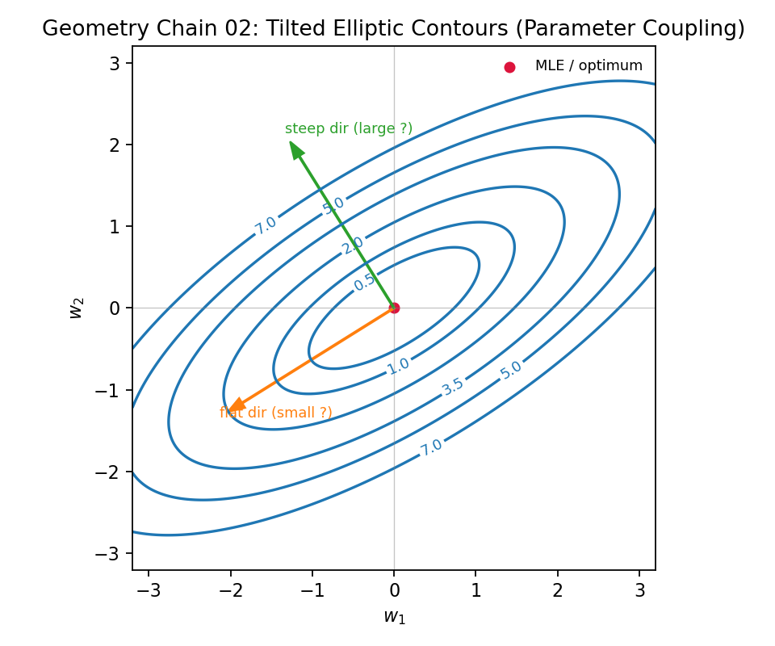
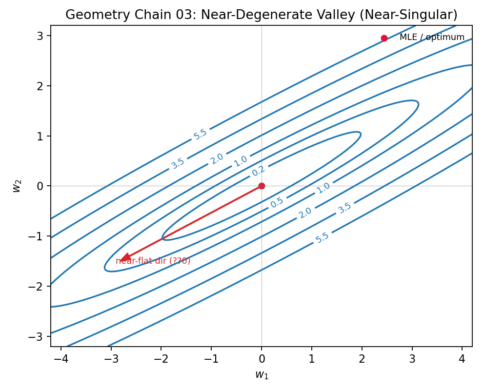
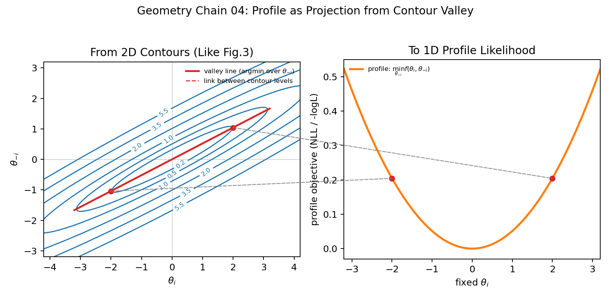

---
date: '2026-03-04T21:00:00+09:00'
draft: false
title: '应用数学 Part 1：奇异矩阵与参数辨识性'
summary: "从奇异矩阵出发，先建立似然函数与 MLE，再用海森矩阵解释参数空间中的曲率、可靠性与可辨识性。"
description: "A practical note linking singular matrices, information loss, identifiability, FIM, profile likelihood, and sensitivity analysis."
tags: ["Applied Mathematics", "Singular Matrix", "Identifiability", "FIM", "Profile Likelihood", "Sensitivity Analysis", "Inverse Problem"]
categories: ["Crucible"]
aliases:
  - /notes/笔记-数学-奇异矩阵与辨识性/
---

# 应用数学 Part 1：奇异矩阵与参数辨识性

这篇主线是：  
奇异矩阵并不只是“算不出逆”，它在参数估计里对应的是“信息有缺口”，最终表现为参数不可辨识。  

---

## 0. 参数空间与矩阵视角

设参数向量为

$$
\theta=[\theta_1,\theta_2,\dots,\theta_p]^\top\in\mathbb{R}^p
$$

参数估计本质上是在参数空间里找最优点，并用矩阵刻画该点附近的局部几何。  
最常见的局部二次型写法是：

$$
\Delta f \approx \frac12\,\Delta\theta^\top H(\theta)\,\Delta\theta
$$

其中 $H$ 是海森矩阵，$\Delta\theta$ 是参数扰动。  
这个式子：参数沿不同方向扰动时，目标函数变化速度由一个“参数空间矩阵”统一编码。

*跟特征值概念很像*

---

## 1. 奇异矩阵：定义与直觉

对方阵 $A\in\mathbb{R}^{n\times n}$，以下条件等价：  
1. $\det(A)=0$。  
2. $\mathrm{rank}(A)\lt n$。  
3. 存在非零向量 $v$ 使得 $Av=0$（非平凡零空间）。  
4. $A^{-1}$ 不存在。

一个 $3\times3$ 的例子：  

$$
A=
\begin{bmatrix}
1 & 2 & 3\\
2 & 4 & 6\\
1 & 1 & 1
\end{bmatrix}
$$

这里第 2 行是第 1 行的 2 倍，因此行向量线性相关，$\mathrm{rank}(A)=2\lt 3$，且 $\det(A)=0$，所以 $A$ 是奇异矩阵。  

几何上，它表示至少一个方向被压扁，信息维度丢失。  

---

## 2. 似然函数（Likelihood）定义

一句话区分 `Probability` 与 `Likelihood`：

- 概率（Probability）：参数 $\theta$ 固定，数据 $y$ 随机。  
  “如果硬币是均匀的，连续 10 次正面的概率是多少？”
- 似然（Likelihood）：数据 $y$ 已固定，参数 $\theta$ 可变。  
  “既然已经看到了连续 10 次正面，‘硬币均匀’这个假设有多靠谱？”

形式上，似然函数写作：

$$
\mathcal{L}(\theta)=p\!\left(y^{\mathrm{obs}}\mid\theta\right)
$$

在高斯噪声近似下，最大化似然等价于最小化负对数似然（NLL）：

$$
-\log \mathcal{L}(\theta)
\propto
\frac{1}{2}\sum_i\big(y_i^{\mathrm{obs}}-y_i(\theta)\big)^2
$$

这一步很关键：后面海森矩阵部分，正是对这个目标函数在最优点附近“弯曲程度”的二阶刻画。
## 3. 最大似然估计（MLE）

有了似然函数后，第一步是先找“山顶位置”，即最大似然估计：

$$
\hat{\theta}_{\mathrm{MLE}}
=
\arg\max_\theta \mathcal{L}(\theta)
=
\arg\min_\theta \big(-\log\mathcal{L}(\theta)\big)
$$

一阶最优条件给出：

$$
\nabla_\theta \log\mathcal{L}(\hat{\theta}) = 0
\quad
\text{（等价于）}
\quad
\nabla_\theta \mathrm{NLL}(\hat{\theta}) = 0
$$

但一阶条件只告诉我们“最优点在哪”，还没告诉我们“这个点有多可靠”。  
这就需要下一步看二阶信息，也就是海森矩阵。

### 3.1 海森矩阵及其与似然函数的联系

海森矩阵的本质：它是二阶项系数矩阵，控制局部曲面弯曲形状。  

其在二阶泰勒展开中出现为：

$$
f(\theta)\approx f(\theta_0)+\nabla f(\theta_0)^\top(\theta-\theta_0)+\frac12(\theta-\theta_0)^\top H(\theta_0)(\theta-\theta_0)
$$

如果把 $f$ 取为负对数似然（NLL），就可以把“山峰直觉”和“特征值定量”统一起来：  
把参数空间看成一座山，最优点是山顶；海森矩阵描述山顶附近的弯曲结构。  
其中“方向”由特征向量给出，“尖/平程度”由对应特征值给出。

$$
H(\theta)=\nabla_\theta^2 f(\theta),\qquad
H_{ij}=\frac{\partial^2 f}{\partial\theta_i\partial\theta_j}
$$

二维情形可写成：

$$
H=
\begin{bmatrix}
\frac{\partial^2 f}{\partial x^2} & \frac{\partial^2 f}{\partial x\partial y}\\
\frac{\partial^2 f}{\partial y\partial x} & \frac{\partial^2 f}{\partial y^2}
\end{bmatrix}
$$

沿方向向量 $v$ 的方向曲率常写作：

$$
\kappa_v=v^\top H v
$$

若使用单位向量（$\|v\|=1$），它直接给出该方向的二次曲率大小。  

统一解释如下（主方向=特征向量，主曲率=特征值）：
1. 特征值大：该方向山体更“尖”，偏离一点 NLL 就明显上升，参数约束强。  
2. 特征值小：该方向山体更“平”，偏离一些 NLL 变化仍小，参数约束弱。  
3. 特征值为 0（或近 0）：该方向近乎“平谷”，海森矩阵奇异（或近奇异），对应弱可辨识或不可辨识方向。

### 3.2 FIM（Fisher Information Matrix）：期望意义下的可信度

海森矩阵是“单次数据/单条轨迹”下的局部曲率；  
FIM 则是把这种曲率在数据分布上取期望，常写为：

$$
I(\theta)=-\mathbb{E}\!\left[\nabla_\theta^2\log p(y\mid\theta)\right].
$$

所以本质上，FIM 是在同一物理背景下，基于多条轨迹（或多次观测）对参数可信度的平均度量，而不是对参数本身做平均。

### 3.3 不可信情况（报警条件）

在工程上，可以把下面几条当作“参数可信度报警”：

1. 最小特征值接近 0（平谷报警）

$$
\lambda_{\min}(H)\approx 0
\quad \text{或} \quad
\lambda_{\min}(I)\approx 0
$$

表示存在近乎平坦方向，参数在该方向上弱可辨识。

2. 条件数过大（病态报警）

$$
\kappa(H)=\frac{\lambda_{\max}(H)}{\lambda_{\min}(H)}
\quad \text{或} \quad
\kappa(I)=\frac{\lambda_{\max}(I)}{\lambda_{\min}(I)}
$$

若 $\kappa$ 很大（如 $10^6\sim10^8$ 量级），说明问题病态，估计对噪声高度敏感。

3. 协方差膨胀（不确定性报警）

$$
\mathrm{Cov}(\hat{\theta})\approx H^{-1}
\quad \text{或} \quad
\mathrm{Cov}(\hat{\theta})\approx I^{-1}
$$

若对角线项很大，表示对应参数方差大、可信度低。

一句话：  
Hessian/FIM 负责“报警”，剖面似然（3.4）负责“复核”（确认是否真的不可辨识）。

### 3.4 剖面似然（Profile Likelihood）：判断是否真的不可辨识

前面的报警指标（特征值、条件数、协方差）本质上是局部诊断。  
但局部病态不一定等于“全局不可辨识”，所以需要剖面似然做二次确认。

它的核心目的只有一个：  
**判断某个参数是否在较大范围内都可以被其他参数补偿，从而实际上不可辨识。**

做法是：固定目标参数 $\theta_i$，把其余参数重新优化，观察最优目标值如何随 $\theta_i$ 变化。

$$
\mathrm{PL}(\theta_i)=\min_{\theta_{-i}}\ \mathcal{L}(\theta_i,\theta_{-i})
$$

可读规则：
1. 若曲线在较大区间内很平：该参数往往弱可辨识或不可辨识。  
2. 若曲线有清晰谷底且两侧明显上升：该参数通常可辨识。  

### 3.5 敏感性分析：谁在驱动输出

如果说 Hessian/FIM 和剖面似然回答的是“能不能辨识”，  
那么敏感性分析回答的是“哪个参数最值得优先辨识”。

#### 3.5.1 局部敏感性

在当前参数点附近，常用归一化灵敏度系数：

$$
S_{ij}
=
\frac{\partial y_i}{\partial \theta_j}\cdot\frac{\theta_j}{y_i}
$$

$|S_{ij}|$ 越大，说明输出对该参数越敏感；  
$|S_{ij}|$ 持续很小，说明该参数即使变化也难在观测中体现，通常更难可靠辨识。

#### 3.5.2 全局敏感性（简述）

局部敏感性依赖当前点；当模型强非线性时，建议补做全局敏感性（如 Morris / Sobol），  
看参数在整个可行范围内的平均贡献与交互作用。

和前文结合起来可以形成一个实用闭环：  
先用敏感性筛掉“几乎不驱动输出”的参数，再对关键参数做 Hessian/FIM 报警与剖面似然复核。

---

## 附加：参数反演的实用流程（从诊断到优化）

目标是做参数反演，一般有下面顺序：

1. 明确反演问题：定义参数 $\theta$、观测 $y^{\mathrm{obs}}$、目标函数 $J(\theta)$ 与参数约束范围。  
2. 先做敏感性分析：筛掉几乎不驱动输出的参数，优先降低维度。  
3. 在初始点附近做 FIM/Hessian 诊断（通常先 FIM）：检查最小特征值、条件数、协方差是否报警。  
4. 若出现报警，再做剖面似然复核：判断是“真不可辨识”还是仅局部病态。  
5. 进入正式优化反演：选用 GD / L-BFGS-B 等方法，结合约束与正则项。  
6. 反演后验收：检查残差质量、参数区间稳定性与多初值一致性。  

总结：  
**先敏感性筛参数 -> 先 FIM 报警 -> 剖面似然复核 -> 再进入反演优化。**

---

## 附加：几何理解链条

### 图 1：圆形等高线（各向同性曲率）

这里对应的是“抛物面山顶”：  
可近似写成 $f=w_1^2+w_2^2$，其海森矩阵为常数 $H=2I$（非 0），表示各方向曲率相同。

### 图 2：倾斜椭圆等高线（参数耦合）

这张图对应“参数耦合”的常见情况：  
等高线从圆变成倾斜椭圆，表示不同方向曲率不同。  
椭圆长轴方向对应小特征值（更平、约束弱），短轴方向对应大特征值（更陡、约束强）。

可用一个带交叉项的二次型来写：

$$
f(w_1,w_2)=a\,w_1^2+b\,w_1w_2+c\,w_2^2
$$

这里的 $w_1w_2$ 项（系数 $b$）就是“耦合项”：  
当 $b\neq 0$ 时，$w_1$ 的变化可被 $w_2$ 部分补偿，等高线通常会旋转成倾斜椭圆。

对应海森矩阵（常数）为：

$$
H=
\begin{bmatrix}
2a & b\\
b & 2c
\end{bmatrix}
$$

其特征向量给出主方向，特征值给出对应方向曲率大小。  
方向曲率由 $\kappa_v=v^\top Hv$ 给出：  
小特征值方向更平（长轴），大特征值方向更陡（短轴）。

### 图 3：近退化谷底（近奇异）

当某个方向特征值非常小（$\lambda\approx 0$）时，等高线会被极度拉长，形成“近乎平谷”的形状。  
在几何上，这意味着沿深谷（长轴）方向移动时，似然高度几乎不变。  

若该方向特征值进一步达到 $\lambda=0$，就对应奇异情形：  
1. 海森矩阵在该方向失去曲率。  
2. 信息在该方向塌缩（信息丢失）。  
3. 参数沿该方向变化时，模型输出几乎不响应（或完全不响应）。  

这正是“不可辨识”在几何上的直观图像。

### 图 4：剖面似然的一维投影

这张图和图 3 是直接关联的：  
左图沿“谷底线”选取两点（红点），通过灰色虚线映射到右图，得到对应的剖面值。  
右图本质上就是把二维等高线地形，按“固定 $\theta_i$、最优化其余参数”压缩成一维曲线。

判读规则：
1. 曲线尖且窄：参数可辨识性强。  
2. 曲线宽而平：参数弱可辨识。  
3. 曲线近乎水平：参数在该范围内几乎都可被补偿，接近不可辨识。
