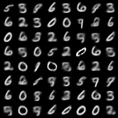
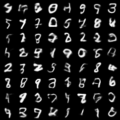
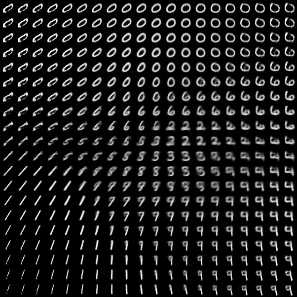

# Machine Learning / Generative Models: CNN-VAE, from MLPs to Convolutional Structure

Previous note: [A Minimal VAE Reproduction](/en/notes/笔记-机器学习-生成模型-vae最小复现/)

Paper: [Auto-Encoding Variational Bayes](https://arxiv.org/abs/1312.6114)

Code repository: `paper-reforge/Variational_AutoEncoder`

This note follows the MLP-VAE reproduction. The previous note already implemented the basic VAE training loop:

$$\begin{aligned} x \rightarrow q_{\phi}(z \mid x) \rightarrow z \rightarrow p_{\theta}(x \mid z) \end{aligned}$$

The goal here is to replace the MLP encoder and decoder with CNNs and observe what changes when the model can use image structure directly.

# Why Replace MLPs with CNNs

The MLP-VAE processes the input as:

```text
[B, 1, 28, 28] -> [B, 784] -> Linear
```

In other words, it flattens the 2D image into a vector immediately. This works, but it does not explicitly use the spatial structure of images.

The CNN-VAE processes the input as:

```text
[B, 1, 28, 28] -> Conv2d -> Conv2d -> flatten
```

The CNN first extracts local patterns on the 2D image, then sends the convolutional features into the VAE latent distribution.

# Basic Intuition of CNNs

A convolutional layer can be understood as a learnable local filter. Given an input image $X$ and a kernel $K$, in the single-channel case the output at position $(i,j)$ can be written as:

$$\begin{aligned} Y_{i,j} = \sum_a\sum_b K_{a,b}X_{i+a,j+b} + b \end{aligned}$$

In PyTorch `Conv2d`, the operation is more precisely cross-correlation, meaning the kernel is not flipped:

$$\begin{aligned} Y_{i,j} = \sum_a\sum_b K_{a,b}X_{i\cdot s+a-p,j\cdot s+b-p} + b \end{aligned}$$

Here:

- $s$ is the stride.
- $p$ is the padding.
- $K$ is a learnable parameter.

# Multi-Channel Convolution

The MNIST input starts as:

```text
[B, 1, 28, 28]
```

The first convolutional layer is:

```python
nn.Conv2d(1, 32, kernel_size=4, stride=2, padding=1)
```

Its output is:

```text
[B, 32, 14, 14]
```

Mathematically, multi-channel convolution can be written as:

$$\begin{aligned} Y_{o,i,j}=b_o+\sum_c\sum_a\sum_b W_{o,c,a,b}X_{c,i\cdot s+a-p,j\cdot s+b-p} \end{aligned}$$

Here:

- $o$ is the output channel index.
- $c$ is the input channel index.
- $a,b$ are positions inside the kernel.
- $i,j$ are spatial positions on the output feature map.

`out_channels=32` means this layer learns 32 different local pattern detectors.

# Shape Calculation

The output size of a convolutional layer is:

$$\begin{aligned} H_{\mathrm{out}} = \left\lfloor \frac{H_{\mathrm{in}} + 2p - k}{s} \right\rfloor + 1 \end{aligned}$$

For the first layer:

```text
H_in = 28
k = 4
s = 2
p = 1

H_out = floor((28 + 2*1 - 4) / 2) + 1 = 14
```

The second layer is:

```python
nn.Conv2d(32, 64, kernel_size=4, stride=2, padding=1)
```

Its output is:

```text
[B, 64, 7, 7]
```

So the encoder shape flow is:

```text
[B, 1, 28, 28]
-> [B, 32, 14, 14]
-> [B, 64, 7, 7]
-> [B, 64*7*7]
-> mu/logvar: [B, latent_dim]
```

# CNN Encoder and the VAE Posterior

The CNN encoder still outputs the parameters of the approximate posterior:

$$\begin{aligned} q_{\phi}(z \mid x)=\mathcal{N}\left(\mu_{\phi}(x), \mathrm{diag}(\sigma_{\phi}^{2}(x))\right) \end{aligned}$$

The code structure is:

```python
h = ConvEncoder(x)
h = flatten(h)
mu = W_mu h + b_mu
logvar = W_logvar h + b_logvar
```

In other words, CNNs only change how the functions $\mu_{\phi}(x)$ and $\log\sigma_{\phi}^{2}(x)$ are parameterized.

The VAE reparameterization trick is unchanged:

$$\begin{aligned} \epsilon \sim \mathcal{N}(0,I), \qquad z=\mu+\exp(0.5\cdot \mathrm{logvar})\odot\epsilon \end{aligned}$$

# CNN Decoder and Transposed Convolution

The MLP decoder is:

```text
z -> Linear -> 784 pixels
```

The CNN decoder is:

```text
z
-> Linear
-> [B, 64, 7, 7]
-> ConvTranspose2d
-> ConvTranspose2d
-> [B, 1, 28, 28]
```

The detailed shape flow is:

```text
z: [B, latent_dim]
-> Linear: [B, 64*7*7]
-> reshape: [B, 64, 7, 7]
-> ConvTranspose2d: [B, 32, 14, 14]
-> ConvTranspose2d: [B, 1, 28, 28]
-> flatten: [B, 784]
```

`ConvTranspose2d` is not a strict inverse convolution. If an ordinary convolution is written as a linear map:

$$\begin{aligned} y = Ax \end{aligned}$$

then transposed convolution is closer to:

$$\begin{aligned} \hat{x}=A^{\top}y \end{aligned}$$

# Why the Loss Does Not Change

The key point is that CNN-VAE does not change the VAE probabilistic model.

The ELBO is still:

$$\begin{aligned} \mathcal{L}(\theta,\phi;x)=\mathbb{E}_{q_{\phi}(z \mid x)}[\log p_{\theta}(x \mid z)]-D_{\mathrm{KL}}\left(q_{\phi}(z \mid x)\middle\|p(z)\right) \end{aligned}$$

Training still minimizes the negative ELBO:

$$\begin{aligned} \mathrm{loss}=\mathrm{BCE}(x,\hat{x})+D_{\mathrm{KL}}\left(q_{\phi}(z \mid x)\middle\|p(z)\right) \end{aligned}$$

So:

```text
Only the encoder/decoder network structure changes.
The VAE probabilistic objective stays the same.
```

# Experiment Setup

This experiment uses the same MNIST setup as the previous note.

| item | MLP-VAE baseline | CNN-VAE |
|---|---|---|
| dataset | MNIST | MNIST |
| latent_dim | 2 / 20 / 50 | 2 / 20 / 50 |
| epochs | 20 | 20 |
| optimizer | Adam | Adam |
| likelihood | Bernoulli over pixels | Bernoulli over pixels |
| loss | BCE + KL | BCE + KL |
| encoder | Linear layers | Conv2d layers |
| decoder | Linear layers | ConvTranspose2d layers |

Command:

```powershell
python -m src.train --config configs/mnist_cnn.yaml
```

# Results

First, compare the MLP-VAE baseline and CNN-VAE at `latent_dim = 20`:

| model | test loss | test recon | test KL |
|---|---:|---:|---:|
| MLP-VAE | 104.1232 | 78.8769 | 25.2463 |
| CNN-VAE | 99.2509 | 74.0344 | 25.2165 |

The clean observation is that CNN-VAE improves reconstruction substantially, while the KL term is almost unchanged.

This suggests that CNNs mainly help the model use image structure more effectively under a similar latent information budget.

Reconstruction at `latent_dim = 20`:


## CNN-VAE Latent Dimension Comparison

Now compare CNN-VAE with `latent_dim = 2 / 20 / 50`:

| latent_dim | test loss | test recon | test KL | observation |
|---:|---:|---:|---:|---|
| 2 | 151.7947 | 145.8052 | 5.9895 | Strong bottleneck, weak reconstruction, very low KL |
| 20 | 99.2509 | 74.0344 | 25.2165 | Balanced baseline, much better reconstruction than MLP-VAE |
| 50 | 99.9014 | 72.7852 | 27.1162 | Lowest reconstruction loss, higher KL, total loss close to latent_dim=20 |

This result matches the expected VAE tradeoff. With `latent_dim=2`, the encoder can only compress the image into a two-dimensional space, so the KL is low but the reconstruction loss is high. With `latent_dim=50`, the model has more latent channels for carrying input-specific information, so the reconstruction term improves, but the approximate posterior deviates more from the standard normal prior and the KL increases.

The KL term can be read as a rough information budget: the more the model relies on $z$ to carry sample-specific details, the more $q_{\phi}(z \mid x)$ tends to move away from $p(z)=\mathcal{N}(0,I)$.

## Prior Samples

`latent_dim = 2`:



`latent_dim = 20`:


`latent_dim = 50`:



By metrics, `latent_dim=50` has the best reconstruction term, but its prior samples are not necessarily much more stable than those of `latent_dim=20`. This matches the MLP-VAE observation from the previous note: increasing latent dimension often improves reconstruction, but prior sampling quality does not necessarily improve linearly.

## 2D Latent Space

Although `latent_dim=2` has weak reconstruction metrics, it has one important advantage: the latent space can be plotted directly.

Latent scatter:


This plot feeds the test set into the encoder and uses $\mu_{\phi}(x)$ as each image's position in the 2D latent space. Different digits show some clustering, but there is still substantial overlap between classes. This confirms that two dimensions are a strong bottleneck: they can capture the main structure, but not all writing variations.

Latent manifold:



This plot takes a regular grid in the 2D plane and decodes each grid point as a latent vector $z$. Moving through the latent space produces continuous changes in digit shape. This is one of the key features of VAE: the model does not merely memorize training images, but learns a generative space that supports continuous sampling and interpolation.

# How to Interpret the Result

MLP treats the image as 784 independently indexed input dimensions. CNN adds inductive biases that fit images better:

1. Local connectivity: first look at local windows.
2. Parameter sharing: the same kernel slides across the whole image.
3. Translation equivariance: when a local pattern moves, the feature map moves accordingly.
4. Hierarchical features: shallow layers detect local strokes, deeper layers combine them.

Therefore, under the same VAE objective, CNNs make it easier to learn clear image reconstructions.

# Summary

CNN-VAE can be understood as:

```text
The VAE probabilistic objective stays the same.
The encoder/decoder are changed from fully connected networks to convolutional networks.
Image structure is processed by local convolution before entering the latent distribution.
The decoder uses transposed convolution to reconstruct images from latent vectors.
```

In formula form:

$$\begin{aligned} x \rightarrow q_{\phi}(z \mid x), \qquad z \rightarrow p_{\theta}(x \mid z) \end{aligned}$$

Only the parameterization of $q_{\phi}$ and $p_{\theta}$ changes from MLP to CNN.
