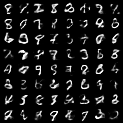

# Generative Models Part 1-2: A Minimal Variational Autoencoder Reproduction

Previous note: [Generative Models Part 1-1: The Basic Idea of Variational Autoencoder and the ELBO](/en/notes/笔记-生成模型1-1-variationalautoencoder的基本思想与elbo推导/)

Paper: [Auto-Encoding Variational Bayes](https://arxiv.org/abs/1312.6114)

Code repository: `paper-reforge/Variational_AutoEncoder`

This is the second note in my VAE study series. The previous note focused on the problem setting, the ELBO derivation, and the reparameterization trick. This one turns those formulas into a small PyTorch implementation and checks what a plain MLP-VAE can learn on MNIST.

# Reproduction Goal

The goal is to reproduce the core VAE training loop:

$$\begin{aligned} x \rightarrow q_{\phi}(z \mid x) \rightarrow z \rightarrow p_{\theta}(x \mid z) \end{aligned}$$

More concretely:

1. The encoder takes an image $x$ and outputs the parameters of a latent distribution.
2. The reparameterization trick samples $z$ from that distribution.
3. The decoder takes $z$ and outputs pixel probabilities for the reconstruction.
4. The model is trained with reconstruction loss and KL loss.

# From Formula to Code

## Encoder: Distribution Parameters

The encoder in a VAE does not simply compress an image into one deterministic vector. It outputs the parameters of an approximate posterior:

$$\begin{aligned} q_{\phi}(z \mid x)=\mathcal{N}\left(\mu_{\phi}(x), \mathrm{diag}(\sigma_{\phi}^{2}(x))\right) \end{aligned}$$

In code, the encoder returns `mu` and `logvar`:

```python
mu = self.fc_mu(h)
logvar = self.fc_logvar(h)
```

The model predicts `logvar` rather than $\sigma$ directly because variance must be positive, and working with log variance is usually more stable.

## Reparameterization: Differentiable Sampling

Sampling directly from $q_{\phi}(z \mid x)$ would put randomness in the middle of the backpropagation path. VAE separates that randomness:

$$\begin{aligned} \epsilon \sim \mathcal{N}(0,I), \qquad z=\mu_{\phi}(x)+\sigma_{\phi}(x)\odot\epsilon \end{aligned}$$

The code version is:

```python
std = torch.exp(0.5 * logvar)
eps = torch.randn_like(std)
z = mu + std * eps
```

Now the randomness comes from fixed noise $\epsilon$, while the dependence of $z$ on `mu` and `logvar` remains differentiable.

## Decoder: Pixel Probabilities

After `ToTensor()`, MNIST pixels lie in $[0,1]$. In this minimal reproduction, the decoder output is treated as the parameter of a Bernoulli likelihood:

$$\begin{aligned} p_{\theta}(x \mid z)=\prod_{j=1}^{784}\mathrm{Bernoulli}(x_j;\pi_{\theta,j}(z)) \end{aligned}$$

In other words, the decoder outputs the probability that each pixel is 1:

$$\begin{aligned} \pi_{\theta}(z) \in [0,1]^{784} \end{aligned}$$

This is why the output layer uses `Sigmoid`.

## Loss: Negative ELBO

From the previous note, the ELBO is:

$$\begin{aligned} \mathcal{L}(\theta,\phi;x)=\mathbb{E}_{q_{\phi}(z \mid x)}[\log p_{\theta}(x \mid z)]-D_{\mathrm{KL}}\left(q_{\phi}(z \mid x)\middle\|p(z)\right) \end{aligned}$$

In training, we minimize the negative ELBO:

$$\begin{aligned} \mathrm{loss}=\mathrm{reconstruction\ loss}+\mathrm{KL\ loss} \end{aligned}$$

For this MNIST version, reconstruction loss is binary cross entropy:

$$\begin{aligned} -\log p_{\theta}(x \mid z)=-\sum_{j=1}^{784}\left[x_j\log \pi_{\theta,j}(z)+(1-x_j)\log(1-\pi_{\theta,j}(z))\right] \end{aligned}$$

The KL term uses the closed-form KL from a diagonal Gaussian posterior to a standard normal prior:

$$\begin{aligned} D_{\mathrm{KL}}\left(q_{\phi}(z \mid x)\middle\|p(z)\right)=-\frac{1}{2}\sum_j\left(1+\log\sigma_j^2-\mu_j^2-\sigma_j^2\right) \end{aligned}$$

So the training objective in code is simply:

```python
loss = recon_loss + kl_loss
```

# Experiment Setup

This reproduction uses a minimal MLP architecture:

| item | value |
|---|---|
| dataset | MNIST |
| model | MLP VAE |
| input_dim | 784 |
| hidden_dim | 400 |
| latent_dim | 2 / 20 / 50 |
| epochs | 20 |
| optimizer | Adam |
| likelihood | Bernoulli over pixels |
| device | CPU |

I intentionally did not start with a CNN. The goal here is not image quality, but checking that the core VAE training loop works.

# Baseline: latent_dim = 20

For the `latent_dim = 20` baseline, after 20 epochs the final metrics are:

| split | loss | recon | KL |
|---|---:|---:|---:|
| train | 104.1901 | 78.5278 | 25.6623 |
| test | 104.1232 | 78.8769 | 25.2463 |

The behavior is mostly as expected:

- The loss drops quickly in the first few epochs and then becomes smoother.
- Test loss stays close to train loss, so there is no obvious overfitting.
- Reconstructions are clearer than samples drawn directly from the prior.
- Generated samples already have digit-like shapes, but they are still blurry, which is normal for an MLP-VAE baseline.

This is enough to confirm that the minimal VAE loop is working.

# Latent Dimension Comparison

Next, I compared `latent_dim = 2 / 20 / 50`.

| latent_dim | test loss | test recon | test KL | observation |
|---:|---:|---:|---:|---|
| 2 | 151.1283 | 144.9927 | 6.1356 | Weaker reconstruction, but more regular prior samples |
| 20 | 104.1232 | 78.8769 | 25.2463 | Baseline, reasonably balanced reconstruction and generation |
| 50 | 103.7298 | 76.7843 | 26.9455 | Best reconstruction, but not necessarily best prior samples |

The interesting part is that larger latent dimensions improve reconstruction metrics, but generation quality does not improve linearly.

With `latent_dim = 2`, the bottleneck is strong, so reconstruction is worse. But because the latent space is small, the decoder seems to learn a more compact and regular structure around the prior, so prior samples look more stable.

With `latent_dim = 50`, the model has more capacity and reconstructs better. However, in a high-dimensional prior space, random samples can land in regions the decoder has not learned as smoothly, so generated samples are not necessarily better than the two-dimensional case.

## Generated Samples

`latent_dim = 2`:


`latent_dim = 20`:



`latent_dim = 50`:


Visually, the two-dimensional model produces samples with more coherent global digit shapes. The 20- and 50-dimensional models reconstruct better, but their prior samples are more likely to become blurry or unstable.

# Observing the 2D Latent Space

The nice thing about `latent_dim = 2` is that the latent space can be plotted directly.

## Latent Scatter


This plot feeds the test set into the encoder and uses $\mu_{\phi}(x)$ as each image's position in the two-dimensional latent space.

Different digits show some clustering, but there is still clear overlap between classes. This is expected because a two-dimensional latent space has limited capacity and cannot perfectly separate every handwritten digit. Still, it shows that the encoder has learned a continuous representation with class and shape structure, not just a random projection.

## Latent Manifold


This plot samples a regular grid in the two-dimensional latent plane and decodes each grid point.

The visual pattern is fairly intuitive:

- The left side looks more like `1` / `7`.
- The middle region transitions through `2` / `3` / `6` / `9`.
- The right side looks more like `0`.
- Moving through latent space changes the generated output smoothly.

This is one of the interesting parts of VAE: it is not just memorizing training images, but learning a generative surface that can be traversed continuously.

# Summary

After this minimal reproduction, my understanding of VAE can be compressed into a few points:

1. The encoder outputs latent distribution parameters, not just a compressed image vector.
2. The reparameterization trick rewrites random sampling as a differentiable path.
3. The decoder outputs parameters of the observation distribution.
4. BCE + KL in code is the negative ELBO.
5. A larger latent dimension usually improves reconstruction, but prior-sampling quality does not necessarily improve with it.

So the core of VAE is not merely "compress and reconstruct an image." It learns two probabilistic mappings:

$$\begin{aligned} x \rightarrow q_{\phi}(z \mid x), \qquad z \rightarrow p_{\theta}(x \mid z) \end{aligned}$$

Together, these two directions form the complete VAE training loop.

# Next Steps

Possible next directions:

1. Replace the MLP with a CNN-VAE to improve image quality.
2. Try $\beta$-VAE and observe how the KL weight changes the latent space.
3. Build an interactive 2D latent-space visualization.
4. Continue reading later VAE papers and see how the idea develops into stronger generative models.
