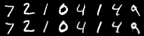
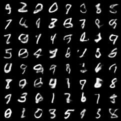
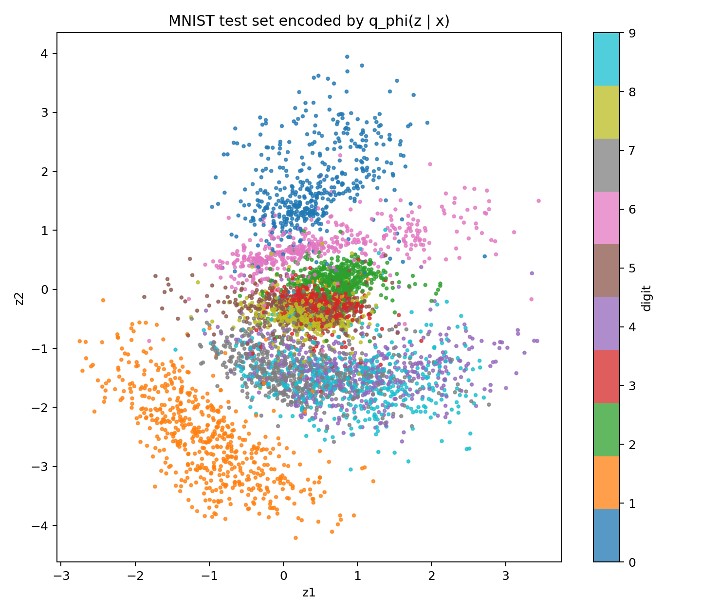

# 生成模型 Part 1-3：CNN-VAE，从 MLP 到卷积结构

上一篇：[生成模型 Part 1-2：Variational Autoencoder 的最小复现](/notes/笔记-生成模型1-2-vae最小复现/)

论文链接：[Auto-Encoding Variational Bayes](https://arxiv.org/abs/1312.6114)

代码仓库：`paper-reforge/Variational_AutoEncoder`

这一篇接在 MLP-VAE 后面。上一篇已经把 VAE 的基本训练闭环跑通了：

$$\begin{aligned} x \rightarrow q_{\phi}(z \mid x) \rightarrow z \rightarrow p_{\theta}(x \mid z) \end{aligned}$$

这一篇的目标是把 encoder 和 decoder 从 MLP 换成 CNN，观察图像结构本身会带来什么变化。

# 为什么从 MLP 换成 CNN

MLP-VAE 的输入处理方式是：

```text
[B, 1, 28, 28] -> [B, 784] -> Linear
```

也就是一开始就把二维图像摊平成一条向量。但是**没有显式利用图像里的空间结构**。

CNN-VAE 的输入处理方式是：

```text
[B, 1, 28, 28] -> Conv2d -> Conv2d -> flatten
```

CNN 首先在二维图像上寻找局部模式，再把卷积特征送入 VAE 的 latent distribution。

# CNN 的基本直觉

卷积层可以理解成一个可学习的局部滤波器。给定输入图像 $X$ 和卷积核 $K$，单通道情况下，输出位置 $(i,j)$ 可以写成：

$$\begin{aligned} Y[i,j] = \sum_a\sum_b K[a,b]X[i+a,j+b] + b \end{aligned}$$

在 PyTorch 的 `Conv2d` 中，更准确地说是 cross-correlation，也就是 kernel 不翻转：

$$\begin{aligned} Y[i,j] = \sum_a\sum_b K[a,b]X[i\cdot s+a-p,j\cdot s+b-p] + b \end{aligned}$$

其中：

- $s$ 是 stride。
- $p$ 是 padding。
- $K$ 是可学习参数。


# 多通道卷积

MNIST 输入一开始是：

```text
[B, 1, 28, 28]
```

第一层卷积：

```python
nn.Conv2d(1, 32, kernel_size=4, stride=2, padding=1)
```

输出：

```text
[B, 32, 14, 14]
```

数学上，多通道卷积可以写成：

$$\begin{aligned}
Y[o,i,j]
=
b[o] + \sum_c\sum_a\sum_b W[o,c,a,b]X[c,i\cdot s+a-p,j\cdot s+b-p]
\end{aligned}$$

这里：

- $o$ 是输出通道编号。
- $c$ 是输入通道编号。
- $a,b$ 是卷积核内部位置。
- $i,j$ 是输出 feature map 的空间位置。

`out_channels=32` 表示这一层会学习 32 个不同的局部模式检测器。

# Shape 计算

卷积输出尺寸公式是：

$$\begin{aligned}
H_{\mathrm{out}} = \left\lfloor \frac{H_{\mathrm{in}} + 2p - k}{s} \right\rfloor + 1
\end{aligned}$$

第一层：

```text
H_in = 28
k = 4
s = 2
p = 1

H_out = floor((28 + 2*1 - 4) / 2) + 1 = 14
```

第二层：

```python
nn.Conv2d(32, 64, kernel_size=4, stride=2, padding=1)
```

输出：

```text
[B, 64, 7, 7]
```

所以 encoder 的整体 shape 是：

```text
[B, 1, 28, 28]
-> [B, 32, 14, 14]
-> [B, 64, 7, 7]
-> [B, 64*7*7]
-> mu/logvar: [B, latent_dim]
```

# CNN Encoder 对应的 VAE 后验

CNN encoder 最后仍然输出近似后验分布的参数：

$$\begin{aligned}
q_{\phi}(z \mid x)
=
\mathcal{N}\left(\mu_{\phi}(x), \mathrm{diag}(\sigma_{\phi}^{2}(x))\right)
\end{aligned}$$

代码结构是：

```python
h = ConvEncoder(x)
h = flatten(h)
mu = W_mu h + b_mu
logvar = W_logvar h + b_logvar
```

也就是说，CNN 仅仅改变了 $\mu_{\phi}(x)$ 和 $\log\sigma_{\phi}^{2}(x)$ 这两个函数的参数化方式。

而 VAE 的 reparameterization trick 不变：

$$\begin{aligned}
\epsilon \sim \mathcal{N}(0,I), \qquad
z=\mu+\exp(0.5\cdot \mathrm{logvar})\odot\epsilon
\end{aligned}$$

# CNN Decoder 与转置卷积

MLP decoder 是：

```text
z -> Linear -> 784 pixels
```

CNN decoder 是：

```text
z
-> Linear
-> [B, 64, 7, 7]
-> ConvTranspose2d
-> ConvTranspose2d
-> [B, 1, 28, 28]
```

具体 shape：

```text
z: [B, latent_dim]
-> Linear: [B, 64*7*7]
-> reshape: [B, 64, 7, 7]
-> ConvTranspose2d: [B, 32, 14, 14]
-> ConvTranspose2d: [B, 1, 28, 28]
-> flatten: [B, 784]
```

`ConvTranspose2d` 不是严格的逆卷积。若普通卷积写成线性变换：

$$\begin{aligned} y = Ax \end{aligned}$$

转置卷积更接近：

$$\begin{aligned} \hat{x}=A^{T}y \end{aligned}$$

# Loss 为什么不用改
注意：CNN-VAE 并没有改变 VAE 的概率模型。

仍然是：

$$\begin{aligned}
\mathcal{L}(\theta,\phi;x)
=
\mathbb{E}_{q_{\phi}(z \mid x)}[\log p_{\theta}(x \mid z)]
-
D_{\mathrm{KL}}\left(q_{\phi}(z \mid x)\middle\|p(z)\right)
\end{aligned}$$

训练时仍然最小化负 ELBO：

$$\begin{aligned}
\mathrm{loss}
=
\mathrm{BCE}(x,\hat{x})
+
D_{\mathrm{KL}}\left(q_{\phi}(z \mid x)\middle\|p(z)\right)
\end{aligned}$$

所以：

```text
变的只是 encoder/decoder 的网络结构；
不变的是 VAE 的概率目标。
```

# 实验设置

本次实验沿用 MNIST 和上一篇的训练设置。

| item | MLP-VAE baseline | CNN-VAE |
|---|---|---|
| dataset | MNIST | MNIST |
| latent_dim | 2 / 20 / 50 | 2 / 20 / 50 |
| epochs | 20 | 20 |
| optimizer | Adam | Adam |
| likelihood | Bernoulli over pixels | Bernoulli over pixels |
| loss | BCE + KL | BCE + KL |
| encoder | Linear layers | Conv2d layers |
| decoder | Linear layers | ConvTranspose2d layers |

代码入口：

```powershell
python -m src.train --config configs/mnist_cnn.yaml
```

# 实验结果

先看 `latent_dim = 20` 时，MLP-VAE baseline 和 CNN-VAE 的对比：

| model | test loss | test recon | test KL |
|---|---:|---:|---:|
| MLP-VAE | 104.1232 | 78.8769 | 25.2463 |
| CNN-VAE | 99.2509 | 74.0344 | 25.2165 |

一个很干净的现象是：CNN-VAE 的 reconstruction 明显更好，但 KL 几乎没有变化。

这说明 CNN 的主要作用不是改变隐变量正则项，而是在差不多相同的 latent 信息预算下，更有效地处理图像结构。

`latent_dim = 20` 的 reconstruction：



## CNN-VAE 的 latent dimension 对比

接着对比 CNN-VAE 的 `latent_dim = 2 / 20 / 50`：

| latent_dim | test loss | test recon | test KL | 观察 |
|---:|---:|---:|---:|---|
| 2 | 151.7947 | 145.8052 | 5.9895 | 强瓶颈，重构明显较弱，KL 很低 |
| 20 | 99.2509 | 74.0344 | 25.2165 | 平衡 baseline，重构明显优于 MLP-VAE |
| 50 | 99.9014 | 72.7852 | 27.1162 | reconstruction 最低，但 KL 更高，总 loss 与 20 维接近 |

这个结果符合 VAE 的预期。`latent_dim=2` 时，encoder 只能把图像信息压进二维空间，因此 KL 较低，但 reconstruction loss 很高。`latent_dim=50` 时，模型有更多 latent 通道可以携带输入信息，重构项进一步下降，但近似后验也会更明显地偏离标准正态先验，因此 KL 更高。

这里可以把 KL 粗略理解成一种信息预算：模型越依赖 $z$ 携带样本细节，$q_{\phi}(z \mid x)$ 通常就越偏离 $p(z)=\mathcal{N}(0,I)$。

## Prior Samples 对比

`latent_dim = 2`：


`latent_dim = 20`：



`latent_dim = 50`：


从指标上看，`latent_dim=50` 的 reconstruction 最好，但它的 prior samples 不一定会比 `latent_dim=20` 稳定很多。这和上一篇 MLP-VAE 的现象一致：更大的 latent dimension 往往改善重构，但 prior sampling 的视觉质量不一定线性提高。

## 二维隐空间观察

`latent_dim=2` 虽然重构指标较差，但它有一个重要优点：可以直接把隐空间画出来。

Latent scatter：



这个图把测试集输入 encoder 后，取 $\mu_{\phi}(x)$ 作为每张图片在二维隐空间中的位置。可以看到，不同数字出现了一定聚类，但类别之间仍然有明显重叠。这说明二维空间确实是一个很强的瓶颈：它能表达主要结构，但不够把所有书写差异完全分开。

Latent manifold：


这个图是在二维平面上取规则网格，把每个网格点当作 $z$ 输入 decoder。可以看到，隐空间中的移动会带来连续的数字形状变化。这正是 VAE 的一个关键特征：学习一个可以连续采样和插值的生成空间。

# 如何理解结果

MLP 把图像看成 784 个彼此独立编号的输入维度。CNN 则加入了几个更适合图像的 inductive bias：

1. 局部连接：先看局部窗口。
2. 参数共享：同一个 kernel 在整张图上滑动。
3. 平移等变：局部模式移动时，feature map 也相应移动。
4. 层级特征：浅层看局部笔画，深层看组合结构。

因此，在同样的 VAE 目标下，CNN 更容易学出清晰的图像重构。

# 小结

CNN-VAE 可以理解成：

```text
VAE 的概率目标不变；
encoder/decoder 从全连接网络换成卷积网络；
图像结构先被局部卷积处理，再进入 latent distribution；
decoder 用转置卷积把 latent vector 还原成图像。
```

对应到公式上：

$$\begin{aligned}
x \rightarrow q_{\phi}(z \mid x), \qquad
z \rightarrow p_{\theta}(x \mid z)
\end{aligned}$$

只是 $q_{\phi}$ 和 $p_{\theta}$ 的参数化方式从 MLP 换成了 CNN。
