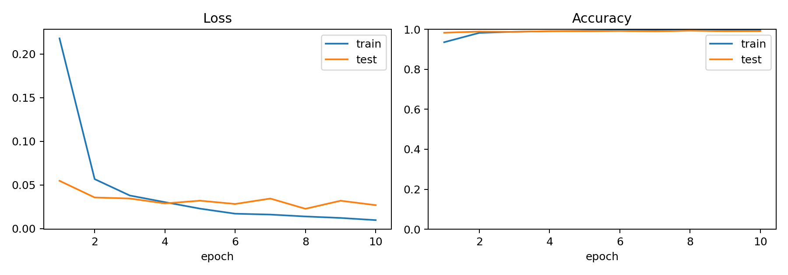
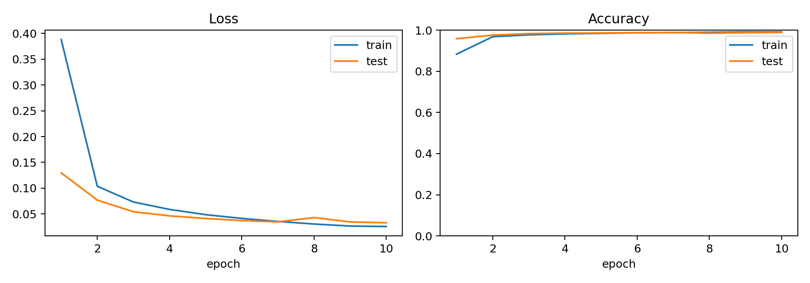
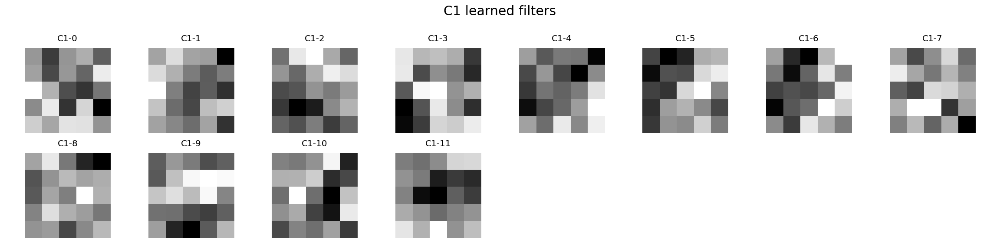
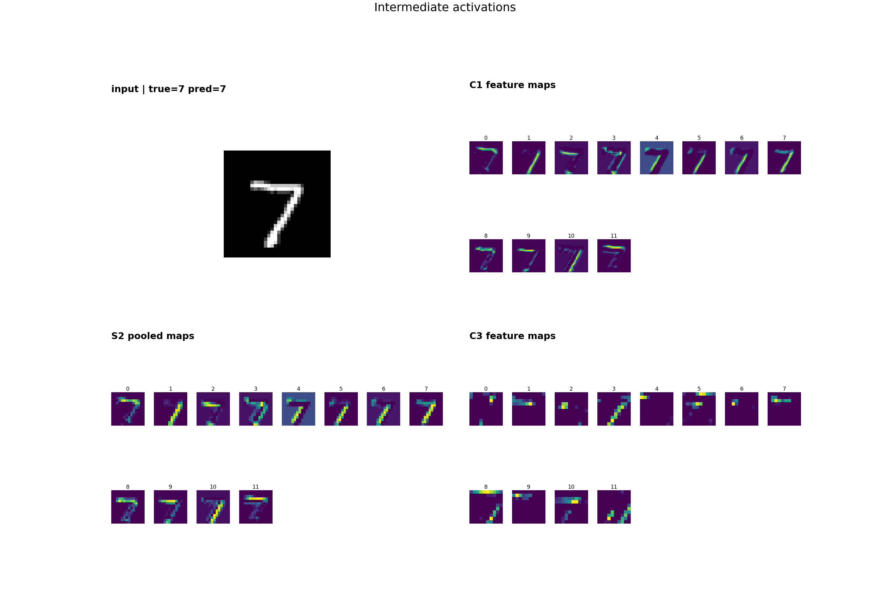
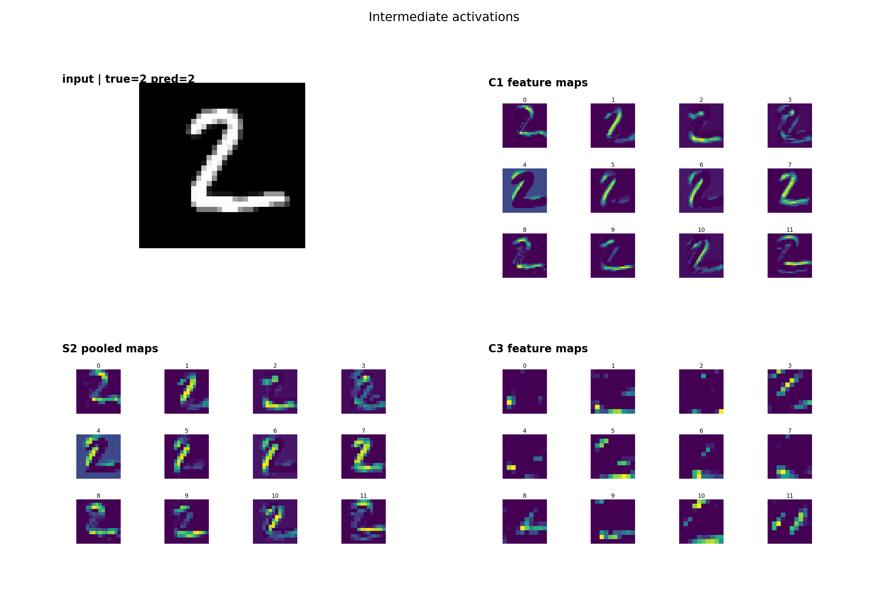

# Generative Models Part 2: From LeNet-5 to Modern CNN

In the previous note, I replaced the MLP in a VAE with a CNN-VAE. This note steps back and looks directly at CNNs, starting from the classic LeNet-5 architecture.

## Before Starting

LeNet-5 is a CNN model. In other words, LeNet-5 and CNNs are not two separate topics, but part of the same chain:

```text
LeNet-5 paper-like:
32x32 input -> C1 -> S2 -> C3 -> S4 -> C5 -> F6 -> RBF prototype

Modern CNN:
32x32 input -> Conv/Activation/Pool -> Conv/Activation/Pool -> Conv -> Linear classifier
```

## Starting from LeNet-5

The first thing to notice is that LeNet-5 does not use the original 28x28 MNIST image directly. Its input is 32x32. According to the paper, the larger canvas helps prevent stroke endpoints or corner features from falling outside the center of high-level receptive fields.

Structurally, 32x32 also makes the later shapes line up nicely:

| Layer | Operation | Output shape | Intuition |
| --- | --- | --- | --- |
| Input | 32x32 grayscale image | 1x32x32 | MNIST 28x28 with padding |
| C1 | 5x5 convolution, 6 feature maps | 6x28x28 | Scan the image with 6 detectors |
| S2 | 2x2 subsampling | 6x14x14 | Downsample while keeping local responses |
| C3 | 5x5 convolution, 16 feature maps | 16x10x10 | Combine lower-level S2 features |
| S4 | 2x2 subsampling | 16x5x5 | Compress spatial size again |
| C5 | 5x5 convolution, 120 feature maps | 120x1x1 | Turn local structure into global representation |
| F6 | Fully connected, 84 dimensions | 84 | A more abstract class-related representation |
| Output | RBF prototype | 10 | Compare with 10 class prototypes |

The main chain is:

```text
Convolution -> Subsampling -> Convolution -> Subsampling -> Representation -> Classifier
```

This is the `C-S-C-S` flow. Convolution extracts local patterns, pooling/subsampling compresses positional details, and later layers combine lower-level patterns into higher-level ones.

## Paper Version vs. Modern Version

At first I thought LeNet-5 would be almost the same as today's CNNs: convolution, pooling, fully connected layers, and softmax. After reading the paper more carefully, several important differences showed up.

First, S2 and S4 are not the modern max pooling layers we often use today. The paper's subsampling layer is closer to:

```text
sum/average over a 2x2 region -> multiply by a trainable alpha -> add bias -> activation
```

So the S layers themselves have learnable parameters.

Second, the activation is not ReLU, but scaled tanh. ReLU is more common today because it is simple and less likely to saturate in the positive range. But in the LeNet-5 era, tanh/sigmoid-style activations were very natural choices.

Third, the output layer is not the modern linear logits + cross entropy setup. Instead, F6 is compared with one prototype for each class. A smaller distance means the representation is closer to that class.

## Paper-Like Reproduction

I kept a version of the code that stays close to the paper:

```text
src/models_paper.py
src/train_paper.py
```

The main paper-like parts are:

| Component | Paper-like design | Code treatment |
| --- | --- | --- |
| Activation | scaled tanh | custom `ScaledTanh` |
| S2/S4 | trainable subsampling | per-channel scale and bias |
| C3 | partial connectivity | select S2 feature maps according to the paper connection table |
| C5 | 5x5 convolution to 1x1 | equivalent to convolving over the whole S4 spatial field |
| Output | RBF prototype | output distances to class prototypes |

The training objective is not a perfect copy of the paper's energy loss. For stability, I use cross entropy on the negative distances:

```text
loss = CrossEntropyLoss(-distances, target)
```

## Modern CNN Attempt

```text
src/models.py
src/train.py
```

The modern version changes three main things:

1. The output layer changes from RBF prototypes to `Linear(84, 10)`.
2. The loss uses `CrossEntropyLoss` directly on logits.
3. Activation, channel width, and pooling are all configurable.

At this point, the classifier's role becomes clear: the convolutional layers turn the image into a feature representation, and the classifier maps that representation into 10 class scores.

```text
features -> classifier -> logits -> argmax -> predicted class
```

The logits are 10 unnormalized scores. During training, `CrossEntropyLoss` applies log-softmax internally. During prediction, I can simply take the class with the largest score.

## Experiment 1: Activation Functions

I first tried several activation functions.

Controlled variables: all runs use `classic` channels, `maxpool`, and 10 training epochs.

| Activation | Epoch 1 train loss | Final train loss | Final test loss | Final test acc | Best test acc |
| --- | ---: | ---: | ---: | ---: | ---: |
| ReLU | 0.3039 | 0.0160 | 0.0322 | 98.95% | 99.12% |
| Tanh | 0.2750 | 0.0093 | 0.0365 | 98.91% | 98.91% |
| Sigmoid | 1.2289 | 0.0425 | 0.0414 | 98.64% | 98.64% |

This matches the intuition. MNIST is relatively simple, so ReLU and tanh do not separate dramatically. Sigmoid, however, has a much higher first-epoch train loss because of its output range and gradient behavior.


The most obvious difference is sigmoid: its first-epoch train loss reaches 1.2289, much higher than ReLU and tanh. It catches up later, but the convergence speed and final accuracy are still slightly weaker. ReLU and tanh are close on MNIST, so further tuning would be needed to separate them more clearly.

## Experiment 2: Number of Channels

I used three channel settings.

Controlled variables: all runs use `ReLU`, `maxpool`, and 10 training epochs.

| Setting | C1/C3/C5 channels | Parameters | Final train loss | Final test loss | Final test acc | Best test acc |
| --- | --- | ---: | ---: | ---: | ---: | ---: |
| small | 4 / 8 / 60 | 18,946 | 0.0323 | 0.0439 | 98.52% | 98.67% |
| classic | 6 / 16 / 120 | 61,706 | 0.0160 | 0.0322 | 98.95% | 99.12% |
| large | 12 / 32 / 240 | 223,278 | 0.0096 | 0.0268 | 99.13% | 99.36% |

On MNIST, the large version performs very well. This is not surprising: it gives the model more detectors and more room to combine features. On harder datasets, however, larger channel width can also bring overfitting, longer training time, and more computation.

I stop the tuning here because the goal of this note is to understand LeNet-5's structure, not to chase a benchmark score.




The result is straightforward: with more channels, both train loss and test loss become lower, and the best test accuracy is also higher. But this experiment can easily tempt me into simply adding more parameters, so I treat it mainly as a structural observation: more channels mean the model can keep more detectors and feature combinations at the same time.

## Experiment 3: Pooling

For pooling, I compared:

| Pooling | Operation | Intuition |
| --- | --- | --- |
| AvgPool | take the local average | smoother, closer to the flavor of paper-style subsampling |
| MaxPool | take the local maximum | emphasizes whether a strong response exists |

Controlled variables: all runs use `ReLU`, `classic` channels, and 10 training epochs.

| Pooling | Final train loss | Final test loss | Final test acc | Best test acc |
| --- | ---: | ---: | ---: | ---: |
| AvgPool | 0.0258 | 0.0330 | 98.92% | 98.92% |
| MaxPool | 0.0160 | 0.0322 | 98.95% | 99.12% |

On MNIST, max pooling is slightly better. This also feels intuitive: for digit recognition, whether a local stroke-like feature appears strongly is often more important than the average response in that region.




One thing to remember: the S2/S4 layers in the paper are not modern MaxPool layers.

```text
LeNet-5 paper: trainable subsampling
Modern CNN: max/avg pooling
```

## Visual Intuition

Accuracy and loss alone are still a bit abstract, so I also visualized the learned C1 kernels and intermediate feature maps.

The learned C1 filters:



This image shows the detectors themselves. Each small square is a 5x5 convolution kernel. At the beginning of training they are randomly initialized; after training, backpropagation gradually turns them into detectors that are sensitive to certain local patterns.

Now look at the feature maps after C1, S2, and C3 for a few samples:





These feature maps show where each detector responds strongly after scanning the whole image. A bright region does not mean the model already knows the answer. It only means that this convolution kernel matches the local image pattern at that location.

Backpropagation then judges these responses through the final loss. If a response helps the model classify a 7 as a 7, parameters along the related path are pushed in a helpful direction. If it leads the model away from the correct class, the gradient pushes those parameters in the opposite direction.

## Summary

After this reproduction, I feel that LeNet-5 is worth studying not because of MNIST itself, but because it exposes several basic CNN ideas:

1. Convolution kernels are not hand-designed templates; they are detectors learned from random initialization through gradient descent.
2. A convolution layer can learn many detectors at the same time, so it outputs multiple feature maps.
3. Shallow layers are closer to edges, strokes, and local structures, while deeper layers combine these structures.
4. Pooling sacrifices precise position in exchange for smaller spatial size and stronger positional robustness.
5. Modern CNNs replace many paper-era components with more direct and stable training conventions, such as ReLU, MaxPool, linear classifiers, and CrossEntropyLoss.

So this note briefly moves from generative models into CV, but it is still filling in a basic deep learning structure. CNN-VAE, later generative models, and more complex vision models all keep running into the same questions: how to extract features, how to compress spatial structure, and how to send the representation into the final objective.
