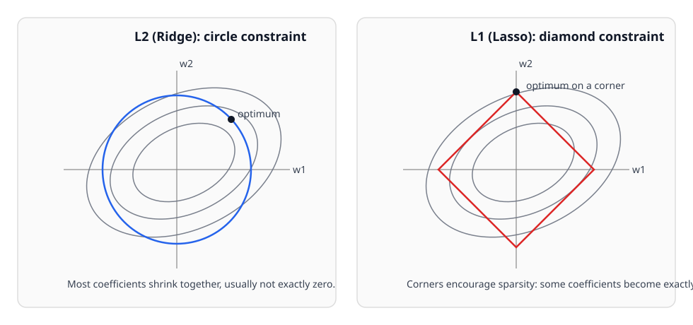
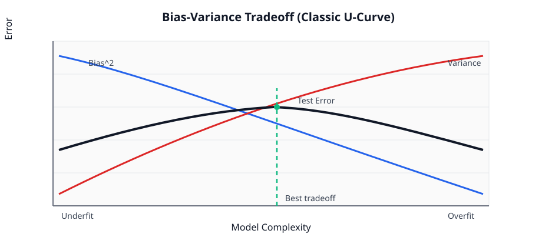
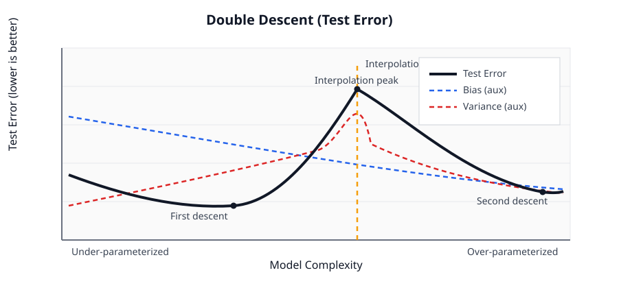

---
date: '2026-03-05T00:00:00+09:00'
draft: true
title: '线性代数 Part 2：正则化与稳定反演'
summary: "从奇异/病态问题出发，给出正则化的几何直觉、似然视角与 Hessian 变化公式，解释为什么它能把不可辨识方向重新变得可控。"
description: "A practical note on regularization, stability, and inverse problems."
tags: ["Linear Algebra", "Regularization", "Inverse Problem", "Tikhonov", "Ridge", "Hessian", "Stability"]
aliases:
  - /notes/笔记-应用数学2-正则化与稳定反演/
categories: ["Crucible"]
---

# 线性代数 Part 2：正则化与稳定反演

这一篇先回答一个核心问题：
当参数反演出现奇异/病态时，正则化到底在“几何上”和“公式上”做了什么？

---

## 1. 正则化
### 1.1 定义
正则化（Regularization）是指：
在原始数据拟合目标之外，额外加入一个先验惩罚项，让问题从“病态或不可解”变成“稳定可解”。

定义总目标函数 $J(\theta)$ 为：

$$
J(\theta)
=\underbrace{\mathcal{L}_{\text{data}}(\theta)}_{\text{数据失配项}}
+\lambda\,\underbrace{R(\theta)}_{\text{正则项}}
$$

参数反演对应：

$$
\min_\theta J(\theta)
$$

其中：
1. $\mathcal{L}_{\text{data}}$：数据告诉你的信息（可能存在平坦方向）。
2. $R(\theta)$：你加入的先验约束（例如“参数不应过大”或“应更平滑”）。
3. $\lambda$：正则强度，控制“信数据”与“信先验”的权衡。

---

### 1.2 几何直觉：把“平行线/平谷”重新掰回闭合形状

在病态问题中，等高线可能沿某个方向被无限拉长（近似平行线/长平谷），
对应海森矩阵某个特征值接近 0，说明该方向几乎没有曲率，参数难以分辨。

从总目标函数出发：

$$
J(\theta)=\mathcal{L}_{\text{data}}(\theta)+\lambda R(\theta)
$$

对参数做二阶求导：

$$
\nabla^2 J(\theta)
= \nabla^2 \mathcal{L}_{\text{data}}(\theta)
+ \lambda \nabla^2 R(\theta)
$$

这条式子告诉我们：正则化会额外贡献一部分曲率
$\lambda \nabla^2 R(\theta)$。即使数据项在某些方向几乎是平的，
只要正则项在这些方向提供了正曲率，整体地形就会从“长平谷”变成“可闭合的盆地”。

几何效果：
1. 每个方向都被强行加了一点“向上弯曲”。
2. 原本平坦方向（特征值接近 0）会被抬升为正值。
3. 开放/极度拉长的等高线重新变成闭合椭圆（哪怕很细长）。

这就是“正则化让不可辨识方向重新可控”的直观本质。

---

## 2. 常见正则化：L2 与 L1

下图用同一组损失等高线，直观对比 L2 与 L1 约束几何：

*图：L2（圆）与 L1（菱形）约束下，等高线与最优点落点对比示意*

### 2.1 L2 正则化（Ridge）：把“平谷”抬成可解盆地

L2 正则项常写为：

$$
R(\theta)=\frac12\lVert\theta\rVert_2^2
$$

直觉上，它对应一个以原点为中心的圆（高维时是球）。  
当它加入目标函数后，会在各个方向提供较均匀的曲率补偿。

$$\frac{1}{2}\lambda \|\theta\|^2 = \frac{1}{2}\lambda (w_1^2 + w_2^2)$$

几何与参数效果：
1. 把“无限拉长的等高线/平谷”往中心拉回，重新闭合。
2. 参数会整体收缩（变小），但通常不直接变成严格的 0。
3. 对病态或近奇异问题，L2 往往能显著提升数值稳定性。

---

### 2.2 L1 正则化（Lasso）：通过稀疏化做特征筛选

L1 正则项常写为：

$$
R(\theta)=\lVert\theta\rVert_1=\sum_j |\theta_j|
$$

在二维参数空间里，L1 约束边界是菱形（旋转 45° 的方形）。  
由于存在尖角，最优点常落在坐标轴附近，从而让部分参数变成 0。

$$\lambda \|\theta\|_1 = \lambda (|w_1| + |w_2|)$$

几何与参数效果：
1. 倾向于产生稀疏解（部分参数被压到 0）。
2. 当某些参数信息弱、与其他参数强耦合时，可直接“裁掉”冗余方向。
3. 在不可辨识场景里，相当于用结构先验做“强行降维”。

用两参数做一个最小推导（便于直觉化）：

设数据只能识别组合 $w_1-w_2$，即数据失配近似为

$$
\mathcal{L}_{\text{data}}(w_1,w_2)=\frac12\,(w_1-w_2-c)^2
$$

这意味着“拟合同样好”的解满足

$$
w_1-w_2=c
$$

是一条直线（沿这条线数据项几乎不变，参数耦合明显）。

此时加入 L1：

$$
\min_{w_1,w_2}\ \frac12\,(w_1-w_2-c)^2+\lambda\,(|w_1|+|w_2|)
$$

在理想约束 $w_1-w_2=c$ 上，可看成最小化 $|w_1|+|w_2|$。  
其最小值在坐标轴角点达到，例如：
1. $(w_1,w_2)=(c,0)$；
2. $(w_1,w_2)=(0,-c)$。

这就是“L1 倾向把一个参数压到 0”的来源：  
在同样能解释数据的一族解里，优先选更稀疏（更靠轴）的解。

对比：若换成 L2，最小化 $w_1^2+w_2^2$ 且满足 $w_1-w_2=c$，解为
$w_1=\tfrac c2,\ w_2=-\tfrac c2$，通常两个参数都不为 0。

---

### 2.3 与剖面似然、不可辨识性的关系

当剖面似然很平（某参数方向几乎不变）时，常见处理区别是：
1. L2：给平坦方向补曲率，让最优点可定位，但通常保留全部参数。
2. L1：在耦合严重时可能直接把部分参数压到 0，实现变量筛选。

因此两者都能缓解不可辨识，但风格不同：  
L2 更偏“稳定化”，L1 更偏“筛选化”。

---

### 2.4 泛化误差视角：权衡与双降

#### 2.4.1 偏差-方差权衡

先看经典结论：在固定问题规模下，泛化误差通常由偏差、方差和噪声共同决定。  
其分解常写为：

$$
\text{Test Error}
\approx
\text{Bias}^2+\text{Variance}+\text{Noise}
$$

该式来源于均方误差展开。设 $y=f(x)+\varepsilon$，且
$\mathbb{E}[\varepsilon]=0$、$\mathrm{Var}(\varepsilon)=\sigma^2$，
则有

$$
\begin{aligned}
\mathbb{E}\!\left[(y-\hat f(x))^2\right]
&=
\underbrace{\left(\mathbb{E}[\hat f(x)]-f(x)\right)^2}_{\text{Bias}^2}
+
\underbrace{\mathrm{Var}(\hat f(x))}_{\text{Variance}}
+
\underbrace{\sigma^2}_{\text{Noise}}.
\end{aligned}
$$

这对应经典 U 型直觉：复杂度上升时，偏差下降、方差上升。  
因此调参上可理解为：
1. $\lambda$ 太小：偏差小、方差大，易过拟合。  
2. $\lambda$ 太大：方差小、偏差大，易欠拟合。  
3. 目标是在验证集上找到折中最优点。

*图：经典偏差-方差权衡的 U 型测试误差曲线*

#### 2.4.2 双降现象（Double Descent）

上面是经典图景；下面是现代过参数化下的修正。  
在模型复杂度继续增大并跨过“插值阈值”后，测试误差不一定停留在单个 U 型，常见为：

1. 先下降（欠拟合区走向合理拟合）。  
2. 在插值附近上升（对噪声敏感、方差激增）。  
3. 再次下降（高维过参数化区出现第二次下降）。

这就是“双降”：它不是否定偏差-方差分解，而是说明误差曲线在高复杂度区会出现第二阶段。  

*图：双降现象示意。测试误差随复杂度通常表现为“先降-再升-再降”。*

---
