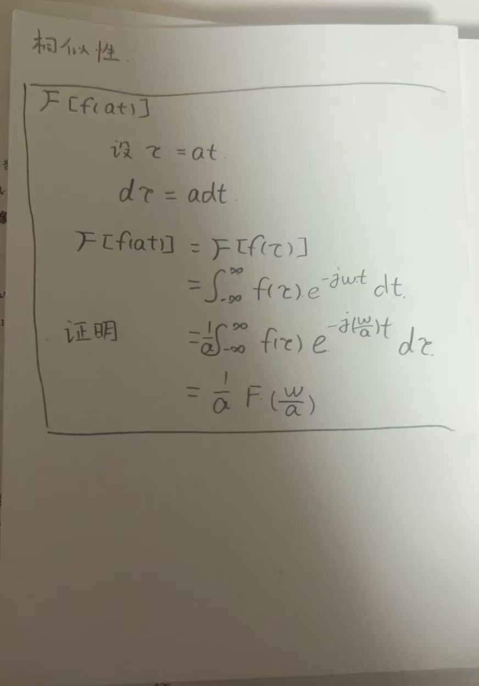
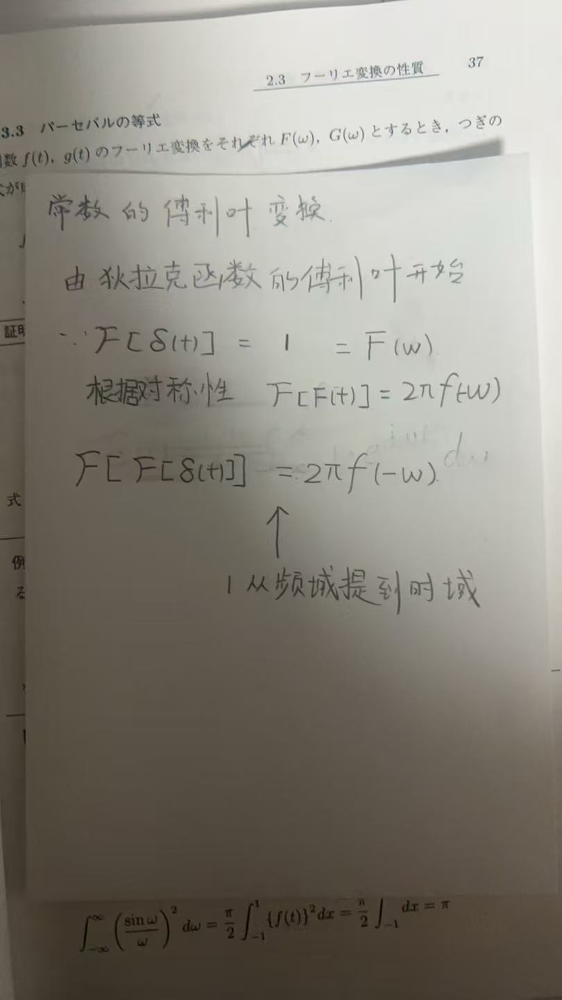
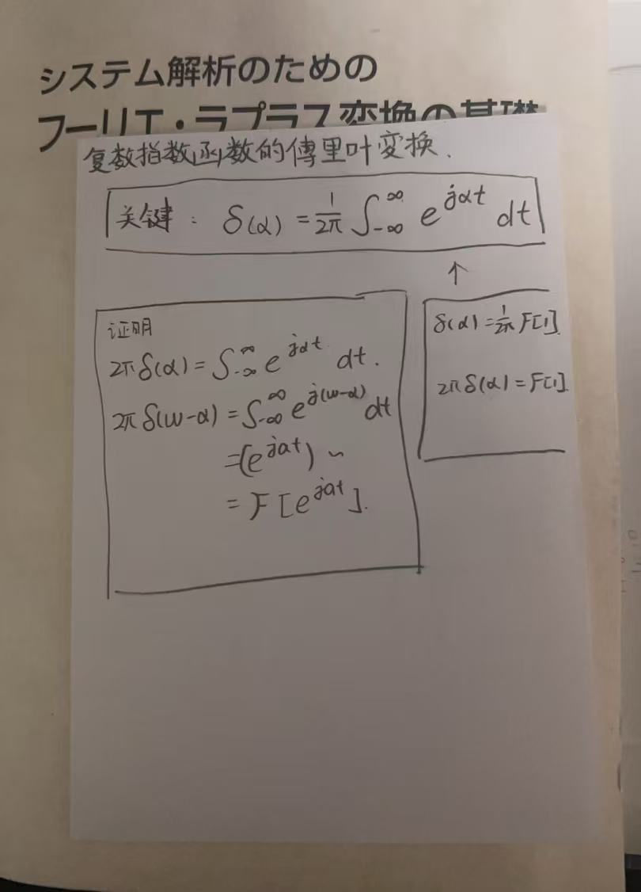
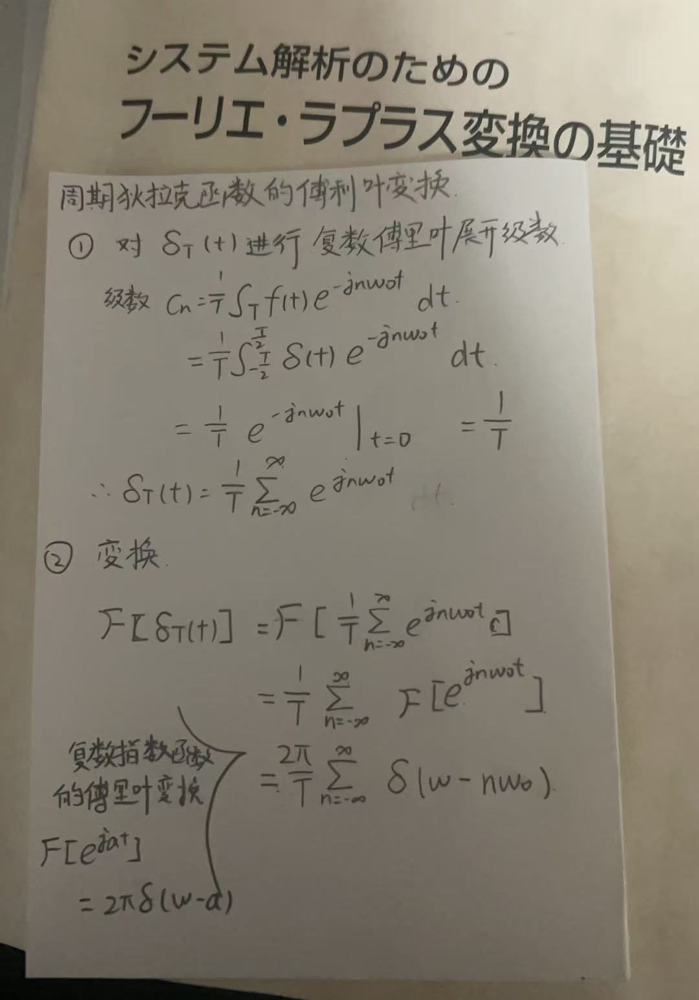
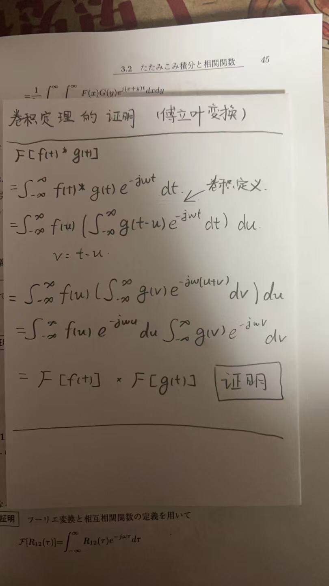
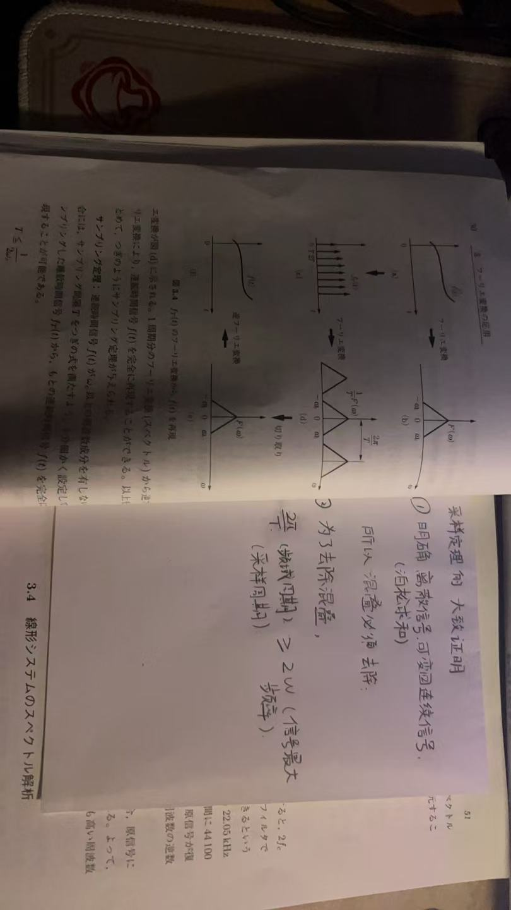

# Key Formulas
## 1. Fourier
### Fourier series

$$f(t) = \frac{a_0}{2} + \sum_{n=1}^{\infty} \left( a_n \cos(n\omega_0 t) + b_n \sin(n\omega_0 t) \right)$$

$\frac{a_0}{2}$ here represents the average value (or DC component) of the signal $f(t)$. This value is calculated by finding the 'net area' under the $f(t)$ curve within one period and dividing by the period $T$. 
The coefficient $a_0$ itself is calculated as twice this average value:

$$a_0 = \frac{2}{T} \int_{t_0}^{t_0+T} f(t) \ dt$$

The coefficients for the AC components ($a_n$ and $b_n$) are calculated as follows:

$$a_n = \frac{2}{T} \int_{t_0}^{t_0+T} f(t) \cos(n\omega_0 t) \ dt$$
$$b_n = \frac{2}{T} \int_{t_0}^{t_0+T} f(t) \sin(n\omega_0 t) \ dt$$

Especially in electronics, we often use the Complex/Exponential Fourier Series, which is derived using Euler's Formula. 

The derivation starts with Euler's Formula.
$$e^{j\theta} = \cos(\theta) + j\sin(\theta) $$

Conversely, $\cos(\theta)$ and $\sin(\theta)$ can be expressed as

$$\cos(\theta) = \frac{e^{j\theta} + e^{-j\theta}}{2} \\ \sin(\theta) = \frac{e^{j\theta} - e^{-j\theta}}{2j} $$

By defining the complex coefficients $c_0$ = $\frac{a_0}{2}$ , $c_n$ = $\frac{a_n-jb_n}{2}$ , $c_{-n}$ = $\frac{a_n+jb_n}{2}$ 

we can substitute these into the trigonometric series to get the final compact form:

$$
f(t) = \sum_{n=-\infty}^{\infty} c_n e^{jn\omega_0 t}
$$

$$c_n = \frac{1}{T} \int_{T} f(t) e^{-jn\omega_0 t} \ dt$$

### Fourier transform

#### Analysis Equation

$$F(\omega) = \mathcal{F}[f(t)] = \int_{-\infty}^{\infty} f(t) e^{-j\omega t}dt$$

#### Synthesis Equation
$$f(t) = \mathcal{F}^{-1}[{F(\omega)} ]= \frac{1}{2\pi} \int_{-\infty}^{\infty}F(\omega)e^{j\omega t}d\omega$$

#### Properties of the Fourier Transform

##### Basics

###### Linearity Property 

$$a f_1(t) + b f_2(t) = a F_1(\omega) + b F_2(\omega)$$

***

###### **Scaling Property** 

$$\mathcal{F}[f(at)] = \frac{1}{|a|} F\left(\frac{\omega}{a}\right)$$

  

    Proof
  

  
    

***

###### Time/Frequency-Shifting Property 

$$\mathcal{F}[f(t - t_0)] = e^{-j\omega t_0} F(\omega)$$

$$\mathcal{F}[e^{j\omega_0 t} f(t)] = F(\omega - \omega_0)$$

***

###### Time/Frequency Differentiation Property 

$$\frac{d^n}{dt^n} f(t) = (j\omega)^n F(\omega)$$

$$(-jt)^n f(t) = \frac{d^n}{d\omega^n} F(\omega)$$

***

###### **Duality Property** 

$$\text{if } f(t) = F(\omega) \text{,   } F(t) = 2\pi f(-\omega)$$

***

##### Special

###### Dirac Delta Function

$$\mathcal{F}[\delta(t)] =1$$

***

###### Shifted Dirac Delta

$$\mathcal{F}[\delta(t - t_0)] = e^{-j\omega t_0}$$

***

###### Constant

$$\mathcal{F}[C ]= 2\pi C \cdot \delta(\omega)$$

  

    Proof
  

  
    

***

###### Complex Exponential

$$\mathcal{F}[e^{j\omega_0 t}] = 2\pi \delta(\omega - \omega_0)$$

  

    Proof
  

  
    

***

###### Periodic Dirac Comb

$$\sum_{n=-\infty}^{\infty} \delta(t - nT) = \frac{2\pi}{T} \sum_{n=-\infty}^{\infty} \delta(\omega - n\omega_0)$$

  

    Proof
  

  
    

***

###### Parseval's Theorem

$$\int_{-\infty}^{\infty} |f(t)|^2 \ dt = \frac{1}{2\pi} \int_{-\infty}^{\infty} |F(\omega)|^2 \ d\omega$$

***

## 2.Differences between FT(Fourier Transform) and LT(Laplace Transform)

$$F(\omega) = \int_{-\infty}^{\infty} f(t) \cdot \underbrace{e^{-j\omega t}}_{\text{Kernel A}} \ dt$$

$$F(s) = \int_{0}^{\infty} f(t) \cdot \underbrace{e^{-st}}_{\text{Kernel B}} \ dt$$

### Difference in Kernal
$$e^{-j\omega t} = \cos(\omega t) - j \sin(\omega t)$$

$$e^{-st} = e^{-(\sigma + j\omega)t} = \underbrace{e^{-\sigma t}}\_{\text{Decay/Growth}} \cdot \underbrace{e^{-j\omega t}}\_{\text{Oscillation}}$$

The definition of the Fourier Transform is to decompose your signal $f(t)$ into an infinite sum of these "never-decaying" pure sine/cosine waves. 
The definition of the Laplace Transform is to decompose your signal $f(t)$ into an infinite sum of these "oscillating waves that can decay or grow.

### Difference in range
  <strong>FT</strong>:As can be seen from the formula, the upper and lower limits of the Fourier Transform are both infinity, making it a bilateral transform. It is generally used to analyze eternal signals, i.e., signals with no starting point, such as radio broadcasts. 
  <strong>LT</strong>:As can be seen from the formula, the upper and lower limits of the Laplace Transform are from 0 to positive infinity, making it a unilateral transform. It perfectly simulates real-world situations (time cannot be less than 0) and thus can be used to solve initial value problems.

## 3.Signal Processing
### Convolution

#### Concepts
  In my opinion, convolution is a method for processing functions (and actually more than just functions). We often use it to describe the interaction (e.g., sliding weighted superposition) between two functions, especially in signal processing and system analysis.

  $$f(t) * g(t) = \int_{-\infty}^{\infty} f(\tau) g(t - \tau) \ d\tau$$

  This is the formula which shows how convolution works.There are some points that is very hard to understand.

1. [$ \tau $ and $-\tau$(*why do we need to reverse it here?*)](#interesting-place)
2. [Why can reversing the sign of $ \tau $ here be used to show a function's characteristics?](#interesting-place)

#### Convolution Theorem

$$\mathcal{F} [ f(t)* g(t) ] = \mathcal{F}[f(t)] \cdot \mathcal{F}[g(t)]$$

$$\mathcal{L} [ f(t)* g(t) ] = \mathcal{L}[f(t)] \cdot \mathcal{L}[g(t)]$$
  

  

    Proof
  

  
    

### Correlation

#### Concepts
From the formula, we can see that correlation is essentially convolution without the flipping step (or with a time-reversed signal). Indeed, we use correlation to measure the similarity between two functions, or even a function with itself.

$$R_{xy}(\tau) = \int_{-\infty}^{\infty} x(t) y(t + \tau) \ dt$$

#### Power Spectral Density(Wiener–Khinchin theorem)
$$\mathcal{F} \{ R_{xx}(\tau) \} = |X(\omega)|^2$$
  This formula demonstrates the calculation of the Energy Spectral Density (ESD).

### Sampling

#### Concepts
Digital computers are incapable of processing continuous-time (analog) signals directly. Therefore, these signals must be converted into a discrete sequence of data points. This process is defined as sampling.
$$f_T(t) = f(t)\delta_T(t) =  \sum_{n=-\infty}^{\infty} f(nT)\delta(t - nT)$$
After Fourier Transform
$$\mathcal{F}[f_T(t)]= \frac{1}{T} \sum_{k=-\infty}^{\infty} F(\omega - k \omega_s)$$

#### Nyquist–Shannon sampling theorem

In the frequency domain, if the sampling frequency is less than twice the maximum frequency of the signal ($\omega_s$<$2\omega_{max}$), aliasing occurs. Consequently, adjacent spectral replicas overlap, making it impossible to perfectly reconstruct the original continuous signal.

  

    Proof
  

  
    

