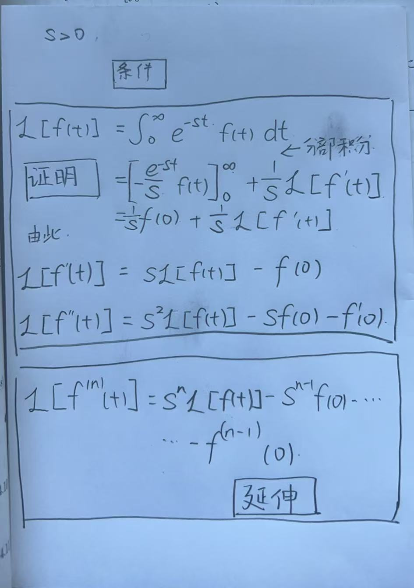
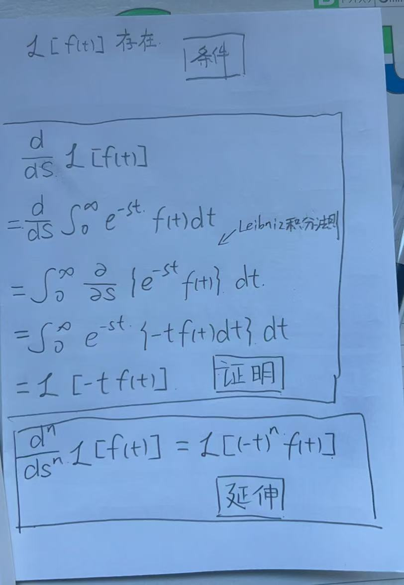

---

date: '2025-11-12T10:17:00+09:00'
draft: true
title: 'Linear Systems Part 2: Laplace Transform'
summary: "Unveiling the mathematical symmetry between Time and Frequency domains. A deep dive into why multiplication in one domain equals convolution in the other, and the mystery of spectrum replication."
tags: [ "Laplace Transform", "Convolution", "Sampling", "Signal & Systems"]
categories: ["The Crucible"]

---

# ラプラス変換

## 目录 / Table of Contents

1. [Analysis Equation](#analysis-equation)
2. [Synthesis Equation](#synthesis-equation)
3. [Properties of the Laplace Transform](#properties-of-the-laplace-transform)
4. [Common Transform Pairs](#common-transform-pairs)
5. [Exercise](#exercise)

## Analysis Equation
$$F(s) =\mathcal{L}\{f(t)\} = \int_{0}^{\infty} e^{-st} f(t)dt$$

## Synthesis Equation
$$f(t) = \mathcal{L}^{-1}\{F(s)\} = \frac{1}{2\pi j} \int_{\gamma - j\infty}^{\gamma + j\infty} e^{st} F(s)ds$$

## Properties of the Laplace Transform

### Basic

#### Linearity Property

$$\mathcal{L}[{a \cdot f(t) + b \cdot g(t)}] = a \cdot F(s) + b \cdot G(s)$$

***

#### Scaling Property

$$\mathcal{L}[{f(a \cdot t)}] = \frac{1}{|a|} \cdot F\left(\frac{s}{a}\right)$$

### Special

#### Differentiation in the Time Domain(t)
$$\mathcal{L}\left[ f'(t) \right] = s\mathcal{L}[f(t)] - f(0)$$

  
Proof

    

***

#### Integration in the Time Domain(t)
$$\mathcal{L}\left[ \int_{0}^{t} f(\tau) d\tau \right] = \frac{1}{s}\mathcal{L}[f(t)]$$

  
Proof

    

***

#### Differentiation in the Frequency Domain(s)
$$\frac{d}{ds} \mathcal{L}[f(t)] = \mathcal{L}\left[ -tf(t) \right] $$

  
Proof

    

***

#### Integration in the Frequency Domain(s)
$$\mathcal{L}\left[ \frac{1}{t}f(t) \right] = \int_{s}^{\infty} F(\sigma) d\sigma$$

  
Proof

    

***

#### Shifting in the Time Domain(t)

$$\mathcal{L}\left[ f(t-\lambda) u(t-\lambda) \right] = e^{-\lambda s} \mathcal{L}[f(t)]$$

***

#### Shifting in the Frequency Domain(s)

$$\mathcal{L}\left[ e^{\sigma t} f(t) \right] = F(s-\sigma)$$

## Common Transform Pairs

| $f(t)$ | $F(s)$ |
|---|---|
| $1$ | $\dfrac{1}{s}$ |
| $t^n\ (n=0,1,2,\dots)$ | $\dfrac{n!}{s^{n+1}}$ |
| $e^{at}$ | $\dfrac{1}{s-a}$ |
| $\sin(bt)$ | $\dfrac{b}{s^2+b^2}$ |
| $\cos(bt)$ | $\dfrac{s}{s^2+b^2}$ |
| $\sinh(bt)$ | $\dfrac{b}{s^2-b^2}$ |
| $\cosh(bt)$ | $\dfrac{s}{s^2-b^2}$ |
| $e^{at}\sin(bt)$ | $\dfrac{b}{(s-a)^2+b^2}$ |
| $e^{at}\cos(bt)$ | $\dfrac{s-a}{(s-a)^2+b^2}$ |
| $u(t-a)$ | $\dfrac{e^{-as}}{s}$ |
| $(t-a)u(t-a)$ | $\dfrac{e^{-as}}{s^2}$ |
| $\delta(t)$ | $1$ |
| $\delta(t-a)$ | $e^{-as}$ |

## Exercise

### 1. Laplace Transform

[基本拉普拉斯变换练习](基本拉普拉斯变换练习.pdf)
[拉普拉斯逆变换及实际应用](拉普拉斯逆变换及实际应用.pdf)
[较复杂拉普拉斯应用](较复杂拉普拉斯应用.pdf)
