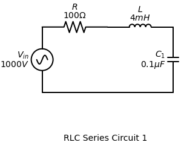

# RLC 电路分析：微分方程法与拉普拉斯法对比 / RLC Circuit Analysis: Differential Equation vs. Laplace Method

## 问题背景 / Problem Background

课堂上分析振荡电路时，我们常通过二阶线性微分方程来求解。  
In class, oscillatory circuits are often solved through second-order linear differential equations.

标准流程是先求齐次解（自然响应）和特解（受迫响应），再利用初值求常数。  
The standard workflow is to find a homogeneous solution (natural response) and a particular solution (forced response), then use initial conditions to determine constants.

但在实际计算里，尤其是求电流 $i(t)=\frac{dq}{dt}$ 时，指数项与三角项的求导组合很容易变得繁琐且易错。  
In practice, especially when finding current $i(t)=\frac{dq}{dt}$, differentiation across exponentials and trigonometric terms becomes tedious and error-prone.

这就是我想比较拉普拉斯法的原因：它是否更系统、更适合工程推导。  
That is why I compared the Laplace method: whether it is more systematic and engineering-friendly.

## 例题：受迫串联 RLC 电路 / Example: Forced Series RLC Circuit

考虑如下串联 RLC 电路，假设开关在 $t=0$ 闭合：  
Consider the following series RLC circuit, with the switch closing at $t=0$:

<br> 
<details>
    <summary>Code (python)</summary>

```python
import schemdraw
import schemdraw.elements as elm
with schemdraw.Drawing(file='RLC示例图1') as d:
    d += (V1 := elm.SourceSin().up().label('$V_{in}$\n$1000V$'))
    d += elm.Resistor().right().label('$R$\n$100\Omega$')
    d += elm.Inductor().right().label('$L$\n$4mH$')
    d += elm.Capacitor().down().label('$C_1$\n$0.1\mu F$')
    d += elm.Line().left().to(V1.start)
    d += elm.Label().label("RLC Series Circuit 1").at((3, -2))

print("图片已生成！")
```

</details>

***

电路的 KVL 方程（以电荷 $q$ 表示）为：  
The KVL equation (in charge $q$ form) is:
$$L \frac{d^2q}{dt^2} + R \frac{dq}{dt} + \frac{1}{C} q = E(t)$$

代入参数：  
Substitute values:
$$0.004 q'' + 100 q' + \frac{1}{10^{-7}} q = 1000$$
$$0.004 q'' + 100 q' + 10,000,000 q = 1000$$

再除以 $L=0.004$：  
Divide by $L=0.004$:
$$q'' + 25000 q' + 2,500,000,000 q = 250,000$$

目标是求电流 $i(t)$。  
Our goal is to find the current $i(t)$.

---

### 方法1：传统微分方程法 / Method 1: Traditional Differential Equation (DE)

总解写作 $q(t)=q_p(t)+q_h(t)$，其中 $q_p$ 为特解，$q_h$ 为齐次解。  
The total solution is $q(t)=q_p(t)+q_h(t)$, where $q_p$ is particular and $q_h$ is homogeneous.

**1) 特解 $q_p$：**  
**1) Particular solution $q_p$:**

当 $t\to\infty$，电感近似短路、电容近似开路，故 $i(\infty)=0$，电容电压等于电源电压。  
As $t\to\infty$, the inductor behaves like a short and the capacitor like an open, so $i(\infty)=0$ and capacitor voltage equals source voltage.

$$q_p = C \times E = (10^{-7} \text{ F}) \times (1000 \text{ V}) = 10^{-4} \text{ C}.$$

**2) 齐次解 $q_h$：**  
**2) Homogeneous solution $q_h$:**

求解特征方程  
Solve the characteristic equation
$$q_h'' + 25000 q_h' + 2.5 \times 10^9 q_h = 0$$
$$s^2 + 25000s + 2,500,000,000 = 0$$

写成标准形式 $s^2+2\alpha s+\omega_0^2=0$，得：  
In standard form $s^2+2\alpha s+\omega_0^2=0$, we have:
- 阻尼系数 $\alpha=\frac{R}{2L}=\frac{100}{2(0.004)}=12500$  
- Damping factor $\alpha=\frac{R}{2L}=\frac{100}{2(0.004)}=12500$
- 固有角频率 $\omega_0=\frac{1}{\sqrt{LC}}=\frac{1}{\sqrt{0.004\times10^{-7}}}=50000$  
- Resonant frequency $\omega_0=\frac{1}{\sqrt{LC}}=\frac{1}{\sqrt{0.004\times10^{-7}}}=50000$

因为 $\alpha<\omega_0$，系统为欠阻尼，根为 $s_{1,2}=-\alpha\pm j\omega_d$。  
Since $\alpha<\omega_0$, the system is underdamped and roots are $s_{1,2}=-\alpha\pm j\omega_d$.

$$\omega_d=\sqrt{\omega_0^2-\alpha^2}=\sqrt{50000^2-12500^2}=12500\sqrt{15}\ \text{rad/s}$$

所以  
So
$$q_h(t)=e^{-12500t}\left(A\cos(12500\sqrt{15}\,t)+B\sin(12500\sqrt{15}\,t)\right)$$

**3) 合成总解并代入初值：**  
**3) Build total solution and apply initial conditions:**

$$q(t)=10^{-4}+e^{-12500t}\left(A\cos(\omega_d t)+B\sin(\omega_d t)\right)$$

代入 $q(0)=0$：  
Apply $q(0)=0$:
$$A=-10^{-4}$$

对总解求导得到电流：  
Differentiate the total solution to get current:
$$
i(t)=q'(t)=e^{-12500t}\left(-A\omega_d\sin(\omega_d t)+B\omega_d\cos(\omega_d t)\right)-12500e^{-12500t}\left(A\cos(\omega_d t)+B\sin(\omega_d t)\right)
$$

代入 $i(0)=q'(0)=0$：  
Apply $i(0)=q'(0)=0$:
$$B\omega_d-12500A=0$$
$$B=-\frac{10^{-4}}{\sqrt{15}}$$

**4) 电流表达式：**  
**4) Current expression:**

为了得到最终 $i(t)$，还需把 $A,B$ 带回大表达式并继续求导整理，步骤较繁琐，容易出错。  
To get final $i(t)$, we still need to substitute $A,B$ back into a long derivative expression, which is tedious and error-prone.

---

### 方法2：拉普拉斯变换法（更直接） / Method 2: Laplace Transform (Cleaner Path)

我们直接对电流建立方程，先写时域 KVL：  
We solve for current directly. Time-domain KVL:
$$L \frac{di}{dt} + Ri + \frac{1}{C} \int_0^t i(\tau) d\tau + v_c(0) = E(t)$$

拉普拉斯变换（已知 $i(0)=0,\ v_c(0)=q(0)/C=0$）：  
Apply Laplace transform (with $i(0)=0,\ v_c(0)=q(0)/C=0$):
$$L[sI(s) - i(0)] + RI(s) + \frac{1}{C} \frac{I(s)}{s} = \frac{E}{s}$$
$$L sI(s) + RI(s) + \frac{1}{Cs} I(s) = \frac{E}{s}$$

两边乘以 $s$：  
Multiply by $s$:
$$L s^2 I(s) + R s I(s) + \frac{1}{C} I(s) = E$$
$$I(s) \left( Ls^2 + Rs + \frac{1}{C} \right) = E$$
$$I(s) = \frac{E}{Ls^2 + Rs + 1/C}$$

再除以 $L$：  
Divide numerator and denominator by $L$:
$$I(s) = \frac{E/L}{s^2 + (R/L)s + 1/LC}$$

代入参数：  
Substitute values:
$$I(s) = \frac{250,000}{s^2 + 25000s + 2,500,000,000}$$

配方：  
Complete the square:
$$s^2 + 25000s + 2.5 \times 10^9 = (s + 12500)^2 + (12500\sqrt{15})^2$$

因此  
Hence
$$I(s) = \frac{250,000}{(s + 12500)^2 + (12500\sqrt{15})^2}$$

匹配逆变换对  
Match inverse-transform pair
$$\mathcal{L}^{-1} \left\{ \frac{b}{(s+a)^2 + b^2} \right\} = e^{-at} \sin(bt)$$

先调整分子：  
Scale numerator:
$$I(s)=\left(\frac{250,000}{12500\sqrt{15}}\right)\cdot\frac{12500\sqrt{15}}{(s+12500)^2+(12500\sqrt{15})^2}$$
$$\frac{250,000}{12500\sqrt{15}}=\frac{20}{\sqrt{15}}$$

于是  
So
$$i(t)=\frac{20}{\sqrt{15}}e^{-12500t}\sin(12500\sqrt{15}\,t)\ \text{(A)}$$

## 小结 / Summary

- **传统微分方程法：** 步骤完整但计算重，尤其在求导和代入环节容易累积错误。  
- **Traditional DE method:** complete but computation-heavy, especially derivative and substitution steps.
- **拉普拉斯法：** 初值自动进入代数方程，流程更直接、可复用性更高。  
- **Laplace method:** initial values are incorporated automatically; workflow is more direct and reusable.
- **工程启发：** 对含初值、受迫项的线性电路，拉普拉斯法通常是更优先的求解路径。  
- **Engineering takeaway:** for linear circuits with initial conditions and driving sources, Laplace is often the better default path.