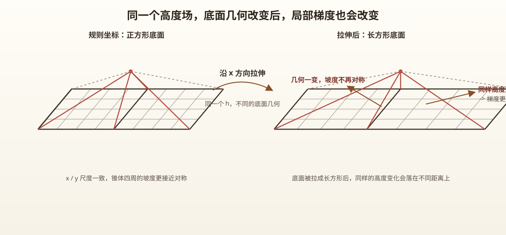

# Part 1: Problem Setup and Spatial Field Construction

This note series uses `orogeny-inversion-validation-lab` as its main example and walks through the full computational chain:

**initial field construction -> grid geometry -> forward solve -> observation generation -> parameter inversion -> validation**

Part 1 stays at the front of that chain.  
Instead of jumping into update formulas, it first fixes the spatial objects that the rest of the project depends on:

- what is being simulated;
- what the evolving field actually is;
- why an initial terrain field `h0` has to be built first;
- why the same `h` still needs a physical coordinate system;
- why control volumes appear naturally once time evolution enters the story.

So the main question here is:

**Before any numerical update happens, how are the problem object and the spatial geometry actually constructed?**

---

## 1. What Problem Are We Simulating?

The continuous model behind `00_forward_variable_kappa` can be written as

$$
\frac{\partial h}{\partial t}=\nabla\cdot\big(\kappa(x,y)\nabla h\big)
$$

At this stage, only two objects matter:

- $h(x,y,t)$: the evolving state field, interpreted here as terrain height;
- $\kappa(x,y)$: a spatial parameter field that controls how fast diffusion acts in different locations.

So the starting point is not “write down a discrete matrix,” but first define the object of study:

**a 2D field $h$ evolving under a spatially varying diffusivity $\kappa(x,y)$.**

If the project later wants observations, inversion, and validation, then this forward problem must be grounded first:

- where the initial state comes from;
- how space is parameterized;
- and on what geometry later computations are actually carried out.

---

## 2. Why the First Step Is Not Solving, but Building `h0`

In project `00`, the first script before the forward solver is `build_base_terrain.py`.

It does not advance the PDE.  
It first creates a synthetic terrain on a regular grid:

$$
h_0(i,j)
$$

that is, the initial condition.

The project uses a Gaussian-mixture construction:

- several Gaussian bumps and depressions are placed on a regular 2D array;
- together they form a controllable and reproducible initial terrain;
- the result is stored as `h` on a regular index grid.

This matters for a simple reason:

**without an initial field, there is nothing concrete for the forward solver to evolve.**

So `build_base_terrain.py` is not just a helper script. It fixes:

- how the system looks at the beginning;
- where the full trajectory starts from;
- what future observations, inversion, and evaluation are built around.

At this stage the grid is still just index space:

- `x = 0,1,2,...,n_x-1`
- `y = 0,1,2,...,n_y-1`
- `h[i,j]` is simply the state value stored on a regular array

So this step is really answering:

**What terrain field are we choosing as the starting point of the whole experiment?**

---

## 3. Why `h` Alone Is Not Enough

Once `h` exists, an easy-to-miss question shows up:

**The values exist, but where do those values actually sit in physical space?**

`h[i,j]` tells us:

- the state value at one discrete location;
- the differences between neighboring entries.

But it does not yet tell us:

- how far neighboring points are in real space;
- or how large a physical region each discrete point is supposed to represent.

That may feel harmless when looking at a static map.  
But the moment the question becomes “how will `h` change next?”, geometry becomes unavoidable.

That is because the quantities used later, such as

- gradients;
- fluxes;
- conservative updates;
- stability constraints

do not depend only on value differences. They also depend on distances and areas.

So the first conceptual turn in Part 1 is:

**`h` gives the field values, but geometry still has to be supplied.**

---

## 4. What the Irregular Grid Is Actually Adding

The next script in the project is `build_irregular_grid.py`.

It does not generate a new terrain.  
Instead, it keeps the same array `h` and redefines where each grid point sits in physical space.

In other words, the same field is attached to a new set of nonuniform coordinate axes:

$$
x_0,x_1,\dots,x_{N_x-1},\qquad
y_0,y_1,\dots,y_{N_y-1}
$$

These coordinates are:

- strictly increasing;
- not equally spaced;
- fixed to a total physical length.

A compact way to say it is:

**the same `h` is remapped from a regular coordinate system to a nonuniform physical coordinate system.**

What changes is not the field values themselves, but the physical placement of those values.

So:

- the field values stay the same;
- the array shape stays the same;
- but the geometric interpretation of the field changes.

That is why the irregular grid can be understood as “adding a new geometric meaning to the same `h`.”

---

## 5. Why Changing Coordinates Already Changes the Discrete Problem

This is the core idea of Part 1.

The PDE does not really care about “the 37th array entry.”  
What matters is:

- how far neighboring points are;
- what gradient corresponds to the same height difference;
- and over what local region later exchanges are distributed.

So:

**once the coordinates change, the discrete problem itself has already changed.**

The most immediate reason is the gradient.

Suppose two neighboring points still have the same height difference

$$
\Delta h = 1
$$

If their distance is

$$
\Delta x = 1
$$

then the local slope is roughly

$$
\frac{\Delta h}{\Delta x}=1
$$

But if the same two values are placed on a different coordinate system and their distance becomes

$$
\Delta x = 0.2
$$

then the same height difference now gives

$$
\frac{\Delta h}{\Delta x}=5
$$

And if the distance becomes

$$
\Delta x = 2
$$

the slope drops to

$$
\frac{\Delta h}{\Delta x}=0.5
$$

So the key sentence here is:

**changing `x,y` changes distances; once distances change, gradients change as well.**

And once gradients change, later fluxes, updates, and stability constraints change with them.

---

## 6. Why This Also Naturally Introduces Control Volumes

Stopping at “the gradient changes” is still not enough.

Because as soon as the question becomes

**How will `h` change at the next time step?**

the point of view shifts.

The question is no longer only “what is the slope here?” but also:

- how much flows in from the left;
- how much flows out to the right;
- what comes from the top and bottom;
- and over what local region those net exchanges should be distributed.

At that point, a discrete unknown `h[i,j]` can no longer be treated as just an abstract point.
It has to be understood as a local region exchanging quantities with its neighbors.

That is the intuition behind a control volume.

So control volumes do not appear because a formula demands them.
They appear because:

**once time evolution is involved, each discrete point must be interpreted as a small local cell that exchanges stored quantity with nearby cells.**

In shorter form:

**the gradient tells us how strongly things want to flow; the control volume tells us over what region those flows matter.**

---

## 7. The Geometric Meaning of Control Volumes in This Project

In project `00`, three spatial quantities will matter later:

### 7.1 Distance Between Neighboring Points

These come directly from the nonuniform coordinates:

$$
\Delta x_j = x_{j+1}-x_j,\qquad
\Delta y_i = y_{i+1}-y_i
$$

These distances determine how later gradient approximations are scaled.

### 7.2 Control-Volume Width

Behind each discrete point there is not only a location, but also a local span of physical responsibility.

In code, this is not treated as simply `diff(coords)`, but more like a midpoint-based local width.

For an interior point, the intuition is:

$$
w_j \approx \frac{x_{j+1}-x_{j-1}}{2},\qquad
w_i \approx \frac{y_{i+1}-y_{i-1}}{2}
$$

This means:

**each discrete unknown represents a small physical neighborhood around it.**

### 7.3 Cell Area

In 2D, that local region naturally has an area:

$$
A_{i,j}=w_i^{(y)}\,w_j^{(x)}
$$

Later in the project, even the `mass_area` statistic is computed with this kind of area weighting.

So by this point it should already be clear:

- geometry is not just for nicer-looking plots;
- it directly enters later conservation and update logic.

---

## 8. Why the Project Uses Variable Kappa Instead of a Constant

Project `00` solves

$$
\frac{\partial h}{\partial t}=\nabla\cdot\big(\kappa(x,y)\nabla h\big)
$$

not a simple constant-coefficient diffusion problem.

That means:

1. different locations diffuse at different rates;
2. later spatial discretization cannot just reuse the simplest constant-coefficient regular-grid formulas unchanged.

The project starts with blockwise `kappa`:

- the domain is split into blocks;
- each block receives one constant diffusivity;
- this creates a piecewise-constant field `kappa(x,y)`.

This is a practical compromise:

- it keeps spatial heterogeneity;
- but it is still much more manageable than a full-resolution field for forward modeling and inversion.

So from a modeling point of view, blockwise `kappa` is a useful middle ground:

**structured enough to be interesting, but still simple enough to stay computationally tractable.**

---

## 9. What Part 1 Has Really Established

Aligned with project `00`, Part 1 has established three things:

1. the evolving state field must first have a concrete initial condition `h0`;
2. before any real discretization starts, the grid geometry has to be defined explicitly, not silently assumed;
3. once time evolution enters the story, a discrete point must be reinterpreted as a local region exchanging quantity with its neighbors, which is why control volumes appear naturally.

So the point of this note is not to memorize a discrete formula yet.
It is to fix a project-oriented judgment:

**before a forward solver can update anything, it must first know**

- where the field values are;
- on what coordinates those values live;
- and how much local physical region each discrete value stands for.

---

## 10. Summary

- Part 1 does not yet enter the real update formulas; it first builds the problem background and the spatial objects.  
- In project `00`, spatial setup is not a single step: it first builds `h0`, then builds the irregular grid.  
- Once the same `h` is placed on a different physical coordinate system, distances change, and gradients change with them.  
- Once the question becomes “how does `h` evolve next?”, each discrete point must be treated as a local region exchanging quantity with its neighbors, which is why control volumes naturally appear.  
- The actual spatial update, time stepping, and CFL discussion belong to Part 2.  
